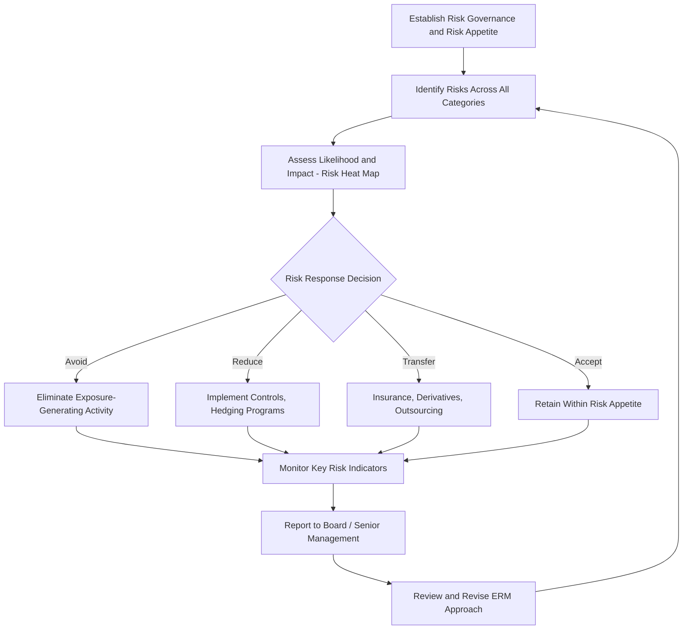

## Enterprise Risk Management Frameworks

### Overview

Enterprise Risk Management (ERM) is a holistic, organization-wide approach to identifying, assessing, and managing risk across all categories — strategic, operational, financial, and compliance/hazard risk — in contrast to the traditional "silo" approach where different risk types (financial, insurance, operational) are managed independently by separate functions with limited coordination. ERM frameworks provide structured methodologies for implementing this integrated approach, situating the financial hedging instruments covered in prior topics within a broader organizational risk governance context.

### From Silo-Based Risk Management to ERM

**Key Points**

- Traditional risk management historically treated financial risk (managed by treasury), insurable/hazard risk (managed by risk management/insurance departments), operational risk (managed within business units), and strategic risk (considered, if at all, within strategic planning) as largely separate domains, often with different reporting lines, tools, and risk appetites, and limited cross-functional visibility into aggregate risk exposure.
- ERM emerged from the recognition that risks interact and correlate across categories — for example, a commodity price spike (financial/market risk) might simultaneously trigger a supply chain disruption (operational risk) and a strategic repositioning need (strategic risk) — and that managing them independently can lead to redundant hedging, unrecognized aggregate exposure, or gaps in coverage.
- **[Inference]** The shift toward ERM has generally been reinforced by high-profile corporate failures and financial crises where siloed risk management failed to capture correlated or compounding risks across categories, though the specific relative contribution of any single event to the broader adoption trend is difficult to establish precisely.

### The COSO ERM Framework

**Key Points**

- Developed by the Committee of Sponsoring Organizations of the Treadway Commission (COSO), this is one of the most widely referenced ERM frameworks, particularly in the United States.
- The COSO ERM framework (updated in 2017 to *Enterprise Risk Management—Integrating with Strategy and Performance*) organizes ERM around five interrelated components:
  1. **Governance and Culture**: Establishes the tone at the top, board risk oversight, organizational risk culture, and core values that shape how risk is considered in decision-making.
  2. **Strategy and Objective-Setting**: Integrates risk consideration directly into the strategic planning process, aligning risk appetite with strategy formulation rather than treating risk assessment as a separate, downstream activity.
  3. **Performance**: Identifies and assesses risks that may affect the achievement of strategy and business objectives, prioritizing risks by severity and developing a portfolio view of risk across the organization.
  4. **Review and Revision**: Involves ongoing evaluation of ERM performance, including reviewing risks and revising the ERM approach as conditions change.
  5. **Information, Communication, and Reporting**: Ensures relevant risk information flows appropriately throughout the organization, supporting the continuous process of identifying, assessing, and responding to risk.
- **[Fact]** The 2017 COSO update explicitly emphasized integrating ERM with strategic planning and performance management, a notable shift from the framework's 2004 predecessor, which was more heavily oriented toward internal control and risk identification as a standalone process.

### The ISO 31000 Framework

**Key Points**

- **ISO 31000** is an international risk management standard (not specific to enterprise-wide financial risk, but broadly applicable across industries and risk types) providing principles and generic guidelines for risk management.
- Structured around three main elements: **principles** (why organizations manage risk), a **framework** (the organizational arrangements for designing, implementing, and improving risk management), and a **process** (the systematic application of policies, procedures, and practices to the risk management activities of identification, analysis, evaluation, treatment, monitoring, and review).
- **[Inference]** ISO 31000 is generally considered less U.S.-centric and less internal-control-focused than COSO, and is more commonly referenced by organizations outside North America or those seeking broader international risk management certification/alignment, though many organizations reference both frameworks in combination.

### Core Components of an ERM Process (Common Across Frameworks)

**Risk Identification**

**Key Points**

- Systematically cataloguing the full range of risks facing the organization across all categories — market/financial risk, credit risk, operational risk, strategic risk, compliance/legal risk, reputational risk, and hazard/insurable risk.
- Common techniques include risk workshops, scenario analysis, historical loss data review, and structured risk taxonomies/checklists tailored to the specific industry.

**Risk Assessment (Measurement and Prioritization)**

**Key Points**

- Risks are typically assessed along two dimensions: **likelihood (probability)** of occurrence and **impact (severity)** if the risk materializes, often visualized using a **risk heat map** or risk matrix.
- Quantitative techniques for financial risks include Value at Risk (VaR), scenario analysis, and stress testing; qualitative techniques (expert judgment, scoring scales) are more commonly applied to strategic, reputational, and other harder-to-quantify risk categories.

**Risk Response (Treatment)**

Four standard categories of risk response are commonly used across ERM frameworks:

| Response | Description | Example |
| --- | --- | --- |
| **Avoid** | Eliminate the activity or exposure generating the risk | Exiting a high-risk business line or geographic market |
| **Reduce (Mitigate)** | Take action to lower the likelihood or impact of the risk | Implementing hedging programs, improving internal controls |
| **Transfer (Share)** | Shift some or all of the risk to a third party | Purchasing insurance, hedging with derivatives, outsourcing |
| **Accept (Retain)** | Consciously retain the risk, typically because the cost of mitigation exceeds the expected benefit, or the risk falls within the firm's risk appetite | Self-insuring for small, high-frequency, low-severity losses |

**Key Points**

- The financial hedging instruments discussed throughout this chapter (forwards, futures, swaps, options) are a primary tool for the "Transfer" and "Reduce" risk response categories specifically for financial risk exposures, situating this chapter's derivatives content as one component within the broader ERM risk response toolkit.

### Risk Appetite and Risk Tolerance

**Key Points**

- **Risk appetite**: The broad, board-level statement of the amount and type of risk an organization is willing to accept in pursuit of its strategic objectives — typically qualitative and directional.
- **Risk tolerance**: More specific, quantifiable boundaries around acceptable variation relative to the risk appetite (e.g., a maximum acceptable value-at-risk limit, or a maximum percentage of unhedged commodity exposure).
- **Key risk indicators (KRIs)**: Specific, monitorable metrics used to track whether actual risk levels remain within established tolerance boundaries, providing early warning signals before a risk tolerance breach becomes a realized loss.

### The Risk Management Process Cycle

### Organizational Structure: The Role of the Chief Risk Officer (CRO)

**Key Points**

- Many organizations implementing ERM establish a **Chief Risk Officer (CRO)** role, typically reporting to the CEO and/or board, responsible for coordinating risk identification and management across all business units and risk categories — a structural response to the coordination failures inherent in the traditional silo-based approach.
- **[Inference]** The prevalence and reporting structure of the CRO role vary considerably by industry (notably more universal in banking and insurance, where regulatory requirements often mandate a formal CRO function, than in many non-financial corporate sectors) and by jurisdiction, reflecting differing regulatory expectations and organizational risk cultures.
- A **board risk committee** (either a standalone committee or a responsibility embedded within the audit committee) typically provides governance oversight of the ERM program, reviewing risk appetite, major risk exposures, and the effectiveness of risk responses.

### ERM and the Cost of Capital / Firm Value

**Key Points**

- The theoretical justification for ERM parallels the motivations for corporate risk management covered earlier: by reducing the volatility of aggregate firm-wide outcomes (rather than managing individual risk categories in isolation, which can leave correlated risks unrecognized), ERM aims to reduce the probability and cost of financial distress, preserve investment capacity, and potentially lower the firm's overall cost of capital.
- **[Inference]** Empirical evidence on whether ERM adoption directly and measurably improves firm value or reduces cost of capital is mixed and an active area of academic research; ERM is more consistently associated with improved risk visibility, more coordinated risk response, and (in regulated industries) with meeting supervisory expectations, than with a definitively quantified, universally observed valuation premium.

### Comparison: Traditional Risk Management vs. ERM

| Dimension | Traditional (Silo) Approach | Enterprise Risk Management |
| --- | --- | --- |
| Scope | Individual risk categories managed separately | All risk categories managed holistically |
| Coordination | Limited cross-functional visibility | Centralized coordination (often via CRO) |
| Risk-strategy linkage | Risk assessed after strategy is set | Risk integrated into strategy formulation |
| Aggregate risk view | Fragmented, category-specific | Portfolio-level view of total risk |
| Governance | Varies by function/department | Board-level oversight, formal risk appetite |

### Integration with Financial Risk Management Instruments

**Key Points**

- The forward, futures, swap, and option instruments covered in this chapter's earlier topics represent the primary tools available for the "Reduce" and "Transfer" risk responses specifically within the financial/market risk category of a broader ERM program.
- **[Inference]** A mature ERM program would typically evaluate financial hedging decisions not in isolation, but in the context of the firm's total risk profile across all categories — for instance, a firm with low operational risk and strong balance sheet resilience might rationally tolerate more unhedged financial risk than an otherwise similar firm with high operational risk and limited financial flexibility, reflecting the portfolio-level, cross-category risk aggregation that distinguishes ERM from the standalone hedging analysis covered in prior topics.

**Related Topics**

- Motivations for corporate risk management (financial distress costs, underinvestment)
- Forward and futures contracts, interest rate/currency swaps, and options as ERM risk-transfer tools
- Value at Risk (VaR) and other quantitative risk measurement techniques
- Corporate governance and board risk oversight structures
- Regulatory risk management requirements in financial institutions (Basel framework, Solvency II)