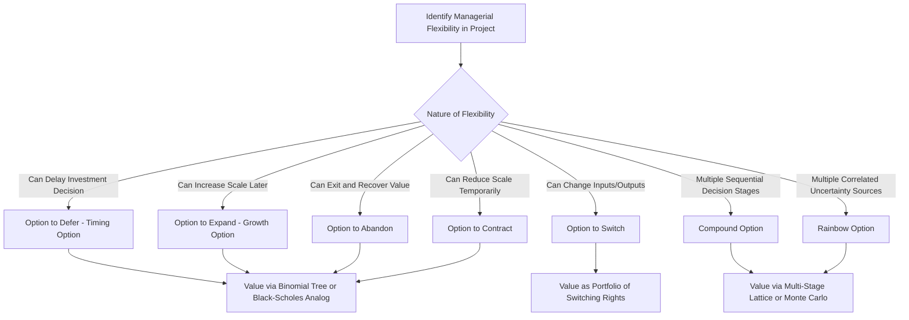

## Types of Real Options

### Overview

Real options extend option pricing theory (developed for financial options) to value the managerial flexibility embedded in real investment decisions — the ability to adapt, defer, expand, contract, or abandon a project as new information arrives over time. Traditional discounted cash flow (DCF)/NPV analysis, which relies on a single, static projection of cash flows, systematically undervalues projects containing significant flexibility, because it fails to capture the value of management's ability to respond favorably to new information. Real options analysis addresses this gap by applying the same valuation logic used for financial options (binomial trees, Black-Scholes-style closed-form approximations) to these embedded managerial decision rights.

### Why Traditional NPV Undervalues Flexibility

**Key Points**

- Standard NPV analysis typically assumes a fixed, "now-or-never" investment decision based on a single expected cash flow scenario, implicitly ignoring the asymmetric payoff structure created by management's ability to make follow-on decisions after uncertainty resolves.
- Real options value arises specifically from this asymmetry: management can choose to exercise favorable follow-on options (expand, continue) and decline to exercise unfavorable ones (abandon, contract), meaning the project's true value distribution is skewed favorably relative to a static single-scenario projection — the same asymmetric payoff logic underlying all option value.
- **[Inference]** The practical implication commonly drawn in capital budgeting is that traditional NPV should be understood as a *lower bound* on a flexible project's true value, with real options analysis providing the additional value attributable to embedded flexibility: $\text{Total Project Value} = \text{Static NPV} + \text{Real Option Value}$.

### The Option to Defer (Timing Option)

**Key Points**

- Gives management the right, but not the obligation, to delay making an investment until a later date, allowing more information (about demand, prices, technology, regulation) to be gathered before committing capital.
- Analogous to a **call option** on the investment opportunity: the "strike price" is the required investment outlay, and the "underlying asset" is the present value of the project's expected cash flows.
- **Value drivers**: The option to defer becomes more valuable with greater underlying uncertainty (since more time allows more uncertainty to resolve favorably or unfavorably before commitment) and a longer available deferral period (analogous to time-to-expiration in financial option pricing).
- **[Inference]** This option type is often most relevant for natural resource extraction rights (e.g., an undeveloped oil lease, an unmined ore deposit) or patent rights not yet commercialized, where the firm holds a right to invest without an obligation to invest immediately, and delay carries little cost beyond the opportunity cost of foregone early cash flows and any competitive first-mover disadvantage.

### The Option to Expand (Growth Option)

**Key Points**

- Gives management the right to increase the scale of an investment (e.g., by expanding production capacity, entering new markets, or pursuing follow-on projects) if the initial investment or market conditions prove favorable.
- Analogous to a call option where the "strike price" is the cost of the expansion investment and the "underlying asset" is the present value of the cash flows from the expanded operations.
- Commonly embedded in **staged investment structures**, where an initial, smaller-scale investment (which may have a modestly negative or marginally positive standalone NPV) is justified by the value of the expansion option it creates — the initial investment is sometimes framed as effectively "purchasing" the growth option.
- **[Inference]** This framework is frequently applied to evaluate investments in emerging markets, new product lines, or research and development programs, where the initial-stage investment's primary strategic rationale is the option value of potential future expansion rather than the standalone economics of the initial stage.

### The Option to Abandon

**Key Points**

- Gives management the right to terminate a project (and recover some salvage or resale value) if it performs poorly, rather than being contractually obligated to continue operating an unprofitable project to completion.
- Analogous to a **put option**: the "strike price" is the salvage/abandonment value (what the firm receives by exiting), and the "underlying asset" is the present value of continuing the project's remaining cash flows.
- At any decision point, management should compare the value of continuing the project against the value of abandoning it, exercising the abandonment option when the continuation value falls below the abandonment value.

$$\text{Value of Continuing} \text{ vs. } \text{Abandonment (Salvage) Value} \Rightarrow \text{Optimal Decision} = \max(\text{Continue}, \text{Abandon})$$

- **[Inference]** The abandonment option is generally most valuable for projects with high uncertainty, significant salvage value (e.g., resalable equipment, redeployable assets), and low costs of exit, and is a key reason why flexible, modular investments (which preserve resale/redeployment value) are sometimes preferred over highly specialized, illiquid investments even when the latter shows a marginally higher static NPV.

### The Option to Contract

**Key Points**

- Gives management the right to reduce the scale of operations (rather than abandon entirely) if market conditions turn unfavorable, avoiding the fixed costs of maintaining full-scale operations during a downturn while preserving the option to later expand again if conditions improve.
- Analogous to a **put option** on a portion of the project's capacity, where the "strike price" is the cost savings achieved by scaling down.
- Often embedded in projects with **flexible or modular capacity design**, where the firm deliberately builds in the ability to operate at variable scale rather than committing to a single fixed operating level.

### The Option to Switch (Switching Option)

**Key Points**

- Gives management the flexibility to switch between different inputs, outputs, or operating modes in response to changing relative prices or market conditions — for example, a power plant capable of switching between multiple fuel sources depending on relative fuel costs, or a manufacturing facility capable of switching between multiple product lines depending on relative demand.
- Can be modeled as a portfolio of options (the right to switch to whichever input/output combination is most favorable at each decision point), and its value increases with the volatility and lack of correlation between the prices/demand levels of the alternative inputs or outputs, since low correlation between the switching alternatives increases the likelihood that at least one alternative will be favorable at any given time.

### Compound Options

**Key Points**

- Many real-world investment opportunities involve **sequential, staged decisions** where each stage's completion creates the option to proceed (or not) to the next stage — a **compound option** (an option on an option).
- Common example: pharmaceutical drug development, where each clinical trial phase (Phase I, II, III) represents a separate investment decision, and successful completion of one phase creates the option (but not obligation) to invest in the next phase.
- **[Inference]** Compound options are generally more complex to value than simple options, since the option in the current stage depends on both the value and volatility of the option in the next stage, rather than directly on a fixed underlying asset value — this typically requires numerical methods (binomial/lattice trees extended across multiple decision stages, or Monte Carlo simulation) rather than simple closed-form solutions.

### Rainbow Options (Multiple Sources of Uncertainty)

**Key Points**

- Real projects often face **multiple, potentially correlated sources of uncertainty simultaneously** (e.g., both price uncertainty and quantity/demand uncertainty, or both technical success uncertainty and market uncertainty) — an option whose value depends on more than one underlying stochastic variable is sometimes termed a "rainbow option" in the real options literature.
- **[Inference]** Modeling multiple correlated uncertainties substantially increases valuation complexity relative to single-variable option models, typically requiring either simplifying assumptions (e.g., combining variables into a single composite underlying value) or more sophisticated numerical techniques (multi-factor lattice models, Monte Carlo simulation with correlated variables).

### Summary Table: Real Option Types

| Real Option Type | Financial Option Analogy | Underlying Asset | "Strike Price" | Typical Application |
| --- | --- | --- | --- | --- |
| Option to defer | Call option | PV of project cash flows | Required investment outlay | Natural resource leases, patent rights |
| Option to expand | Call option | PV of expanded operation cash flows | Cost of expansion investment | Staged market entry, capacity expansion |
| Option to abandon | Put option | PV of continuing project cash flows | Salvage/resale value | Projects with resalable/redeployable assets |
| Option to contract | Put option | PV of full-scale operation cash flows | Cost savings from scaling down | Flexible/modular capacity design |
| Option to switch | Portfolio of options | Multiple input/output price or demand paths | Switching cost | Multi-fuel plants, flexible manufacturing |
| Compound option | Option on an option | Value of the subsequent-stage option | Cost of proceeding to next stage | Staged R&D, pharmaceutical development |

### Real Options Classification Flow

### Why This Matters for Capital Budgeting

**Key Points**

- Recognizing which type(s) of real option are embedded in a given investment is the essential first step before applying any specific valuation technique (binomial lattice, Black-Scholes analog, or Monte Carlo simulation, covered in subsequent topics), since different option types have different underlying assets, exercise conditions, and appropriate modeling approaches.
- **[Inference]** In practice, many real investments contain more than one type of embedded real option simultaneously (e.g., a mining project might have both a defer option before development and an abandon option during operation), requiring analysts to identify and, where feasible, separately value each significant flexibility component rather than assuming a single option type captures the full strategic value of the investment.

**Related Topics**

- Real options valuation using binomial/lattice models
- Real options valuation using Black-Scholes-style approximations
- Traditional NPV and DCF analysis as the baseline for real options adjustment
- Decision tree analysis in capital budgeting
- Staged investment and follow-on decision analysis in venture capital and R&D