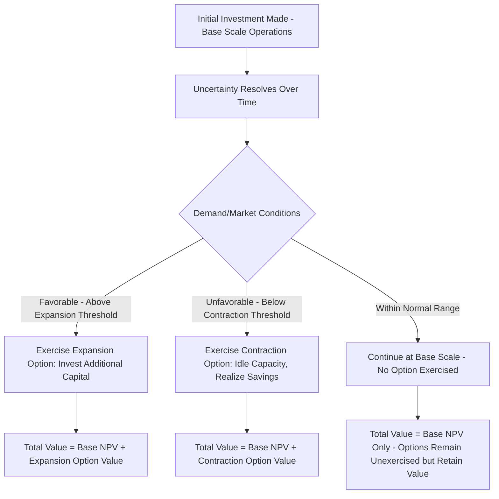

## The Option to Expand or Contract

### Overview

The option to expand and the option to contract are complementary forms of operational flexibility that allow management to adjust project scale in response to how uncertainty resolves after initial investment. Where the previous topic introduced these as part of a broader taxonomy of real options, this topic develops their valuation mechanics in depth, applying the option pricing tools (binomial trees, Black-Scholes analogs) covered earlier in the course to these two specific, closely related flexibility types.

### The Option to Expand: Conceptual Framework

**Key Points**

- The option to expand gives management the right, but not the obligation, to increase project scale — additional capacity, new markets, follow-on products — at a future date, contingent on how initial conditions develop.
- Modeled as a **call option**: the underlying asset is the present value of the cash flows from the expanded scale of operations, and the strike price is the additional investment outlay required to implement the expansion.
- The initial (base-scale) project is often evaluated using traditional NPV, while the expansion option is valued separately and then added to arrive at the project's total strategic value:

$$\text{Total Project Value} = NPV_{\text{base scale}} + \text{Value of Expansion Option}$$

### Valuing the Expansion Option: Binomial Approach

**Worked Example**

A firm is evaluating an initial $10,000,000 investment in a manufacturing facility with base-case NPV of $500,000 (a modest but positive standalone value). The facility is designed to allow expansion of capacity within 3 years at an additional cost of $15,000,000 if demand proves strong.

**Step 1: Estimate the underlying asset value and volatility**

The present value of the cash flows from the expanded facility, if built today, is estimated at $S_0 = \$14,000,000$, with the volatility of this value estimated (via comparable projects or Monte Carlo simulation of demand/price uncertainty) at $\sigma = 35\%$.

**Step 2: Set up binomial parameters** (using CRR calibration over one 3-year step for simplicity)

$$u = e^{\sigma\sqrt{T}} = e^{0.35\sqrt{3}} = e^{0.606} = 1.834$$

$$d = 1/u = 0.545$$

**Step 3: Compute terminal underlying values**

$$S_u = 14{,}000{,}000 \times 1.834 = \$25{,}676{,}000$$

$$S_d = 14{,}000{,}000 \times 0.545 = \$7{,}630{,}000$$

**Step 4: Compute expansion option payoffs** (exercise only if value exceeds the $15,000,000 expansion cost)

$$C_u = \max(0, 25{,}676{,}000 - 15{,}000{,}000) = \$10{,}676{,}000$$

$$C_d = \max(0, 7{,}630{,}000 - 15{,}000{,}000) = \$0$$

**Step 5: Compute risk-neutral probability** (assuming $r = 5\%$)

$$p = \frac{(1.05)^3 - d}{u - d} = \frac{1.158 - 0.545}{1.834 - 0.545} = \frac{0.613}{1.289} = 0.476$$

**Step 6: Discount expected payoff**

$$\text{Option Value} = \frac{0.476(10{,}676{,}000) + 0.524(0)}{(1.05)^3} = \frac{5{,}081{,}776}{1.158} = \$4{,}389{,}271$$

**Step 7: Total project value**

$$\text{Total Value} = 500{,}000 + 4{,}389{,}271 = \$4{,}889{,}271$$

**Key Points**

- The expansion option value ($4.39 million) dwarfs the base-case standalone NPV ($500,000), illustrating a common finding in real options analysis: the strategic option value embedded in a project can substantially exceed the value indicated by traditional static NPV alone, particularly for projects with high underlying uncertainty.
- **[Inference]** This large gap between static NPV and total strategic value is precisely the situation real options analysis is designed to surface — a project that might be rejected or under-resourced based on standalone NPV alone can be much more attractive once its embedded expansion flexibility is properly valued, provided the volatility and expansion cost estimates are reasonably reliable.

### The Option to Contract: Conceptual Framework

**Key Points**

- The option to contract gives management the right to reduce the scale of operations if market conditions turn unfavorable, avoiding the fixed costs associated with maintaining full-scale operations during a downturn.
- Modeled as a **put option** on a portion of the project's capacity: the underlying asset is the present value of cash flows from the portion of capacity that could be eliminated, and the strike price is the cost savings realized by contracting operations.

$$\text{Value of Contraction Option} = \max(0, \text{Cost Savings from Contracting} - \text{PV of Lost Cash Flows from Reduced Capacity})$$

### Worked Example: Option to Contract

**Given**: A firm operates a production facility generating cash flows with a present value of $S_0 = \$8,000,000$ from a portion of capacity that could be idled. If demand falls, contracting operations saves $6,000,000 in present-value terms in avoided fixed and variable costs, at the cost of forgoing the $8,000,000 in cash flows from that capacity. Using similar binomial parameters ($\sigma = 30\%$, $T=2$ years, $r=5\%$):

$$u = e^{0.30\sqrt{2}} = e^{0.424} = 1.528 \qquad d = 1/u = 0.654$$

$$S_u = 8{,}000{,}000 \times 1.528 = \$12{,}224{,}000 \qquad S_d = 8{,}000{,}000 \times 0.654 = \$5{,}232{,}000$$

**Contraction option payoffs** (exercised — i.e., capacity idled — when the value of continuing that capacity falls below the savings from contracting):

$$P_u = \max(0, 6{,}000{,}000 - 12{,}224{,}000) = 0 \text{ (continue operating — capacity worth more than savings)}$$

$$P_d = \max(0, 6{,}000{,}000 - 5{,}232{,}000) = \$768{,}000 \text{ (contract — savings exceed continuation value)}$$

$$p = \frac{(1.05)^2 - 0.654}{1.528 - 0.654} = \frac{1.1025 - 0.654}{0.874} = \frac{0.4485}{0.874} = 0.513$$

$$\text{Option Value} = \frac{0.513(0) + 0.487(768{,}000)}{(1.05)^2} = \frac{374{,}016}{1.1025} = \$339{,}280$$

**Key Points**

- The contraction option is valuable specifically in the "down" state, where reduced capacity utilization makes idling that portion of operations more attractive than continuing to bear its costs — this is the direct real-options analog of an out-of-the-money put becoming valuable as the underlying value falls.

### Combined Expand/Contract Flexibility

**Key Points**

- Many real investments are deliberately designed with **both** expansion and contraction flexibility simultaneously — sometimes described as an option to "operate at variable scale" — allowing management to scale up in favorable states and scale down in unfavorable states, capturing value in both directions relative to a fixed-scale alternative.
- **[Inference]** Designing this bidirectional flexibility into a project (e.g., modular plant construction, leased rather than owned capacity, flexible workforce arrangements) typically carries a cost premium over a fixed-scale design (e.g., higher per-unit construction cost for modularity, higher lease versus purchase cost), and the decision of whether this premium is justified is itself analyzable as a cost-benefit comparison between the incremental design cost and the combined value of the expansion and contraction options it enables.

### Determinants of Expansion/Contraction Option Value

| Factor | Effect on Expansion Option Value | Effect on Contraction Option Value |
| --- | --- | --- |
| Underlying volatility (demand/price uncertainty) | Increases | Increases |
| Time until decision must be made | Increases (more time to observe favorable outcomes) | Increases (more time to observe unfavorable outcomes) |
| Expansion cost / contraction savings level | Higher expansion cost decreases value | Higher contraction savings increases value |
| Correlation with existing operations | Lower correlation generally increases diversification-like value | Lower correlation generally increases diversification-like value |

**[Inference]** Both option types share the general property (common to all options) that value increases with the volatility of the underlying uncertainty — a feature that often surprises analysts trained primarily on traditional NPV/DCF methods, where higher uncertainty (via a higher discount rate) typically reduces a project's calculated value rather than increasing it.

### Practical Considerations in Applying These Models

**Key Points**

- **Estimating volatility** for a real (non-traded) asset is considerably more challenging than for a financial option on a publicly traded underlying, and typically relies on comparable-company/comparable-project historical volatility, Monte Carlo simulation of the underlying business drivers (demand, price, cost), or management's own subjective probability assessments — introducing more estimation uncertainty into real options valuations than is typical for financial options valuations.
- **Competitive responses**: Unlike financial options, exercising a real expansion option (e.g., entering a new market) may trigger competitive responses that alter the payoff structure in ways not fully captured by a standard option pricing model — a limitation sometimes addressed by combining real options analysis with game-theoretic considerations in more advanced treatments.
- **[Inference]** For these reasons, real options valuations are generally used to complement rather than fully replace traditional NPV analysis and qualitative strategic judgment — the numerical output is often treated as directionally informative (confirming that embedded flexibility has meaningful value) rather than as a precise point estimate to be relied upon with the same confidence as a financial option price derived from observable market inputs.

### Expand/Contract Decision Flow

**Related Topics**

- Types of real options (comprehensive taxonomy)
- Binomial option pricing as applied to real assets
- The option to abandon and the option to defer
- Volatility estimation for non-traded underlying assets (Monte Carlo simulation approaches)
- Traditional NPV and DCF analysis as the real-options baseline