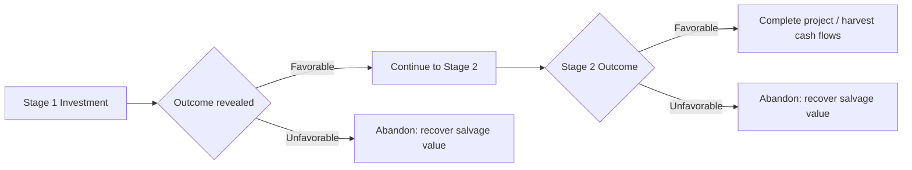
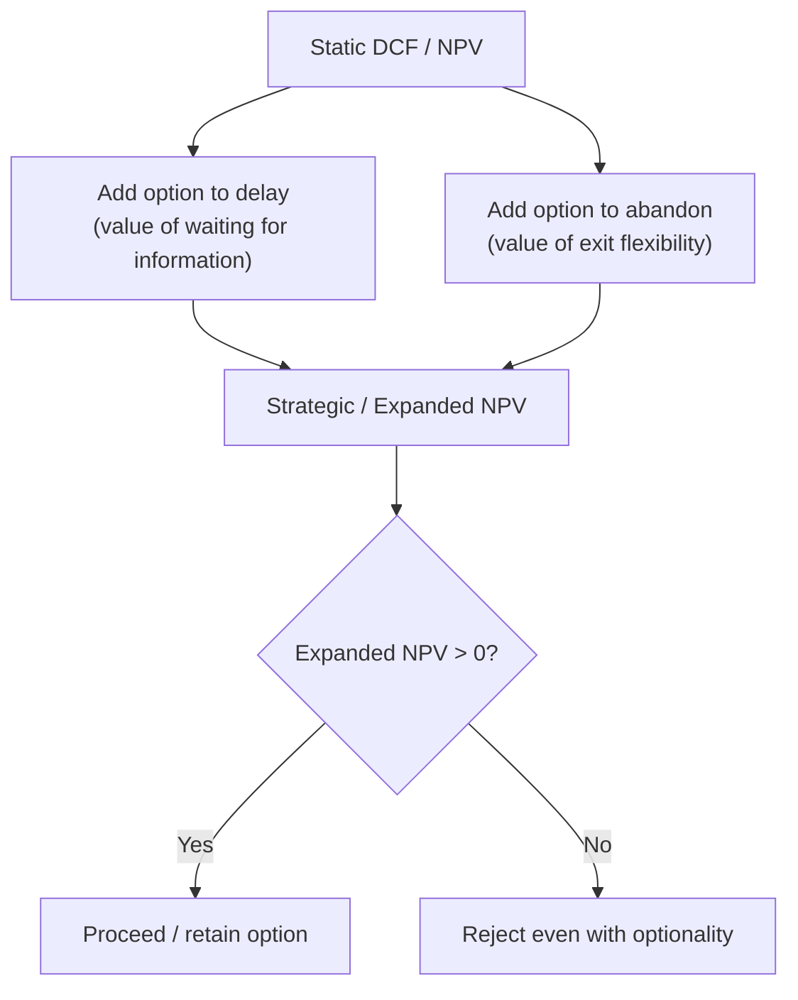

## The Option to Abandon or Delay

### Overview

Real options extend option-pricing theory from financial derivatives to real (physical or strategic) assets. Among the standard taxonomy of real options — expand, contract, switch, defer, abandon — the **option to delay** (defer) and the **option to abandon** are two of the most widely applied in capital budgeting because they directly modify the classic accept/reject NPV decision by incorporating the value of managerial flexibility under uncertainty.

Both options arise because investment or divestment decisions are rarely "now-or-never." Managers can wait for more information (delay) or exit a failing project before it destroys further value (abandon). Traditional discounted cash flow (DCF) analysis, by assuming a static, irreversible commitment, systematically undervalues projects that embed this flexibility.

---

### The Option to Delay (Defer)

#### Conceptual Basis

The option to delay treats an investment opportunity as analogous to an American call option on a real asset. The firm holds the right, but not the obligation, to invest in a project at any point during a finite window. Delaying preserves optionality: the firm can wait to see how demand, prices, technology, or regulation evolve before committing capital.

This is most relevant when:

- The investment is **irreversible** or has high sunk-cost characteristics
- There is **significant uncertainty** about future cash flows
- The firm has **exclusive or semi-exclusive rights** to the opportunity (patent, land lease, license, first-mover position) so competitors cannot pre-empt the option

#### Option Analogy Mapping

| Financial Call Option | Real Option to Delay |
| --- | --- |
| Stock price ($S$) | PV of expected project cash inflows |
| Strike price ($K$) | Investment cost (capital outlay) |
| Time to expiration ($T$) | Time until opportunity disappears (license expiry, competitive entry) |
| Volatility ($\sigma$) | Uncertainty in project value (demand, price, cost volatility) |
| Risk-free rate ($r_f$) | Risk-free rate |

#### Valuation Approaches

**1. Black-Scholes Approximation**

$$C = S_0 N(d_1) - K e^{-r_f T} N(d_2)$$

where

$$d_1 = \frac{\ln(S_0/K) + (r_f + \sigma^2/2)T}{\sigma\sqrt{T}}, \quad d_2 = d_1 - \sigma\sqrt{T}$$

Here $S_0$ is the present value of the project's expected operating cash flows, $K$ is the required investment outlay, and $\sigma$ is the volatility of project value (often proxied by comparable-firm equity volatility or Monte Carlo-derived cash flow volatility).

**2. Binomial Lattice**

More flexible for real options because it handles early exercise, changing volatility, and embedded managerial decisions at each node.

$$u = e^{\sigma\sqrt{\Delta t}}, \quad d = \frac{1}{u}, \quad p = \frac{e^{r_f \Delta t} - d}{u - d}$$

The project value at each node is the greater of the intrinsic exercise value (invest now) or the continuation value (wait), discounted back through the lattice — this is the key structural difference from a standard European-style DCF that only evaluates a single time-zero decision.

**Decision Rule:**

$$\text{Extended NPV} = \text{Static NPV} + \text{Value of Option to Delay}$$

A project can have a negative static NPV today but a positive extended NPV, because the option value compensates for the downside protection of not investing until conditions improve.

#### Numerical Example

A mining company holds a 5-year exclusive lease on a deposit.

- Investment cost ($K$): $500M
- PV of expected cash flows if developed today ($S_0$): $450M
- Static NPV = $450M − $500M = **−$50M** (reject under traditional NPV)
- Volatility of commodity-linked project value ($\sigma$): 35%
- Time to expiration ($T$): 5 years
- Risk-free rate: 4%

Applying Black-Scholes:

$$d_1 = \frac{\ln(450/500) + (0.04 + 0.35^2/2)(5)}{0.35\sqrt{5}} \approx 0.49$$

$$d_2 \approx 0.49 - 0.35\sqrt{5} \approx -0.29$$

$N(d_1) \approx 0.688$, $N(d_2) \approx 0.386$

$$C = 450(0.688) - 500e^{-0.04 \times 5}(0.386) \approx 309.6 - 158.2 \approx \$151.4M$$

The option to delay is worth roughly $151M, so the extended NPV (option value alone, since the firm is not investing today) is strongly positive — the lease itself is a valuable asset even though immediate development is not.

#### Key Points

- The option to delay is most valuable when uncertainty is high and irreversibility is severe — the two conditions reinforce each other
- Waiting has a cost: forgone cash flows during the deferral period act like a "dividend yield" that erodes option value, similar to how dividends reduce American call option value
- Competitive erosion (loss of exclusivity) truncates the effective time horizon $T$ and can force early exercise even when option theory alone would suggest waiting
- [Inference] In practice, many firms use simplified decision-tree or scenario-based approximations rather than full Black-Scholes/binomial models, given the difficulty of estimating $\sigma$ reliably for non-traded real assets

---

### The Option to Abandon

#### Conceptual Basis

The option to abandon is structurally a **put option**: the firm has the right to sell or liquidate a project (or switch to a superior alternative use) at a predetermined salvage/exit value, rather than continuing to operate it. It is the mirror image of the delay option — it captures downside protection *after* the investment has already been made.

This is relevant across:

- Project termination during construction phases (staged investment)
- Divestiture of a business unit or plant with resale/salvage value
- Contract exit clauses, franchise termination rights, or lease break clauses

#### Option Analogy Mapping

| Financial Put Option | Real Option to Abandon |
| --- | --- |
| Strike price ($K$) | Salvage or resale value of the asset |
| Underlying asset value ($S$) | PV of expected continuing project cash flows |
| Exercise | Abandon and liquidate/redeploy the asset |

#### Valuation via Put-Option Formula

$$P = K e^{-r_f T} N(-d_2) - S_0 N(-d_1)$$

using the same $d_1$, $d_2$ definitions as above, but with $K$ now representing salvage value and $S_0$ the value of continuing operations.

**Decision Rule at each period:**

$$V_t = \max(\text{Continuation Value}_t, \text{Salvage Value}_t)$$

This is naturally modeled via backward induction on a decision tree or binomial lattice, since the abandonment decision can occur at multiple points over the project's life, not just once.

#### Sequential (Multi-Period) Abandonment via Decision Tree

For projects with staged capital commitments (e.g., pharma R&D, oil field development, plant construction), abandonment is evaluated at each stage gate:

At each decision node, the firm compares expected continuation NPV against the abandonment payoff (salvage value net of exit costs) and takes the maximum — this recursive comparison is what embeds optionality into the valuation, versus a single static go/no-go NPV computed only at $t=0$.

#### Numerical Example

A manufacturing plant project has two years remaining. At the end of Year 1, management can continue or abandon:

- If continued: expected PV of Year 1 continuation cash flows = $80M (in a good state) or $40M (in a bad state), each with 50% probability
- Salvage value if abandoned at Year 1 = $55M
- Risk-free/discount rate = 5%

**Without abandonment option:**

$$E[\text{Value}] = 0.5(80) + 0.5(40) = \$60M$$

**With abandonment option (take max at each node):**

$$\text{Good state: } \max(80, 55) = 80$$

$$\text{Bad state: } \max(40, 55) = 55$$

$$E[\text{Value with option}] = 0.5(80) + 0.5(55) = \$67.5M$$

**Value of the abandonment option** = $67.5M − $60M = **$7.5M**

This $7.5M represents the value of downside protection — the ability to exit the bad state early rather than being forced to absorb the full $40M continuation value.

#### Key Points

- Abandonment value increases with the **salvage/resale value** of assets and with the **volatility** of project outcomes (more volatility = more states where abandonment is the better choice)
- Assets with active secondary markets (e.g., standard machinery, aircraft, real estate) have higher abandonment option value than highly specialized, single-use assets with near-zero salvage value
- Contractual exit provisions (lease breaks, JV dissolution clauses) are frequently negotiated specifically to purchase this option value
- [Inference] Abandonment option value is often understated in practice because salvage value estimates tend to be conservative or based on stale book values rather than realistic secondary-market pricing

---

### Combined Framework: Expanded NPV

$$\text{Strategic (Expanded) NPV} = \text{Traditional NPV} + \sum \text{Value of Embedded Real Options}$$

Where the option set typically includes delay, abandon, expand, contract, and switch — evaluated jointly since they interact (e.g., the option to delay and the option to abandon are partial substitutes: strong abandonment flexibility can reduce the incremental value of waiting, because downside risk is already hedged post-investment).

#### Decision Framework Diagram (svg_diagram)

<svg xmlns="http://www.w3.org/2000/svg" viewBox="0 0 760 400">
<text x="380" y="30" text-anchor="middle" font-size="18" font-weight="bold" fill="#1a1a1a">Delay vs. Abandon Option Positioning (svg_diagram)</text>
<line x1="80" y1="350" x2="700" y2="350" stroke="#333" stroke-width="2" />
<line x1="80" y1="350" x2="80" y2="60" stroke="#333" stroke-width="2" />
<text x="390" y="385" text-anchor="middle" font-size="13" fill="#333">Uncertainty (Volatility)</text>
<text x="30" y="200" text-anchor="middle" font-size="13" fill="#333" transform="rotate(-90 30 200)">Irreversibility</text>
<rect x="90" y="70" width="290" height="130" fill="#dbeafe" fill-opacity="0.6" stroke="#3b82f6" />
<text x="235" y="100" text-anchor="middle" font-size="13" font-weight="bold" fill="#1e3a8a">High Value: Option to Delay</text>
<text x="235" y="120" text-anchor="middle" font-size="11" fill="#1e3a8a">High uncertainty +</text>
<text x="235" y="136" text-anchor="middle" font-size="11" fill="#1e3a8a">high irreversibility</text>
<text x="235" y="156" text-anchor="middle" font-size="11" fill="#1e3a8a">(e.g., mineral rights,</text>
<text x="235" y="172" text-anchor="middle" font-size="11" fill="#1e3a8a">R&amp;D licenses)</text>
<rect x="390" y="210" width="290" height="130" fill="#dcfce7" fill-opacity="0.6" stroke="#16a34a" />
<text x="535" y="240" text-anchor="middle" font-size="13" font-weight="bold" fill="#14532d">High Value: Option to Abandon</text>
<text x="535" y="260" text-anchor="middle" font-size="11" fill="#14532d">High uncertainty +</text>
<text x="535" y="276" text-anchor="middle" font-size="11" fill="#14532d">liquid salvage market</text>
<text x="535" y="296" text-anchor="middle" font-size="11" fill="#14532d">(e.g., equipment,</text>
<text x="535" y="312" text-anchor="middle" font-size="11" fill="#14532d">resalable real estate)</text>
<rect x="90" y="210" width="290" height="130" fill="#f3f4f6" stroke="#9ca3af" />
<text x="235" y="280" text-anchor="middle" font-size="12" fill="#374151">Low optionality value:</text>
<text x="235" y="298" text-anchor="middle" font-size="12" fill="#374151">low uncertainty, standard NPV</text>
<text x="235" y="316" text-anchor="middle" font-size="12" fill="#374151">sufficient</text>
</svg>

---

### Comparison Table

| Dimension | Option to Delay | Option to Abandon |
| --- | --- | --- |
| Option type analogy | Call option | Put option |
| Timing | Before initial investment | After initial investment |
| "Strike price" | Investment cost | Salvage/resale value |
| Value driver | Uncertainty about upside potential | Uncertainty about downside + salvage liquidity |
| Erosion factor | Competitive entry, expiring exclusivity | Sunk-cost bias, exit barriers, contractual lock-in |
| Typical model | Black-Scholes / binomial on a single decision point | Multi-period binomial / decision tree with recursive max() |

---

### Practical Considerations and Limitations

- **Estimating volatility ($\sigma$)** for a non-traded real asset is the most contentious input; common proxies include historical variance of project cash flow forecasts, Monte Carlo simulation of the underlying DCF, or volatility of comparable publicly traded firms' asset returns. [Unverified] There is no universally agreed-upon "correct" method, and results are highly sensitive to this assumption.
- **Behavioral and organizational frictions** — sunk-cost fallacy, career-risk aversion to admitting failure, or contractual penalties — often prevent managers from exercising the abandonment option even when it is financially optimal. [Inference] This is frequently cited in the corporate finance literature as a reason abandonment options are undervalued or under-exercised in practice relative to theoretical models.
- **Model risk**: applying Black-Scholes assumptions (constant volatility, no dividends, frictionless markets, log-normal returns) to illiquid, non-traded real assets is an approximation; behavior of actual outcomes may vary from model predictions, particularly for assets with jump risk (e.g., regulatory approval/rejection) rather than continuous diffusion.
- Real options complement, rather than replace, scenario analysis and decision-tree methods — many practitioners use decision trees with discrete probabilities as a more transparent, auditable alternative to closed-form option pricing when presenting to non-technical stakeholders.

---

**Related Topics**

- The option to expand or contract (growth options and scale-flexibility options)
- The option to switch (inputs, outputs, or operating modes)
- Compound options and sequential/staged R&D investment valuation
- Monte Carlo simulation for real option volatility estimation
- Decision tree analysis vs. options-based valuation in capital budgeting
- Real options in natural resource extraction (oil, gas, mining)
- Game-theoretic extensions: real options under competitive pre-emption
- Behavioral biases in exercise of abandonment options (sunk-cost fallacy, escalation of commitment)