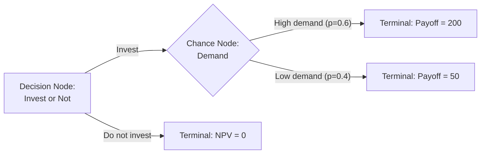
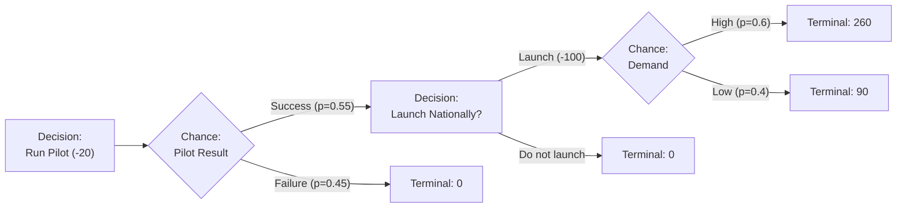

## Decision Tree Analysis

### Overview

Decision tree analysis (DTA) is a structured, graphical method for evaluating sequential decisions under uncertainty. In corporate finance, it is used to model investment decisions that unfold in stages — where each stage involves a choice (decision node) followed by the resolution of uncertainty (chance node), and where later decisions are contingent on earlier outcomes. Unlike single-point NPV, which discounts one fixed set of expected cash flows, decision trees explicitly map the branching structure of possible futures and the managerial responses available at each branch, making them a natural complement to real options analysis.

---

### Core Building Blocks

| Element | Symbol (convention) | Meaning |
| --- | --- | --- |
| Decision node | Square | A point where management chooses among alternatives (invest, delay, abandon, expand) |
| Chance node | Circle | A point where uncertainty resolves according to a probability distribution (demand high/low, success/failure) |
| Terminal node | Triangle / endpoint | Final payoff at the end of a branch |
| Branch | Line/arrow | A possible action or outcome, labeled with its probability (chance branches) or cost (decision branches) |

#### Basic Structure

---

### Methodology: Building and Solving a Decision Tree

#### Step 1 — Structure the Problem

Identify all decision points, the alternatives available at each, and the points at which uncertainty is resolved. Sequence matters: the tree should reflect the actual chronological and informational order in which decisions are made and information arrives.

#### Step 2 — Assign Probabilities

Chance-node branches must be assigned probabilities that sum to 1 across each node's branches. These are typically derived from:

- Historical data or market research
- Expert/management judgment
- Scenario analysis (base/upside/downside cases mapped to discrete probabilities)

#### Step 3 — Assign Payoffs

Terminal nodes receive the cash flow or NPV outcome associated with that specific path through the tree.

#### Step 4 — Solve by Backward Induction ("Rollback")

The tree is solved from right to left (from terminal nodes back to the initial decision):

- **At chance nodes:** compute the expected value (EV) as the probability-weighted average of the branches emanating from that node.

$$EV = \sum_{i=1}^{n} p_i \times X_i$$

- **At decision nodes:** select the branch (alternative) with the highest expected value (or lowest expected cost), and prune (discard) the inferior branches. The value carried backward to that node is the value of the *optimal* choice, not an average of all choices.

This recursive process — average out at chance nodes, choose the best at decision nodes — is often abbreviated **"average out and fold back."**

#### Step 5 — Discount to Present Value

Since branches occur at different points in time, expected cash flows at each node must be discounted back to $t=0$ using an appropriate risk-adjusted discount rate (or, in more advanced applications, risk-neutral probabilities with the risk-free rate — see the Decision Trees vs. Real Options section below).

---

### Worked Example

A firm is considering a two-stage product launch.

**Stage 1:** Invest $20M in a pilot program.

**Stage 2 (contingent on pilot result):** If the pilot succeeds, the firm can invest a further $100M to launch nationally; if it fails, the firm abandons at zero further cost.

Probabilities and payoffs (all already expressed as PV at the relevant decision point, discount rate embedded):

- P(pilot succeeds) = 0.55; P(pilot fails) = 0.45
- If succeeds, and national launch proceeds:
  - P(high demand | success) = 0.6 → PV of cash flows = $260M
  - P(low demand | success) = 0.4 → PV of cash flows = $90M
- If pilot fails → no further investment, payoff = $0

**Rollback from right to left:**

**Chance node E (Demand, given launch):**

$$EV_E = 0.6(260) + 0.4(90) = 156 + 36 = \$192M$$

**Decision node C (Launch or not, given success):**

$$\text{Launch: } 192 - 100 = \$92M \quad \text{vs.} \quad \text{Don't launch: } \$0$$

Optimal choice: **Launch** → value carried back = $92M

**Chance node B (Pilot result):**

$$EV_B = 0.55(92) + 0.45(0) = \$50.6M$$

**Decision node A (Run pilot or not):**

$$\text{Run pilot: } 50.6 - 20 = \$30.6M \quad \text{vs.} \quad \text{Don't run pilot: } \$0$$

Optimal choice: **Run the pilot** → **Expected NPV = $30.6M**

#### Key Points

- The rollback method automatically embeds the option to abandon at Stage 2 (not launching nationally if the pilot fails) — this is precisely why decision trees are the natural discrete-scenario counterpart to real options analysis
- A single-point NPV computed by simply weighting the *best-case outcome only* would overstate value; the tree correctly prunes the inferior "don't launch" branch only where it's actually inferior, node by node
- If the national launch decision were *not* contingent on pilot success (i.e., committed upfront regardless of pilot outcome), the expected value would differ, illustrating why correctly sequencing decision and chance nodes is critical

---

### Sensitivity and Risk Analysis Extensions

Decision trees are commonly paired with:

- **Sensitivity analysis**: re-solving the tree under different probability or payoff assumptions to test how robust the optimal path is
- **Expected Value of Perfect Information (EVPI)**: the difference between the tree's value if the firm could know the chance outcome in advance versus the value under uncertainty — quantifies the maximum amount worth paying for additional information (e.g., market research) before committing

$$EVPI = EV_{\text{with perfect information}} - EV_{\text{under uncertainty}}$$

- **Risk profile / payoff distribution**: rather than only reporting the expected value, the full distribution of terminal payoffs (with associated probabilities) can be tabulated to assess variance and downside exposure, since two trees can have identical EV but very different risk profiles

---

### Discounting Considerations

A common pitfall is applying a single constant risk-adjusted discount rate uniformly across all branches, even though risk (and therefore the appropriate discount rate) can differ by stage — e.g., early-stage technical risk (pilot success/failure) is often diversifiable/firm-specific, while later-stage market demand risk may carry different systematic risk. Two common refinements:

1. **Stage-differentiated discount rates**: apply higher rates to riskier early stages and lower rates to more predictable later cash flows
2. **Risk-neutral valuation**: convert real-world probabilities to risk-neutral probabilities (as in binomial option pricing) and discount all cash flows at the risk-free rate — this is the bridge between decision tree analysis and real options valuation

[Inference] In practice, many corporate finance applications use a single risk-adjusted discount rate for simplicity, accepting some theoretical imprecision in exchange for transparency and ease of communication to stakeholders.

---

### Decision Trees vs. Real Options Analysis

| Dimension | Decision Tree Analysis | Real Options (Black-Scholes/Binomial) |
| --- | --- | --- |
| Probabilities | Real-world (subjective/estimated) probabilities | Risk-neutral probabilities derived from replication/no-arbitrage |
| Discount rate | Single or stage-varying risk-adjusted rate(s), applied somewhat ad hoc | Risk-free rate, applied consistently once risk-neutral probabilities are used |
| Structure | Fully flexible, any number of branches/stages, any payoff structure | Typically requires assumptions of continuous, lognormal, replicable underlying asset value |
| Transparency | High — easy to audit, explain, and modify assumptions | Lower — relies on volatility estimation and option-pricing machinery |
| Theoretical rigor on risk pricing | Lower — discount rate selection is often judgmental | Higher — grounded in no-arbitrage pricing theory, if assumptions hold |

[Inference] The two methods are frequently used together in practice: the tree structure to map out the decision sequence, with real-options-consistent (risk-neutral) probabilities and discounting applied at each node where the underlying risk can reasonably be treated as spanned by traded assets — this hybrid is sometimes referred to as the "decision tree/real options" or "risk-neutral decision tree" approach in academic treatments (e.g., Copeland & Antikarov).

---

### Common Pitfalls

- **Overly coarse probability estimation**: reducing genuinely continuous uncertainty (e.g., demand) into only two or three discrete branches can materially distort the true expected value and variance if branch points are not well chosen
- **Ignoring correlation between branches**: treating sequential chance nodes as independent when they are not (e.g., a technically difficult pilot success may also predict lower-than-typical national demand due to product complexity) can bias results
- **Inconsistent discount rate application**: using the firm's overall WACC uniformly across nodes with very different risk characteristics
- **Path explosion**: trees with many sequential decisions and multiple branches per node grow exponentially in complexity; in practice, trees are often simplified via scenario bucketing or supplemented with Monte Carlo simulation for continuous variables

---

### Software and Practical Implementation

Decision trees for corporate finance applications are commonly built in:

- Spreadsheet software (Excel) using structured formulas and data tables, often with add-ins (e.g., TreePlan, PrecisionTree) for visualization and automated rollback
- Dedicated decision-analysis software for larger, multi-branch trees
- [Unverified] Specific current software feature sets and version capabilities should be verified against vendor documentation, as this space evolves and exact functionality is not something to state with certainty here

---

**Related Topics**

- The option to abandon or delay (real options)
- Monte Carlo simulation in capital budgeting
- Expected Value of Perfect Information (EVPI) and Value of Information analysis
- Risk-neutral valuation and binomial option pricing
- Scenario analysis and sensitivity analysis in DCF
- Certainty equivalents vs. risk-adjusted discount rates
- Staged/sequential investment and compound real options