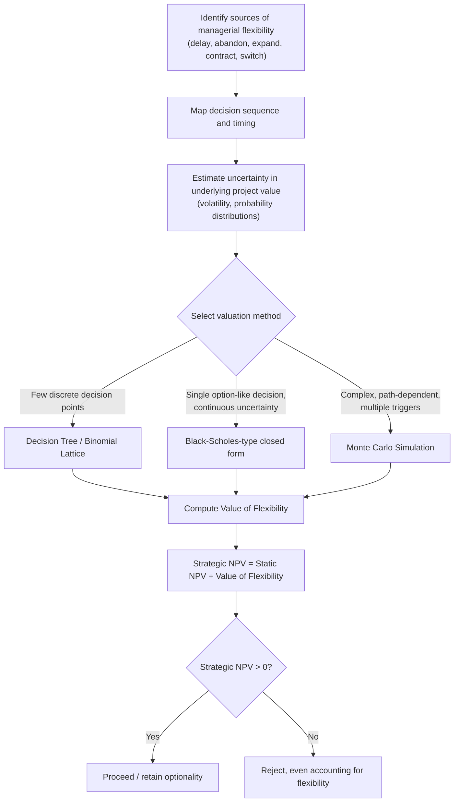

## Valuing Flexibility in Capital Budgeting

### Overview

Traditional capital budgeting techniques — NPV, IRR, payback period — implicitly assume a project is a static, "now-or-never" commitment: cash flows are forecast along a single expected path, discounted at a fixed rate, and accepted or rejected once. In reality, management retains the ability to react as uncertainty resolves: delaying investment, expanding successful projects, contracting or abandoning failing ones, or switching inputs/outputs in response to changing conditions. **Valuing flexibility** is the discipline of explicitly quantifying this managerial adaptability and incorporating it into the investment decision, rather than treating it as an unpriced qualitative afterthought.

This topic sits at the intersection of the two preceding subjects in this chapter — decision tree analysis and specific real options (delay, abandon, expand, contract, switch) — and addresses *why* and *when* flexibility carries measurable economic value, and *how* to build it into a formal capital budgeting framework.

---

### Why Traditional NPV Undervalues Flexibility

Standard NPV assumes:

1. A single, fixed decision made at $t=0$
2. Cash flows follow one expected trajectory, discounted at a constant risk-adjusted rate
3. No subsequent managerial intervention once the investment is made

$$NPV = -C_0 + \sum_{t=1}^{n} \frac{E[CF_t]}{(1+r)^t}$$

This formulation treats upside and downside scenarios symmetrically in expectation, but management does not passively experience both — flexibility means the firm can **exploit favorable states and limit exposure to unfavorable ones**. That asymmetry has value that a static expected-cash-flow calculation cannot capture.

$$\text{Expanded (Strategic) NPV} = \text{Static NPV} + \text{Value of Flexibility (Option Value)}$$

The value of flexibility is analogous to the value of an option's asymmetric payoff structure: the option holder benefits from favorable movements while the loss is capped at the premium (or, in the real-asset case, at the sunk investment already made).

---

### Conditions Under Which Flexibility Has High Value

Flexibility is not uniformly valuable across all projects. Its value increases with:

| Driver | Effect on Flexibility Value |
| --- | --- |
| **Uncertainty** (volatility of underlying project value) | Higher uncertainty → higher option value, since a wider range of future states increases the value of being able to choose favorably among them |
| **Irreversibility of the base investment** | Higher irreversibility → higher value of deferral/abandonment options, since the cost of being "locked in" without flexibility is greater |
| **Time until commitment is forced** | Longer time horizon before a decision must be finalized → more value from optionality (more time for uncertainty to resolve favorably) |
| **Degree of managerial discretion / contractual rights** | Exclusive rights (patents, licenses, land options) preserve option value against competitive erosion |

Conversely, flexibility has **low incremental value** when: uncertainty is low, the investment is fully reversible (e.g., low sunk cost, liquid secondary market for the asset), or competitors can freely pre-empt the opportunity regardless of the firm's own timing.

---

### Categories of Managerial Flexibility (Real Options Taxonomy)

| Option Type | Nature of Flexibility | Financial Option Analogy |
| --- | --- | --- |
| Option to delay/defer | Wait for uncertainty to resolve before committing capital | Call option |
| Option to abandon | Exit and recover salvage value if outcomes are unfavorable | Put option |
| Option to expand | Scale up if conditions are favorable | Call option on additional capacity |
| Option to contract | Scale down operations to reduce losses | Put option on reduced scale |
| Option to switch | Change inputs, outputs, or operating mode in response to relative price/demand shifts | Portfolio of options |
| Compound options | Sequential options where exercising one creates or reveals the next (e.g., staged R&D) | Option on an option |

*(Delay and abandon are treated in depth elsewhere in this chapter; this topic focuses on the general valuation framework that unifies them.)*

---

### Frameworks for Valuing Flexibility

#### 1. Decision Tree Analysis (Discrete-State Approach)

Maps out sequential decision and chance nodes explicitly, solved via backward induction ("average out and fold back"). Well-suited to communicating flexibility value transparently to stakeholders, though probability and discount-rate assumptions are often judgmental. (Full methodology covered under Decision Tree Analysis in this chapter.)

#### 2. Option Pricing Models (Continuous-State Approach)

Treats the flexibility as a financial option on the underlying project value, using Black-Scholes-type closed-form solutions or binomial/lattice methods for path-dependent or multiple-exercise-point flexibility.

$$C = S_0 N(d_1) - K e^{-r_f T} N(d_2)$$

This approach borrows the no-arbitrage, risk-neutral valuation logic of financial options, substituting project-specific inputs (PV of cash flows for $S_0$, investment cost for $K$, project value volatility for $\sigma$).

#### 3. Simulation-Based Approaches (Monte Carlo)

Where flexibility involves complex, path-dependent decision rules that are difficult to capture in closed-form option formulas or small trees, Monte Carlo simulation generates thousands of possible cash flow paths, applies the relevant decision rule (e.g., "abandon if cumulative losses exceed X") along each path, and averages the resulting discounted payoffs.

$$\text{Value} = \frac{1}{N}\sum_{i=1}^{N} \left(\max\text{-payoff along path } i\right) \times e^{-r_f T}$$

This is especially useful for compound, multi-trigger flexibility (e.g., a project with simultaneous expand, contract, and abandon options across many periods) where lattice methods become computationally unwieldy.

---

### Unified Process Flow

---

### Worked Example: Staged Manufacturing Investment

A firm evaluates a plant expansion with an embedded option to abandon at Year 2 if demand disappoints, using decision-tree rollback (as detailed methodologically under Decision Tree Analysis).

- Initial investment: $40M
- Static (no-flexibility) expected NPV: **−$3M** (project would be rejected under naive NPV)
- Incorporating the option to abandon at Year 2 for a $15M salvage recovery in the low-demand state raises expected value by $9M once the inferior "continue operating at a loss" branch is pruned

$$\text{Strategic NPV} = -3 + 9 = +\$6M$$

The project shifts from reject to accept once flexibility is priced explicitly — this is the central practical payoff of the framework: **flexibility can convert marginal or negative-NPV projects into value-creating ones**, and ignoring it systematically biases firms toward underinvestment in uncertain, strategically important opportunities.

#### Key Points

- The value of flexibility is *additive* to static NPV only when options are valued independently; when multiple options are embedded in the same project (e.g., both delay and abandon), they typically **interact** and are not simply additive — exercising one option can change the value of another (interaction/portfolio effects), so compound or multiple-option valuation requires joint modeling rather than summing standalone values
- Flexibility value is not free: it often requires paying an explicit or implicit premium (e.g., holding a more expensive but modular technology, or maintaining excess capacity) — the decision-relevant question is whether the option value exceeds this cost of preserving flexibility
- [Inference] In corporate practice, the greatest resistance to adopting real-options/flexibility valuation is typically organizational rather than technical — capital budgeting processes built around single-point NPV hurdle rates can be difficult to adapt to option-based decision criteria, and volatility/probability inputs are harder to defend to committees than a single discounted cash flow figure

---

### Limitations and Practical Cautions

- **Volatility estimation** for non-traded, project-specific uncertainty remains the most significant practical challenge across all methods — proxies (comparable firm volatility, historical variance of forecasts, simulation-derived dispersion) each carry estimation risk
- **Market completeness assumption**: option-pricing methods rely on the underlying risk being spanned or replicable by traded securities; when this assumption is weak (highly idiosyncratic project risk), decision-tree methods with subjective probabilities may be more defensible, albeit less rigorous on risk pricing
- **Overstatement risk**: flexibility valuation can be misused to justify marginal projects by inflating volatility or understating the cost of maintaining optionality — rigorous, auditable assumption-setting is essential to avoid this bias
- **Behavioral frictions**: as with the abandonment option specifically, organizations may fail to exercise value-maximizing flexibility in practice due to sunk-cost bias or misaligned incentives, meaning the *theoretical* value of flexibility may exceed the value actually *realized*

---

**Related Topics**

- The option to abandon or delay
- Decision tree analysis
- The option to expand or contract
- The option to switch inputs/outputs
- Compound and sequential (staged) real options
- Monte Carlo simulation in capital budgeting
- Risk-neutral valuation and binomial lattice methods
- Behavioral biases in capital allocation (sunk-cost fallacy, escalation of commitment)