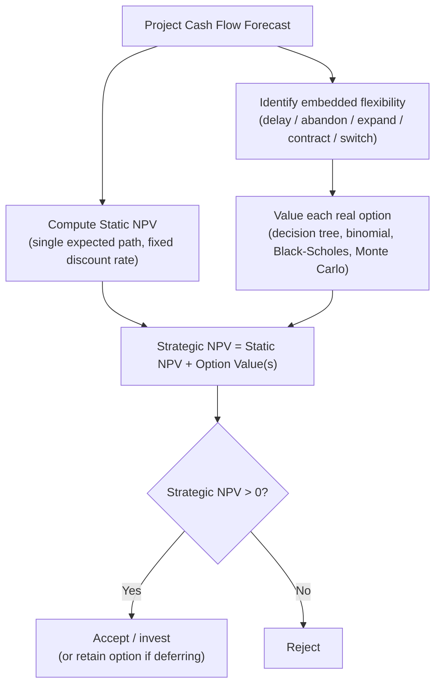

## Strategic Net Present Value

### Overview

Strategic Net Present Value (Strategic NPV, also called Expanded NPV or Adjusted NPV in the real-options literature) is a capital budgeting framework that augments traditional NPV by explicitly adding the value of embedded managerial flexibility (real options) to the static, passive-DCF value of a project. It formalizes the conclusion reached throughout this chapter: conventional NPV, by valuing a single fixed cash flow path, systematically misprices projects containing meaningful decision flexibility, competitive/strategic positioning value, or multi-stage contingent structure.

$$\text{Strategic NPV} = \text{Static (Passive) NPV} + \text{Value of Embedded Real Options}$$

---

### Conceptual Decomposition

Strategic NPV separates project value into two additive (in the simple case) components:

| Component | Definition | Valuation Method |
| --- | --- | --- |
| **Static/Passive NPV** | Value of the project's expected cash flows under a single committed path, ignoring any managerial ability to react to new information | Traditional DCF: $-C_0 + \sum \frac{E[CF_t]}{(1+r)^t}$ |
| **Option Value (Flexibility Premium)** | Value added by the ability to delay, abandon, expand, contract, or switch in response to resolving uncertainty | Decision trees, binomial lattices, Black-Scholes-type models, or Monte Carlo simulation |

$$\text{Strategic NPV} = NPV_{\text{static}} + \sum_{i} V(\text{Option}_i)$$

where the summation runs over all materially valuable embedded options identified in the project (delay, abandon, expand, contract, switch, compound options), recognizing that when multiple options are present, simple summation is only a first approximation — see Interaction Effects below.

---

### Why the Distinction Matters

Static NPV alone produces systematically biased accept/reject decisions in three characteristic ways:

1. **False rejections**: projects with negative static NPV but valuable embedded flexibility (e.g., an exploratory investment with a strong option to expand if successful) are wrongly rejected
2. **Mispriced comparisons**: two projects with identical static NPV can have very different Strategic NPV if one contains significant optionality (e.g., staged investment with abandonment rights) and the other is a fully committed, irreversible outlay
3. **Underinvestment bias in uncertain/strategic sectors**: industries characterized by high uncertainty and long-lived, irreversible investment (pharma R&D, natural resources, technology platforms) are especially prone to underinvestment when evaluated purely on static NPV, since these are precisely the conditions under which option value is largest

---

### Worked Example: Pharmaceutical Development Program

A biotech firm evaluates a Phase II drug program.

- Cost of Phase II trial: $30M
- If Phase II fails (P = 0.65): program terminates, value = $0
- If Phase II succeeds (P = 0.35): firm has the *option*, not obligation, to invest $200M in Phase III/commercialization
  - PV of expected commercial cash flows if launched: $340M
  - Static NPV of proceeding to Phase III unconditionally (ignoring the option to walk away) would use a single blended expected path

**Static NPV (naively discounting a single blended path without recognizing the abandonment/option structure at the Phase II/III gate):**

If cash flows were forecast as a single expected trajectory without recognizing that Phase III is optional, a simplistic blended-expectation calculation might understate value or even show a negative figure, because it forces in expectation the "always proceed to Phase III" cash flows including the 65% failure branch's full negative exposure.

**Strategic NPV (recognizing the compound option structure):**

At the Phase II/III decision gate, management only proceeds to Phase III if it is value-accretive:

$$\text{Phase III decision: } \max(340 - 200, 0) = \$140M \text{ (if success)}$$

$$E[\text{Value}] = 0.35(140) + 0.65(0) = \$49M$$

$$\text{Strategic NPV} = 49 - 30 = \$19M$$

The compound-option structure (Phase II trial as an option to acquire the Phase III option) converts what a naive single-path DCF might show as marginal or negative into a clearly positive strategic value — this is the canonical corporate finance illustration of Strategic NPV in R&D-intensive industries.

#### Key Points

- Strategic NPV does not replace static NPV — it **decomposes and extends** it, and the static component should still be computed and reported separately so decision-makers can see how much of total value comes from committed cash flows versus optionality
- The framework is most decision-relevant precisely where traditional NPV is least reliable: high uncertainty, high irreversibility, multi-stage investment
- A positive option value component does not, by itself, justify investing immediately — for a pure delay option, the correct action when Strategic NPV is positive but static NPV is negative is typically to **retain the option** (wait), not to invest now

---

### Interaction Effects Among Multiple Options

When a project embeds more than one type of flexibility simultaneously (e.g., both an option to expand and an option to abandon), their values are generally **not simply additive**. Exercising one option can materially change the value of another:

$$V(\text{Option}_A + \text{Option}_B) \neq V(\text{Option}_A) + V(\text{Option}_B) \quad \text{(in general)}$$

- **Options in the same direction** (e.g., abandon and contract, both downside-protection options) tend to exhibit **negative interaction** — the marginal value of the second option is reduced because the first already captures much of the same downside protection
- **Options in opposite directions** (e.g., expand and abandon, covering upside and downside respectively) tend to interact **less negatively** or can even be closer to additive, since they hedge different states of the world

[Inference] Because of these interaction effects, rigorous multi-option Strategic NPV analysis typically requires joint valuation (e.g., a single lattice or simulation model capturing all embedded decision rules together) rather than summing independently computed single-option values, particularly when the options are exercisable at overlapping points in the project's life.

---

### Relationship to Other Tools in This Chapter

| Tool | Role Relative to Strategic NPV |
| --- | --- |
| Decision tree analysis | Provides the discrete-state mechanism (backward induction/rollback) commonly used to compute the option-value component |
| Option to delay | One specific option type whose value feeds into the Strategic NPV summation |
| Option to abandon | One specific option type whose value feeds into the Strategic NPV summation |
| Valuing flexibility (general framework) | The conceptual and methodological umbrella; Strategic NPV is the specific *decision metric/formula* that operationalizes "value of flexibility" into a single accept/reject criterion |

---

### Practical Implementation Considerations

- **Transparency in reporting**: best practice is to present Strategic NPV as static NPV plus a clearly itemized option-value bridge, rather than a single blended number, so stakeholders can interrogate each assumption (probabilities, volatility, discount rates) independently
- **Discount rate consistency**: the static NPV component uses a risk-adjusted discount rate appropriate to the committed cash flows, while the option-value component, if computed via option-pricing methods, typically uses risk-neutral probabilities and the risk-free rate — mixing these methodologies without care can produce internally inconsistent valuations
- **Governance and hurdle rates**: firms that apply a single fixed NPV hurdle rate across all projects may need separate approval processes or lower effective hurdles for high-optionality projects, since Strategic NPV can be legitimately positive even when a project would fail a conventional static-NPV-only screening threshold
- [Unverified] The degree to which large corporations formally integrate Strategic NPV/real-options metrics into standard capital budgeting approval processes, versus using them as a supplementary analytical lens alongside conventional NPV, varies substantially by industry and firm, and specific current adoption rates should not be asserted without direct sourcing

---

### Common Pitfalls

- **Double-counting**: adding a generic "strategic premium" on top of both a padded static NPV *and* a separately computed option value, effectively counting the same flexibility twice
- **Overstating optionality to rescue weak projects**: using inflated volatility or overly generous exercise assumptions to manufacture a positive Strategic NPV for a project that is genuinely value-destroying
- **Ignoring competitive erosion**: option value calculations that assume the firm retains exclusive rights to exercise (e.g., delay) indefinitely, when in reality competitor action can eliminate the option before the firm chooses to exercise it
- **Treating Strategic NPV as a single number without decomposition**, obscuring where the value actually originates and making the analysis harder to audit or challenge

---

**Related Topics**

- The option to abandon or delay
- Decision tree analysis
- Valuing flexibility in capital budgeting
- Compound and sequential (staged) real options
- Risk-neutral valuation and binomial lattice methods
- Real options in R&D and pharmaceutical portfolio valuation
- Capital budgeting under competitive pre-emption (game-theoretic real options)