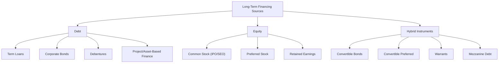

## Sources of Long-Term Financing

### Overview

Long-term financing refers to capital raised with maturities typically exceeding one year (often 5–30+ years, or permanent in the case of equity) used to fund fixed assets, expansion, acquisitions, and other investments with extended payback horizons. Firms draw on a spectrum of sources that differ in cost, risk, control implications, tax treatment, and claim priority. Understanding this spectrum — and how it maps onto the broader capital structure decision — is foundational to corporate financing strategy.

---

### Classification Framework

Long-term financing sources are generally grouped into three broad categories:

| Category | Nature of Claim | Examples |
| --- | --- | --- |
| **Long-term debt** | Fixed contractual obligation; priority claim on assets/cash flows | Term loans, corporate bonds, debentures, project finance debt |
| **Equity** | Residual ownership claim; no fixed repayment obligation | Common stock, preferred stock, retained earnings |
| **Hybrid instruments** | Combine debt and equity features | Convertible bonds, convertible preferred stock, warrants, mezzanine financing |

---

### Long-Term Debt Financing

#### Term Loans

Loans extended by banks or institutional lenders with a fixed repayment schedule, typically 3–10 years, secured by specific collateral or general corporate assets.

- **Key Points**: Interest often floating-rate (indexed to a benchmark such as SOFR), may include covenants restricting additional debt, dividend payments, or requiring maintenance of financial ratios (leverage, interest coverage)

#### Corporate Bonds

Publicly or privately placed debt securities with a stated coupon, maturity, and face value, sold to a broad investor base.

$$P_0 = \sum_{t=1}^{n} \frac{C}{(1+y)^t} + \frac{F}{(1+y)^n}$$

where $P_0$ is the bond's price, $C$ is the periodic coupon, $F$ is face value, and $y$ is the yield to maturity.

- **Types**: Secured (mortgage bonds, backed by specific assets) vs. unsecured (debentures, backed by general creditworthiness); fixed-rate vs. floating-rate; callable vs. non-callable; investment-grade vs. high-yield ("junk")
- **Key Points**: Bond covenants (affirmative and negative) protect bondholders; credit rating agencies (Moody's, S&P, Fitch) assess default risk and directly influence the coupon rate required

#### Debentures

Unsecured long-term debt instruments backed only by the general credit and earning power of the issuer, not specific collateral. Common in jurisdictions/markets where the issuer has strong credit standing; typically carries a higher coupon than secured debt to compensate for the lack of collateral.

#### Project Finance / Asset-Based Long-Term Debt

Debt structured around a specific asset or project's cash flows (e.g., infrastructure, energy projects), often with limited or no recourse to the parent company's general balance sheet.

---

### Equity Financing

#### Common Stock

Represents residual ownership; common stockholders have voting rights and residual claims on assets and earnings after all other claimants (debt holders, preferred stockholders) are satisfied.

- **Initial Public Offering (IPO)**: First sale of common stock to the public, converting a private firm to publicly traded status
- **Seasoned Equity Offering (SEO) / Follow-on Offering**: Additional shares issued by an already-public company
- **Rights Issue**: Existing shareholders offered the right to purchase additional shares, typically at a discount, in proportion to current holdings — preserves proportional ownership if fully subscribed
- **Private Placement**: Equity sold directly to a limited number of institutional or accredited investors without a public offering

$$\text{Cost of Equity (CAPM)} = r_f + \beta(r_m - r_f)$$

#### Preferred Stock

A hybrid-like equity instrument with a fixed dividend (similar to debt's fixed coupon) but generally without a maturity date or guaranteed repayment (equity-like), and typically without voting rights.

- **Key Points**: Dividends are usually cumulative (unpaid dividends accrue and must be paid before common dividends resume) and preferred claims rank senior to common stock but junior to all debt in liquidation
- Preferred dividends are generally not tax-deductible to the issuer (unlike interest on debt), which is a key driver of preferred stock's relatively higher cost compared to debt

#### Retained Earnings

Internally generated funds retained rather than distributed as dividends, representing the largest source of long-term financing for many mature firms.

- **Key Points**: No issuance costs, no dilution, no need for external market access; however, it carries an opportunity cost equal to the return shareholders could have earned by receiving the funds as dividends and reinvesting elsewhere — treated as having a cost of capital equal to the required return on equity

---

### Hybrid Instruments

#### Convertible Bonds

Debt securities that give the holder the option to convert into a predetermined number of common shares, combining a bond's downside protection (fixed coupon, priority claim) with upside participation in equity appreciation.

$$\text{Conversion Ratio} = \frac{\text{Face Value}}{\text{Conversion Price}}$$

- **Key Points**: Typically carry a lower coupon than straight debt because investors pay for the embedded conversion option through reduced yield; valuation combines a straight-bond component and an embedded call option on the issuer's stock

#### Convertible Preferred Stock

Preferred shares convertible into common stock, often used in venture capital and growth-equity financing to give investors downside protection (preferred claim/dividend) with upside optionality.

#### Warrants

Long-term options issued by the company giving the holder the right to purchase shares at a specified exercise price before expiration, often attached to bond or loan issues ("equity sweeteners") to reduce the required coupon.

#### Mezzanine Financing

Subordinated debt or preferred equity that ranks below senior debt but above common equity in the capital structure, frequently including warrants or conversion features; commonly used in leveraged buyouts and growth financing where senior debt capacity is exhausted.

---

### Comparison Table: Key Characteristics

| Source | Fixed Obligation | Tax Deductibility | Ownership Dilution | Claim Priority | Typical Cost (relative) |
| --- | --- | --- | --- | --- | --- |
| Term loans / bonds | Yes | Interest deductible | No | Senior | Lowest |
| Debentures | Yes | Interest deductible | No | Senior (unsecured) | Low–Moderate |
| Mezzanine debt | Partial | Often deductible | Possible (if convertible) | Subordinated | Moderate–High |
| Convertible bonds | Yes (until conversion) | Interest deductible | Potential | Senior (until conversion) | Moderate |
| Preferred stock | No (dividend, not debt) | Not deductible | No (no voting typically) | Between debt and common equity | Moderate–High |
| Common stock (retained earnings) | No | N/A | No (internal) | Residual | Implicit cost of equity |
| Common stock (new issuance) | No | N/A | Yes | Residual | Highest |

---

### Capital Structure and Selection Considerations

The choice among long-term financing sources reflects several interacting factors, each explored in depth elsewhere in corporate finance study but summarized here as selection drivers:

- **Cost of capital**: debt is generally cheaper than equity due to the tax shield on interest and debt holders' seniority (lower required return), but excessive debt raises financial distress risk and can increase the cost of *both* debt and equity at high leverage levels
- **Control and dilution**: equity issuance dilutes existing ownership and voting control, a significant consideration for founder- or family-controlled firms
- **Financial flexibility and covenant constraints**: debt agreements often impose restrictive covenants limiting future financing or operating flexibility
- **Signaling effects**: per pecking order theory, equity issuance can be interpreted by the market as a signal that management believes shares are overvalued, often producing a negative stock price reaction; retained earnings and debt are generally preferred over new equity issuance for this reason
- **Market conditions**: interest rate environment, credit spreads, and equity market valuations at the time of financing materially affect the relative attractiveness of each source
- **Life-cycle stage**: early-stage/high-growth firms with limited or no cash flow and collateral often rely more heavily on equity and convertible/mezzanine instruments, while mature firms with stable cash flows can support higher proportions of straight debt

[Inference] The pecking order theory (Myers and Majluf) suggests firms generally prefer internal financing (retained earnings) first, then debt, and equity issuance as a last resort, due to information asymmetry and signaling costs — though this is a widely taught theoretical framework rather than a description that holds uniformly across all firms and market conditions.

---

### Key Points

- Long-term financing sources span a continuum from pure debt (fixed obligation, tax-deductible, senior claim) to pure equity (no fixed obligation, non-deductible, residual claim), with hybrids occupying the middle ground
- The overall mix of these sources constitutes the firm's capital structure, and the marginal cost of each source changes as the firm's leverage and risk profile shift — a topic developed further under capital structure theory (Modigliani-Miller, trade-off theory, pecking order theory)
- Issuance costs (underwriting fees, legal costs, registration expenses) vary significantly by instrument type and are generally highest for public equity offerings and lowest for private term loans or retained earnings

---

**Related Topics**

- Capital structure theory (Modigliani-Miller propositions, trade-off theory, pecking order theory)
- Cost of capital and WACC estimation
- Initial public offerings and underwriting process
- Bond valuation and yield-to-maturity
- Convertible securities valuation
- Leveraged buyouts and mezzanine financing structures
- Dividend policy and retained earnings decisions
- Credit ratings and corporate bond covenants