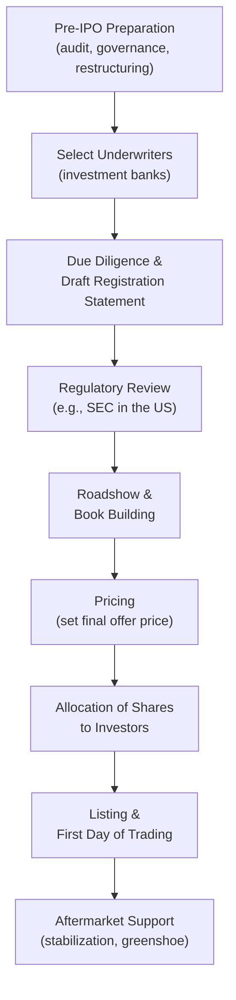

## Initial Public Offering Process and Pricing

### Overview

An Initial Public Offering (IPO) is the process through which a privately held company offers shares to the public for the first time, transitioning to publicly traded status. Beyond simply raising capital, an IPO establishes a public market price for the firm's equity, creates liquidity for existing shareholders, and subjects the company to ongoing public disclosure and governance requirements. The process combines legal/regulatory compliance, valuation, marketing, and a specialized pricing mechanism designed to balance issuer proceeds against aftermarket price stability.

---

### The IPO Process: Sequential Stages

#### Step 1 — Pre-IPO Preparation

The company strengthens governance (independent board members, audit committee), ensures audited financial statements meet public-company standards, and often restructures its capital or corporate structure in anticipation of public ownership.

#### Step 2 — Underwriter Selection

The issuer selects one or more investment banks to act as underwriters. A **lead underwriter (bookrunner)** coordinates the offering; larger IPOs use a **syndicate** of multiple banks to distribute risk and broaden distribution capacity.

**Underwriting arrangement types:**

| Arrangement | Mechanism | Risk Allocation |
| --- | --- | --- |
| Firm commitment | Underwriter purchases the entire share issue from the company at a fixed price and resells to the public | Underwriter bears the risk of unsold shares |
| Best efforts | Underwriter agrees only to use best efforts to sell shares, with no guarantee of the full amount raised | Issuer bears the risk of an undersubscribed offering |

Firm commitment is the standard structure for most traditional IPOs in developed markets.

#### Step 3 — Due Diligence and Registration

The underwriting syndicate and legal counsel conduct due diligence, and the company files a **registration statement** (e.g., Form S-1 in the United States) with the relevant securities regulator, containing audited financials, risk factors, use of proceeds, and business description. A preliminary prospectus (often called a **"red herring"**, since it carries a legend in red ink noting the offering terms are not yet final) is distributed to prospective investors during this stage.

#### Step 4 — Regulatory Review

The regulator (e.g., the SEC) reviews the filing and may issue comment letters requiring amendments before declaring the registration effective.

#### Step 5 — Roadshow and Book Building

Company management and underwriters present to institutional investors across multiple cities (or virtually) to generate demand. Concurrently, the underwriter conducts **book building**: soliciting indications of interest from institutional investors at various price points to gauge demand and inform final pricing.

#### Step 6 — Pricing

The final offer price is set the evening before trading begins, based on book-building demand, comparable company valuations, and market conditions (detailed in the Pricing Methodologies section below).

#### Step 7 — Allocation

Shares are allocated among investors who submitted orders during book building, typically favoring long-term institutional holders to promote post-IPO price stability, alongside allocations to retail investors depending on jurisdiction and offering structure.

#### Step 8 — Listing and First-Day Trading

Shares begin trading on the chosen exchange. The **opening trade** is often determined via an auction mechanism coordinated between the exchange and the lead underwriter (acting as stabilizing agent), rather than a simple continuous match, particularly on U.S. exchanges.

#### Step 9 — Aftermarket Stabilization

The lead underwriter may engage in **price stabilization** activities (see Greenshoe Option below) for a limited period after listing to support the stock price if it trades below the offer price.

---

### Underwriting Compensation and the Greenshoe Option

#### Underwriting Spread

The difference between the price the underwriter pays the issuer and the price at which shares are sold to the public, compensating the underwriter for risk-bearing and distribution.

$$\text{Gross Spread} = \text{Public Offering Price} - \text{Price Paid to Issuer}$$

Gross spreads on traditional U.S. IPOs have historically clustered near a commonly cited 7% benchmark for many mid-sized deals, though this varies by deal size, market, and structure. [Unverified] Current typical spread percentages should be verified against recent market data, as fee structures evolve and vary considerably by transaction size and jurisdiction.

#### Greenshoe Option (Over-Allotment Option)

A provision allowing underwriters to sell up to an additional 15% of the offering (standard convention, though the precise percentage is negotiable) beyond the base offer size, typically exercisable within 30 days of the IPO.

- **Mechanism**: Underwriters initially oversell (short) the additional shares. If the stock trades above the offer price, they exercise the greenshoe option to cover the short by purchasing shares from the issuer at the offer price. If the stock trades below the offer price, underwriters instead buy shares in the open market to cover the short position, which supports (stabilizes) the market price
- **Key Points**: This mechanism gives underwriters a natural stabilization tool without requiring separate market operations funded independently of the offering structure

---

### Pricing Methodologies

#### 1. Book Building (Dominant Global Method)

Underwriters collect non-binding indications of interest from institutional investors across a marketed price range, then set the final price based on aggregate demand, often pricing at or near the top of the range for strongly oversubscribed deals.

$$\text{Demand-Weighted Price Discovery} \Rightarrow \text{Final Offer Price} \in [\text{Low}, \text{High}] \text{ of Marketed Range}$$

- **Key Points**: Allows price discovery informed by real institutional demand; the initial price range itself is set using comparable company multiples and discounted cash flow analysis as a starting anchor

#### 2. Fixed Price Method

The issuer and underwriter set a single fixed price in advance of the offering, without a book-building demand-discovery phase; more common in some jurisdictions and for smaller offerings, or as a component of hybrid offerings alongside a book-built tranche.

#### 3. Dutch Auction

Investors submit bids specifying both price and quantity; the offering is priced at the highest price at which the entire share allocation can be sold (the market-clearing price), and all successful bidders typically pay this same clearing price regardless of their individual bid.

- **Key Points**: Intended to reduce underpricing and give a broader investor base (including retail) more direct price influence; used in a minority of notable IPOs but is not the dominant global method

#### Comparable Valuation Inputs to the Price Range

Regardless of mechanism, the underwriter typically anchors the initial price range using:

- Comparable company trading multiples (EV/EBITDA, P/E, EV/Revenue) of similar publicly traded firms
- Discounted cash flow valuation of the issuer's projected cash flows
- Recent precedent transaction multiples in the sector
- Qualitative factors: growth prospects, market conditions, sector sentiment

---

### IPO Underpricing

A well-documented empirical phenomenon in which IPO shares are priced below their first-day closing (aftermarket) trading price, producing a positive average first-day return.

$$\text{Underpricing (\%)} = \frac{P_{\text{close, day 1}} - P_{\text{offer}}}{P_{\text{offer}}} \times 100$$

**Leading explanations in the academic literature:**

| Theory | Core Mechanism |
| --- | --- |
| Winner's Curse (Rock, 1986) | Uninformed investors only receive full allocations in unattractive (overpriced) deals, so issuers underprice to keep uninformed investors participating |
| Information Asymmetry / Signaling | Underpricing signals issuer quality, allowing credible signaling that better firms can "leave money on the table" and still profit from favorable follow-on financing |
| Book-Building Compensation | Underwriters underprice to reward institutional investors for truthfully revealing positive demand information during book building |
| Litigation Avoidance | Underpricing reduces the likelihood of shareholder litigation following post-IPO price declines |

[Inference] These theories are not mutually exclusive and are generally presented in finance curricula as complementary explanations, each capturing part of the empirically observed underpricing pattern rather than a single universally accepted cause.

---

### Costs of Going Public

| Cost Type | Description |
| --- | --- |
| Direct costs | Underwriting spread, legal fees, accounting/audit fees, exchange listing fees, printing/filing costs |
| Underpricing ("indirect cost") | Opportunity cost to the issuer/existing shareholders of shares sold below true market value |
| Ongoing public company costs | Increased disclosure, compliance (e.g., governance and internal control requirements), investor relations, higher D&O insurance |

---

### Alternative Routes to Public Markets

| Method | Distinguishing Feature |
| --- | --- |
| Traditional IPO (firm commitment, book-built) | Underwriter-led process described above; raises new capital and establishes initial trading |
| Direct Listing | Existing shares begin trading directly on an exchange without a new capital raise or traditional underwritten offering; relies on an opening auction for initial price discovery |
| Dutch Auction IPO | As described above; price discovery via auction rather than underwriter book building |
| SPAC (Special Purpose Acquisition Company) Merger | A publicly listed shell company merges with a private operating company, taking it public without a traditional IPO process |

---

### Key Points

- The IPO process combines regulatory compliance, valuation, and a demand-discovery pricing mechanism (most commonly book building) to set an offer price intended to balance issuer proceeds against aftermarket stability
- The greenshoe option is the standard mechanism by which underwriters stabilize aftermarket trading without needing separately committed capital
- IPO underpricing is a persistent, empirically observed phenomenon across global markets, though the relative weight of its various theoretical explanations remains a subject of ongoing academic discussion
- [Inference] The choice between traditional IPO, direct listing, and SPAC merger involves trade-offs among capital-raising needs, cost, speed, and desired control over price discovery, and the relative popularity of each method has shifted over time with market conditions and regulatory developments

---

**Related Topics**

- Sources of long-term financing
- Seasoned equity offerings and rights issues
- Valuation methods: comparable company analysis and DCF
- Underwriting syndicates and investment banking economics
- SPAC mergers as an alternative to traditional IPOs
- Corporate governance requirements for newly public companies
- Lock-up periods and post-IPO share sale restrictions