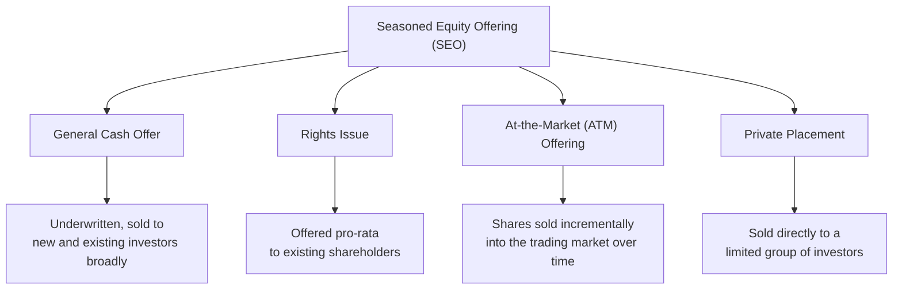

## Seasoned Equity Offerings and Rights Issues

### Overview

A **Seasoned Equity Offering (SEO)**, also called a follow-on offering or secondary equity offering, is the sale of additional common shares by a company that is already publicly traded. Unlike an IPO, an SEO does not establish the first public market price — it raises incremental capital against an existing market valuation. SEOs take several structural forms, the most significant distinction being between offerings sold broadly to the market (general cash offers) and **rights issues**, which are offered preferentially to existing shareholders in proportion to their current holdings. Both are core mechanisms by which already-public firms raise long-term equity capital without going through a full IPO process.

---

### Types of Seasoned Equity Offerings

#### General Cash Offer

The most common SEO structure: new shares are sold to the public market broadly (new and existing investors alike), typically via an underwritten offering similar in mechanics to an IPO (book building, prospectus, underwriting syndicate), but pricing is anchored much more directly to the existing observable market price rather than requiring full comparable-company valuation from scratch.

#### At-the-Market (ATM) Offering

The company sells shares incrementally, directly into the existing trading market over an extended period (weeks to months) through a designated broker-dealer, rather than in a single discrete transaction. This allows the issuer to raise capital opportunistically and with less market impact per share than a large single block offering.

#### Private Placement (Follow-on)

Additional shares sold directly to a limited number of institutional or accredited investors, avoiding the costs and disclosure requirements of a full public offering.

#### Rights Issue

Existing shareholders are granted **rights** entitling them to purchase additional shares, typically at a discount to the current market price, in proportion to their existing ownership stake — preserving proportional ownership (avoiding dilution) for shareholders who exercise their rights in full.

---

### Rights Issue Mechanics

#### Key Terminology

| Term | Definition |
| --- | --- |
| Subscription price | The discounted price at which new shares can be purchased under the rights |
| Rights ratio | Number of existing shares required to purchase one new share (e.g., "1-for-4" means 1 new share for every 4 held) |
| Ex-rights date | Date on or after which shares trade without the attached right |
| Rights-on price | Market price of the share while still carrying the right to subscribe |
| Ex-rights price (theoretical) | Expected market price after the rights are detached |

#### Theoretical Ex-Rights Price (TERP)

$$TERP = \frac{(N \times P_0) + P_S}{N + 1}$$

where $N$ is the number of existing shares required per new share (rights ratio), $P_0$ is the rights-on (cum-rights) market price, and $P_S$ is the subscription price.

#### Value of a Right

$$\text{Value of one right} = \frac{P_0 - P_S}{N + 1}$$

or, once trading ex-rights:

$$\text{Value of one right} = \frac{TERP - P_S}{N}$$

#### Worked Example

A company announces a 1-for-5 rights issue at a subscription price of $40, with the stock currently trading (cum-rights) at $50.

$$TERP = \frac{(5 \times 50) + 40}{5 + 1} = \frac{250 + 40}{6} = \$48.33$$

$$\text{Value of one right} = \frac{50 - 40}{5 + 1} = \frac{10}{6} \approx \$1.67$$

**Interpretation**: A shareholder holding 5 shares (worth $250 cum-rights) can either subscribe for 1 new share by paying $40, bringing their total holding to 6 shares worth $6 \times 48.33 = \$290$ (matching their original $250 plus the $40 paid in), or sell their rights (worth approximately $1.67 each, or $8.33 for the 5 rights attached to their 5 shares) to a third party and let their percentage ownership dilute slightly, while remaining financially neutral in aggregate value terms before transaction costs.

#### Key Points

- Shareholders have three choices when rights are issued: **exercise** the rights (subscribe for new shares), **sell** the rights (renounce them, typically tradable on the exchange for a limited period), or **let them lapse** (which is value-destructive to the shareholder if the rights had positive value, since no compensation is received)
- Because subscription is offered pro-rata, a fully-subscribed rights issue causes no change in an individual shareholder's percentage ownership if they exercise their full entitlement — this is the central design feature distinguishing rights issues from general cash offers
- The theoretical value of a right and the TERP calculation assume no signaling or informational effects from the announcement itself; actual post-issue prices can diverge from TERP due to market reaction to the capital raise announcement

---

### Rights Issue vs. General Cash Offer: Comparison

| Dimension | Rights Issue | General Cash Offer |
| --- | --- | --- |
| Ownership dilution (existing holders) | None, if fully subscribed | Full dilution for non-participating existing holders |
| Underwriting cost | Often lower (existing shareholder base pre-committed) | Higher (broader marketing, book building, syndicate) |
| Pricing discount required | Typically deeper discount to incentivize subscription | Smaller discount to current market price, closer to prevailing price |
| Regulatory/preemptive rights considerations | Often required or preferred in jurisdictions with statutory pre-emption rights (e.g., many European markets) | May require shareholder waiver of pre-emption rights where such rights exist |
| Market signaling | Can still signal negative information, but structurally protects existing shareholders | May be interpreted more negatively due to broader dilution exposure |
| Speed/complexity | Can be slower due to subscription period and rights trading logistics | Can often be executed relatively quickly, especially via ATM or shelf-registered programs |

[Inference] The relative prevalence of rights issues versus general cash offers varies substantially by jurisdiction — rights issues are considerably more common in markets with statutory shareholder pre-emption rights (common in parts of Europe and Asia) than in the United States, where general cash offers (particularly underwritten follow-on offerings) are the dominant SEO structure; exact current market-share statistics by region should be verified against recent data rather than asserted definitively here.

---

### Market Reaction to SEO Announcements

A substantial body of empirical corporate finance research documents that announcements of new equity issuance (both general cash offers and, to a lesser extent, rights issues) are, on average, associated with a **negative abnormal stock price reaction** at announcement.

**Leading explanation — Information Asymmetry / Signaling (Myers and Majluf, 1984):**

Managers are assumed to possess superior information about firm value relative to outside investors. Equity issuance is more attractive to managers when they believe shares are overvalued (since new investors buy in at a price favorable to existing shareholders), so a rational market interprets an equity issuance announcement as a signal that management perceives the stock to be overvalued, leading to a downward price adjustment.

This is the theoretical foundation of the **pecking order theory**: firms prefer internal financing (retained earnings), then debt, and treat new equity issuance as a financing source of last resort due to this negative signaling cost.

#### Key Points

- [Inference] Because rights issues preserve existing shareholders' ownership if exercised, some finance literature suggests the negative signaling effect may be somewhat attenuated relative to general cash offers, though the direction and magnitude of any such difference is not something to assert as a settled, universal empirical finding
- The magnitude of the negative price reaction has been shown in various studies to vary with firm characteristics (size, growth prospects, existing leverage) and stated use of proceeds (e.g., funding a specifically identified value-accretive investment versus generic balance sheet purposes)

---

### Shelf Registration

In many jurisdictions (e.g., under SEC Rule 415 in the United States), an already-public company can file a **shelf registration statement** covering a range of securities it may wish to issue over a subsequent period (commonly up to three years), allowing it to execute SEOs (or debt issuances) quickly when market conditions are favorable without a fresh full registration process for each individual offering.

---

### Costs and Practical Considerations

- **Underwriting/flotation costs**: generally lower as a percentage of proceeds than IPO costs, since the company is already public, has an established market price, and existing disclosure infrastructure
- **Dilution management**: rights issues are a structural tool to manage dilution concerns among existing shareholders, particularly significant for large capital raises relative to existing market capitalization
- **Timing considerations**: firms often time SEOs to periods of relatively favorable share price performance, which is itself consistent with (and often cited as supporting evidence for) the market-timing and signaling theories of equity issuance

---

**Related Topics**

- Sources of long-term financing
- Initial public offering process and pricing
- Capital structure theory and the pecking order hypothesis
- Dividend policy and signaling effects
- Shelf registration and at-the-market offering programs
- Convertible securities as an alternative to direct equity issuance
- Underwriting arrangements (firm commitment vs. best efforts)