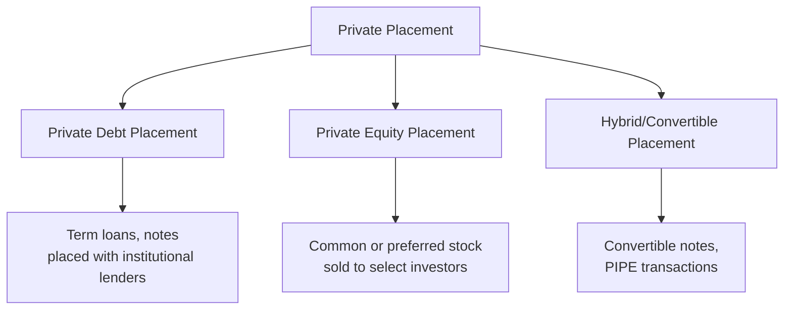

## Private Placements

### Overview

A private placement is the sale of securities — debt, equity, or hybrid instruments — directly to a limited number of pre-selected investors (institutional investors, accredited/qualified investors, or a small group of individuals) rather than through a public offering registered with securities regulators and marketed broadly. Private placements avoid many of the registration, disclosure, and marketing requirements attached to public offerings, in exchange for restrictions on resale and a narrower, typically more sophisticated investor base.

---

### Core Characteristics

| Dimension | Private Placement | Public Offering |
| --- | --- | --- |
| Investor base | Limited number of institutional/accredited investors | Broad public market |
| Regulatory registration | Typically exempt from full registration requirements | Full registration and disclosure required |
| Disclosure requirements | Reduced; negotiated directly with investors | Extensive, standardized prospectus disclosure |
| Liquidity of securities issued | Restricted; limited resale rights for a holding period | Freely tradable on public markets |
| Speed of execution | Generally faster | Slower (registration, roadshow, review) |
| Cost | Lower issuance costs (no underwriting syndicate, no roadshow) | Higher (underwriting spread, legal, marketing) |
| Pricing | Privately negotiated | Market/book-building determined |

---

### Regulatory Framework (Illustrative — U.S. Context)

Many jurisdictions provide statutory exemptions from full public registration for offerings meeting specific conditions. In the United States, the most commonly referenced framework is **Regulation D** under the Securities Act of 1933, which includes several exemption rules (commonly referenced as Rule 506(b) and Rule 506(c) among others) permitting sales primarily to **accredited investors** — a defined category based on income, net worth, or institutional status — with restrictions on general solicitation depending on the specific exemption used.

[Unverified] Specific numerical thresholds, investor-count limits, and the precise current requirements of these exemptions are subject to periodic regulatory amendment; readers should verify current requirements against the SEC's own guidance rather than relying on a fixed figure here, as this is a compliance-sensitive area where exact current rules matter.

Securities sold under such exemptions are generally classified as **"restricted securities"**, meaning they cannot be freely resold to the public without either registration or satisfying a subsequent exemption (such as a specified holding period), which materially affects the liquidity discount investors apply when pricing the placement.

---

### Types of Private Placement Instruments

#### Private Debt Placement

Debt securities (notes, term loans) sold directly to a small group of institutional investors — insurance companies, pension funds, and specialized private debt funds are common buyers — without public registration or a credit rating in many cases.

- **Key Points**: Terms (covenants, maturity, coupon) are individually negotiated between issuer and investor(s), allowing more bespoke structuring than a standardized public bond issue; often used by mid-sized companies that lack the scale or credit profile to efficiently access public bond markets

#### Private Equity Placement

Common or preferred shares sold directly to institutional investors, private equity funds, or a small group of accredited individuals, common both for private companies raising growth capital and for already-public companies raising incremental equity outside a public SEO process.

#### PIPE Transactions (Private Investment in Public Equity)

A specific form of private equity placement in which an already publicly traded company sells shares (common, preferred, or convertible) directly to selected institutional investors, often used when speed of execution is critical or when market conditions make a traditional public SEO less attractive.

- **Key Points**: PIPE investors typically negotiate a discount to the prevailing market price and often receive **registration rights**, obligating the issuer to subsequently register the shares for public resale within a specified period, restoring liquidity to the investor once that registration is completed

---

### Advantages of Private Placements

- **Speed**: avoids the lengthy registration, review, and marketing timeline of a public offering, useful when capital is needed quickly or a market window may close
- **Lower issuance costs**: no large underwriting syndicate or broad roadshow marketing effort required, reducing direct transaction costs relative to proceeds raised
- **Reduced disclosure burden**: avoids extensive public disclosure of sensitive business information, of particular importance for private companies not otherwise subject to public reporting
- **Flexible, negotiated terms**: covenants, conversion features, board representation, and other terms can be tailored bilaterally between issuer and investor(s) in ways a standardized public offering typically cannot accommodate
- **Market timing flexibility**: can be executed even when broader public market conditions (e.g., high equity market volatility) would make a public offering difficult or costly

---

### Disadvantages and Considerations

- **Liquidity discount**: because resale is restricted, investors typically demand a discount to the price they would pay for freely tradable securities, increasing the effective cost of capital to the issuer relative to a comparable public offering
- **Narrower investor base**: limits total capital that can realistically be raised in a single transaction relative to a broadly marketed public offering
- **Negotiating leverage concentration**: a small number of sophisticated investors can extract more favorable terms (covenants, board seats, anti-dilution protection) than a diffuse public shareholder base typically would
- **Signaling considerations**: for already-public companies, a PIPE or private placement announcement can be interpreted by the market in various ways depending on investor identity and deal terms — a placement with a well-regarded strategic or institutional investor can be read as a positive signal, while a heavily discounted placement, particularly one with restrictive terms for existing shareholders (e.g., significant dilution or structural subordination), can be read negatively

---

### Private Placement vs. Other Financing Sources

| Dimension | Private Placement | Public Offering (IPO/SEO) | Bank Term Loan |
| --- | --- | --- | --- |
| Investor sophistication | High (institutional/accredited) | Broad (retail + institutional) | Single lender or small syndicate |
| Disclosure | Limited, negotiated | Extensive, standardized | Limited, negotiated |
| Cost of capital | Often between bank debt and public markets | Varies by market conditions | Generally lowest for investment-grade borrowers |
| Speed | Fast | Slower | Fast |
| Liquidity to investor | Restricted | High (freely tradable) | N/A (not typically resold) |

---

### Key Points

- Private placements sit structurally between fully negotiated bank financing and broadly marketed public securities offerings, offering a middle path on the speed/cost/disclosure spectrum
- The core economic trade-off for issuers is reduced issuance cost and faster execution against a liquidity discount demanded by investors and potentially more restrictive negotiated terms
- PIPE transactions are a particularly important private placement variant for already-public companies, frequently paired with subsequent registration rights to restore investor liquidity over time
- [Inference] Private placements are generally more prevalent among mid-sized and smaller companies, or in situations requiring speed and deal-specific customization, while large-cap companies with efficient public market access more often default to public offerings for standard capital-raising needs, though this is a generalization rather than a fixed rule

---

**Related Topics**

- Sources of long-term financing
- Initial public offering process and pricing
- Seasoned equity offerings and rights issues
- Regulation D exemptions and accredited investor criteria
- Convertible securities and PIPE deal structuring
- Venture capital and growth equity financing
- Mezzanine financing and subordinated debt structures