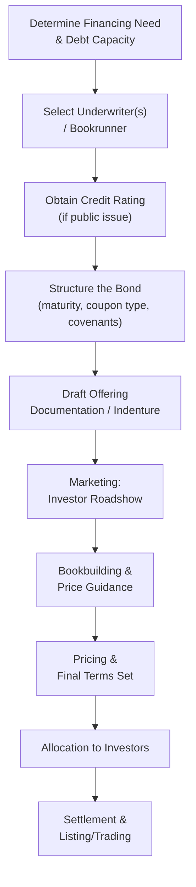

## Corporate Bond Issuance

### Overview

Corporate bond issuance is the process by which companies raise long-term debt capital by selling fixed-income securities directly to investors in the public or private debt markets. Bonds represent a contractual obligation to pay periodic interest (coupons) and return principal at maturity, and issuance involves structuring, rating, marketing, and pricing the debt instrument to match investor demand with the issuer's financing needs and credit profile.

---

### The Bond Issuance Process

#### Step 1 — Financing Need and Debt Capacity Assessment

The issuer, typically with advisory input from investment banks and internal treasury, determines the amount of capital required, the appropriate maturity profile relative to the use of proceeds (e.g., matching long-lived asset investments with long-dated debt), and assesses existing leverage capacity against target credit metrics.

#### Step 2 — Underwriter Selection

One or more investment banks are engaged as **bookrunners/lead managers** to structure, market, and place the bonds. For large issues, a syndicate of banks shares underwriting and distribution responsibilities.

#### Step 3 — Credit Rating

For public bond offerings, the issuer typically engages one or more credit rating agencies (Moody's, S&P Global Ratings, Fitch) to assign a rating reflecting default risk, which directly influences the required coupon.

| Rating Category (S&P/Fitch scale) | Classification | General Risk Interpretation |
| --- | --- | --- |
| AAA to BBB− | Investment grade | Lower default risk, generally accessible to a broader institutional investor base (many of which have investment-grade-only mandates) |
| BB+ and below | High yield / speculative grade ("junk") | Higher default risk, requires higher coupon to compensate investors |

[Inference] The exact rating notches and their precise definitions vary slightly across agencies (Moody's uses a different alphanumeric scale, e.g., Aaa/Aa/A/Baa/Ba/B/Caa), and issuers should consult current agency methodology documents rather than relying on a fixed universal mapping.

#### Step 4 — Structuring the Bond

Key structural decisions made during this stage are detailed in the Bond Structuring Features section below (maturity, coupon type, security/collateral, covenants, call provisions).

#### Step 5 — Documentation

A **bond indenture** (trust deed) is drafted, specifying the contractual terms between the issuer and bondholders, including a **trustee** appointed to represent bondholder interests and monitor compliance with covenants. A prospectus or offering memorandum is prepared for marketing purposes, with disclosure requirements varying depending on whether the issue is public (full registration/disclosure) or privately placed (reduced disclosure, sold to institutional/qualified investors).

#### Step 6 — Marketing and Bookbuilding

Similar in spirit to equity book building: the underwriter markets the proposed issue to institutional fixed-income investors, gathers indications of interest across a range of potential yields/spreads, and refines price guidance as demand becomes clearer.

#### Step 7 — Pricing

The final coupon and issue price are set based on aggregate demand, prevailing benchmark rates (government bond yields or reference rates), and the credit spread appropriate to the issuer's rating and sector.

$$\text{Bond Yield} = \text{Benchmark Rate} + \text{Credit Spread}$$

#### Step 8 — Allocation and Settlement

Bonds are allocated among participating investors, and the transaction settles with proceeds delivered to the issuer, net of underwriting fees.

---

### Bond Structuring Features

#### Maturity Structure

| Term | Typical Range |
| --- | --- |
| Short-term notes | 1–5 years |
| Medium-term notes | 5–10 years |
| Long-term bonds | 10–30+ years |

Maturity is often chosen to align with the duration of the assets or projects being financed (a matching principle sometimes referred to as the "maturity matching" approach to financial structuring).

#### Coupon Structure

| Type | Mechanism |
| --- | --- |
| Fixed-rate | Coupon set at issuance, unchanged for the life of the bond |
| Floating-rate | Coupon reset periodically based on a reference rate (e.g., SOFR) plus a fixed spread |
| Zero-coupon | No periodic coupon; issued at a discount to face value, with the discount representing the implicit yield |
| Step-up/step-down | Coupon changes at predetermined dates or upon specified triggers (e.g., a ratings downgrade) |

#### Security and Priority

| Type | Claim Basis |
| --- | --- |
| Secured (mortgage bonds, asset-backed) | Backed by specific pledged collateral |
| Senior unsecured | General claim on issuer assets, ranking above subordinated debt but not backed by specific collateral |
| Subordinated debt | Ranks below senior debt in the event of liquidation, typically carrying a higher coupon to compensate for lower priority |

#### Call and Put Provisions

- **Callable bonds**: give the issuer the right to redeem the bond before maturity, typically at a premium to face value, useful if interest rates fall and the issuer wishes to refinance at a lower rate — this call feature is priced as an embedded option, reducing the bond's value to investors (and therefore requiring a higher coupon) relative to an equivalent non-callable bond
- **Puttable bonds**: give the investor the right to require early redemption, typically used to protect investors against specific risk events (e.g., a change-of-control provision)

#### Covenants

- **Affirmative covenants**: require the issuer to take specific actions (maintain insurance, provide periodic financial reporting, maintain minimum working capital)
- **Negative covenants**: restrict issuer actions (limits on additional debt issuance, restrictions on dividend payments, limits on asset sales, maintenance of specified financial ratios such as leverage or interest coverage)

---

### Bond Valuation and Pricing Mechanics

$$P_0 = \sum_{t=1}^{n} \frac{C}{(1+y)^t} + \frac{F}{(1+y)^n}$$

where $P_0$ is the bond price, $C$ is the periodic coupon payment, $F$ is face (par) value, $n$ is the number of periods to maturity, and $y$ is the yield to maturity (market-required return given the bond's risk).

**Yield to Maturity (YTM)** is the internal rate of return that equates the bond's price to the present value of its promised cash flows, and is the standard metric used to compare bonds of differing coupon and maturity.

**Credit Spread** is the incremental yield investors require over a risk-free benchmark (e.g., a comparable-maturity government bond) to compensate for default risk, liquidity risk, and other issuer-specific factors:

$$\text{Credit Spread} = y_{\text{corporate}} - y_{\text{benchmark}}$$

#### Worked Example: Pricing a New Issue

A company issues a 10-year bond with a $1,000 face value and a 6% annual coupon. Comparable-rated bonds currently trade at a yield to maturity of 7%.

$$P_0 = \sum_{t=1}^{10} \frac{60}{(1.07)^t} + \frac{1000}{(1.07)^{10}}$$

$$P_0 \approx 60 \times 7.024 + 1000 \times 0.5083 \approx 421.4 + 508.3 \approx \$929.7$$

Because the coupon (6%) is below the required market yield (7%), the bond is priced at a **discount** to face value ($929.70), reflecting the below-market coupon relative to what investors currently require for comparable risk.

---

### Public vs. Private Bond Issuance

| Dimension | Public Bond Offering | Private Placement (Debt) |
| --- | --- | --- |
| Investor base | Broad institutional and (in some markets) retail | Limited institutional investors (insurers, pension funds, private debt funds) |
| Disclosure | Extensive, standardized prospectus | Reduced, negotiated |
| Credit rating | Typically required/expected | Often not required |
| Liquidity | Generally tradable in secondary market | Restricted resale, often held to maturity |
| Documentation flexibility | Standardized terms | Highly negotiable, bespoke covenants |
| Typical issuer size | Larger, established issuers with market access | Mid-sized issuers or those seeking bespoke terms |

---

### Costs of Bond Issuance

- **Underwriting fees/gross spread**: compensation to the underwriting syndicate for structuring, marketing, and distribution risk
- **Rating agency fees**: paid to credit rating agencies for the initial rating and ongoing surveillance
- **Legal and documentation costs**: drafting the indenture, prospectus, and related legal opinions
- **Trustee and ongoing administrative fees**: compensation to the bond trustee and costs of ongoing covenant compliance reporting

---

### Tax and Capital Structure Considerations

Interest payments on corporate bonds are generally tax-deductible to the issuer in most jurisdictions, creating a **debt tax shield** that reduces the after-tax cost of debt relative to equity financing:

$$\text{After-Tax Cost of Debt} = y_{\text{pretax}} \times (1 - T_c)$$

where $T_c$ is the issuer's marginal corporate tax rate. This tax deductibility is a central driver of why debt is generally cheaper than equity on an after-tax basis, and is foundational to capital structure theory (the trade-off theory balances this tax benefit against the increasing costs of financial distress as leverage rises).

---

### Key Points

- Bond issuance combines credit assessment, structural design (maturity, coupon, security, covenants, optionality), and market-based price discovery (via bookbuilding against benchmark yields and credit spreads)
- Embedded options (call/put provisions) require explicit valuation adjustments beyond simple discounted cash flow bond pricing, since they alter the effective cash flow profile relative to a plain-vanilla bond
- The public/private issuance choice mirrors the broader trade-off seen in equity financing: public offerings provide broader access to capital and liquidity at the cost of higher disclosure and issuance expense, while private placements offer speed and flexibility at the cost of a narrower investor base and liquidity discount
- [Inference] Covenant structures in corporate bond indentures have historically varied in stringency across market cycles, with periods of strong investor demand sometimes associated with more issuer-favorable ("covenant-lite") terms — but current covenant market conditions should be verified against recent market commentary rather than assumed to be static

---

**Related Topics**

- Sources of long-term financing
- Private placements
- Bond valuation and yield-to-maturity
- Credit ratings and rating agency methodology
- Capital structure theory and the tax shield of debt
- Convertible bonds and hybrid debt instruments
- Covenant design and bondholder protections