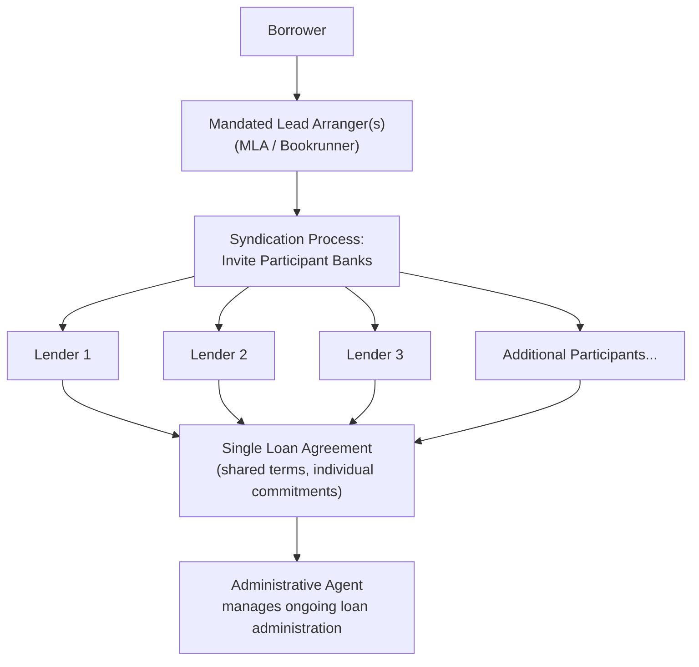

## Bank Loans and Syndicated Lending

### Overview

Bank loans represent one of the most fundamental sources of corporate debt financing, ranging from simple bilateral term loans provided by a single lender to large **syndicated loans** in which a group of banks jointly provide financing too large or too risky for any single institution to hold alone. Syndicated lending bridges the gap between traditional bilateral bank finance and public bond markets, offering borrowers access to large capital pools with more negotiated, relationship-driven structuring than a public bond issue typically allows.

---

### Bilateral Bank Loans

#### Structure

A bilateral loan involves a single lender and borrower, with terms negotiated directly between the two parties.

| Loan Type | Characteristics |
| --- | --- |
| Term loan | Fixed principal drawn at closing, repaid per a set amortization schedule over a defined maturity |
| Revolving credit facility | Borrower can draw, repay, and redraw up to a committed limit during the facility's life, similar to a corporate credit card |
| Bridge loan | Short-term financing intended to be refinanced (e.g., with a bond issue or equity raise) shortly after closing |

#### Pricing

Bank loan pricing is typically expressed as a spread over a reference rate:

$$\text{Interest Rate} = \text{Reference Rate (e.g., SOFR)} + \text{Credit Spread}$$

The credit spread reflects the borrower's creditworthiness, the loan's seniority/security, and prevailing market liquidity conditions, and is frequently structured with a **pricing grid** that adjusts the spread based on the borrower's leverage ratio or credit rating at each measurement period, incentivizing deleveraging over the loan's life.

---

### Syndicated Lending

#### Conceptual Basis

A syndicated loan is a single loan facility provided jointly by a group of lenders (the "syndicate"), documented under one set of loan terms, but with each lender holding a portion of the total commitment. Syndication allows borrowers to access larger amounts of capital than any single bank could or would prudently provide, while allowing individual lenders to diversify credit exposure across many borrowers rather than concentrating risk in large single-name exposures.

#### Key Roles in a Syndicated Loan

| Role | Function |
| --- | --- |
| Mandated Lead Arranger (MLA) / Bookrunner | Structures the facility, leads negotiation with the borrower, and manages the syndication process (marketing the deal to potential participant lenders) |
| Underwriting bank(s) | May commit to fund the full facility amount and then syndicate down the exposure, bearing underwriting risk if syndication demand is weaker than expected |
| Participant lenders | Banks or institutional investors that join the syndicate, each funding a portion of the total facility |
| Administrative Agent | Manages ongoing loan administration post-closing: collecting payments, monitoring covenant compliance, and coordinating communication between borrower and lenders |
| Security/Collateral Agent | Holds and administers security interests on behalf of the syndicate where the facility is secured |

#### Syndication Process

1. **Mandate**: Borrower selects arranging bank(s) and agrees on indicative terms (a "term sheet")
2. **Due diligence and documentation**: Arranger conducts credit analysis; loan agreement and related documentation are drafted
3. **Syndication/Marketing**: The arranger markets the facility to prospective participant lenders, often via an information memorandum, sometimes through a broader "general syndication" process or a more targeted "club deal" approach with a small pre-selected group
4. **Commitment and Allocation**: Participant banks commit to specific portions of the facility; if oversubscribed, allocations may be scaled back
5. **Closing and Funding**: Final documentation is executed, and the facility becomes available to the borrower per its terms

---

### Types of Syndication Structures

| Structure | Description |
| --- | --- |
| Underwritten deal | Arranger(s) commit to provide the full loan amount and then syndicate, bearing the risk of being unable to fully place the debt at expected terms |
| Best-efforts syndication | Arranger agrees only to use reasonable efforts to syndicate the full amount; if undersubscribed, the facility may be reduced in size or terms adjusted |
| Club deal | A small, pre-selected group of relationship lenders jointly provide the facility, often with more collaborative negotiation and less formal broad marketing than a full syndication |

---

### Loan Structuring Features

#### Security and Seniority

Syndicated loans are frequently **secured**, with a security package (pledges over assets, share pledges of subsidiaries, guarantees) shared pro-rata among syndicate members, and typically rank senior to unsecured bondholders and equity in the capital structure.

#### Covenants

- **Maintenance covenants**: require the borrower to satisfy specified financial ratio tests (e.g., leverage ratio, interest coverage ratio) tested periodically throughout the life of the loan, regardless of whether the borrower takes any specific action — a feature more common in traditional syndicated ("investment-grade" or "leveraged") loan structures than in bonds
- **Incurrence covenants**: only tested when the borrower takes a specific action (e.g., incurring additional debt, making an acquisition, paying a dividend) — more typical of high-yield bond documentation

[Inference] The relative prevalence of maintenance versus incurrence covenants (and the broader trend toward "covenant-lite" loan structures with fewer maintenance tests) has shifted over different credit market cycles; current market covenant norms should be checked against recent leveraged finance market commentary rather than assumed static.

#### Term Loan A vs. Term Loan B

| Feature | Term Loan A (TLA) | Term Loan B (TLB) |
| --- | --- | --- |
| Typical lender base | Commercial/relationship banks | Institutional investors (CLOs, loan funds) |
| Amortization | Meaningful scheduled amortization throughout the term | Minimal amortization, large "bullet" repayment at maturity |
| Typical maturity | Shorter (often 3–5 years) | Longer (often 5–7 years) |
| Covenant structure | More often maintenance covenants | More often covenant-lite / incurrence-based |
| Pricing | Generally tighter spread | Generally wider spread, reflecting institutional investor risk/return requirements |

---

### Syndicated Loans vs. Bond Financing

| Dimension | Syndicated Bank Loan | Corporate Bond |
| --- | --- | --- |
| Lender/investor base | Banks and institutional loan investors | Broad fixed-income investor base |
| Security | Frequently secured | Often unsecured (particularly investment-grade issuers) |
| Covenant intensity | Often more restrictive, especially maintenance covenants | Generally less restrictive (incurrence-based, especially investment-grade) |
| Flexibility to amend terms | Can be amended with lender consent (often majority or supermajority threshold) more readily than public bond terms | Amending public bond terms typically requires formal consent solicitation, often more cumbersome |
| Prepayment flexibility | Frequently prepayable without penalty or with modest penalties | Often subject to call premiums or make-whole provisions |
| Rating requirement | Often not required (particularly for smaller/private loans) | Typically expected for public issuance |
| Disclosure | Reduced, negotiated between borrower and lenders | Extensive, standardized (public issues) |

---

### Pricing Example

A borrower secures a $500M syndicated term loan priced at SOFR + 250 basis points (2.50%), with SOFR currently at 4.30%.

$$\text{All-in Interest Rate} = 4.30\% + 2.50\% = 6.80\%$$

$$\text{Annual Interest Cost} = \$500M \times 6.80\% = \$34M$$

If the loan's pricing grid specifies that the spread steps down to 225 bps once the borrower's leverage ratio falls below a specified threshold, the borrower has a direct financial incentive embedded in the loan structure to deleverage.

---

### Advantages and Disadvantages of Syndicated Lending

**Advantages to Borrowers:**

- Access to large capital amounts not available from a single lender
- Often faster to execute and more flexible to amend than a public bond issue
- Can be structured with bespoke covenants and features tailored to the borrower's specific situation
- Relationship-based lending can provide ongoing access to future financing and advisory relationships

**Disadvantages to Borrowers:**

- Frequently subject to more restrictive covenants (particularly maintenance covenants) than public bonds
- Often secured, requiring the borrower to pledge collateral and potentially limiting flexibility to raise additional secured debt
- Coordination among multiple lenders can complicate the amendment/waiver process if consent thresholds are not met, notwithstanding the general flexibility advantage noted above

**Advantages to Lenders:**

- Diversifies credit exposure across a portfolio of borrowers rather than concentrating in large single-name loans
- Administrative agent structure reduces individual lender administrative burden
- Secured, seniority-ranked position provides stronger recovery prospects in a default scenario relative to unsecured creditors

---

### Key Points

- Syndicated lending exists structurally between bilateral bank loans and public bond markets, combining the scale of public capital markets with the negotiated, relationship-driven, often secured structure characteristic of bank finance
- The Term Loan A / Term Loan B distinction reflects a broader divergence between traditional relationship banking (TLA) and the institutional leveraged loan investor base (TLB), each with different covenant, amortization, and pricing conventions
- Covenant structure (maintenance vs. incurrence) is one of the most consequential differentiators between bank loan and bond financing from the borrower's ongoing operational flexibility perspective
- [Inference] The choice between syndicated bank debt and public bond issuance for a given financing need typically depends on the borrower's credit profile, desired covenant flexibility, speed requirements, and relative pricing in prevailing loan versus bond markets at the time of the decision, rather than a fixed hierarchy applicable to all issuers

---

**Related Topics**

- Sources of long-term financing
- Corporate bond issuance
- Private placements
- Covenant design and leveraged finance documentation
- Leveraged buyouts and acquisition financing structures
- Credit ratings and rating agency methodology
- Capital structure theory and the cost of debt