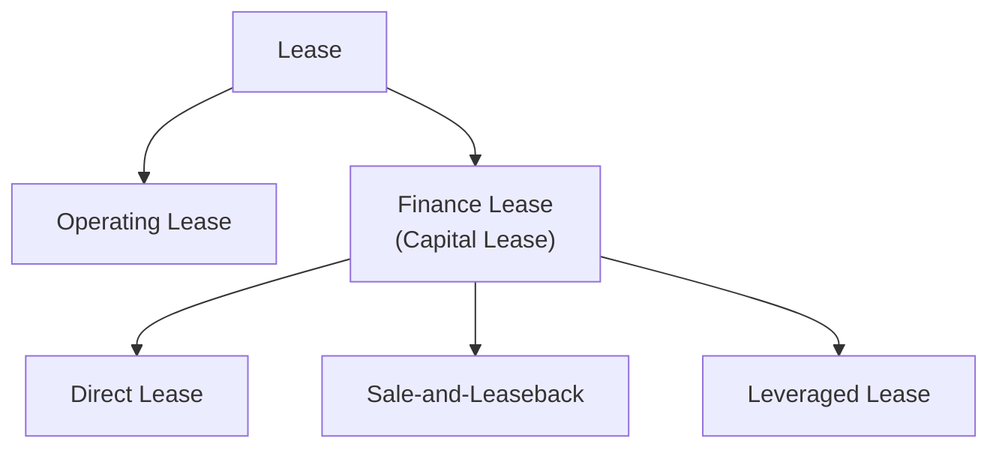

## Leasing as a Financing Alternative

### Overview

Leasing allows a firm to obtain the use of an asset — equipment, vehicles, real estate, aircraft — without purchasing it outright, in exchange for periodic payments to the asset's owner (the lessor). As a financing alternative, leasing competes directly with debt-financed asset purchase as a means of acquiring the economic use of long-lived assets, and the lease-versus-buy decision is a standard corporate finance evaluation distinct from, but closely related to, the broader capital structure and long-term financing choices covered elsewhere in this chapter.

---

### Types of Leases

#### Operating Lease

A shorter-term arrangement, typically covering less than the full economic life of the asset, where the lessor retains substantial ownership risks and rewards. Historically treated as an off-balance-sheet obligation under older accounting standards, though this treatment has changed significantly under current lease accounting rules (see Accounting Treatment below).

- **Key Points**: Often includes maintenance and service provided by the lessor; provides flexibility since the lessee is not committed to the asset for its full useful life and can more easily upgrade or exit at lease-end

#### Finance Lease (Capital Lease)

A longer-term arrangement that transfers substantially all the risks and rewards of ownership to the lessee, economically resembling a debt-financed purchase even though legal title may remain with the lessor during the lease term.

- **Key Points**: Typically non-cancellable (or cancellable only with significant penalty), the lease term often covers most of the asset's useful economic life, and the lessee is usually responsible for maintenance, insurance, and taxes

#### Sale-and-Leaseback

The owner of an asset sells it to a lessor (often a financial institution or leasing company) and simultaneously leases it back, converting an owned asset into cash while retaining operational use.

- **Key Points**: A common mechanism for firms to unlock capital tied up in owned real estate or equipment without disrupting operations; the sale proceeds can be redeployed elsewhere in the business, effectively substituting lease payment obligations for the opportunity cost of capital previously tied up in the owned asset

#### Leveraged Lease

A three-party arrangement in which the lessor finances a significant portion of the asset purchase with debt (borrowed from a separate lender), using the leased asset and lease payments as collateral/security for that debt — common for very large assets such as aircraft or major industrial equipment.

---

### Lease vs. Buy Decision Framework

The standard corporate finance evaluation compares the net present value of leasing against the net present value of purchasing the asset (typically financed with debt, since leasing is most directly comparable to debt financing given its fixed, contractual payment obligation).

#### Net Advantage to Leasing (NAL)

$$NAL = \text{Cost of Buying} - \text{PV of Leasing}$$

Or, structured as the incremental cash flow analysis:

$$NAL = -\text{Initial Investment Avoided} + \sum_{t=1}^{n} \frac{-\text{Lease Payment}_t(1-T_c) + \text{Depreciation Tax Shield Foregone}_t}{(1+r_d(1-T_c))^t} - \frac{\text{Salvage Value Foregone}}{(1+r_d(1-T_c))^n}$$

**Key components:**

- Initial investment avoided by leasing (the purchase price the firm does not have to pay upfront)
- After-tax lease payments (a cash outflow, but the lease payment itself is generally tax-deductible)
- Depreciation tax shield foregone (since the lessor, not the lessee, typically claims depreciation on a true lease)
- Salvage value foregone at the end of the asset's useful life (since ownership, and any residual value, resides with the lessor under an operating or true lease)
- Discounting is typically performed at the after-tax cost of debt, $r_d(1-T_c)$, since lease payments are a relatively low-risk, debt-like fixed obligation

#### Worked Example

A company is deciding whether to purchase equipment for $1,000,000 (financed via debt) or lease it for 5 years at an annual lease payment of $240,000, paid at the start of each year. The equipment would be depreciated straight-line over 5 years with no salvage value if purchased. The firm's marginal tax rate is 25%, and its pre-tax cost of debt is 8%.

**Purchase option:**

- Depreciation tax shield per year: $\frac{1,000,000}{5} \times 0.25 = \$50,000$
- After-tax cost of debt: $8\%(1 - 0.25) = 6\%$

**Lease option:**

- After-tax lease payment per year: $240,000 \times (1 - 0.25) = \$180,000$

**Incremental analysis (Lease minus Buy), discounted at 6%:**

| Year | Lease Payment (after-tax) | Depreciation Tax Shield Lost | Net Incremental Cash Flow |
| --- | --- | --- | --- |
| 0 | −180,000 | — | −180,000 |
| 1–4 | −180,000 | −50,000 | −230,000 |
| 5 | 0 | −50,000 | −50,000 |

$$NAL = 1,000,000 - \left[180,000 + \sum_{t=1}^{4}\frac{230,000}{(1.06)^t} + \frac{50,000}{(1.06)^5}\right]$$

$$\approx 1,000,000 - [180,000 + 797,340 + 37,362] \approx 1,000,000 - 1,014,702 \approx -\$14,702$$

**Interpretation**: A negative NAL of approximately −$14,700 indicates leasing is slightly more costly than purchasing (with debt financing) in this scenario, so purchasing would be the marginally preferred option on a pure NPV-of-financing-method basis, all else equal.

#### Key Points

- The lease-vs-buy analysis isolates the *financing method* decision, holding the underlying asset acquisition/investment decision (which should already have passed a standard capital budgeting NPV test) constant — it answers "how should we finance this asset," not "should we acquire this asset at all"
- The appropriate discount rate is the after-tax cost of debt, since lease payments are a contractually fixed, debt-like obligation with risk comparable to the firm's borrowing rate, not the firm's overall (higher, equity-inclusive) weighted average cost of capital
- Tax asymmetries between lessor and lessee (e.g., differing effective tax rates, differing ability to use the depreciation tax shield) are frequently the single largest driver of why leasing is advantageous in specific situations — this is sometimes described as a form of **tax arbitrage**, where the party better able to use the tax shield (often a lessor in a higher tax bracket, or one with substantial other taxable income) captures it and passes some benefit back to the lessee through a lower lease rate

---

### Accounting Treatment

Under both major current accounting frameworks (ASC 842 in the U.S. under GAAP, and IFRS 16 internationally), most leases — including many previously classified as off-balance-sheet operating leases — must be capitalized on the lessee's balance sheet, recognizing a **right-of-use (ROU) asset** and a corresponding **lease liability** at the present value of future lease payments.

[Unverified] The precise current classification thresholds and exceptions (e.g., short-term lease and low-value asset exemptions) differ in detail between ASC 842 and IFRS 16 and are subject to specific technical accounting rules that should be verified against current standard-setter guidance rather than summarized definitively here, given the compliance-sensitive nature of lease accounting classification.

- **Key Points**: This shift substantially reduced the traditional "off-balance-sheet financing" appeal that operating leases historically offered, since most leases now appear on the balance sheet regardless of classification — though the income statement expense recognition pattern (and classification as operating vs. finance lease for expense presentation purposes) can still differ

---

### Comparison: Leasing vs. Debt-Financed Purchase

| Dimension | Leasing | Debt-Financed Purchase |
| --- | --- | --- |
| Upfront capital outlay | None (typically) | Full purchase price (or down payment) required |
| Ownership/residual value | Retained by lessor (in true/operating leases) | Retained by the firm |
| Depreciation tax shield | Generally retained by lessor | Retained by the purchasing firm |
| Balance sheet impact | ROU asset and lease liability recognized (under current standards) for most leases | Asset and associated debt recognized |
| Flexibility | Often easier to exit, upgrade, or return the asset (particularly operating leases) | Firm bears obsolescence and disposal risk directly |
| Covenant/collateral impact | May affect lease-adjusted leverage covenants differently than traditional debt, depending on covenant definitions | Directly increases reported debt and may use up secured borrowing capacity |

---

### Strategic and Practical Reasons for Leasing Beyond Pure NPV

- **Avoiding obsolescence risk**: particularly relevant for technology or rapidly evolving equipment, where the lessor bears residual value risk
- **Preserving borrowing capacity**: lease obligations, while now largely balance-sheet recognized under current standards, may be treated differently by certain lenders' covenant definitions or by credit rating agencies' leverage adjustments than traditional secured term debt
- **Maintenance and service bundling**: particularly in operating leases, bundled maintenance can reduce the lessee's operational management burden
- **Matching cash flows to asset usage**: lease payments can be structured to align with the revenue-generating pattern of the asset's use, aiding cash flow matching for the lessee

---

### Key Points

- Leasing is fundamentally a debt-substitute financing decision: the appropriate comparison is leasing versus debt-financed purchase, evaluated via incremental after-tax cash flow analysis discounted at the after-tax cost of debt
- Tax rate differentials between lessor and lessee are often the primary economic driver of leasing's attractiveness in a given transaction, beyond pure operational flexibility considerations
- Modern lease accounting standards (ASC 842, IFRS 16) have substantially reduced, though not eliminated, the traditional balance-sheet-related motivations for structuring transactions as operating leases
- [Inference] The relative attractiveness of leasing versus purchasing shifts with prevailing interest rate environments, relative tax positions of lessor and lessee, and asset-specific residual value/obsolescence characteristics, meaning the lease-vs-buy conclusion is transaction-specific rather than a fixed general preference for one method over the other

---

**Related Topics**

- Sources of long-term financing
- Bank loans and syndicated lending
- Capital structure theory and the tax shield of debt
- Cost of capital and discount rate selection for financing decisions
- Sale-and-leaseback structuring in corporate real estate and asset-heavy industries
- Off-balance-sheet financing and lease accounting standards (ASC 842, IFRS 16)