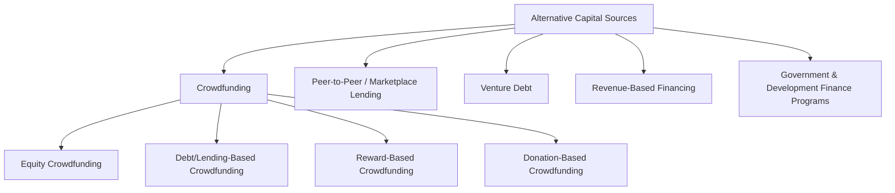

## Crowdfunding and Alternative Capital Sources

### Overview

Beyond traditional bank loans, public/private debt and equity offerings, and leasing, firms — particularly early-stage, small, and mid-sized businesses without efficient access to conventional capital markets — increasingly draw on a broader set of alternative financing channels. These include crowdfunding platforms, peer-to-peer lending, venture debt, revenue-based financing, and specialized government or supranational funding programs. This category has expanded substantially alongside fintech platform development and regulatory frameworks designed to broaden access to capital formation beyond traditional institutional and public market channels.

---

### Taxonomy of Alternative Capital Sources

---

### Crowdfunding

Crowdfunding raises capital from a large number of individuals, typically in relatively small amounts each, via online platforms, rather than from a small number of institutional or accredited investors.

#### Equity Crowdfunding

Investors receive an equity (ownership) stake in the company in exchange for their investment, executed through regulated online platforms.

- **Regulatory context**: In the United States, **Regulation Crowdfunding (Reg CF)**, adopted under the JOBS Act, permits companies to raise capital from both accredited and non-accredited investors through registered funding portals, subject to specified offering limits and investor investment caps. [Unverified] Specific current dollar limits on offering size and individual investor caps are subject to periodic regulatory adjustment and should be verified against current SEC rules rather than stated as a fixed figure here.
- **Key Points**: Provides access to capital for very early-stage companies that may not yet qualify for venture capital or traditional private placement, but involves managing a potentially large number of small shareholders, which can create administrative complexity (cap table management, investor communications) relative to a concentrated institutional investor base

#### Debt/Lending-Based Crowdfunding

Investors provide loans to the company (rather than equity), typically receiving fixed interest payments and principal repayment, facilitated through an online lending platform that aggregates many individual lenders' contributions into a single loan or loan pool.

#### Reward-Based Crowdfunding

Backers contribute funds in exchange for a non-financial reward — typically a pre-order of the product being developed, or another tangible/experiential benefit — rather than equity or debt. This is not, strictly speaking, a capital-raising method that creates a financial claim against the company, but is commonly grouped with crowdfunding as an alternative early-stage funding mechanism, particularly for product-focused startups validating market demand.

#### Donation-Based Crowdfunding

Contributors provide funds without expectation of financial return, typically for charitable, community, or personal causes rather than commercial ventures; largely outside the scope of corporate capital raising but included here for taxonomic completeness.

---

### Peer-to-Peer (P2P) / Marketplace Lending

Online platforms that match borrowers directly with individual or institutional lenders, bypassing traditional bank intermediation. While overlapping conceptually with debt-based crowdfunding, marketplace lending platforms have increasingly evolved toward institutional-scale funding (loans originated on the platform being purchased in bulk by institutional investors) rather than purely retail crowd-based funding.

- **Key Points**: Can offer faster underwriting and funding timelines than traditional bank loans, particularly valuable for small and medium-sized enterprises (SMEs) with limited operating history or collateral that may face difficulty accessing conventional bank credit

---

### Venture Debt

Debt financing specifically structured for early-stage, high-growth, often pre-profitability companies (typically venture-capital-backed), usually provided by specialized venture debt lenders or bank divisions focused on this segment.

- **Key Points**: Typically supplements rather than replaces equity financing, extending a company's cash runway between equity rounds while minimizing additional dilution; often includes **warrants** (the right to purchase equity at a set price) as an additional lender return component, compensating the lender for the elevated risk associated with lending to a company with limited or negative current cash flow
- Sizing is commonly tied to a percentage of the most recent equity round raised, and covenants tend to focus on liquidity/cash runway milestones and material adverse change provisions rather than traditional cash-flow-based leverage covenants (given the borrower typically lacks stable operating cash flow)

---

### Revenue-Based Financing (RBF)

A financing structure in which the company receives upfront capital in exchange for a fixed percentage of future revenues until a predetermined total repayment cap (a multiple of the original amount) is reached.

$$\text{Total Repayment} = \text{Capital Advanced} \times \text{Repayment Multiple}$$

$$\text{Periodic Payment} = \text{Revenue}_t \times \text{Agreed Revenue Share \%}$$

- **Key Points**: Payments scale automatically with the company's revenue performance, reducing fixed-payment burden during slower revenue periods relative to a traditional fixed-amortization loan; does not require equity dilution or fixed collateral in the way traditional bank debt often does, but the effective cost of capital (implied by the repayment multiple relative to funding speed) can be higher than conventional debt, reflecting the lender's assumption of revenue variability risk
- Commonly used by subscription-based, e-commerce, and other recurring-revenue business models where monthly revenue can be reliably tracked and shared

---

### Government and Development Finance Programs

Various governmental and supranational bodies offer grants, guaranteed loan programs, or subsidized financing to support specific policy objectives (small business growth, regional development, innovation, export activity).

| Program Type | Mechanism |
| --- | --- |
| Government-guaranteed loans | Government guarantees a portion of a loan made by a private lender, reducing lender risk and often enabling more favorable borrower terms |
| Grants | Non-repayable funding, typically tied to specific objectives (R&D, regional development) and requiring compliance/reporting |
| Export credit agency financing | Supports financing for companies engaged in international trade/export activity |
| Development finance institution (DFI) financing | Financing from multilateral or national development institutions, often targeting projects with development impact (infrastructure, emerging markets) |

[Inference] Specific program names, eligibility criteria, and terms vary substantially by country and are subject to frequent policy change; readers seeking to access such programs should consult current government or institutional sources directly rather than relying on generalized descriptions.

---

### Comparison Table

| Source | Typical Stage/Use Case | Dilution | Fixed Obligation | Typical Cost/Return Profile |
| --- | --- | --- | --- | --- |
| Equity crowdfunding | Early-stage, consumer-facing companies | Yes | No | Variable (equity-like return expectation) |
| Debt crowdfunding / P2P lending | SMEs needing fast, flexible credit | No | Yes | Moderate–high, reflects borrower risk profile |
| Venture debt | VC-backed growth-stage companies | Minimal (warrant coverage only) | Yes | Moderate, plus warrant-based equity kicker |
| Revenue-based financing | Recurring-revenue businesses | No | Revenue-linked, not fixed | Higher effective cost, but flexible timing |
| Government/DFI programs | Policy-aligned objectives (SME growth, R&D, development impact) | Varies (often none) | Varies by program | Often below-market/subsidized |

---

### Advantages and Disadvantages of Alternative Capital Sources

**Advantages:**

- Broadens access to capital for companies that may not qualify for traditional bank credit or lack the scale/track record for public or large private market access
- Often faster execution and less onerous documentation than traditional institutional financing channels
- Diversifies the investor/lender base, reducing reliance on any single financing relationship
- Some structures (equity crowdfunding, revenue-based financing) avoid or minimize traditional collateral requirements

**Disadvantages:**

- Effective cost of capital can be higher than traditional bank or public market financing, reflecting the higher risk profile of borrowers typically using these channels and/or the platform/intermediary's own margin
- Regulatory frameworks (particularly for equity crowdfunding) can impose offering size limits that constrain the amount of capital raisable through a single channel
- Administrative complexity of managing a large, dispersed investor/lender base (particularly relevant to equity and debt crowdfunding)
- Platform and counterparty risk: reliance on a fintech platform's continued operation and creditworthiness as an intermediary

---

### Key Points

- Alternative capital sources have expanded the financing spectrum available to companies — particularly early-stage and smaller firms — beyond the traditional bank loan, public/private bond, and traditional equity channels covered elsewhere in this chapter
- Venture debt and revenue-based financing occupy a middle ground between pure equity and traditional fixed-amortization debt, each designed to address the specific cash flow and dilution constraints of growth-stage or recurring-revenue businesses
- Regulatory frameworks (such as equity crowdfunding rules) are a first-order determinant of which alternative channels are accessible to a given company and at what scale, and these frameworks vary significantly by jurisdiction and are subject to change
- [Inference] As alternative capital markets mature, the boundary between "alternative" and "traditional" financing continues to blur — for example, institutional capital increasingly participates in marketplace lending platforms originally designed for retail crowd participation — so the taxonomy presented here reflects a snapshot of a still-evolving market segment rather than a fixed permanent categorization

---

**Related Topics**

- Sources of long-term financing
- Private placements
- Bank loans and syndicated lending
- Venture capital and growth equity financing
- Capital structure considerations for early-stage and high-growth firms
- Regulatory frameworks for capital formation (JOBS Act, Regulation Crowdfunding)
- Cost of capital estimation for non-traditional financing structures