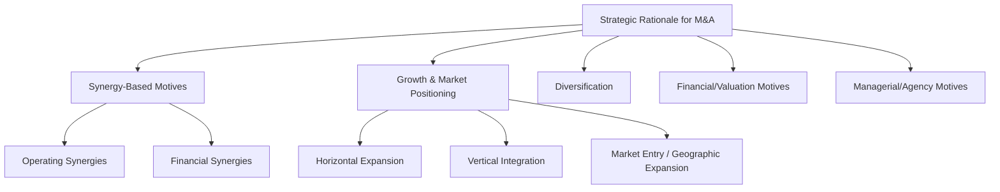
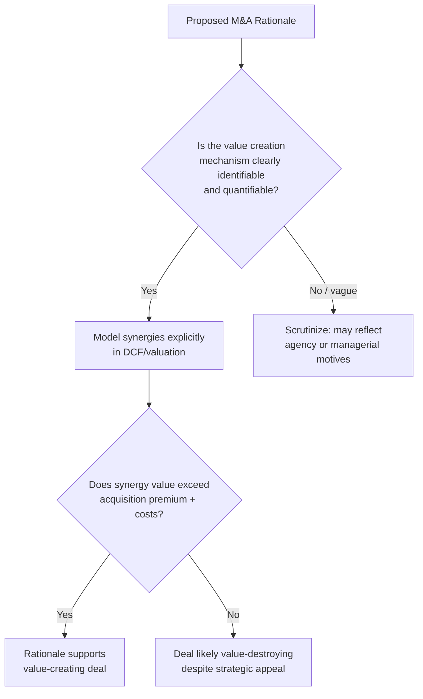

## Strategic Rationale for Mergers and Acquisitions

### Overview

The strategic rationale for a merger or acquisition (M&A) is the underlying economic and strategic logic management uses to justify why combining two firms creates more value than the two firms operating independently. This rationale is the foundation upon which deal structuring, valuation, financing, and integration planning are subsequently built, and evaluating whether a stated rationale is genuinely value-creating (versus value-neutral or value-destroying) is a central analytical task in M&A corporate finance.

$$V(A + B) > V(A) + V(B)$$

This condition — that the combined entity's value exceeds the sum of the standalone values — is the fundamental economic test any M&A rationale must satisfy to be considered value-creating for the acquirer's shareholders (net of any premium paid and transaction costs).

---

### Taxonomy of Strategic Rationales

---

### Synergy-Based Motives

Synergy is the most commonly cited justification for M&A: the expectation that the combined firm will generate greater value than the two firms independently, typically through cost reduction, revenue enhancement, or financial efficiency gains.

#### Operating Synergies

**Cost synergies**: elimination of duplicate functions (administrative overhead, redundant facilities, combined procurement leverage), economies of scale in production or distribution, and elimination of redundant corporate infrastructure.

$$\text{Value of Cost Synergies} = \sum_{t=1}^{n} \frac{\Delta\text{Cost Savings}_t \times (1-T_c)}{(1+r)^t}$$

**Revenue synergies**: cross-selling opportunities across combined customer bases, expanded distribution reach, combined product portfolios enabling bundling, and enhanced pricing power in less competitive post-merger markets.

- **Key Points**: Cost synergies are generally considered more reliably achievable and more readily quantifiable in deal valuation than revenue synergies, which depend on customer and market behavior that is harder to predict and control post-close; [Inference] this asymmetry is widely reflected in M&A practice, where acquirers and their advisors often apply more conservative estimation and lower confidence weighting to projected revenue synergies than to cost synergies during deal modeling

#### Financial Synergies

- **Increased debt capacity**: a combined, more diversified entity may support higher leverage than either standalone firm, potentially reducing the overall cost of capital via increased tax shield capture
- **Tax benefits**: utilization of acquired net operating losses (NOLs) or other tax attributes, subject to relevant jurisdictional limitations on loss carryforward usage following ownership changes
- **Lower cost of capital**: combined cash flow diversification (if imperfectly correlated) can reduce the volatility of aggregate cash flows, potentially lowering the combined entity's cost of debt

[Inference] The coinsurance effect — the idea that combining imperfectly correlated cash flow streams reduces default risk and thus lowers borrowing costs — is a long-standing theoretical argument in the academic M&A literature, though its practical magnitude and whether it represents genuine value creation for shareholders (as opposed to a wealth transfer from shareholders to existing bondholders, who benefit from reduced default risk without bearing acquisition costs) has been debated.

---

### Growth and Market Positioning Motives

#### Horizontal Integration

Acquisition of a competitor operating in the same industry and market segment, typically pursued for market share consolidation, economies of scale, and elimination of competitive intensity.

- **Key Points**: Horizontal deals are subject to the greatest antitrust/competition regulatory scrutiny, since they most directly reduce the number of independent competitors in a given market

#### Vertical Integration

Acquisition of a firm operating at a different stage of the same value/supply chain — either upstream (a supplier) or downstream (a customer or distributor).

- **Forward integration**: acquiring closer to the end customer (e.g., a manufacturer acquiring a distributor)
- **Backward integration**: acquiring further from the end customer (e.g., a manufacturer acquiring a raw material supplier)
- **Key Points**: Vertical integration rationale typically centers on securing supply chain reliability, capturing margin previously paid to third parties, and reducing transaction costs/hold-up risk associated with dealing with independent suppliers or distributors

#### Market Entry and Geographic Expansion

Acquisition as a faster (relative to organic/greenfield expansion) means of entering a new geographic market or product category, leveraging the target's existing regulatory approvals, customer relationships, brand recognition, and operational infrastructure.

- **Key Points**: The "buy versus build" trade-off is central here — acquisition typically offers speed and reduced execution risk relative to organic expansion, at the cost of an acquisition premium and integration risk

---

### Diversification

Acquisition of a business in an unrelated or loosely related industry, historically pursued to reduce overall corporate cash flow volatility or earnings variability.

- **Key Points**: Pure conglomerate diversification for risk-reduction purposes has been a subject of long-standing academic and practitioner skepticism, since public shareholders can generally diversify their own portfolios more efficiently and at lower cost than a corporation can diversify through acquisition — this critique is central to the academic literature's generally cautious view of diversification as a standalone value-creating rationale
- [Inference] Diversification motives that are more readily defensible from a value-creation standpoint typically involve genuine operational or capability synergies with the new business line (related diversification), rather than pure risk-pooling across unrelated businesses (conglomerate diversification)

---

### Financial and Valuation-Driven Motives

- **Undervaluation**: acquiring a target believed to be trading below its intrinsic value, capturing the valuation gap for the acquirer's shareholders
- **Arbitrage of relative valuation multiples**: in stock-financed deals, an acquirer with a high market valuation multiple (P/E) acquiring a lower-multiple target can produce immediate accretion to reported earnings per share, even absent genuine operating synergies — a phenomenon sometimes referred to as "P/E arbitrage" or multiple expansion illusion
- **Key Points**: EPS accretion driven purely by relative multiple differences (rather than genuine synergy value) is a well-documented analytical trap; accretion/dilution analysis should be interpreted alongside, not as a substitute for, a rigorous NPV-based assessment of whether the deal is genuinely value-creating

---

### Managerial and Agency-Based Motives (Value-Neutral or Value-Destroying)

Not all M&A activity is motivated by, or results in, genuine shareholder value creation. Corporate finance theory identifies several motives that can drive deal activity despite being neutral or negative for acquirer shareholder value:

| Motive | Mechanism |
| --- | --- |
| Empire building / managerial hubris | Managers pursue growth and increased firm size (and associated compensation, prestige, or influence) beyond what maximizes shareholder value |
| Overconfidence (hubris hypothesis) | Acquiring management overestimates its ability to create value or accurately value the target, leading to overpayment (Roll's hubris hypothesis is a widely cited academic formalization of this idea) |
| Free cash flow motive | Managers with substantial free cash flow and limited attractive reinvestment opportunities may pursue acquisitions rather than returning capital to shareholders, potentially to avoid the discipline/scrutiny associated with capital markets funding |
| Diversification for managerial risk reduction | Managers, whose personal wealth and employment are concentrated in the firm, may pursue diversifying acquisitions to reduce firm-specific (and thus their own personal) risk, even where this does not benefit diversified shareholders |

[Inference] These agency-based motives are widely taught as important explanatory factors behind the substantial body of empirical evidence showing that acquirer shareholders often do not, on average, capture significant positive abnormal returns from acquisitions (with target shareholders typically capturing most of the value creation, largely through the acquisition premium paid) — though the precise magnitude and interpretation of these empirical findings has been the subject of extensive academic debate and varies across studies, time periods, and deal types.

---

### Evaluating Strategic Rationale: A Practical Framework

#### Key Points

- A stated strategic rationale should always be translated into quantifiable, testable value-creation mechanisms (specific cost or revenue synergies, specific capability gaps filled) rather than accepted as inherently value-creating on its face
- The central financial test is whether the present value of synergies and strategic benefits exceeds the acquisition premium paid plus transaction and integration costs — a compelling strategic narrative does not guarantee this condition holds
- Horizontal and vertical rationales are generally more directly linked to identifiable operating synergies than pure diversification rationales, which face a higher bar of justification given shareholders' own diversification alternatives
- Empirical M&A research consistently highlights the gap between commonly stated strategic rationales and actual realized shareholder value outcomes, underscoring the importance of rigorous, skeptical evaluation of any proposed rationale rather than accepting management's framing at face value

---

**Related Topics**

- Merger valuation and synergy analysis
- Accretion/dilution analysis in stock-financed transactions
- Methods of payment in M&A (cash, stock, mixed consideration)
- Antitrust and regulatory considerations in horizontal mergers
- Post-merger integration and the sources of M&A failure
- Agency theory and the free cash flow hypothesis (Jensen)
- Target valuation and premium determination