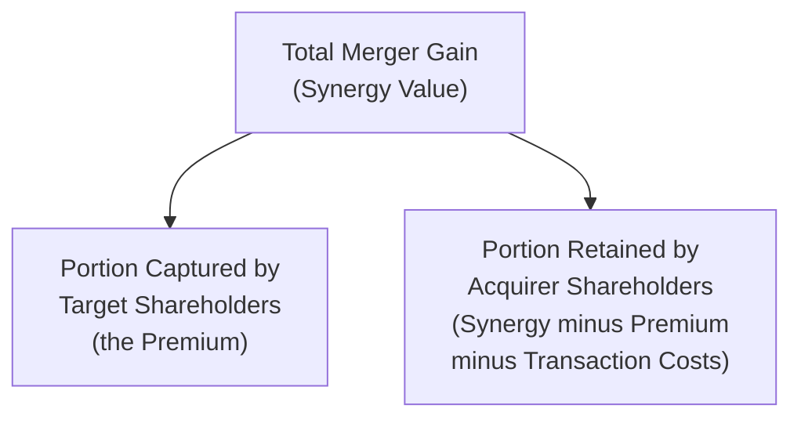
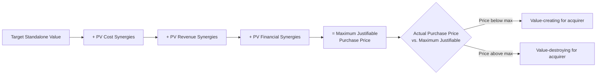

## Valuing Synergies and Merger Gains

### Overview

Valuing synergies and merger gains is the quantitative process of estimating the incremental value created (or destroyed) by combining two firms, and determining how that value is divided between acquirer and target shareholders through the acquisition premium. This builds directly on the strategic rationale for a deal by translating qualitative claims about synergy into an explicit, discounted-cash-flow-based valuation that can be tested against the price actually paid.

---

### Core Valuation Framework

#### The Fundamental Merger Gain Identity

$$\text{Synergy (Merger Gain)} = V_{AB} - (V_A + V_B)$$

where $V_{AB}$ is the value of the combined firm post-merger, and $V_A$, $V_B$ are the standalone values of acquirer and target.

#### Division of Value Between Acquirer and Target

$$\text{Premium Paid} = \text{Purchase Price} - V_B$$

$$\text{Net Gain to Acquirer} = \text{Synergy} - \text{Premium Paid} - \text{Transaction Costs}$$

$$\text{Gain to Target Shareholders} = \text{Premium Paid}$$

- **Key Points**: The total synergy value is fixed by the economics of the combination, but how that value is *split* between the two sets of shareholders is a negotiation outcome determined by the purchase price — a deal can generate substantial genuine synergy and still be value-destroying for the acquirer if the premium paid exceeds the synergy captured

---

### Standalone Valuation as the Baseline

Before synergy can be valued, both firms must be valued independently on a standalone basis, typically using standard corporate finance valuation methods:

- **Discounted Cash Flow (DCF)**: projecting standalone free cash flows for each firm and discounting at each firm's own weighted average cost of capital (WACC)
- **Comparable company analysis**: applying observed trading multiples (EV/EBITDA, P/E) of similar publicly traded firms
- **Precedent transaction analysis**: applying multiples observed in comparable prior M&A transactions (which themselves embed some historical premium)

This standalone baseline is essential: synergy value is defined only *relative to* what each firm would be worth independently, so an inaccurate standalone valuation directly distorts the synergy estimate.

---

### Building the Combined-Entity (Pro Forma) Valuation

The standard approach is to construct a **pro forma combined DCF model**, explicitly modeling the merged entity's projected cash flows inclusive of identified synergies, then valuing this combined cash flow stream at an appropriate combined discount rate.

$$V_{AB} = \sum_{t=1}^{n} \frac{FCF_{A,t} + FCF_{B,t} + \Delta\text{Synergy}_t}{(1+WACC_{AB})^t} + TV$$

#### Combined WACC

$$WACC_{AB} = \frac{D_{AB}}{V_{AB}} \times r_d(1-T_c) + \frac{E_{AB}}{V_{AB}} \times r_e$$

The combined entity's capital structure (post-transaction leverage, financing mix used to fund the deal) determines this rate, which may differ meaningfully from either firm's standalone WACC, particularly if the transaction is significantly debt-financed.

---

### Quantifying Specific Synergy Categories

#### Cost Synergies

Typically the most reliably quantifiable synergy type, built up from specific, identifiable line items:

$$PV(\text{Cost Synergies}) = \sum_{t=1}^{n} \frac{(\Delta SG\&A_t + \Delta COGS_t + \Delta CapEx_t) \times (1-T_c)}{(1+r)^t}$$

Common sources: elimination of duplicate corporate overhead (finance, HR, legal functions), procurement scale economies, facility/plant consolidation, headcount reduction in overlapping functions, and combined IT/systems rationalization.

**Worked Example**: A merger is expected to eliminate $40M of duplicate annual SG&A starting in Year 1, growing modestly with inflation, with realization ramping to full run-rate over 2 years (50% in Year 1, 100% from Year 2 onward). Tax rate is 25%, discount rate is 9%.

| Year | Gross Cost Savings | After-Tax Savings | PV Factor (9%) | PV |
| --- | --- | --- | --- | --- |
| 1 | 20.0M (50% ramp) | 15.0M | 0.917 | 13.76M |
| 2 | 40.0M | 30.0M | 0.842 | 25.25M |
| 3 | 41.2M (2% growth) | 30.9M | 0.772 | 23.86M |

For a perpetuity from Year 3 onward growing at 2%:

$$TV_{\text{synergy}} = \frac{30.9M \times 1.02}{0.09 - 0.02} = \$450.1M \text{ (at end of Year 3, then discounted back)}$$

This illustrates the standard build: explicit near-term ramp period, followed by a terminal value treatment consistent with the rest of the combined DCF model.

#### Revenue Synergies

Estimated from specific, identifiable commercial opportunities: cross-selling rates applied to the combined customer base, incremental market share from combined distribution capabilities, or pricing power improvements in a less fragmented market.

$$PV(\text{Revenue Synergies}) = \sum_{t=1}^{n} \frac{\Delta\text{Revenue}_t \times \text{Contribution Margin}_t \times (1-T_c)}{(1+r)^t}$$

- **Key Points**: Revenue synergies should be valued at their *incremental contribution margin* (revenue less incremental variable costs), not at the full revenue amount, since generating that additional revenue also consumes incremental cost of goods and operating expense
- [Inference] Because revenue synergies depend on customer behavior, competitive response, and successful commercial execution — factors less directly within management's control than cost elimination — practitioners commonly apply a lower probability-weighting or higher discount to revenue synergy estimates relative to cost synergies when presenting a risk-adjusted view to a deal committee or board

#### Financial Synergies

Valued as the incremental value from improved tax shield capture, reduced cost of capital, or utilization of acquired tax attributes (e.g., net operating losses), computed as the present value of the incremental after-tax benefit versus the standalone counterfactual.

---

### Discount Rate Selection for Synergy Valuation

A frequently debated methodological question is which discount rate to apply to projected synergy cash flows:

| Approach | Rationale |
| --- | --- |
| Combined entity WACC | Treats synergies as part of the integrated combined business, discounted consistently with all other combined cash flows |
| Acquirer's standalone WACC | Reflects the acquirer's own risk profile and cost of capital, particularly relevant if the acquirer is the party bearing execution risk |
| Risk-adjusted rate specific to synergy type | Cost synergies (generally lower execution risk) discounted at a lower rate than revenue synergies (higher execution/market risk), reflecting differential uncertainty |

[Inference] While using the combined entity's WACC is a common default in practice for simplicity and consistency with the rest of the pro forma model, some practitioners argue that synergy cash flows — particularly less certain revenue synergies — warrant a higher, risk-adjusted discount rate reflecting their greater execution uncertainty relative to the "base case" standalone cash flows of each business; there is no single universally prescribed convention, and the choice should be disclosed and justified explicitly in any presented analysis.

---

### Break-Even Synergy Analysis

A useful sanity-check framework: given the premium the acquirer is proposing (or being asked) to pay, what minimum level of synergy is required to justify the transaction?

$$\text{Break-Even Synergy (PV)} = \text{Purchase Price} - V_B(\text{standalone})$$

**Worked Example**: An acquirer proposes to pay $1.2B for a target with a standalone DCF value of $950M.

$$\text{Break-Even Synergy Required} = 1,200M - 950M = \$250M$$

Management and the board should then assess whether the identified, risk-adjusted synergy estimate plausibly exceeds $250M in present value terms — if the base-case synergy estimate is, say, $180M, the deal requires either upside beyond the base case or additional unidentified synergy sources to be value-creating for acquirer shareholders at the proposed price.

#### Key Points

- Break-even synergy analysis reframes the valuation question from "how much synergy do we think exists" to "how much synergy would we need to believe exists to justify this price" — a useful discipline against overpaying based on optimistic or unvalidated synergy assumptions
- This analysis is particularly valuable in competitive auction processes, where rising bid prices can be tested against escalating implied break-even synergy requirements to assess whether continued bidding remains rational

---

### Integration Risk and Synergy Realization

A substantial body of empirical M&A research and practitioner experience documents that **realized** synergies frequently fall short of **projected** synergies at deal announcement, due to integration execution challenges, cultural friction, customer/employee attrition, and overly optimistic initial estimates.

- **Key Points**: Sophisticated acquirers increasingly apply explicit **realization discounts** or probability-weighting to projected synergies (e.g., valuing only 70-80% of "identified" synergies in the base-case deal model) to reflect this well-documented execution risk, and track actual post-close synergy capture against original projections as part of post-merger integration governance
- [Inference] The gap between projected and realized synergies is widely cited in academic and consulting literature as a significant contributing factor to the broader empirical finding that acquirer shareholders often do not capture positive abnormal returns from acquisitions on average, though the precise magnitude of this "synergy realization gap" varies considerably across studies, industries, and deal types, and specific current benchmark statistics should be verified against recent empirical sources rather than cited as a fixed figure

---

### Summary Valuation Bridge

---

### Key Points

- Synergy valuation requires an explicit, line-item build-up of cost, revenue, and financial synergy sources, each valued at present value and, where appropriate, risk-adjusted for realization uncertainty
- The premium paid to target shareholders directly determines how much of the total synergy value accrues to acquirer shareholders versus target shareholders — a mechanically simple but strategically critical negotiation outcome
- Break-even synergy analysis provides a disciplined reality check against the specific, bottom-up synergy estimate, particularly valuable in competitive bidding situations
- Given the well-documented empirical gap between projected and realized synergies, prudent valuation practice incorporates realization discounts or probability weighting rather than treating management's initial synergy estimate as a certain outcome

---

**Related Topics**

- Strategic rationale for mergers and acquisitions
- Accretion/dilution analysis in stock-financed transactions
- Discounted cash flow valuation methodology
- Post-merger integration and synergy realization tracking
- Methods of payment in M&A (cash, stock, mixed consideration)
- Weighted average cost of capital estimation for combined entities
- Comparable company and precedent transaction analysis