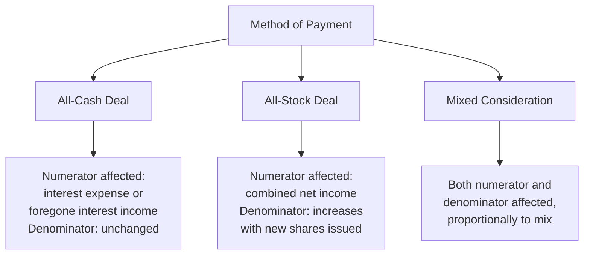

## Accretion and Dilution Analysis

### Overview

Accretion/dilution analysis measures the impact of a proposed acquisition on the acquirer's post-transaction earnings per share (EPS), determining whether the deal increases ("accretive") or decreases ("dilutive") the acquirer's standalone EPS. It is one of the most widely used quick-reference metrics in M&A deal evaluation, particularly for stock-financed or mixed-consideration transactions, though it is a mechanical earnings metric distinct from, and not a substitute for, genuine NPV-based value creation analysis.

$$\text{Pro Forma EPS} = \frac{\text{Combined Net Income}}{\text{Combined Diluted Shares Outstanding}}$$

$$\text{Accretion/(Dilution) \%} = \frac{\text{Pro Forma EPS} - \text{Acquirer Standalone EPS}}{\text{Acquirer Standalone EPS}}$$

A positive result indicates the transaction is **accretive** (pro forma EPS exceeds the acquirer's standalone EPS); a negative result indicates **dilution**.

---

### Core Mechanics

#### Building the Pro Forma Combined Income Statement

$$\text{Pro Forma Net Income} = NI_A + NI_B + \Delta\text{Synergies (after-tax)} - \Delta\text{Incremental Interest Expense (after-tax)} - \Delta\text{Incremental D\&A from Purchase Accounting (after-tax)} + \text{Foregone Interest Income (if cash-funded, after-tax)}$$

**Key adjustment items:**

| Adjustment | Direction of Impact |
| --- | --- |
| Target's standalone net income | Added in full (or pro-rated for partial-year closing) |
| After-tax cost synergies | Increases pro forma net income |
| Incremental interest expense on new acquisition debt | Reduces pro forma net income |
| Foregone interest income on cash used for the deal | Reduces pro forma net income (opportunity cost of cash deployed) |
| Incremental depreciation/amortization from purchase price allocation step-up | Reduces pro forma net income |
| Elimination of target's pre-existing debt (if refinanced) and associated interest expense | Removes target's prior interest expense from the combined figure |

#### Building Pro Forma Shares Outstanding

$$\text{Pro Forma Shares} = \text{Acquirer Standalone Shares} + \text{New Shares Issued to Target Shareholders}$$

$$\text{New Shares Issued} = \frac{\text{Value of Stock Consideration}}{\text{Acquirer Share Price}}$$

For all-cash deals, no new shares are issued, so the share count denominator does not change (only the numerator, net income, is affected by financing costs).

---

### Cash vs. Stock Financing: Impact on Accretion/Dilution

#### Key Points

- **All-cash deals**: shares outstanding remain unchanged, so accretion/dilution depends entirely on whether the target's net income (plus synergies) exceeds the after-tax cost of funding the acquisition (interest expense if debt-funded, or foregone interest income if funded with existing cash)
- **All-stock deals**: the outcome depends critically on the **relative P/E multiples** of acquirer and target — this relationship is formalized in the P/E arbitrage rule below
- Mixed consideration transactions blend both effects proportionally to the cash/stock split

---

### The P/E Arbitrage Rule (Stock-for-Stock Deals)

For an all-stock transaction with no synergies, financing costs, or purchase accounting adjustments, a simplified rule of thumb applies:

$$\text{If } P/E_{\text{Acquirer}} > P/E_{\text{Target}} \Rightarrow \text{Deal is Accretive}$$

$$\text{If } P/E_{\text{Acquirer}} < P/E_{\text{Target}} \Rightarrow \text{Deal is Dilutive}$$

**Intuition**: When the acquirer's stock trades at a higher earnings multiple than the target's, the acquirer can "buy" a dollar of the target's earnings more cheaply (in terms of shares issued) than a dollar of its own earnings is valued at by the market — mechanically increasing pro forma EPS even absent any genuine synergy.

**Worked Example:**

|  | Acquirer | Target |
| --- | --- | --- |
| Net Income | $500M | $100M |
| Shares Outstanding | 200M | 50M |
| EPS | $2.50 | $2.00 |
| Share Price | $50 | $24 |
| P/E Ratio | 20.0x | 12.0x |

Acquirer offers to buy the target for $30/share (a 25% premium to the target's $24 price), paid entirely in acquirer stock.

$$\text{New Shares Issued} = \frac{30 \times 50M}{50} = \frac{1,500M}{50} = 30M \text{ shares}$$

$$\text{Pro Forma Shares} = 200M + 30M = 230M$$

$$\text{Pro Forma Net Income (no synergies)} = 500M + 100M = 600M$$

$$\text{Pro Forma EPS} = \frac{600M}{230M} = \$2.61$$

$$\text{Accretion} = \frac{2.61 - 2.50}{2.50} = +4.3\%$$

Despite paying a 25% premium, the deal is EPS-accretive because the acquirer's higher P/E (20.0x) relative to the target's (12.0x) means the acquirer is issuing "expensive" stock to buy "cheap" earnings.

#### Key Points

- This P/E arbitrage effect is a purely **mechanical accounting outcome** of relative valuation multiples, not evidence of genuine economic value creation — a high-P/E acquirer can generate EPS accretion by acquiring almost any lower-P/E target, even one offering no operational synergies whatsoever
- Relying on accretion/dilution as a standalone deal-justification metric is a well-recognized analytical pitfall; a transaction can be simultaneously EPS-accretive and NPV-negative (if the premium paid exceeds the present value of any genuine synergies), or EPS-dilutive in the near term while still being a genuinely value-creating long-term strategic investment

---

### Illustrative Debt-Financed (All-Cash) Example

Acquirer purchases the same target for $1,500M in cash, funded entirely with new debt at a 6% pre-tax interest rate, with a 25% marginal tax rate. Assume $30M in identified after-tax cost synergies.

$$\text{After-Tax Interest Expense} = 1,500M \times 6\% \times (1 - 0.25) = \$67.5M$$

$$\text{Pro Forma Net Income} = 500M + 100M + 30M - 67.5M = \$562.5M$$

$$\text{Pro Forma Shares} = 200M \text{ (unchanged — no new shares issued)}$$

$$\text{Pro Forma EPS} = \frac{562.5M}{200M} = \$2.8125$$

$$\text{Accretion} = \frac{2.8125 - 2.50}{2.50} = +12.5\%$$

This example illustrates the **"cheap debt" effect**: when the after-tax cost of debt financing is lower than the target's earnings yield (net income ÷ purchase price), a debt-financed acquisition tends to be accretive, independent of the P/E-based logic relevant to stock deals.

$$\text{Target Earnings Yield} = \frac{100M}{1,500M} = 6.67\% > \text{After-tax cost of debt } (4.5\%) \Rightarrow \text{Accretive}$$

---

### Break-Even Synergy / Break-Even Multiple Analysis

Accretion/dilution modeling is often used to solve backward for the minimum synergy level (or maximum purchase price) required to achieve EPS neutrality, providing a useful cross-check against the independent NPV-based break-even synergy analysis (see Valuing Synergies and Merger Gains).

$$\text{Break-Even Synergy (after-tax, annual)} = \text{(financing cost of the deal)} - \text{(target standalone net income contribution)} + \text{(amount needed for EPS neutrality)}$$

This is typically solved algebraically or via iterative modeling within the pro forma income statement structure rather than a single closed-form formula, since it depends on the specific financing mix and purchase accounting adjustments involved.

---

### Limitations and Common Pitfalls

- **EPS accretion is not equivalent to value creation**: as demonstrated by the P/E arbitrage example, EPS accretion can occur mechanically from relative valuation multiples or cheap financing, independent of whether the transaction generates genuine economic synergy exceeding the premium paid
- **Short-term EPS focus can bias against genuinely value-creating deals**: a strategically sound acquisition with long-term growth or synergy potential may be dilutive in early years (particularly if funded with new equity or carrying significant near-term integration costs) even though its NPV is strongly positive over a longer horizon
- **Purchase price allocation effects**: incremental depreciation and amortization from asset step-ups in purchase accounting can create dilution in the near term that reverses as intangible assets amortize over their useful lives, requiring multi-year modeling rather than a single first-year snapshot to assess the full trajectory
- **Ignoring share price reaction**: accretion/dilution analysis as typically presented uses static, pre-announcement share prices and P/E multiples; actual market reaction to the deal announcement can shift the acquirer's share price and thus both the effective cost of the transaction and pro forma metrics

---

### Key Points

- Accretion/dilution analysis is a widely used, easily communicated screening metric, but is fundamentally an **earnings mechanics** exercise, not a substitute for NPV-based synergy and value-creation analysis
- The direction of accretion/dilution in stock deals is heavily influenced by relative P/E multiples between acquirer and target (P/E arbitrage), while in cash/debt-financed deals it is driven primarily by the spread between the target's earnings yield and the after-tax cost of the financing used
- Best practice pairs accretion/dilution analysis with a genuine NPV/synergy-based valuation (see Valuing Synergies and Merger Gains) to avoid conflating mechanical EPS effects with actual economic value creation
- Multi-year modeling, rather than a single pro forma year, is necessary to properly assess the trajectory of accretion/dilution as purchase accounting adjustments, synergy ramp-up, and debt paydown evolve over time

---

**Related Topics**

- Valuing synergies and merger gains
- Strategic rationale for mergers and acquisitions
- Methods of payment in M&A (cash, stock, mixed consideration)
- Purchase price allocation and purchase accounting
- Cost of capital and financing mix decisions in M&A
- Target valuation and premium determination