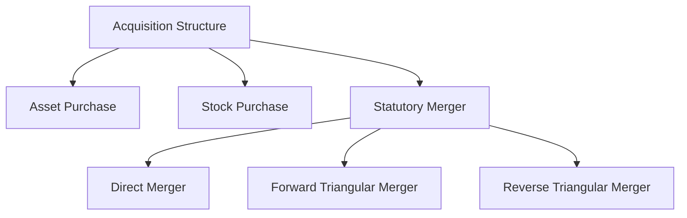
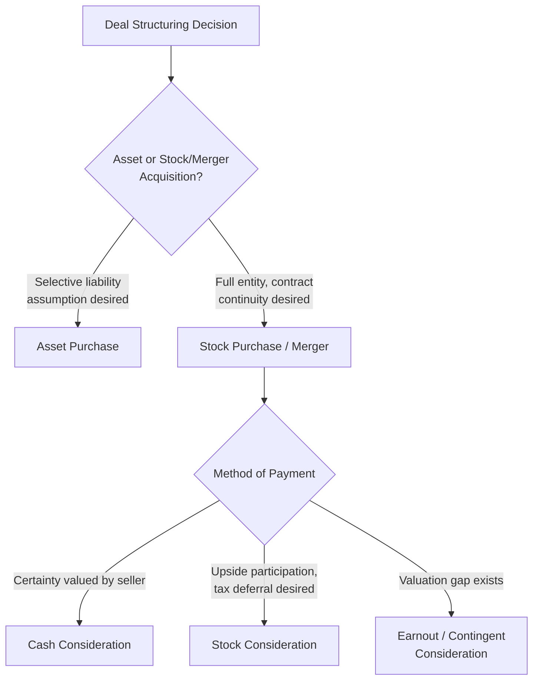

## Deal Structuring and Payment Methods

### Overview

Deal structuring in M&A encompasses the legal, financial, and tax architecture through which an acquisition is executed — determining what is being acquired (assets versus stock), how the transaction is legally effected, and critically, the **method of payment** used to compensate target shareholders (cash, stock, or a combination). These structural choices materially affect risk allocation, tax consequences, financing requirements, accounting treatment, and how the deal's economics are perceived and priced by both sides.

---

### Acquisition Structure: Asset Purchase vs. Stock Purchase vs. Merger

#### Asset Purchase

The acquirer buys specific assets (and may assume specific liabilities) of the target directly, rather than acquiring the target entity itself.

- **Key Points**: Allows the acquirer to selectively choose which assets and liabilities to assume, avoiding unwanted or unknown liabilities remaining with the target's original corporate shell; generally requires re-titling/re-registering individual assets and often requires third-party (customer, supplier, lessor) consent for contract assignment, which can add complexity and time; frequently provides a "step-up" in tax basis of acquired assets to fair market value, generating higher future depreciation/amortization deductions for the acquirer

#### Stock Purchase

The acquirer buys the target's outstanding shares directly from its shareholders, acquiring the entire legal entity — including all its assets, liabilities, and contracts — as a going concern.

- **Key Points**: Simpler to execute from a contract-assignment perspective (the legal entity itself doesn't change, so third-party consents are less often triggered), but the acquirer inherits all target liabilities, including unknown or contingent ones, making thorough due diligence particularly critical; generally does not provide an asset basis step-up for tax purposes (subject to certain elections in some jurisdictions), which can result in a less favorable ongoing depreciation/amortization profile relative to an asset purchase

#### Statutory Merger

A legal combination effected under corporate merger statutes, in which the target merges into (or with) the acquirer or an acquisition subsidiary, and target shareholders typically receive merger consideration (cash, acquirer stock, or a mix) in exchange for their shares, often without requiring individual shareholder consent (subject to any required shareholder vote and dissenters'/appraisal rights).

| Merger Type | Structure |
| --- | --- |
| Direct merger | Target merges directly into the acquirer |
| Forward triangular merger | Target merges into a newly formed acquisition subsidiary of the acquirer, with the subsidiary surviving |
| Reverse triangular merger | A newly formed acquisition subsidiary of the acquirer merges into the target, with the target surviving as a wholly owned subsidiary — commonly used to preserve the target's existing contracts, licenses, and legal identity while still achieving 100% ownership by the acquirer |

[Inference] Reverse triangular mergers are widely used in practice specifically because they can allow the target to retain non-assignable contracts, licenses, and permits without triggering third-party consent requirements, since the target entity itself survives and its contractual counterparty does not technically change — though specific contract language and applicable law always govern whether a given contract's assignment or change-of-control provisions are actually avoided.

---

### Comparison: Asset vs. Stock Structure

| Dimension | Asset Purchase | Stock Purchase |
| --- | --- | --- |
| Liability exposure | Selective; acquirer can exclude unwanted liabilities | Comprehensive; acquirer inherits all target liabilities |
| Tax basis step-up | Generally yes (fair market value basis for acquired assets) | Generally no (carryover basis), absent specific tax elections |
| Contract assignment | Often requires third-party consent | Generally avoided (entity continuity) |
| Complexity/time to close | Can be higher due to asset-by-asset transfer requirements | Generally lower from a transfer-mechanics standpoint |
| Seller tax treatment | Often less favorable to seller (potential double taxation at corporate level for C-corps, then again at shareholder level) | Generally more favorable to seller (single layer of tax on share sale gain) |
| Target shareholder approval | Not required if only assets, not the entity, are sold (though may trigger disclosure/approval under certain thresholds) | Required if effected via merger or majority share sale |

[Inference] Because asset purchases are often more tax-efficient for the buyer (basis step-up) but less tax-efficient for the seller (potential double taxation), and stock purchases have the opposite profile, the negotiated purchase price in a given transaction often reflects some allocation of this tax burden between the parties — the specific tax treatment depends heavily on the target's corporate form (C-corporation, S-corporation, partnership/LLC) and applicable jurisdiction, and should be evaluated with qualified tax advice rather than generalized here.

---

### Methods of Payment

#### Cash Consideration

Target shareholders receive a fixed cash amount per share.

$$\text{Total Cash Consideration} = \text{Offer Price per Share} \times \text{Target Shares Outstanding}$$

- **Key Points**: Provides target shareholders with certainty of value (no exposure to post-close acquirer share price movements), typically funded through acquirer cash reserves, new debt issuance, or a combination; cash deals are generally simpler to value and negotiate since there is no exchange ratio mechanics to resolve

#### Stock Consideration

Target shareholders receive acquirer shares in exchange for their target shares, based on a negotiated **exchange ratio**.

$$\text{Exchange Ratio} = \frac{\text{Offer Price per Target Share}}{\text{Acquirer Share Price}}$$

**Fixed vs. Floating Exchange Ratios:**

| Type | Mechanism | Risk Allocation |
| --- | --- | --- |
| Fixed exchange ratio | Target shareholders receive a fixed number of acquirer shares per target share, regardless of acquirer share price movement between announcement and close | Target shareholders bear the risk/benefit of acquirer share price changes during the interim period |
| Fixed value (floating exchange ratio) | The number of acquirer shares delivered adjusts to maintain a fixed dollar value, based on acquirer's share price near closing | Acquirer bears the dilution risk if its share price falls before closing, since more shares must be issued to deliver the same fixed value |
| Collar structure | Exchange ratio floats within a defined band, becoming fixed if the acquirer's share price moves outside specified upper/lower bounds | Shares risk between the two parties within a negotiated range |

- **Key Points**: Stock consideration allows target shareholders to participate in the upside (and downside) of the combined entity and can be more tax-efficient for target shareholders in many jurisdictions (potential tax deferral treatment on share-for-share exchanges, subject to specific tax rules); stock deals also avoid straining the acquirer's cash/debt capacity, but dilute existing acquirer shareholders' ownership percentage

#### Mixed (Cash and Stock) Consideration

A combination of cash and stock, allowing the deal to balance target shareholder preferences (some may prefer certainty via cash, others upside participation via stock) against the acquirer's financing capacity and desire to limit dilution.

---

### Contingent Consideration Structures

#### Earnouts

A portion of the purchase price is contingent on the target achieving specified post-closing performance milestones (revenue, EBITDA, or other metrics) over a defined period.

$$\text{Earnout Payment} = \max\left(0, \min\left(\text{Cap}, f(\text{Actual Performance} - \text{Target Threshold})\right)\right)$$

- **Key Points**: Frequently used to bridge valuation gaps between acquirer and seller expectations, particularly when the target's future performance is highly uncertain (common in acquisitions of early-stage or founder-led businesses); shifts some risk of underperformance back onto the seller, but introduces potential post-closing disputes over how the earnout metric is measured and managed, and can create misaligned incentives if the seller retains operational control during the earnout period

#### Contingent Value Rights (CVRs)

Securities granted to target shareholders that provide additional payment contingent on specified future events (e.g., regulatory approval of a pharmaceutical product, achievement of a sales milestone), functioning similarly to an earnout but often structured as a tradable or transferable security.

---

### Tax Treatment Overview (Illustrative)

| Structure | General Seller Tax Treatment (Illustrative) |
| --- | --- |
| All-cash asset or stock deal | Generally a fully taxable event to sellers in the year of sale |
| Qualifying stock-for-stock merger | Can potentially qualify for tax-deferred ("tax-free reorganization") treatment in certain jurisdictions, deferring shareholder-level tax until the acquirer shares are subsequently sold |
| Cash and stock mix | Often results in taxable treatment for the cash portion and potential deferral for the stock portion, subject to specific qualifying conditions |

[Unverified] Specific tax qualification requirements for reorganization treatment (e.g., continuity of interest, continuity of business enterprise tests under U.S. tax law, or equivalent concepts elsewhere) are technical, jurisdiction-specific, and subject to change; this table is illustrative of general structural patterns only and should not be relied upon for actual transaction tax planning, which requires qualified tax counsel review of the specific facts and applicable law.

---

### Financing the Transaction

Deal structuring is closely linked to financing strategy (covered in depth under sources of long-term financing and syndicated lending elsewhere in this text):

- **Cash-funded from balance sheet**: uses existing cash reserves, avoiding new financing costs but potentially signaling reduced financial flexibility
- **Debt-financed**: new term loans, syndicated facilities, or bond issuance raised specifically to fund cash consideration, subject to the acquirer's debt capacity and rating implications
- **Stock-financed**: avoids new cash/debt requirements but dilutes existing shareholders and exposes the deal's value to acquirer share price volatility between announcement and close
- **Bridge financing**: short-term financing (often from the acquirer's investment bank advisors) used to guarantee deal funding at signing, with the intention of refinancing via permanent debt or equity issuance shortly after closing

---

### Key Structural Decision Framework

---

### Key Points

- The asset-versus-stock (or merger) structural choice primarily balances liability exposure, tax basis considerations, and transfer complexity, with meaningfully different implications for both acquirer and target
- Method of payment (cash, stock, or mixed) allocates both valuation risk (via exchange ratio mechanics) and tax consequences between acquirer and target shareholders, and is a central negotiated deal term distinct from, but interacting with, the purchase price itself
- Contingent consideration structures (earnouts, CVRs) are valuable tools for bridging valuation disagreements but introduce post-closing measurement and incentive-alignment complexity that must be carefully documented
- [Inference] The optimal deal structure and payment method for a given transaction depends on the specific tax positions, liability risk tolerance, financing capacity, and valuation certainty of both parties, meaning structuring decisions are highly transaction-specific rather than governed by a single generally preferable approach

---

**Related Topics**

- Strategic rationale for mergers and acquisitions
- Valuing synergies and merger gains
- Accretion and dilution analysis
- Sources of long-term financing
- Corporate bond issuance and bank loans and syndicated lending (acquisition financing)
- Tax-free reorganizations and M&A tax structuring
- Due diligence processes in M&A transactions