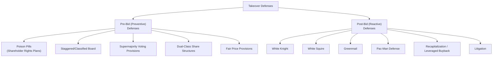

## Takeover Defenses and Protective Provisions

### Overview

Takeover defenses and protective provisions are the structural, legal, and strategic mechanisms a company can adopt — either proactively (pre-bid) or reactively (post-bid) — to deter, delay, or negotiate more favorable terms in the face of an unsolicited (hostile) acquisition attempt. These defenses span corporate charter/bylaw provisions, financial restructuring tactics, and litigation-based strategies, and their use raises significant governance and shareholder-value considerations that are central to the study of hostile takeover dynamics.

---

### Taxonomy of Takeover Defenses

---

### Pre-Bid (Preventive) Defenses

#### Poison Pill (Shareholder Rights Plan)

A provision granting existing shareholders (other than the acquirer) the right to purchase additional shares at a substantial discount if an acquirer's ownership stake crosses a specified threshold (commonly cited around the 10-20% range in many historical implementations, though the specific trigger threshold is company-specific and negotiable), massively diluting the acquirer's economic and voting stake and making a hostile acquisition prohibitively expensive without board approval.

$$\text{Dilutive Effect} \approx \text{New Shares Issued to Existing Holders} \times (\text{Market Price} - \text{Discounted Purchase Price})$$

- **Flip-in pill**: triggers the right to purchase additional shares of the *target* company at a discount
- **Flip-over pill**: triggers the right to purchase shares of the *acquirer* at a discount if a merger is subsequently completed
- **Key Points**: Poison pills are typically adopted by board resolution without requiring a shareholder vote, and can often be redeemed (removed) by the board — this redemption feature is central to their strategic function, since it gives the incumbent board significant negotiating leverage: the pill can be removed as part of a negotiated, board-approved transaction at a price the board deems acceptable, effectively forcing a hostile acquirer to negotiate directly with the board rather than proceeding unilaterally

#### Staggered (Classified) Board

The board of directors is divided into classes (commonly three), with only one class standing for election each year, meaning a hostile acquirer that gains a controlling equity stake cannot immediately replace the entire board and must wait multiple election cycles to gain full board control.

- **Key Points**: Significantly slows the pace at which an acquirer can convert an equity stake into full board/operational control, extending the effective timeline of a hostile campaign and providing the incumbent board more time to negotiate, seek alternatives, or otherwise respond

#### Supermajority Voting Provisions

Charter or bylaw provisions requiring an elevated shareholder vote threshold (e.g., two-thirds or higher, well above a simple majority) to approve specified major transactions (mergers, charter amendments) or to remove directors, making it structurally more difficult for an acquirer to obtain the votes necessary to complete a takeover or remove the incumbent board even after acquiring a substantial equity stake.

#### Dual-Class Share Structures

The company maintains multiple classes of common stock with differential voting rights (e.g., one class with one vote per share available to public investors, another with multiple votes per share typically retained by founders or insiders), allowing controlling parties to retain voting control even while holding a minority of total economic equity.

- **Key Points**: While often adopted primarily for founder-control purposes at IPO rather than purely as a takeover defense mechanism, dual-class structures function as one of the most effective takeover deterrents available, since an acquirer cannot obtain voting control through open-market purchases of the low-vote public class alone

#### Fair Price Provisions

Charter amendments requiring an acquirer to pay all shareholders the same (typically the highest) price paid for any shares acquired during the takeover process, preventing two-tiered offer structures in which an acquirer might otherwise offer a higher price for a controlling initial stake and a lower price in a subsequent squeeze-out of remaining minority shareholders.

---

### Post-Bid (Reactive) Defenses

#### White Knight

The target company solicits a friendlier, preferred alternative acquirer to make a competing bid, intending either to complete a merger on more favorable terms than the original hostile bidder offered, or to use the competing bid to extract better terms from the original bidder.

#### White Squire

Similar in spirit to a white knight, but the friendly third party acquires a substantial (though not controlling) equity stake in the target — often with standstill and voting agreements in place — sufficient to block the hostile acquirer from obtaining the votes or ownership percentage needed to complete the takeover, without the friendly party itself acquiring full control.

#### Greenmail

The target company repurchases the hostile acquirer's accumulated equity stake at a premium to the prevailing market price, in exchange for the acquirer's agreement to cease its takeover attempt (often paired with a standstill agreement preventing the acquirer from purchasing additional shares for a specified period).

- **Key Points**: Historically controversial and has become substantially less common, partly due to regulatory/tax deterrents adopted in various jurisdictions (e.g., punitive excise taxes on greenmail profits under U.S. tax law) and partly due to the negative signal it sends regarding the board acting in the interest of the specific departing acquirer rather than shareholders broadly; [Unverified] the current prevalence and specific regulatory treatment of greenmail should be verified against current law given the substantial regulatory attention this practice has historically attracted.

#### Pac-Man Defense

The target company responds to a hostile bid by launching its own counter-bid to acquire the original hostile acquirer, reversing the roles of acquirer and target.

- **Key Points**: Rarely used in practice given the substantial financing, legal, and execution complexity of mounting a credible counter-acquisition, but remains a recognized defensive category in the academic and practitioner literature on hostile takeover tactics.

#### Recapitalization / Leveraged Recapitalization

The target dramatically increases its leverage (often through a large debt-financed share buyback or special dividend), making the company less attractive to a hostile acquirer by loading the balance sheet with debt and/or by concentrating a larger proportion of remaining equity in the hands of management and employees (an **Employee Stock Ownership Plan**, or ESOP, is sometimes used in this context to place a friendly, employee-aligned block of shares with reduced likelihood of tendering into a hostile offer).

#### Litigation

The target board initiates or threatens legal action against the acquirer, alleging securities law violations, breach of fiduciary duty, antitrust concerns, or other legal deficiencies in the bid, primarily as a delay tactic to create additional time for other defensive measures to take effect or for alternative bidders to emerge.

---

### Governance and Legal Considerations

#### Fiduciary Duty Framework

Board decisions regarding takeover defenses are generally evaluated under the corporate governance and fiduciary duty framework applicable in the relevant jurisdiction (in the U.S., most notably Delaware corporate law, given the significant proportion of major public companies incorporated there).

- **Business judgment rule**: the default deferential standard under which courts generally do not second-guess board decisions made in good faith, on an informed basis, and in the honest belief the action is in the company's best interest
- **Enhanced scrutiny standards**: in the specific context of takeover defenses, many jurisdictions apply a heightened standard of judicial review (in Delaware, this body of case law is most closely associated with the *Unocal* and *Revlon* precedents) requiring the board to demonstrate a reasonable, good-faith basis for perceiving a threat to corporate policy and effectiveness, and that any defensive measure adopted is reasonable and proportionate in relation to that threat

[Unverified] The precise current legal standards, their evolution through subsequent case law, and jurisdiction-specific variations are a matter of ongoing legal development; this overview reflects the general conceptual framework commonly taught in corporate finance curricula rather than a definitive statement of current legal doctrine, and should not be relied upon in place of qualified legal counsel for any actual takeover defense situation.

#### Shareholder Perspective and Empirical Debate

The academic and practitioner literature reflects an ongoing debate regarding whether takeover defenses, on balance, benefit or harm shareholders:

| Perspective | Argument |
| --- | --- |
| Defenses harm shareholders (entrenchment view) | Defenses primarily protect incumbent management from accountability, entrenching underperforming leadership and depriving shareholders of premium-generating acquisition opportunities |
| Defenses can benefit shareholders (negotiating leverage view) | Defenses provide the board time and leverage to negotiate a higher price, solicit competing bids, or resist an opportunistically timed/underpriced offer, potentially increasing the ultimate premium received by shareholders |

[Inference] This tension is widely discussed in corporate governance and M&A literature, and the empirical evidence on which view predominates in practice has been extensively studied and debated across different defense types, time periods, and governance contexts, without a single settled consensus applicable across all situations — the appropriate framing in an educational context is that takeover defenses involve a genuine governance trade-off rather than a mechanism unambiguously favorable or unfavorable to shareholders in all cases.

---

### Comparison Table

| Defense | Timing | Primary Mechanism | Reversibility |
| --- | --- | --- | --- |
| Poison pill | Pre-bid (or adopted rapidly post-bid) | Massive dilution upon threshold trigger | Generally board-redeemable |
| Staggered board | Pre-bid | Delays acquirer's ability to gain board control | Requires charter amendment (often shareholder vote) to remove |
| Supermajority provisions | Pre-bid | Raises the voting threshold for approval | Requires charter amendment (often supermajority itself) to remove |
| Dual-class shares | Pre-bid (typically established at IPO) | Concentrates voting control independent of economic ownership | Very difficult to unwind once established |
| White knight/squire | Post-bid | Introduces a competing, friendlier party | Deal-specific, one-time response |
| Greenmail | Post-bid | Buys out the specific hostile acquirer's stake | One-time transaction |
| Recapitalization | Post-bid (or pre-bid preventively) | Increases leverage/reduces attractiveness | Generally not reversible without significant refinancing |

---

### Key Points

- Takeover defenses span a spectrum from structural, pre-bid charter/bylaw provisions (poison pills, staggered boards, supermajority requirements, dual-class structures) to reactive, deal-specific tactics deployed once a hostile bid is announced (white knights, recapitalization, litigation)
- The poison pill's core strategic value lies in its redeemability: it does not permanently block a takeover but gives the incumbent board significant leverage to force negotiation on its own terms
- Board conduct in adopting and maintaining takeover defenses is subject to heightened judicial scrutiny standards in many jurisdictions, reflecting the inherent conflict-of-interest concern when incumbent management/boards make decisions that could entrench their own position
- The overall shareholder-value impact of takeover defenses remains a genuinely debated question in corporate governance literature, balancing entrenchment risk against legitimate negotiating-leverage benefits, rather than being resolved uniformly in either direction

---

**Related Topics**

- Strategic rationale for mergers and acquisitions
- Deal structuring and payment methods
- Corporate governance and board structure
- Fiduciary duties of directors in M&A contexts
- Hostile takeover tactics (tender offers, proxy contests)
- Leveraged buyouts and going-private transactions
- Shareholder activism and proxy voting mechanics