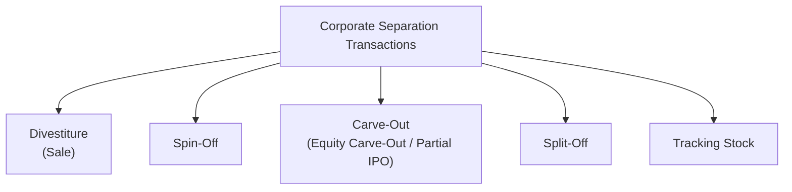
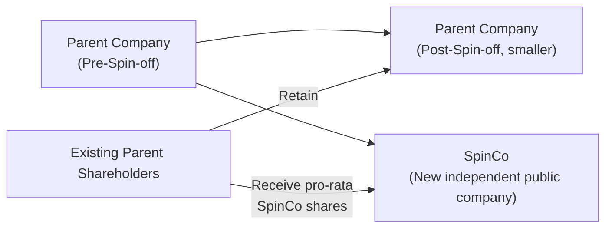
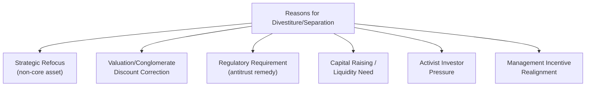

## Divestitures, Spin-Offs, and Carve-Outs

### Overview

Corporate restructuring is not limited to acquisitive growth — firms frequently create shareholder value by disposing of business units, subsidiaries, or divisions that no longer fit the parent's strategic focus, are undervalued within the conglomerate structure, or would perform better as an independent entity. Divestitures, spin-offs, carve-outs, and split-offs represent the primary structural tools for such separations, each with distinct legal mechanics, tax treatment, and implications for how value is realized and by whom.

---

### Taxonomy of Corporate Separation Transactions

---

### Divestiture (Sale of a Business Unit)

The outright sale of a subsidiary, division, or business unit to a third party (a strategic buyer, financial buyer/private equity, or via public offering), in exchange for cash, stock of the buyer, or other consideration.

$$\text{Divestiture Proceeds} = \text{Sale Price} - \text{Transaction Costs} - \text{Tax on Gain (if applicable)}$$

- **Key Points**: Provides the seller with immediate liquidity that can be redeployed (debt paydown, reinvestment in core operations, return to shareholders), and shifts all operational and financial risk of the divested unit to the buyer; the transaction is typically structured as either an asset sale or a stock sale of the relevant subsidiary, following the same structural logic as an acquisition (see Deal Structuring and Payment Methods) from the buyer's perspective
- Motivations commonly include: refocusing on core competencies, raising capital, divesting underperforming or non-strategic assets, addressing regulatory (antitrust) requirements from a prior acquisition, or responding to activist investor pressure

---

### Spin-Off

The parent company distributes shares of a subsidiary to its existing shareholders on a pro-rata basis, creating a new, independent publicly traded entity with the same ownership base as the parent (at least initially), without any cash changing hands and without the parent receiving sale proceeds.

$$\text{Shareholder receives:} \quad \text{Parent Shares (unchanged)} + \text{New SpinCo Shares (pro-rata distribution)}$$

- **Key Points**: Because shares are distributed rather than sold, spin-offs can often qualify for tax-free treatment to both the parent and its shareholders in many jurisdictions, provided specific structural and business-purpose requirements are satisfied — this is a primary driver of the spin-off structure's popularity relative to an outright taxable sale
- No cash proceeds are generated for the parent; the transaction's value creation thesis rests on the idea that the separated businesses will each be valued more highly (and managed more effectively, with more focused capital allocation and management incentives) as independent entities than as a combined conglomerate — sometimes referred to as eliminating a **"conglomerate discount"**
- Post-spin-off, the two entities are entirely independent (separate management, boards, and capital structures), though transitional service agreements are commonly put in place for a period to manage the operational separation

#### Key Rationale Points for Spin-Offs

- **Focus and management incentive alignment**: separate management teams can pursue strategies and capital allocation priorities specific to each business, with equity compensation more directly tied to that business's own performance
- **Regulatory or antitrust requirements**: sometimes mandated as a condition of approving a prior merger, or to address competition concerns
- **Unlocking valuation**: if the market systematically undervalues a diversified conglomerate relative to the sum of its independently valued parts (the conglomerate discount), separation can, in principle, unlock this value differential
- [Inference] Academic research on spin-offs has generally found more consistent evidence of positive announcement-period abnormal returns for spin-offs compared to some other corporate restructuring transaction types, though the magnitude and consistency of findings vary across studies, time periods, and the specific circumstances of each transaction, and should not be treated as a guaranteed outcome for any individual spin-off

---

### Carve-Out (Equity Carve-Out / Partial IPO)

The parent company sells a **minority stake** in a subsidiary to public investors via an initial public offering, while typically retaining majority ownership and control of the subsidiary.

$$\text{Parent receives:} \quad \text{IPO Proceeds from Sale of Minority Stake}$$

- **Key Points**: Unlike a spin-off, a carve-out generates cash proceeds for the parent (since shares are sold, not distributed) and establishes a public market valuation/currency for the subsidiary while the parent retains strategic control; the newly public subsidiary follows the standard IPO process (underwriting, roadshow, book building) described elsewhere in this text, but with the parent as the primary selling/retaining shareholder rather than a fully independent company going public for the first time
- Carve-outs are frequently used as a **precursor to a subsequent full spin-off or complete divestiture**, allowing the parent to establish a market valuation benchmark, test investor appetite, and retain flexibility before fully separating from the business
- **Key Points**: Because the parent typically retains majority control post-carve-out, the subsidiary's public shareholders (the minority stake purchasers) are subject to potential conflicts of interest regarding related-party transactions, resource allocation, and eventual full-separation timing, decisions which remain substantially influenced by the parent

---

### Split-Off

Similar to a spin-off in that no cash is generated for the parent, but structurally different: existing parent shareholders are offered the choice to **exchange their parent shares for shares of the subsidiary**, rather than receiving subsidiary shares in addition to their existing parent holdings.

$$\text{Shareholder Choice:} \quad \text{Retain Parent Shares} \quad \text{OR} \quate \text{Exchange for SpinCo Shares}$$

- **Key Points**: Because shareholders exchange (rather than passively receive additional shares), a split-off structurally reduces the parent's share count, which can be beneficial if the parent wishes to shrink its share base (functioning similarly to a targeted share buyback using the subsidiary's stock as consideration rather than cash); typically results in different shareholders self-selecting into the parent versus the subsidiary based on their preference for each entity's prospects, potentially producing a more natural post-separation ownership base for each

---

### Tracking Stock

A separate class of the parent company's own stock created to reflect the financial performance of a specific division or subsidiary, without legally separating that division into an independent company — the division remains fully owned and controlled by the parent, but its economic performance is tracked and reported separately to tracking stockholders.

- **Key Points**: Does not achieve true operational or legal separation, and tracking stockholders have no direct legal claim on the specific division's assets (their claim remains against the parent corporation as a whole), a structural limitation that has historically limited tracking stock's popularity and durability as a restructuring tool relative to genuine spin-offs or carve-outs; [Unverified] the current prevalence of tracking stock structures in public markets should be verified against recent examples, as this structure has seen varying levels of adoption over different market periods

---

### Comparison Table

| Dimension | Divestiture (Sale) | Spin-Off | Carve-Out | Split-Off |
| --- | --- | --- | --- | --- |
| Cash proceeds to parent | Yes (from buyer) | No | Yes (from IPO investors) | No |
| Resulting ownership of separated entity | Third-party buyer | Existing parent shareholders (pro-rata) | Public market (minority) + parent (majority, retained) | Exchanging shareholders only |
| Parent retains control post-transaction | No | No | Typically yes (majority retained) | No |
| Typical tax treatment (illustrative) | Often taxable | Can often qualify for tax-free treatment | Taxable gain on shares sold to public | Can often qualify for tax-free treatment |
| Primary value driver | Immediate liquidity, risk transfer | Unlocking conglomerate discount, management focus | Valuation benchmark + retained control/optionality | Similar to spin-off, with shareholder self-selection |

---

### Motivations for Corporate Separation (General Framework)

- **Key Points**: The choice among these structural alternatives (outright sale, spin-off, carve-out, split-off) depends heavily on whether the parent needs cash proceeds (favoring divestiture or carve-out over spin-off/split-off), whether tax-free treatment is achievable and desired (favoring spin-off/split-off structures), and whether the parent wishes to retain any ongoing economic interest or control in the separated business (favoring carve-out over a full sale or spin-off)

---

### Key Points

- Divestitures, spin-offs, carve-outs, and split-offs represent distinct structural tools for corporate separation, differentiated primarily by whether cash proceeds are generated, whether the parent retains any ongoing stake, and the tax treatment achieved
- Spin-offs and split-offs are typically pursued specifically to achieve tax-free treatment under applicable reorganization rules, a major structural advantage over an outright taxable divestiture sale
- Carve-outs are frequently used as an intermediate step, establishing a public valuation benchmark while preserving parent control and optionality regarding eventual full separation
- The underlying economic rationale across all these structures commonly centers on correcting a perceived conglomerate discount and improving management focus and capital allocation discipline within each separately operating business

---

**Related Topics**

- Strategic rationale for mergers and acquisitions
- Deal structuring and payment methods
- Initial public offering process and pricing
- Leveraged buyouts and going-private transactions
- Corporate governance and management incentive design
- Activist investing and shareholder pressure for restructuring
- Tax-free reorganizations in corporate restructuring