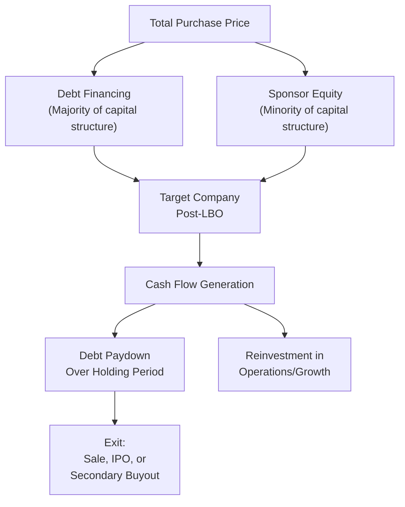

## Leveraged Buyouts

### Overview

A Leveraged Buyout (LBO) is the acquisition of a company financed predominantly with debt, with the acquired company's own assets and projected cash flows serving as the primary source of debt repayment and often as collateral for the financing itself. LBOs are typically executed by private equity firms (the "financial sponsor"), converting a public or private target into a highly leveraged, privately held entity, with the sponsor's return generated through operational improvement, debt paydown, and an eventual exit at a higher valuation.

---

### Core Economic Logic

$$\text{Purchase Price} = \text{Equity Contribution (Sponsor)} + \text{Debt Financing}$$

The defining characteristic of an LBO is the capital structure used to fund the acquisition: a substantial majority of the purchase price is financed with debt (historically often 60-80% of the capital structure, though the specific proportion varies considerably by deal, market conditions, and target characteristics), with the sponsor contributing a comparatively smaller equity check.

**Sources of return to the sponsor's equity:**

1. **Debt paydown ("deleveraging")**: as debt is repaid from operating cash flow over the holding period, the sponsor's proportional equity claim on the (unchanged or growing) enterprise value increases
2. **EBITDA growth**: operational improvements, revenue growth, and margin expansion increase the underlying enterprise value
3. **Multiple expansion**: exiting at a higher valuation multiple than was paid at entry (though this is generally treated as a less reliable, less controllable source of return than the first two)

---

### The LBO Capital Structure

#### Financing Layers

| Layer | Typical Characteristics | Seniority |
| --- | --- | --- |
| Senior secured debt (Term Loan A/B, revolving credit facility) | Lowest cost, collateralized, often floating rate | Most senior |
| Senior unsecured / high-yield bonds | Higher cost than secured debt, no specific collateral | Subordinate to secured debt |
| Mezzanine / subordinated debt | Higher cost, often includes warrants or equity kicker | Subordinate to senior debt |
| Sponsor equity (common and/or preferred) | Highest risk/return position | Most junior |

This layered structure mirrors the general debt/hybrid/equity taxonomy covered under sources of long-term financing, but is compressed into a single transaction-specific capital structure designed around the target's projected cash flow capacity to service debt.

#### Key Sizing Metric: Leverage Multiple

$$\text{Leverage Multiple} = \frac{\text{Total Debt}}{\text{EBITDA}}$$

Lenders and sponsors size the debt financing relative to the target's EBITDA, with the maximum sustainable leverage multiple depending on the stability and predictability of the target's cash flows — businesses with highly stable, recurring, non-cyclical cash flows can typically support higher leverage multiples than cyclical or capital-intensive businesses.

---

### LBO Candidate Characteristics

Not all companies are suitable LBO targets. Favorable characteristics typically include:

- **Stable, predictable cash flows**: necessary to reliably service substantial debt obligations without excessive covenant or default risk
- **Low existing leverage**: provides debt capacity headroom for the sponsor to layer on new acquisition debt
- **Strong asset base**: tangible assets or intellectual property that can serve as loan collateral
- **Limited near-term capital expenditure requirements**: reduces competing claims on cash flow relative to debt service
- **Identifiable operational improvement opportunities**: cost reduction, margin improvement, or growth initiatives the sponsor believes can be executed to drive value creation beyond pure financial engineering
- **Strong, defensible market position**: reduces business risk during the leveraged holding period

---

### Building an LBO Model: Core Mechanics

#### Step 1 — Entry Valuation and Sources & Uses

$$\text{Uses} = \text{Purchase of Equity} + \text{Refinancing of Existing Debt} + \text{Transaction Fees}$$

$$\text{Sources} = \text{New Debt Tranches} + \text{Sponsor Equity}$$

Sources must equal Uses; the plug for sponsor equity is determined after sizing the maximum feasible debt given the target's cash flow and the lending market's leverage appetite.

#### Step 2 — Projecting Operating Performance

Standard operating model projections (revenue, EBITDA, capital expenditures, working capital) over the anticipated holding period (commonly 3–7 years, though this varies by strategy and market conditions).

#### Step 3 — Debt Schedule and Cash Flow Sweep

$$\text{Free Cash Flow Available for Debt Paydown} = EBITDA - CapEx - \Delta NWC - \text{Cash Interest} - \text{Cash Taxes}$$

Many LBO structures include a **cash flow sweep** provision, requiring some or all excess free cash flow (after mandatory amortization) to be applied to voluntary debt prepayment, accelerating deleveraging.

#### Step 4 — Exit Valuation

$$\text{Exit Enterprise Value} = \text{Exit Year EBITDA} \times \text{Exit Multiple}$$

$$\text{Exit Equity Value} = \text{Exit Enterprise Value} - \text{Remaining Net Debt at Exit}$$

#### Step 5 — Return Calculation

$$\text{MOIC (Multiple on Invested Capital)} = \frac{\text{Equity Proceeds at Exit}}{\text{Initial Equity Investment}}$$

$$IRR: \quad \text{Initial Equity} = \sum_{t=1}^{n} \frac{\text{Interim Cash Flows}_t}{(1+IRR)^t} + \frac{\text{Exit Equity Proceeds}}{(1+IRR)^n}$$

---

### Worked Example (Simplified)

A sponsor acquires a company for $500M enterprise value (8.0x entry EBITDA of $62.5M), financed with $350M debt (5.6x leverage) and $150M sponsor equity.

Over a 5-year holding period, EBITDA grows to $85M, and $120M of debt is paid down from cumulative free cash flow, leaving $230M of debt at exit. The sponsor exits at the same 8.0x EBITDA multiple.

$$\text{Exit Enterprise Value} = 85M \times 8.0x = \$680M$$

$$\text{Exit Equity Value} = 680M - 230M = \$450M$$

$$MOIC = \frac{450M}{150M} = 3.0x$$

$$IRR \approx (3.0)^{1/5} - 1 \approx 24.6\%$$

This example illustrates the combined effect of EBITDA growth ($62.5M → $85M) and debt paydown ($350M → $230M) driving equity value from $150M to $450M, even with a constant (not expanded) exit multiple — demonstrating that returns need not rely on multiple expansion to be substantial.

#### Key Points

- The leverage effect amplifies equity returns relative to the underlying enterprise-level performance: because the sponsor's equity is a comparatively small slice of the total capital structure, moderate EBITDA growth and debt paydown can generate outsized percentage returns on the equity invested — this amplification is the central financial engineering mechanism of the LBO structure
- This same leverage effect works in reverse: a shortfall in projected EBITDA growth, or an exit at a lower multiple, is similarly amplified on the downside, meaning LBO equity returns carry substantially more risk/variance than the underlying business's unlevered operating performance would suggest

---

### Exit Strategies

| Exit Route | Description |
| --- | --- |
| Strategic sale | Sale to a corporate acquirer seeking the business for strategic (synergy-driven) reasons |
| Secondary buyout | Sale to another private equity sponsor |
| Initial Public Offering | Taking the company public, following the standard IPO process described elsewhere in this text |
| Dividend recapitalization | Not a full exit, but a partial return of capital to the sponsor via a new debt-financed dividend paid before eventual full exit |

---

### Risks and Criticisms of LBOs

- **Financial distress risk**: high leverage increases the probability of covenant breach or default if operating performance underperforms projections, particularly in economic downturns or unexpected industry disruption
- **Reduced operational flexibility**: substantial mandatory debt service and covenant restrictions can constrain the target's ability to invest in growth opportunities or weather temporary performance shortfalls
- **Employment and stakeholder impact**: LBOs have historically drawn criticism (and academic study) regarding their impact on employment, wages, and other stakeholders, alongside the financial returns generated for sponsor investors — [Inference] this remains an area of ongoing empirical research and public policy debate, with findings varying across studies, industries, and time periods, rather than a settled consensus in either direction
- **Fee structures**: sponsors typically earn both management fees (on committed capital) and carried interest (a share of profits above a specified return hurdle), creating an incentive structure that has itself been the subject of academic and regulatory scrutiny regarding alignment with underlying investor (limited partner) interests

---

### Key Points

- LBOs are defined by their capital structure — a majority debt-financed acquisition — rather than any particular industry or deal size, and the technique can theoretically be applied to any company with sufficiently stable and predictable cash flows to support substantial leverage
- Value creation in a well-executed LBO stems from a combination of debt paydown, EBITDA growth, and (less reliably) multiple expansion, with the leverage inherent in the structure amplifying both upside and downside equity returns
- LBO candidate selection criteria (cash flow stability, low existing leverage, strong asset base, operational improvement potential) directly reflect the structural requirement to service substantial debt while still generating attractive equity returns
- The technique sits at the intersection of several other topics in this text: debt/financing structuring (bank loans, syndicated lending, high-yield bonds), valuation methodology, and corporate restructuring more broadly

---

**Related Topics**

- Bank loans and syndicated lending
- Corporate bond issuance
- Divestitures, spin offs, and carve outs
- Strategic rationale for mergers and acquisitions
- Capital structure theory and financial distress costs
- Private equity fund structures and carried interest
- Dividend recapitalizations and sponsor return optimization