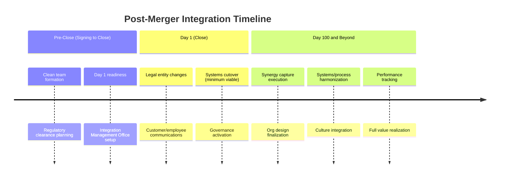
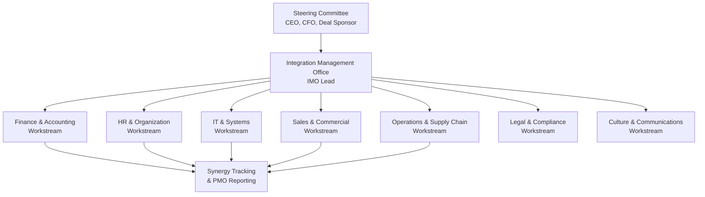
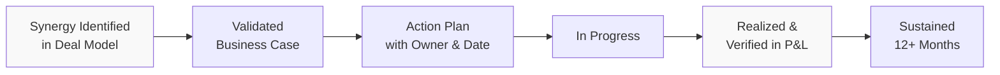
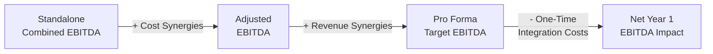

## Post-Merger Integration

### Overview

Post-merger integration (PMI) is the structured process of combining two previously independent organizations into a single functioning entity after a merger or acquisition (M&A) transaction closes. PMI translates the deal's strategic rationale and projected synergies into operational reality by aligning systems, processes, organizational structures, cultures, and financial reporting.

PMI is widely regarded as the phase where most M&A value is won or lost. [Inference] Industry studies commonly cite failure rates for M&A value creation in the 50–70% range, with integration execution frequently identified as the leading cause, though methodologies and definitions of "failure" vary across studies.

### Strategic Rationale and the Synergy Thesis

Every integration plan should trace back to the original deal thesis. Synergies are typically classified as:

- **Revenue synergies**: Cross-selling, market access expansion, pricing power, product bundling
- **Cost synergies**: Headcount rationalization, procurement leverage, facility consolidation, SG&A reduction
- **Financial synergies**: Lower cost of capital, tax optimization, improved working capital efficiency

**Key Points**

- Cost synergies are generally easier to quantify and execute than revenue synergies.
- Revenue synergies take longer to materialize and are harder to isolate from organic growth. [Inference] Many practitioners discount revenue synergy estimates by 50% or more in valuation models due to this execution risk.
- The synergy thesis should directly drive the integration roadmap prioritization — functions with the largest synergy pools get the earliest and most resourced attention.

### Integration Archetypes

The integration approach should match the strategic intent of the deal.

| Archetype | Description | Typical Use Case |
| --- | --- | --- |
| Absorption | Target fully absorbed into acquirer's systems, processes, and brand | Bolt-on acquisitions, scale plays |
| Preservation | Target retained largely as a standalone unit | Talent/IP-driven deals, new market entry |
| Symbiosis | Selective integration of key functions while preserving core differentiators | Capability-driven mergers |
| Transformation | Both companies restructured into a new operating model | Merger of equals |

Choosing the wrong archetype — e.g., forcing absorption on a deal made for a preserved culture and talent base — is a common cause of value destruction. [Inference] This mismatch is frequently cited anecdotally in M&A case studies, though it is difficult to isolate as a standalone causal factor in aggregate failure statistics.

### The PMI Timeline

PMI is generally organized into three overlapping phases.

#### Pre-Close Planning

Work that begins after signing but before close, constrained by antitrust "gun-jumping" rules that prohibit competitors from coordinating commercially before close.

- **Clean team** protocols: A legally firewalled team (often including outside counsel) reviews competitively sensitive data to plan integration without violating antitrust law
- Integration Management Office (IMO) formation and governance charter
- Day 1 readiness planning (payroll continuity, IT access, customer-facing continuity)
- Synergy baseline validation

#### Day 1

The legal close date. Priorities are narrow and operational:

- Employees get paid, badges work, systems are accessible
- Customer and supplier continuity is maintained
- Communications go out (internal and external)
- Minimum legal/regulatory obligations are met (e.g., new entity registrations)

#### Day 100 and Beyond

The bulk of value realization occurs here, typically spanning 12–24 months for full integration on complex deals. [Inference] Timeline length varies significantly by deal size, industry, and integration archetype; complex cross-border or transformational mergers can extend well beyond 24 months.

### Integration Management Office (IMO) Structure

**Key Points**

- The **Steering Committee** holds decision authority and resolves cross-functional conflicts.
- The **IMO Lead** is a dedicated, often full-time role — not a part-time addition to someone's existing job.
- **Workstream leads** are typically senior operators from both legacy organizations (paired leadership is common to build trust and preserve institutional knowledge).
- A **synergy tracking office** maintains a single source of truth for savings/revenue capture against baseline, reporting into the steering committee on a fixed cadence (commonly bi-weekly or monthly).

### Core Workstreams

#### Finance and Accounting Integration

- Chart of accounts harmonization
- ERP consolidation or interim reporting bridge
- Purchase accounting under ASC 805 (US GAAP) or IFRS 3 (International): allocating purchase price to identifiable tangible/intangible assets and goodwill
- Internal controls (SOX compliance) extension to the acquired entity
- Treasury and cash management consolidation
- Tax structure integration (transfer pricing, entity rationalization)

**Example**

A US-based acquirer purchasing a private target must typically complete purchase price allocation (PPA) within the measurement period (up to one year from the acquisition date under ASC 805), identifying and fair-valuing intangible assets such as customer relationships, technology, and trade names separately from residual goodwill.

#### Human Resources and Organizational Design

- Org structure design (who reports to whom)
- Compensation and benefits harmonization
- Retention plans for key talent (often structured as retention bonuses with cliff vesting)
- Redundancy identification and severance planning
- HRIS/payroll systems consolidation

$$\text{Retained Value} = \sum_{i=1}^{n} P(\text{retain}_i) \times V_i$$

Where $V_i$ represents the value attributed to key employee $i$ and $P(\text{retain}_i)$ is the estimated retention probability, often modeled based on retention package structure and role criticality.

#### IT and Systems Integration

- Application rationalization (eliminate duplicate systems)
- Data migration and cybersecurity harmonization
- Cloud infrastructure consolidation
- Cutover sequencing (big-bang vs. phased migration)

**Key Points**

- **Big-bang cutover**: All systems switched simultaneously — faster but higher risk.
- **Phased/parallel-run cutover**: Gradual transition with both systems running concurrently — lower risk but slower and more resource-intensive.
- [Inference] IT integration is frequently the long-pole workstream in complex deals due to legacy system entanglement, though this varies significantly by industry and target IT maturity.

#### Commercial and Sales Integration

- Customer segmentation and account mapping to avoid channel conflict
- Sales force alignment and compensation plan harmonization
- Cross-sell/up-sell enablement (the primary revenue synergy lever)
- Pricing strategy alignment
- CRM consolidation

#### Culture Integration

Often under-resourced relative to its impact on execution risk.

- Cultural due diligence (ideally started pre-close)
- Values and behavior alignment workshops
- Change management and communication cadence
- Leadership visibility and symbolic actions (e.g., joint town halls, co-located leadership)

### Synergy Tracking Framework

A disciplined tracking methodology is essential to prevent "synergy mirage" — reported savings that do not translate to bottom-line impact.

**Key Points**

- Synergies should only be counted as "realized" when reflected in actual financial statements, not when a plan is approved.
- A common governance practice is requiring finance sign-off before a synergy moves from "in progress" to "realized" status, to prevent double-counting or premature credit.
- Run-rate savings (annualized impact) should be distinguished from in-year cash impact, since implementation timing affects the current fiscal year differently than the full annual run rate.

### Integration Cost and Value Bridge

One-time integration costs (severance, system migration, advisory fees, facility exit costs) are typically modeled separately from run-rate synergies and can offset a significant portion of Year 1 benefits. [Inference] Industry rule-of-thumb estimates sometimes place one-time integration costs at roughly 1x the annual run-rate cost synergy value, though this ratio varies materially by deal complexity and is not a fixed standard.

### Common Pitfalls

**Key Points**

- **Underinvestment in the IMO**: Treating integration as a part-time add-on to existing jobs rather than dedicated resourcing.
- **Synergy overestimation**: Deal teams under pressure to justify valuation may set unrealistic synergy targets.
- **Culture neglect**: Focusing exclusively on systems/process integration while ignoring behavioral and cultural friction.
- **Customer/talent attrition during ambiguity**: Prolonged uncertainty about roles and reporting lines drives voluntary departures of both customers and key employees.
- **Day 1 over-engineering**: Attempting full integration on Day 1 instead of sequencing for minimum viable continuity first.
- **Loss of momentum post-Day 100**: Initial energy fades before full synergy capture is complete, particularly on multi-year integrations.

### Regulatory and Antitrust Considerations

- **Hart-Scott-Rodino (HSR) Act** (US): Requires premerger notification and a waiting period before closing for qualifying transactions.
- **Gun-jumping rules**: Prohibit acquirer and target from coordinating pricing, customers, or output decisions before legal close.
- **Merger control clearances**: Cross-border deals often require approval from multiple jurisdictions (e.g., US FTC/DOJ, EU Commission), which can delay Day 1 and constrain pre-close integration planning.

### Illustrative PMI Governance Cadence (svg_diagram)

<svg xmlns="http://www.w3.org/2000/svg" viewBox="0 0 780 340" font-family="Arial, sans-serif">
<text x="390" y="28" text-anchor="middle" font-size="18" font-weight="bold" fill="#1a1a1a">PMI Governance Cadence (svg_diagram)</text>
<rect x="30" y="60" width="720" height="50" rx="6" fill="#e8eef7" stroke="#4a6fa5" stroke-width="1.5" />
<text x="390" y="90" text-anchor="middle" font-size="14" fill="#1a1a1a">Steering Committee — Monthly Strategic Review</text>
<rect x="30" y="130" width="720" height="50" rx="6" fill="#eef7e8" stroke="#5a9a4a" stroke-width="1.5" />
<text x="390" y="160" text-anchor="middle" font-size="14" fill="#1a1a1a">IMO Core Team — Bi-Weekly Cross-Workstream Sync</text>
<rect x="30" y="200" width="720" height="50" rx="6" fill="#f7efe8" stroke="#c08a4a" stroke-width="1.5" />
<text x="390" y="230" text-anchor="middle" font-size="14" fill="#1a1a1a">Workstream Leads — Weekly Status &amp; Blocker Review</text>
<rect x="30" y="270" width="720" height="50" rx="6" fill="#f7e8ee" stroke="#a54a6f" stroke-width="1.5" />
<text x="390" y="300" text-anchor="middle" font-size="14" fill="#1a1a1a">Synergy Tracking Office — Continuous Data Capture &amp; Validation</text>
<line x1="390" y1="110" x2="390" y2="130" stroke="#888" stroke-width="1.5" marker-end="url(#arrow)" />
<line x1="390" y1="180" x2="390" y2="200" stroke="#888" stroke-width="1.5" marker-end="url(#arrow)" />
<line x1="390" y1="250" x2="390" y2="270" stroke="#888" stroke-width="1.5" marker-end="url(#arrow)" />
</svg>

### Key Performance Indicators for PMI Success

| KPI Category | Example Metrics |
| --- | --- |
| Financial | Synergy capture vs. target, integration cost vs. budget, revenue retention |
| Talent | Voluntary attrition rate (especially key talent), employee engagement scores |
| Customer | Customer retention rate, Net Promoter Score (NPS) trend |
| Operational | System cutover milestones met, process harmonization completion rate |
| Timeline | % of Day 100 plan milestones achieved on schedule |

**Related Topics**

- Purchase price allocation (ASC 805 / IFRS 3)
- Synergy valuation and modeling in M&A
- Change management frameworks in corporate transactions
- Carve-out and divestiture transition service agreements (TSAs)
- Cross-border M&A regulatory approval processes
- Earnout structures and contingent consideration
- Organizational design and change readiness assessment
- M&A due diligence frameworks (financial, operational, cultural)