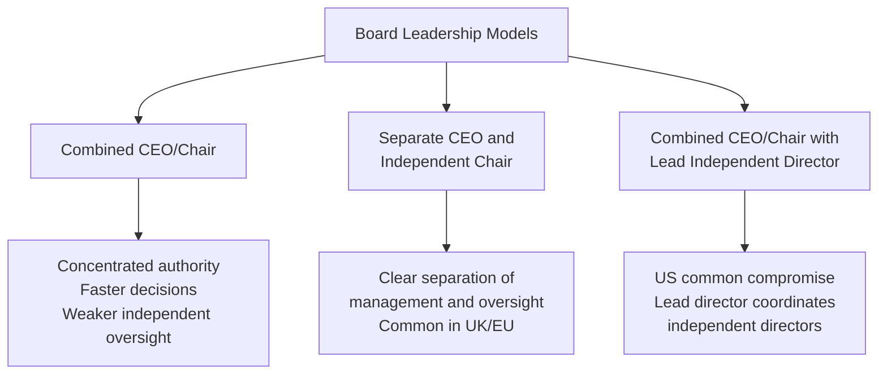
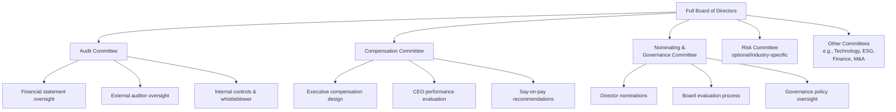
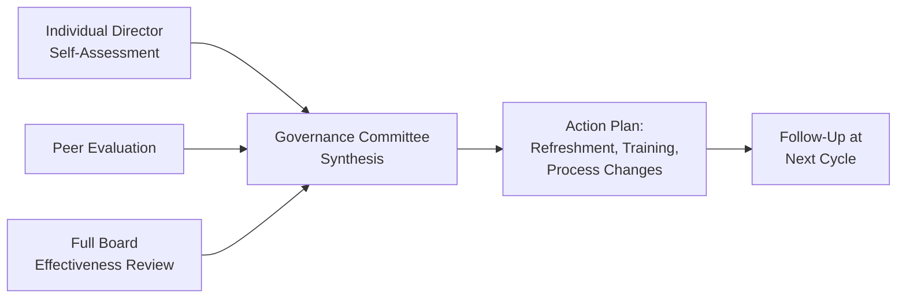

## Board Composition and Structure

### Overview

Board composition and structure refers to the design of a corporation's board of directors — its size, member mix, independence profile, committee architecture, and leadership arrangement. These design choices shape the board's capacity to perform its two core governance functions: monitoring management (oversight) and advising on strategy (counsel). Board structure is a central focus of corporate governance codes, institutional investor stewardship policies, and proxy advisory firm (ISS, Glass Lewis) voting guidelines.

### Core Functions of the Board

- **Monitoring/oversight**: Evaluating management performance, approving major transactions, ensuring internal controls and risk management
- **Advisory**: Providing strategic counsel, industry expertise, and network access to management
- **Resource provision**: Legitimacy, reputation, and external relationship access
- **Fiduciary duty**: Directors owe duties of care and loyalty to shareholders (in some jurisdictions, extended to broader stakeholders)

### Board Size

**Key Points**

- Most large-cap boards range from 8–15 directors. [Inference] This range is commonly cited in governance literature and index composition data, though optimal size is context-dependent and no universal standard exists.
- Smaller boards are associated with faster decision-making and easier coordination.
- Larger boards bring broader expertise and network diversity but face coordination costs and free-rider risk (individual accountability dilutes as size increases).
- Academic governance research (e.g., Jensen, 1993; Yermack, 1996) has associated smaller board size with higher firm valuation in some contexts, though this finding is not universal across industries or time periods. [Unverified — specific coefficient estimates and generalizability vary by study and are sensitive to methodology.]

### Director Independence

Independence is the most heavily regulated structural dimension of board composition.

| Independence Category | Definition | Typical Listing Requirement |
| --- | --- | --- |
| Independent director | No material relationship with the company beyond board service | NYSE/Nasdaq: majority of board must be independent |
| Non-independent (affiliated) | Former executive, family member of executive, or has material business ties | Limited/prohibited from majority board role |
| Inside director | Current company executive (e.g., CEO) | Permitted, typically limited in number |

**Key Points**

- NYSE and Nasdaq listing standards require a majority of independent directors on US-listed company boards.
- Certain committees — **Audit**, **Compensation**, and **Nominating/Governance** — generally require full independence for their members under exchange listing rules and, for audit committees, SEC rules implementing Sarbanes-Oxley Section 301.
- Independence tests typically look back 3 years for material relationships (e.g., employment, significant business dealings, immediate family ties to executives).

### Board Leadership Structure

- **Combined CEO/Chair**: One person holds both roles. Historically more common in the US.
- **Independent Chair**: Chair role separated from CEO, held by a non-executive director. This is the predominant model in the UK (per the UK Corporate Governance Code) and much of continental Europe.
- **Lead Independent Director (LID)**: A US-common compromise where the CEO retains the Chair title, but an independent director is designated to coordinate executive sessions, set agendas jointly with the chair, and serve as a liaison for shareholder concerns.

$$\text{Independence Ratio} = \frac{\text{Number of Independent Directors}}{\text{Total Board Size}}$$

### Committee Structure

#### Audit Committee

- Requires all-independent membership under NYSE/Nasdaq rules and SEC Rule 10A-3
- Must include at least one "audit committee financial expert" per SEC disclosure rules
- Oversees external auditor engagement, financial reporting integrity, and internal control systems

#### Compensation Committee

- Designs and approves executive compensation packages
- Oversees say-on-pay proposals (required periodically under Dodd-Frank for US public companies)
- Often engages independent compensation consultants

#### Nominating and Governance Committee

- Identifies and vets new director candidates
- Oversees board evaluation and succession planning processes
- Monitors compliance with governance policies and codes

**Example**

A newly public company (post-IPO) is typically permitted a phase-in period under exchange rules — commonly up to one year — to achieve full compliance with majority-independence and all-independent-committee requirements, recognizing that pre-IPO boards are often founder/investor-heavy.

### Board Diversity Dimensions

Modern board composition analysis extends beyond independence to multiple diversity dimensions:

- **Expertise diversity**: Financial, operational, industry-specific, technology, legal, ESG/sustainability
- **Tenure diversity**: Balancing institutional knowledge (longer-tenured directors) against fresh perspective (newer directors)
- **Demographic diversity**: Gender, race/ethnicity, age — increasingly subject to disclosure requirements and, in some jurisdictions, quotas
- **Skills matrix**: A structured tool mapping director competencies against strategic needs

**Key Points**

- Some jurisdictions impose board diversity requirements or disclosure mandates (e.g., California's board diversity statutes faced legal challenges; EU member states have varying quota regimes; Nasdaq adopted board diversity disclosure rules, though the SEC vacated Nasdaq's related listing rule in 2024 following litigation). [Unverified — regulatory status is actively evolving and jurisdiction-specific; verify current requirements before relying on this for compliance purposes.]
- A **skills matrix** is a common governance tool: a table cross-referencing each director against required competency categories (finance, cybersecurity, international operations, industry expertise, etc.) to identify gaps for future recruitment.

### Director Tenure and Refreshment

| Mechanism | Description |
| --- | --- |
| Term limits | Fixed maximum years of service (less common in US, more common internationally) |
| Retirement age policies | Mandatory retirement at a specified age (e.g., 72–75) |
| Annual elections (declassified board) | All directors stand for election every year |
| Classified/staggered board | Directors serve multi-year terms with only a subset up for election annually |

**Key Points**

- **Staggered boards** make hostile takeovers and proxy contests more difficult by preventing a dissident from replacing the full board in a single election cycle, but are viewed by many governance advocates as reducing accountability.
- Annual/declassified elections have become the predominant structure among large-cap US companies over the past two decades. [Inference] This trend is well-documented in governance advisory reports (e.g., from ISS, Harvard Law School Forum on Corporate Governance), though exact current percentages vary by data source and year.

### Board Evaluation Process

- Typically conducted annually
- May be self-administered or facilitated by external governance consultants (periodically, e.g., every 3 years) for greater objectivity
- Increasingly disclosed (at a summary level) in proxy statements as a governance best practice

### One-Tier vs. Two-Tier Board Systems

| System | Structure | Common Jurisdictions |
| --- | --- | --- |
| One-tier (unitary) | Single board with executive and non-executive directors together | US, UK, most common-law jurisdictions |
| Two-tier | Separate Management Board (executives) and Supervisory Board (oversight, no executives) | Germany, Netherlands, and other civil-law jurisdictions |

**Key Points**

- In the **two-tier system**, the Supervisory Board appoints and can remove members of the Management Board, and the two bodies are legally and structurally distinct.
- Germany's two-tier system also incorporates **codetermination** (Mitbestimmung), requiring employee representation on the Supervisory Board for companies above certain size thresholds.

### Proxy Advisor and Investor Considerations

- **ISS (Institutional Shareholder Services)** and **Glass Lewis** publish voting guidelines that influence board composition norms — e.g., recommending "against" votes for nominating committee chairs at companies with insufficient board diversity or over-boarded directors (directors serving on too many public boards simultaneously).
- **Over-boarding thresholds**: Common guideline limits are around 4–5 public company boards for non-executive directors and 1–2 for sitting CEOs, though exact thresholds vary by proxy advisor and have been updated over time. [Unverified — specific numeric thresholds should be confirmed against current ISS/Glass Lewis policy documents, as they are revised periodically.]

### Common Structural Pitfalls

**Key Points**

- **Insufficient independence on key committees**, risking listing non-compliance or investor pushback
- **Skills gaps** not identified until a crisis exposes them (e.g., no cybersecurity expertise during a breach)
- **Overboarded directors** unable to devote adequate time to fiduciary duties
- **Lack of succession planning**, creating governance disruption at unexpected departures
- **Combined CEO/Chair without a strong Lead Independent Director**, weakening independent oversight capacity

**Related Topics**

- Director fiduciary duties (duty of care, duty of loyalty, business judgment rule)
- Executive compensation design and say-on-pay
- Shareholder activism and proxy contests
- ESG governance and sustainability committee structures
- Board succession planning frameworks
- Sarbanes-Oxley Act governance provisions
- Related-party transaction oversight
- Board diversity disclosure regulations by jurisdiction