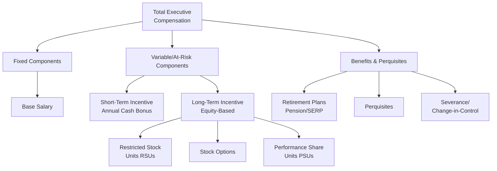
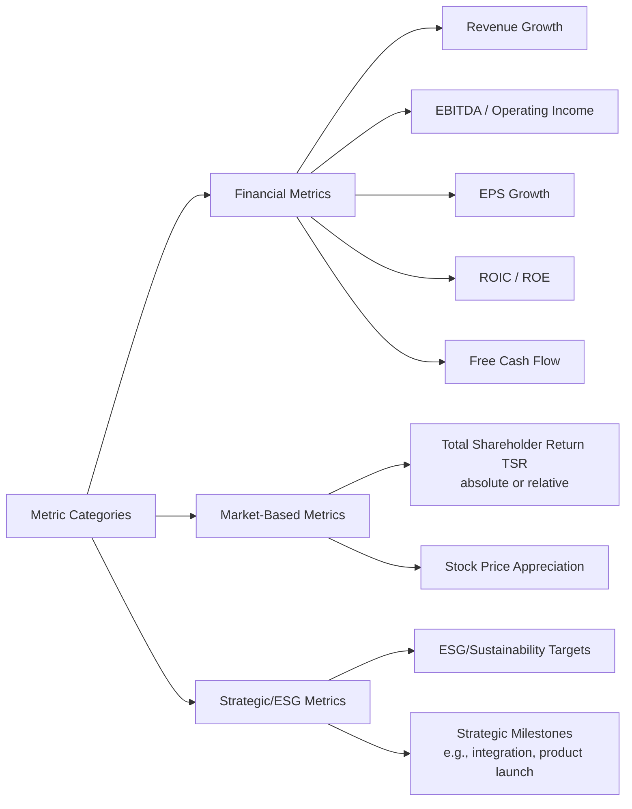
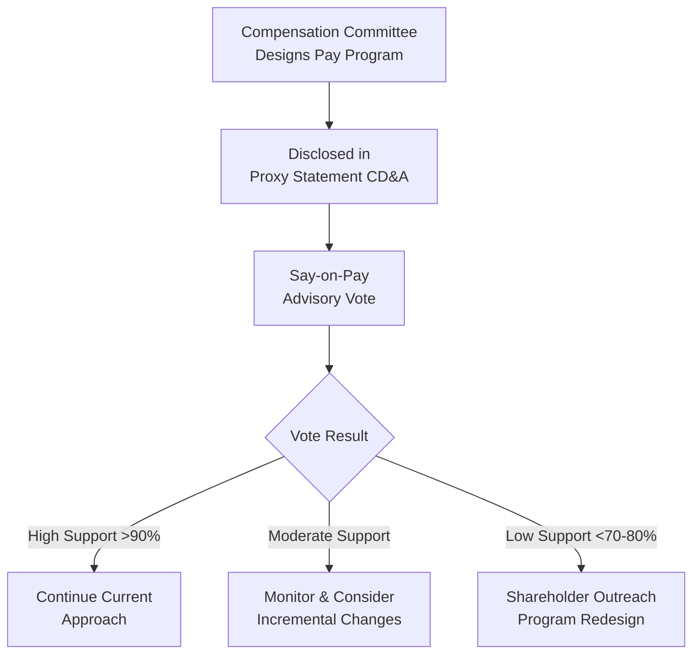
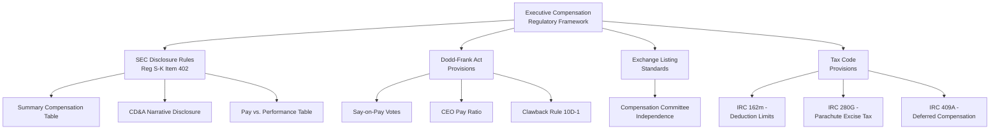

## Executive Compensation Design

### Overview

Executive compensation design is the process of structuring pay packages for senior executives to align management incentives with shareholder value creation while managing risk, ensuring competitiveness in the talent market, and satisfying regulatory and disclosure requirements. The Compensation Committee of the board holds primary design authority, typically supported by independent compensation consultants.

### Core Objectives

- **Alignment**: Link pay to performance metrics that correlate with long-term value creation
- **Retention**: Ensure packages are competitive enough to retain key talent
- **Risk management**: Avoid incentive structures that encourage excessive risk-taking
- **Pay-for-performance**: Demonstrate a credible relationship between realized pay and company performance to shareholders and proxy advisors

### Components of Total Compensation

#### Base Salary

- Fixed cash compensation, generally the smallest component of total pay for large-cap CEOs relative to variable pay
- Typically benchmarked against a **peer group** of comparably sized companies in similar industries
- Annual increases usually modest, reviewed against market movement and individual performance

#### Short-Term Incentives (STI) / Annual Bonus

- Cash award tied to annual performance, typically measured against financial metrics (revenue, EBITDA, EPS) and sometimes strategic/individual objectives
- Structured with a **threshold–target–maximum** payout curve

$$\text{Bonus Payout} = \text{Target Bonus} \times \text{Payout Multiplier}(\text{Performance})$$

Where the payout multiplier is typically 0% below threshold performance, 100% at target, and capped (commonly 150–200% of target) at maximum performance.

**Example**

| Performance Level | EBITDA Achievement | Payout % of Target |
| --- | --- | --- |
| Below Threshold | <90% of target | 0% |
| Threshold | 90% of target | 50% |
| Target | 100% of target | 100% |
| Maximum | ≥120% of target | 200% (capped) |

#### Long-Term Incentives (LTI)

LTI is generally the largest component of senior executive pay at public companies and is the primary mechanism for aligning management with shareholder interests over a multi-year horizon.

| Instrument | Mechanism | Alignment Strength | Common Vesting |
| --- | --- | --- | --- |
| Stock Options | Right to buy shares at a fixed strike price | Strong upside alignment; no value if stock falls below strike | 3–4 years, often with cliff + ratable vesting |
| Restricted Stock Units (RSUs) | Grant of shares vesting over time, no purchase required | Moderate — retains value even in flat/declining markets | 3–4 years ratable or cliff |
| Performance Share Units (PSUs) | Shares earned based on achievement of multi-year performance metrics | Strongest performance alignment | 3-year performance period, cliff vest |

**Key Points**

- **Stock options** provide leveraged upside but zero value if the stock price falls below the strike price, which can create asymmetric risk incentives.
- **RSUs** deliver more predictable retention value since they retain worth even in a flat or declining stock environment, making them useful for retention-focused grants.
- **PSUs** have become the dominant LTI vehicle among large-cap US companies over the past decade, reflecting proxy advisor and investor pressure for stronger pay-for-performance linkage. [Inference] This trend is well-documented in compensation survey data (e.g., from Equilar, ISS, Meridian Compensation Partners), though exact mix percentages vary by year, sector, and company size.

### Performance Metric Selection

**Key Points**

- **Relative TSR (rTSR)** compares company stock performance against a peer group or index over the performance period, isolating company-specific performance from broad market movements.
- Using a **single metric** creates simplicity but risks gaming; using **too many metrics** dilutes focus and clarity. [Inference] Governance practitioners commonly recommend 2–4 metrics for balance, though this is a design heuristic rather than a fixed rule.
- ESG-linked metrics have grown in prevalence, though their weighting in incentive plans and rigor of target-setting vary substantially by company and jurisdiction. [Unverified — adoption rates and design quality are actively debated and evolving.]

### CEO Pay Ratio and Benchmarking

$$\text{CEO Pay Ratio} = \frac{\text{CEO Total Annual Compensation}}{\text{Median Employee Total Annual Compensation}}$$

- Required disclosure for US public companies under Dodd-Frank Act Section 953(b) and implementing SEC rules (Item 402(u) of Regulation S-K)
- Companies select a benchmarking **peer group** (typically 15–20 companies of similar size/industry) reviewed periodically by the compensation committee and validated against ISS/Glass Lewis peer group methodologies

### Say-on-Pay and Shareholder Engagement

- **Say-on-pay** is a non-binding advisory shareholder vote on executive compensation, required at least every 3 years for US public companies (annually at most large-caps, per shareholder frequency votes) under Dodd-Frank
- Low say-on-pay support (commonly below 70–80%, though thresholds are company/context-specific) typically triggers proactive shareholder engagement and CD&A ("Compensation Discussion and Analysis") disclosure explaining responsive changes
- The **CD&A** section of the proxy statement is the primary disclosure vehicle explaining compensation philosophy, metric selection, and payout outcomes

### Clawback Policies

- Mandatory under Dodd-Frank Act Section 954 and SEC Rule 10D-1 (effective for listed companies via exchange listing standards adopted 2023): requires recovery of erroneously awarded incentive compensation following an accounting restatement, applied on a **no-fault basis** (misconduct is not required to trigger clawback)
- Distinguished from earlier, narrower Sarbanes-Oxley Section 304 clawback provisions, which applied only to CEO/CFO and required misconduct-related restatements

**Key Points**

- The Dodd-Frank/Rule 10D-1 clawback regime applies to **current and former executive officers**, not just the CEO/CFO.
- Clawback applies to incentive-based compensation received during the 3 fiscal years preceding the restatement determination date.

### Severance and Change-in-Control Provisions

| Provision | Description |
| --- | --- |
| Single-trigger | Severance/acceleration paid upon change-in-control alone |
| Double-trigger | Requires both a change-in-control AND subsequent termination (or constructive termination) to trigger payment |
| Golden parachute | Severance package for senior executives upon change-in-control-related termination |
| Excise tax gross-up | Company reimburses executive for excise taxes on parachute payments (IRC Section 280G) |

**Key Points**

- **Double-trigger** provisions have become the predominant market standard, as they are viewed as better aligned with shareholder interests than single-trigger arrangements (which can incentivize executives to support a deal regardless of merit).
- **Excise tax gross-ups** have become largely uncommon among large-cap companies due to sustained shareholder and proxy advisor opposition. [Inference] This shift is well-documented in governance survey data, though exact prevalence figures vary by year and data source.

### Regulatory and Disclosure Framework Summary

**Key Points**

- **IRC Section 162(m)** limits the tax deductibility of compensation paid to certain "covered employees" above $1 million annually; the Tax Cuts and Jobs Act (2017) eliminated the prior performance-based compensation exception, broadening the limitation's reach.
- **IRC Section 409A** governs nonqualified deferred compensation, imposing strict rules on timing of deferral elections and distributions, with significant tax penalties for noncompliance.
- The **Pay vs. Performance** table (SEC rule effective for fiscal 2022 proxy disclosures) requires companies to disclose "compensation actually paid" alongside company TSR, peer group TSR, net income, and a company-selected financial performance measure.

### Common Design Pitfalls

**Key Points**

- **Metric misalignment**: Incentivizing short-term metrics (e.g., quarterly EPS) at the expense of long-term value creation
- **Excessive complexity**: Overlapping metrics across STI and LTI plans that obscure genuine pay-for-performance linkage
- **Peer group manipulation**: Selecting benchmarking peers that skew compensation upward without genuine comparability
- **Weak goal-setting rigor**: Setting threshold/target/maximum levels too easily achievable, undermining incentive integrity
- **Insufficient stock ownership requirements**: Failing to require executives to hold meaningful equity positions, weakening long-term alignment

### Stock Ownership Guidelines

A common complementary governance mechanism requiring executives to maintain a minimum equity stake, typically expressed as a multiple of base salary:

**Example**

| Role | Typical Ownership Requirement |
| --- | --- |
| CEO | 5–6x base salary |
| Other NEOs (Named Executive Officers) | 1–3x base salary |
| Non-employee Directors | 3–5x annual cash retainer |

[Inference] These multiples reflect commonly observed market practice ranges reported in compensation surveys; specific requirements vary considerably by company size, industry, and governance philosophy.

**Related Topics**

- Board composition and structure
- Say-on-pay shareholder proposals and engagement strategy
- Equity compensation accounting (ASC 718)
- Compensation committee governance and consultant independence
- ESG-linked incentive design
- Golden parachute tax treatment (IRC 280G)
- Pay-for-performance alignment analysis
- Deferred compensation plan design (IRC 409A compliance)