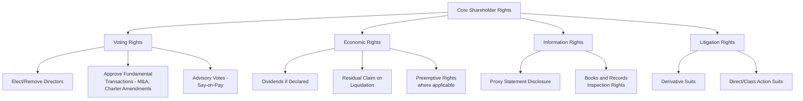
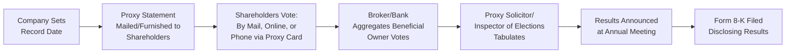
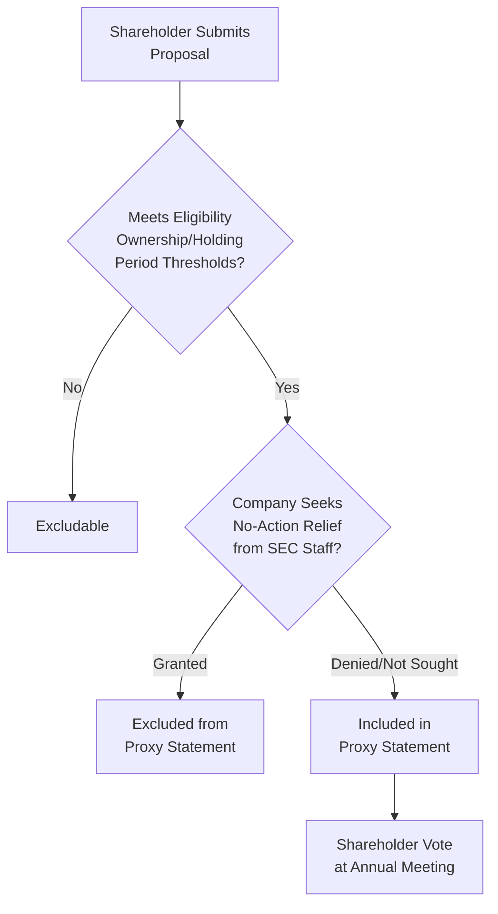
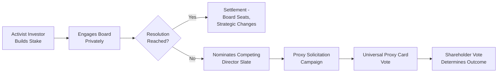
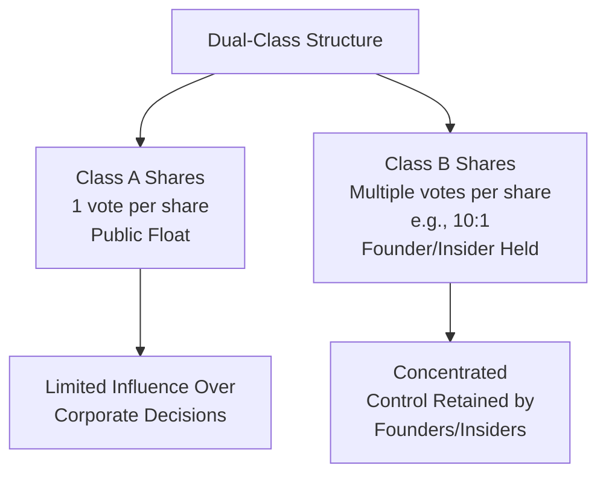

## Shareholder Rights and Proxy Voting

### Overview

Shareholder rights and proxy voting form the mechanism by which equity owners exercise control over corporate decisions despite the separation of ownership and management inherent in the modern public corporation. These rights are grounded in corporate law (state law in the US, primarily Delaware General Corporation Law for most large public companies), federal securities regulation (SEC proxy rules under the Securities Exchange Act of 1934), and exchange listing standards.

### Foundational Shareholder Rights

#### Voting Rights

- **Director elections**: The primary recurring shareholder vote; conducted under either plurality or majority voting standards
- **Fundamental transaction approval**: Mergers, sales of substantially all assets, dissolutions, and charter amendments typically require shareholder approval under state corporate law
- **Advisory votes**: Say-on-pay, say-on-frequency, and (for certain proposals) say-on-golden-parachutes

#### Economic Rights

- Right to receive dividends **if and when declared** by the board (not a guaranteed entitlement — boards retain discretion)
- Residual claim on assets in liquidation, subordinate to creditors and preferred shareholders
- **Preemptive rights**: The right to maintain proportional ownership by purchasing shares in future issuances before external investors — increasingly rare in modern US public company charters but more common in venture-backed private companies and some international jurisdictions

### Voting Standards for Director Elections

| Standard | Mechanism | Effect |
| --- | --- | --- |
| Plurality voting | Directors elected with the most "for" votes win, regardless of "withhold" votes | A single unopposed nominee is elected even with only one "for" vote |
| Majority voting | Directors must receive a majority of votes cast to be elected | An unopposed nominee failing to win majority support must submit a resignation for board consideration |
| Majority voting with plurality carve-out | Majority standard in uncontested elections; plurality standard in contested elections | Most common hybrid approach for large-cap US companies |

**Key Points**

- **Majority voting** has become the predominant standard among large-cap US public companies, reflecting sustained governance advocacy for stronger director accountability. [Inference] This shift is well-documented in governance survey data (e.g., from Institutional Shareholder Services, Harvard Law School Forum on Corporate Governance), though exact adoption percentages vary by data source and year.
- Under majority voting regimes, a director who fails to receive majority support in an uncontested election is typically required to **tender a resignation**, which the board's nominating/governance committee then evaluates — the resignation is not automatically effective.

### The Proxy Voting Mechanism

- **Record date**: The date determining which shareholders are entitled to vote; only holders of record on this date may vote, regardless of subsequent share transfers
- **Proxy statement**: The primary disclosure document (SEC Schedule 14A) sent to shareholders ahead of the annual meeting, containing director nominee information, compensation disclosure (CD&A), and proposals to be voted on
- **Street name ownership**: Most retail shares are held in "street name" through brokers, requiring a chain of voting instruction from beneficial owner → broker → tabulator

$$\text{Quorum} = \frac{\text{Shares Present or Represented by Proxy}}{\text{Total Shares Outstanding and Entitled to Vote}} \geq \text{Quorum Threshold}$$

Quorum thresholds are set by corporate bylaws, commonly a majority of outstanding shares, though this varies by company.

### Record Holders vs. Beneficial Owners

| Type | Description | Voting Mechanism |
| --- | --- | --- |
| Registered/Record holder | Shares held directly in the shareholder's own name | Votes directly via proxy card |
| Beneficial owner (street name) | Shares held through a broker/bank in the broker's name | Votes via voting instruction form (VIF) relayed through the broker |

**Key Points**

- **Broker non-votes** occur when a broker holds shares in street name but does not receive voting instructions from the beneficial owner and lacks discretionary authority to vote on a given matter.
- Under NYSE rules, brokers retain discretionary voting authority only on designated "routine" matters (e.g., ratification of the independent auditor); "non-routine" matters (director elections, say-on-pay, most shareholder proposals) require explicit instructions, and uninstructed shares become broker non-votes.

### Types of Shareholder Meetings

- **Annual meeting**: Required under state law and stock exchange rules; primary venue for director elections and routine business
- **Special meeting**: Called to address specific matters outside the annual cycle (e.g., a merger vote); ability to call special meetings is governed by charter/bylaw provisions and varies significantly by company
- **Virtual/hybrid meetings**: Conducted online or combining in-person and virtual attendance, a practice that expanded significantly following the COVID-19 pandemic

### Shareholder Proposals (SEC Rule 14a-8)

- SEC Rule 14a-8 allows eligible shareholders to submit proposals for inclusion in the company's proxy statement, subject to ownership and holding-period thresholds and a word-count limit
- Companies may exclude proposals on enumerated grounds (e.g., ordinary business operations, already substantially implemented, conflicts with company's own proposal) by seeking a **no-action letter** from SEC staff
- Common proposal topics include executive compensation limits, environmental/social policy requests, governance structural changes (e.g., declassifying the board, eliminating supermajority voting requirements), and political spending disclosure

**Key Points**

- Shareholder proposals under Rule 14a-8 are typically **precatory (non-binding)**, meaning management is not legally required to implement even a majority-supported proposal, though boards face reputational and governance pressure to respond.
- Eligibility thresholds and holding periods have been subject to periodic SEC rule amendments; specific current thresholds should be verified against the most recent SEC rule text, as they have changed over time. [Unverified — regulatory thresholds are subject to change and should be confirmed against current SEC rules.]

### Proxy Contests and Activist Campaigns

- **Proxy contest**: An activist or dissident shareholder solicits votes for an alternative slate of director nominees or against management proposals
- **Universal proxy rules** (SEC rules effective 2022): Require both company and dissident proxy cards to list all director nominees from both sides, allowing shareholders to "mix and match" votes across slates rather than being forced to choose one full slate — a significant change from the prior bifurcated-card system
- **Poison pills (shareholder rights plans)**: Defensive mechanisms triggered by an acquirer crossing an ownership threshold, diluting the acquirer's stake; subject to board fiduciary duty scrutiny under case law such as *Unocal v. Mesa Petroleum*

### Say-on-Pay and Advisory Votes

- **Say-on-pay**: Non-binding advisory vote on named executive officer compensation, required at least triennially for US public companies under Dodd-Frank; most large companies hold this vote annually based on shareholder frequency preference votes
- **Say-on-frequency**: A vote (required at least every 6 years) on how often say-on-pay votes should occur (1, 2, or 3 years)
- **Say-on-golden-parachutes**: A separate advisory vote required in connection with merger transactions, addressing golden parachute arrangements for named executive officers tied to the specific transaction

### Litigation Rights

| Right | Description |
| --- | --- |
| Derivative suit | Shareholder sues on behalf of the corporation for harm to the company (e.g., breach of fiduciary duty by directors); recovery typically flows to the corporation, not the individual plaintiff |
| Direct/class action suit | Shareholder sues for harm suffered directly and individually (e.g., securities fraud under Rule 10b-5), often as a class action on behalf of similarly situated shareholders |
| Appraisal rights | In certain merger transactions, dissenting shareholders may seek judicial determination of "fair value" for their shares rather than accepting the merger consideration |

**Key Points**

- Derivative suits typically require the plaintiff to first make a **demand** on the board to pursue the claim, or plead with particularity why demand would be futile (demand futility), under standards such as Delaware's *Aronson* and *Zapata* frameworks.
- **Appraisal rights** (e.g., under Delaware General Corporation Law Section 262) provide a statutory remedy for shareholders who believe merger consideration undervalues their shares, though exercising these rights involves procedural requirements and litigation risk/cost.

### Dual-Class Share Structures and Voting Power Concentration

**Key Points**

- Dual-class structures allow founders/insiders to raise public capital while retaining voting control disproportionate to their economic ownership.
- Governance advocates and some index providers (e.g., certain S&P Dow Jones Indices policies) have restricted or excluded companies with extreme dual-class structures from flagship indices, reflecting investor concern over accountability. [Inference] Specific index eligibility rules have evolved over time and vary by index provider; current criteria should be verified directly against the relevant index provider's methodology documentation.
- Many dual-class structures include **sunset provisions** — automatic conversion to single-class structure after a specified time period or triggering event (e.g., founder departure) — increasingly favored by governance advocates as a compromise mechanism.

### Institutional Investor Voting and Stewardship

- Large institutional investors (index funds, pension funds, asset managers) exercise outsized influence given concentrated ownership stakes across the market
- Many maintain **stewardship/voting policies** disclosing how they approach votes on director elections, compensation, and shareholder proposals
- **Proxy advisory firms** (ISS, Glass Lewis) issue vote recommendations that meaningfully influence outcomes, particularly among institutional investors who reference or follow these recommendations

### Common Pitfalls and Governance Tensions

**Key Points**

- **Rational shareholder apathy**: Individual retail shareholders often have limited incentive to research and vote given diffuse ownership and low per-share stakes, contributing to low retail participation rates
- **Broker non-vote impact**: Failure to instruct brokers on non-routine matters effectively removes a shareholder's voice from votes requiring active instruction
- **Overreliance on proxy advisor recommendations**: Concerns exist regarding institutional investors' degree of reliance on ISS/Glass Lewis recommendations versus independent analysis
- **Dual-class structure entrenchment**: Extended or permanent dual-class structures without sunset provisions can insulate management from accountability indefinitely

**Related Topics**

- Board composition and structure
- Executive compensation design
- Fiduciary duties of directors (duty of care, duty of loyalty)
- Shareholder activism and hedge fund campaigns
- Delaware corporate law and case law foundations (Unocal, Revlon, Aronson)
- ESG shareholder proposals and engagement trends
- Universal proxy card mechanics
- Appraisal rights and merger litigation