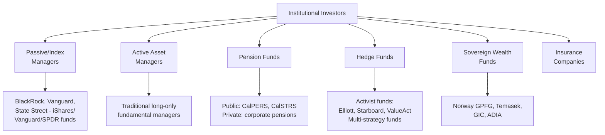
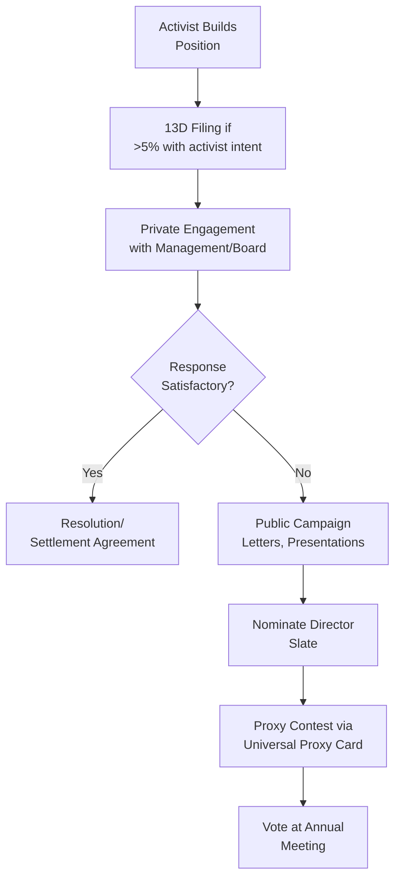
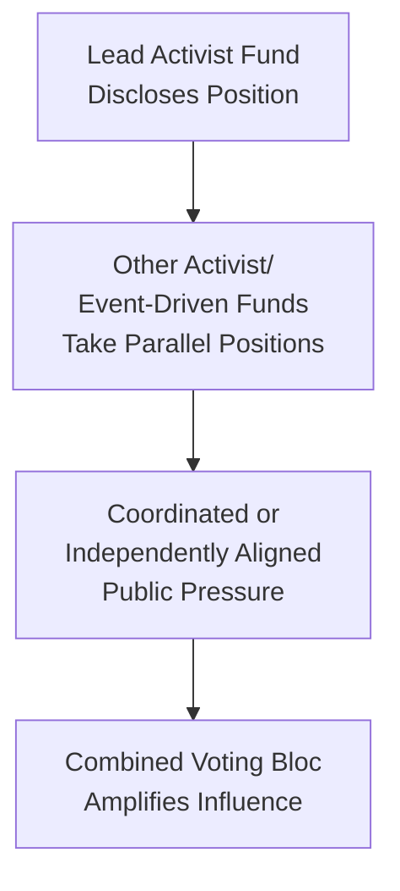
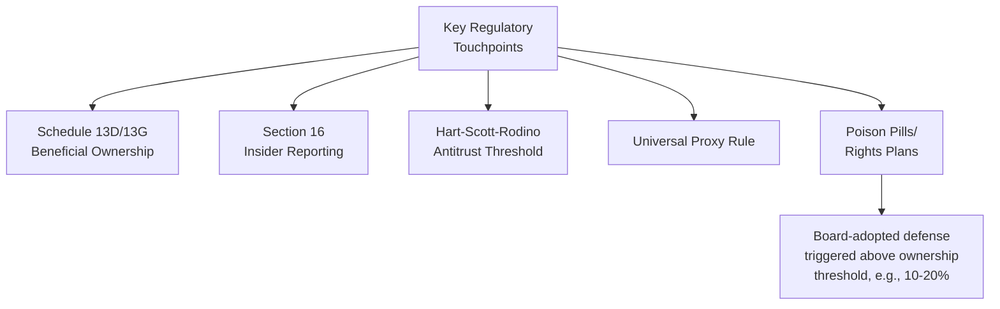

## Institutional Investors and Shareholder Activism

### Overview

Institutional investors — entities that pool and invest capital on behalf of others (pension funds, mutual funds, hedge funds, insurance companies, sovereign wealth funds, endowments) — collectively hold the majority of public equity in most developed markets and are therefore central actors in corporate governance. Shareholder activism refers to the range of tactics these investors (and sometimes individuals) use to influence corporate strategy, capital allocation, governance, or operations, spanning a spectrum from quiet private engagement to public proxy contests.

### Types of Institutional Investors

**Key Points**

- **Passive/index managers** hold positions across nearly all constituents of an index and cannot easily "vote with their feet" by selling, giving them a structural incentive toward long-term engagement rather than exit — often termed "voice over exit."
- **Active managers** can sell underperforming positions, giving them more flexibility to exit rather than engage, though many maintain active stewardship programs regardless.
- **Activist hedge funds** typically take concentrated minority stakes with the explicit intent of pushing for change, differentiating them from passive/index holders who engage more broadly across large portfolios.
- **Public pension funds** (e.g., large state retirement systems) have historically been prominent voices in governance reform advocacy, given their long investment horizons and public accountability.

### The Rise of Passive Ownership and the "Big Three"

$$\text{Combined Ownership \%} = \sum_{i=1}^{3} \frac{\text{Shares Held by Manager}_i}{\text{Total Shares Outstanding}}$$

**Key Points**

- BlackRock, Vanguard, and State Street (collectively often called the "Big Three") have become among the largest shareholders at a substantial share of large-cap US public companies through their index fund businesses. [Inference] Precise aggregate ownership percentages are cited variably across academic and financial press sources and shift over time with fund flows; specific current figures should be verified against recent public disclosures (e.g., Schedule 13G filings) rather than assumed static.
- This concentration has generated academic and regulatory debate over "common ownership" effects — the theory that overlapping ownership across competing firms in the same industry could theoretically soften competitive incentives. [Unverified — this remains a genuinely disputed empirical question in financial economics literature, with studies reaching mixed conclusions.]
- Because passive managers cannot exit positions easily, their stewardship teams and voting policies have become increasingly influential in shaping governance norms across the market.

### Forms of Shareholder Engagement

**Key Points**

- Most institutional engagement occurs privately and is never publicly disclosed — public activism campaigns represent a small, visible fraction of total shareholder engagement activity.
- Private engagement is generally preferred by both companies and large institutional holders as a lower-cost, lower-conflict mechanism to resolve concerns before they escalate.
- Escalation typically follows unsuccessful private engagement, moving through public pressure, formal proposals, and ultimately proxy contests if concerns remain unaddressed.

### Activist Investor Playbook

**Key Points**

- **Schedule 13D**: Required SEC filing within 10 days (under current rules) of acquiring beneficial ownership exceeding 5% of a class of registered equity securities with an intent to influence control — distinguished from **Schedule 13G**, a shorter form for passive investors without control intent.
- Common activist thesis categories include: capital allocation critique (excess cash, buyback/dividend policy), operational underperformance, portfolio/conglomerate breakup ("sum-of-the-parts" arguments), M&A opposition or advocacy, and governance reform (board refreshment, leadership change).
- **Settlement agreements** are a common outcome, where the company agrees to board seats, governance changes, or strategic actions in exchange for the activist standing down a proxy contest — avoiding the cost and uncertainty of a full vote.

### Common Activist Thesis Types

| Thesis Type | Description | Typical Ask |
| --- | --- | --- |
| Capital allocation | Company holds excess cash or under-returns capital | Increase buybacks/dividends |
| Operational | Margins/efficiency lag peers | Cost cutting, management change |
| Strategic/portfolio | Conglomerate discount, unrelated business lines | Spin-off, divestiture, breakup |
| M&A-related | Company pursuing or resisting a deal | Block/support transaction, seek higher price |
| Governance | Weak oversight, entrenched board | Board refreshment, declassification |

**Example**

An activist fund building a 7% stake in a multi-division industrial conglomerate might argue the market is undervaluing the sum of the parts relative to focused pure-play peers, publicly advocating for a spin-off of a non-core division to unlock value — a common "sum-of-the-parts" activist thesis structure.

### Institutional Stewardship Codes

Formal frameworks guiding how institutional investors exercise ownership responsibilities.

**Key Points**

- **UK Stewardship Code** (administered by the Financial Reporting Council) sets out principles for effective stewardship that signatory asset managers and asset owners report against, on an "apply and explain" basis.
- Similar stewardship codes and principles exist in other jurisdictions (e.g., Japan's Stewardship Code, various EU member state frameworks), generally emphasizing engagement, voting transparency, and escalation policies. [Inference] Specific code requirements and signatory obligations vary by jurisdiction and are periodically revised; current requirements should be verified against the relevant regulator's latest published code.
- In the US, no single unified statutory stewardship code exists at the federal level; stewardship practices are largely shaped by individual asset manager policies, ERISA fiduciary obligations for pension fiduciaries, and SEC proxy voting disclosure rules (e.g., Form N-PX for registered funds).

### Wolf Pack Activism

- Refers to a pattern where multiple activist or event-driven funds independently (or through loosely coordinated, legally cautious communication) build positions in the same target following a lead activist's public disclosure, amplifying collective pressure without necessarily forming a formal "group" under securities law (which would trigger different aggregated disclosure obligations)
- Raises regulatory and disclosure questions around the definition of a "group" under Section 13(d) of the Exchange Act, since formal groups face stricter aggregated reporting requirements

### ESG and Values-Based Activism

Distinguished from traditional financial/operational activism, though sometimes overlapping in the same campaign.

| Type | Focus | Example Tactics |
| --- | --- | --- |
| Financial activism | Value creation via capital allocation/operations | Buybacks, spin-offs, M&A |
| Governance activism | Board accountability, structure | Declassification, independent chair |
| ESG/climate activism | Environmental and social policy | Climate risk disclosure proposals, board nominees with climate expertise |

**Key Points**

- A notable example of ESG-focused activism achieving traditional proxy contest success was Engine No. 1's 2021 campaign at ExxonMobil, where the small activist fund won board seats on a climate-strategy platform with support from major index fund stewardship teams. [Inference] This is a widely reported case in financial press coverage of shareholder activism; specific vote tallies and subsequent developments should be verified against primary sources for precision.
- ESG shareholder proposal volume and support levels have fluctuated significantly across proxy seasons, reflecting shifting investor sentiment and, at times, political and regulatory countercurrents. [Unverified — trend direction is actively contested and varies by year, region, and proposal category; treat any specific trend claim as time-sensitive.]

### Regulatory Framework Governing Activism

**Key Points**

- **Poison pills** (shareholder rights plans) are a common board-level defensive tool, diluting an acquirer's stake if ownership crosses a specified threshold without board approval — companies sometimes adopt these rapidly in response to activist accumulation, particularly during periods of depressed stock prices.
- **HSR Act filing thresholds** can apply even to activist stake-building above certain size thresholds, requiring antitrust notification even without an intent to acquire control, following SEC/FTC guidance clarifications.
- The **universal proxy rule** (effective September 2022) reshaped activist campaign dynamics by allowing shareholders to vote for a mix of management and dissident nominees on one card, generally seen as lowering the practical barrier to voting for at least some dissident nominees.

### Measuring Activist Campaign Outcomes

$$\text{Campaign Success Rate} = \frac{\text{Campaigns Achieving Stated Objective}}{\text{Total Campaigns Launched}}$$

**Key Points**

- Common outcome metrics tracked by activism research firms include: board seats won, settlement rate (vs. going to a full vote), stock price reaction around campaign announcement, and subsequent operational/strategic changes.
- [Inference] Academic studies on activist campaign outcomes (e.g., research examining hedge fund activism) have generally found short-term positive abnormal stock returns around campaign announcements, though findings on long-term operating performance impact are more mixed and remain an active area of research debate. [Unverified — long-term causal impact of activism on firm performance is genuinely disputed in the academic literature.]

### Common Critiques and Counterarguments

**Key Points**

- **Short-termism critique**: Critics argue activist pressure can push management toward short-term stock-boosting actions (buybacks, cost cuts) at the expense of long-term investment (e.g., R&D).
- **Defender view**: Proponents argue activism disciplines underperforming or entrenched management and surfaces value that would otherwise remain trapped, benefiting all shareholders including long-term holders.
- **Empirical debate**: This remains a genuinely contested area of financial economics research without clear consensus, with study findings varying by methodology, time period, and campaign type. [Unverified]
- **Passive investor influence critique**: Some policymakers and academics have raised concerns about the concentration of voting power among a small number of large index managers, questioning whether their scale of influence over corporate governance across the whole market is appropriate given limited direct capital-at-risk relative to the companies they influence. [Unverified — this is an active, unresolved policy debate.]

**Related Topics**

- Shareholder rights and proxy voting
- Board composition and structure
- Executive compensation design
- Poison pills and takeover defenses
- ESG investing and stewardship codes
- Common ownership theory in industrial organization
- Dual-class share structures
- Corporate spin-offs and divestitures