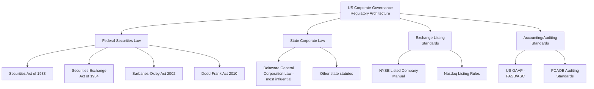
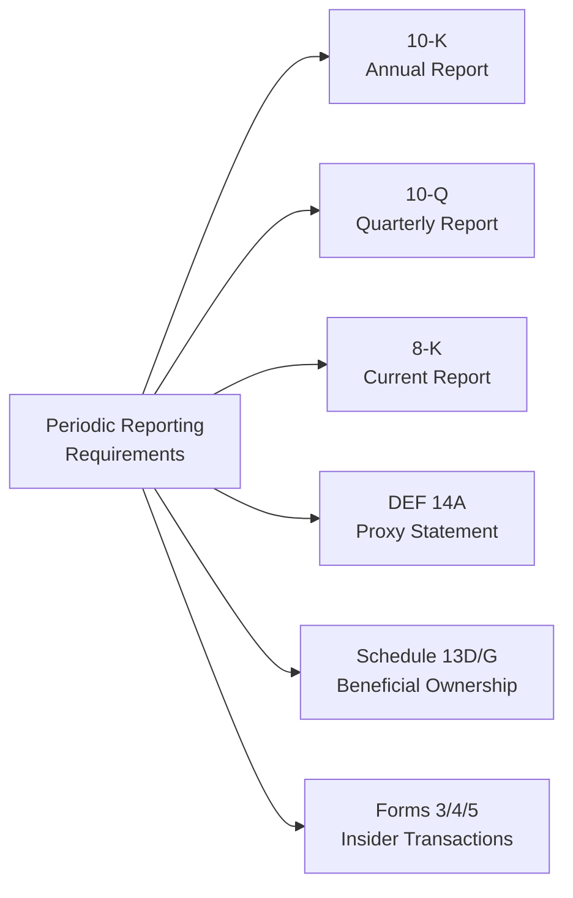
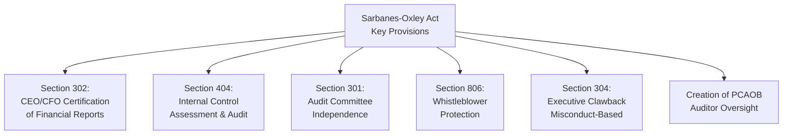
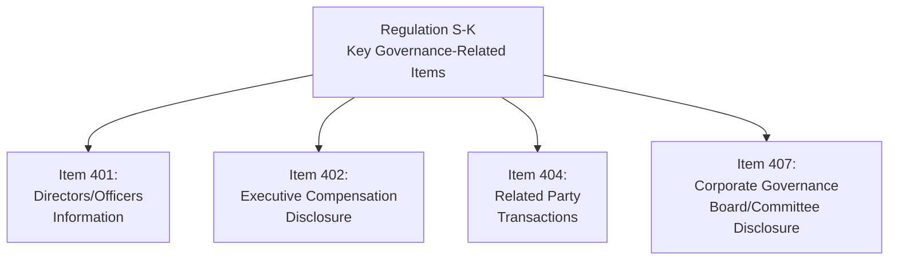
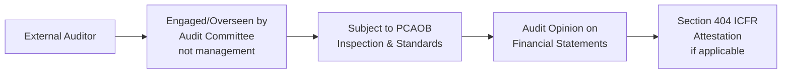
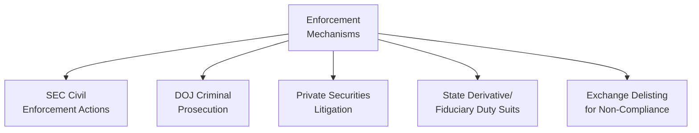

## Governance Regulation and Disclosure Requirements

### Overview

Governance regulation and disclosure requirements comprise the body of statutory law, administrative rules, and exchange listing standards that mandate how public companies structure their governance and disclose information to shareholders and regulators. These frameworks aim to reduce information asymmetry between management/insiders and outside investors, deter fraud and self-dealing, and establish baseline governance practices considered essential to functioning capital markets.

### Regulatory Architecture (US-Centric View)

**Key Points**

- **Federal securities law** primarily governs disclosure — what companies must tell investors and when — rather than substantive corporate governance matters (board structure, fiduciary duties), which are traditionally governed by state law.
- **Delaware corporate law** is disproportionately influential because a majority of large US public companies are incorporated there, given its well-developed body of case law (particularly from the Delaware Court of Chancery) and generally management-friendly, flexible statutory framework.
- **Exchange listing standards** (NYSE, Nasdaq) impose governance requirements (e.g., board independence, committee composition) as a condition of maintaining a listing, functioning as a quasi-regulatory layer distinct from SEC rules.

### Securities Exchange Act of 1934 — Core Disclosure Obligations

| Filing | Purpose | Typical Trigger/Frequency |
| --- | --- | --- |
| Form 10-K | Comprehensive annual report including audited financials | Annual |
| Form 10-Q | Unaudited quarterly financial update | Quarterly (3 per fiscal year) |
| Form 8-K | Disclosure of material events | Within 4 business days of triggering event |
| Schedule DEF 14A | Proxy statement for shareholder votes | Ahead of annual/special meetings |
| Schedule 13D/13G | Beneficial ownership disclosure above 5% threshold | Within set days of crossing threshold |
| Forms 3/4/5 | Insider (officer/director/10%+ holder) transaction reporting | Form 4 generally within 2 business days of transaction |

**Key Points**

- **Form 8-K** triggering events include material agreements, executive/director departures or appointments, bankruptcy, delisting notices, and shareholder vote results, among others enumerated in the form's specific items.
- **Regulation FD (Fair Disclosure)** prohibits selective disclosure of material nonpublic information to select investors/analysts without simultaneous broad public disclosure, addressing a specific information-asymmetry concern distinct from periodic reporting.

### Sarbanes-Oxley Act (2002)

Enacted in response to the Enron and WorldCom accounting scandals, SOX significantly expanded governance and internal control requirements for US public companies.

**Key Points**

- **Section 302** requires CEOs and CFOs to personally certify the accuracy of financial statements and the effectiveness of disclosure controls in each periodic report.
- **Section 404** requires management to assess and report on internal control over financial reporting (ICFR) effectiveness, with an independent auditor attestation required for larger companies ("accelerated filers" and above); smaller reporting companies are exempt from the auditor attestation requirement under later amendments (Dodd-Frank Section 989G).
- **Section 301** mandates that audit committees be composed entirely of independent directors and directly responsible for appointing, compensating, and overseeing the external auditor.
- The **PCAOB (Public Company Accounting Oversight Board)** was created by SOX to oversee audits of public companies, replacing prior self-regulation by the accounting profession.

### Dodd-Frank Wall Street Reform and Consumer Protection Act (2010)

Enacted following the 2008 financial crisis, with several provisions specifically targeting executive compensation and shareholder rights governance.

| Provision | Requirement |
| --- | --- |
| Section 951 | Say-on-pay and say-on-frequency advisory votes |
| Section 953(b) | CEO pay ratio disclosure |
| Section 954 | Mandatory incentive compensation clawback (no-fault, via Rule 10D-1) |
| Section 955 | Disclosure of hedging policies for employees/directors |
| Section 972 | Disclosure of board leadership structure rationale (why combined or separate CEO/Chair) |

**Key Points**

- Dodd-Frank's compensation-related provisions were implemented through subsequent SEC rulemaking over an extended period, with the clawback rule (Rule 10D-1) not finalized and fully effective via exchange listing standards until 2023 — illustrating that statutory passage and final implementing rule effectiveness can be separated by many years.

### Regulation S-K — Core Disclosure Content Requirements

**Key Points**

- **Item 402** governs the detailed executive compensation tables and CD&A narrative required in proxy statements.
- **Item 404** requires disclosure of related-party transactions above specified materiality thresholds, addressing conflict-of-interest concerns.
- **Item 407** requires disclosure of board leadership structure, director independence determinations, committee membership/charters, and risk oversight practices.

### Auditor Independence and Oversight

**Key Points**

- SOX prohibits auditors from providing certain non-audit services (e.g., bookkeeping, certain consulting) to audit clients simultaneously, to reduce conflicts of interest that could compromise independence.
- **Audit partner rotation** requirements (typically every 5 years for the lead engagement partner) aim to maintain auditor independence over long client relationships.
- The PCAOB conducts periodic inspections of registered audit firms and can impose sanctions for quality control deficiencies.

### Say-on-Pay and Related Governance Votes (Regulatory Summary)

$$\text{Advisory Vote Cycle} \in \{1, 2, 3\} \text{ years, per shareholder frequency vote}$$

- Companies must hold a **say-on-frequency** vote (at least every 6 years) allowing shareholders to indicate their preference for how often say-on-pay votes should occur (annually, biennially, or triennially)
- Annual say-on-pay has become the predominant practice among large-cap US companies. [Inference] This is well-documented in governance survey data, though exact current prevalence figures vary by data source and year.

### International Governance Disclosure Frameworks (Comparative Note)

| Jurisdiction | Key Framework | Approach |
| --- | --- | --- |
| UK | UK Corporate Governance Code | "Comply or explain" — not strictly mandatory, but deviations must be disclosed and justified |
| EU | Shareholder Rights Directive II (SRD II) | Mandates say-on-pay, related-party transaction disclosure, institutional investor engagement transparency |
| Japan | Corporate Governance Code (Financial Services Agency/TSE) | "Comply or explain" model influenced by UK approach |
| US | SEC rules + exchange listing standards | More prescriptive, rules-based approach relative to "comply or explain" jurisdictions |

**Key Points**

- **"Comply or explain"** is a principles-based regulatory approach (predominant in the UK and influential internationally) where companies are not strictly required to follow every code provision but must publicly explain deviations, contrasting with the more rules-based US approach.
- Regulatory convergence and divergence across jurisdictions is an ongoing dynamic, particularly around ESG/sustainability disclosure mandates. [Unverified — this area is under active and rapid regulatory development globally; specific jurisdictional requirements should be verified against current primary sources given the pace of change.]

### Emerging Disclosure Areas

**Key Points**

- **Climate/ESG disclosure rules**: Multiple jurisdictions have proposed or adopted climate-related financial disclosure requirements (e.g., following TCFD-aligned frameworks), though the scope, timeline, and legal status of specific rules (including SEC climate disclosure rulemaking) have been subject to significant regulatory and litigation uncertainty. [Unverified — this is a rapidly evolving and contested regulatory area; current status should be verified against the latest primary regulatory sources.]
- **Cybersecurity disclosure**: The SEC adopted rules (effective for fiscal years ending on or after December 15, 2023) requiring disclosure of material cybersecurity incidents (via Form 8-K Item 1.05) and annual disclosure of cybersecurity risk management and governance practices.
- **Human capital management disclosure**: SEC rules adopted in 2020 require disclosure of human capital resources material to understanding the business, though the principles-based approach affords companies flexibility in what specific metrics to disclose.

### Enforcement Mechanisms

**Key Points**

- The **SEC** brings civil enforcement actions for disclosure violations, fraud, and books-and-records violations, with remedies including fines, disgorgement, and officer/director bars.
- **Private Securities Litigation Reform Act (PSLRA)** of 1995 established heightened pleading standards and procedural safeguards for private securities fraud class actions, aiming to curb frivolous litigation.
- **Exchange delisting** is a last-resort consequence for sustained governance or disclosure non-compliance, though exchanges typically provide cure periods before delisting proceedings commence.

### Common Compliance Pitfalls

**Key Points**

- **Late or inaccurate 8-K filings** for material events, risking SEC enforcement scrutiny
- **Insufficient ICFR documentation** under Section 404, creating audit and certification risk
- **Related-party transaction disclosure gaps**, particularly for transactions that develop or change materiality over time
- **Inconsistent CD&A narrative and actual pay practices**, undermining say-on-pay credibility and inviting proxy advisor scrutiny
- **Underestimating cybersecurity disclosure materiality thresholds**, given the relative novelty and evolving interpretation of the 2023 SEC rules

**Related Topics**

- Board composition and structure
- Executive compensation design
- Shareholder rights and proxy voting
- Institutional investors and shareholder activism
- Fiduciary duties and the business judgment rule under Delaware law
- Internal controls and enterprise risk management frameworks (COSO)
- ESG and climate-related disclosure regulation
- Auditor independence and PCAOB oversight