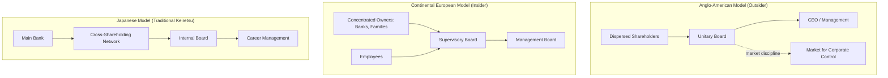

## Comparative Corporate Governance Systems

### Overview

Comparative corporate governance examines how different legal, economic, and cultural systems structure the relationships among shareholders, boards, management, and other stakeholders. The dominant framework contrasts **shareholder-oriented (outsider) systems**, typified by the US and UK, with **stakeholder-oriented (insider) systems**, typified by Germany, Japan, and much of continental Europe and East Asia. These differences shape board structure, ownership concentration, capital markets, labor relations, and the mechanisms used to discipline management.

### Core Dimensions of Comparison

Corporate governance systems are typically compared along several structural dimensions:

- **Ownership structure**: dispersed (diffuse, arm's-length shareholders) vs. concentrated (block-holders, family, state, or bank ownership)
- **Board structure**: unitary (one-tier) vs. dual (two-tier)
- **Primary control mechanism**: market for corporate control (takeovers) vs. relational monitoring (banks, cross-shareholdings, family oversight)
- **Legal origin**: common law vs. civil law (French, German, or Scandinavian)
- **Stakeholder scope**: shareholder primacy vs. codetermination/stakeholder inclusion
- **Financing pattern**: market-based (equity/bond markets) vs. bank-based (relationship lending)

**[Inference]** The legal-origins hypothesis (La Porta, Lopez-de-Silanes, Shleifer, and Vishny) argues common-law countries provide stronger minority shareholder protections than civil-law countries, which correlates with more dispersed ownership and deeper equity markets; this remains a widely cited but contested empirical claim in the literature.

### The Anglo-American (Outsider) Model

**Key Points**

- Predominant in the US and UK
- Ownership is typically dispersed across many small shareholders
- Unitary (one-tier) board structure combining executive and non-executive directors
- Strong reliance on the **market for corporate control**: hostile takeovers discipline underperforming management
- Emphasis on shareholder primacy and maximizing shareholder value
- Extensive disclosure requirements and independent auditing
- Board committees (audit, compensation, nominating) staffed largely by independent directors

**Structural Features**

- CEO and Chairman roles may be combined (common in the US) or separated (more common in the UK, per the UK Corporate Governance Code)
- Executive compensation heavily tied to equity-based incentives (stock options, restricted stock)
- Litigation and regulatory enforcement (e.g., SEC in the US) serve as key accountability mechanisms
- Proxy voting and shareholder activism (including activist hedge funds) are significant governance forces

**Example**

A US public company follows a unitary board model: the board of directors oversees the CEO and senior management, with an audit committee composed entirely of independent directors overseeing financial reporting. If the company underperforms, external shareholders can sell shares (exit) or an acquirer can launch a hostile tender offer to replace management (market for corporate control).

### The Continental European (Insider) Model

**Key Points**

- Predominant in Germany, Austria, and to varying degrees the Netherlands and Nordic countries
- Ownership is more concentrated: banks, families, and other corporations hold significant blocks
- **Two-tier (dual) board structure**: a Management Board (Vorstand) handles day-to-day operations, supervised by a Supervisory Board (Aufsichtsrat)
- **Codetermination (Mitbestimmung)**: in Germany, large companies (typically >2,000 employees) require up to 50% employee representation on the Supervisory Board
- Banks historically play a dual role as lenders and equity holders (Hausbank system), giving them both debt and equity monitoring incentives
- Weaker market for corporate control; hostile takeovers are rarer due to concentrated ownership and legal/structural defenses

**Structural Features**

- Supervisory Board appoints, monitors, and can dismiss the Management Board
- Employee co-determination gives labor a formal governance voice, distinguishing this model from shareholder-primacy systems
- Cross-shareholdings among firms and banks (historically strong in Germany, weakening since the early 2000s) reduce takeover threats
- Stakeholder interests (employees, creditors, community) are more explicitly embedded in governance objectives

**Example**

A German AG (Aktiengesellschaft) with over 2,000 employees must maintain a Supervisory Board that is (near-)equally split between shareholder representatives and employee representatives. The Supervisory Board, not shareholders directly, hires and can remove the Management Board's CEO-equivalent (Vorstandsvorsitzender).

### The Japanese (Keiretsu) Model

**Key Points**

- Historically characterized by **keiretsu** networks: groups of affiliated companies with cross-shareholdings, often centered on a main bank
- Main bank monitoring substitutes for dispersed shareholder oversight
- Lifetime employment norms and seniority-based promotion historically reduced managerial turnover pressure
- Boards traditionally composed largely of internal, career executives rather than independent directors
- Since the late 1990s/2000s corporate governance reforms (Companies Act amendments, Corporate Governance Code introduced in 2015) have pushed toward more independent directors and a "Company with Committees" structure resembling US-style audit/nominating/compensation committees

**[Inference]** The decline of cross-shareholding networks and main bank dominance since Japan's 1990s banking crisis has moved Japanese governance incrementally toward hybrid outsider-style practices, though family and institutional cross-holdings remain more prevalent than in the US/UK.

### Board Structure Comparison

| Feature | One-Tier (Unitary) | Two-Tier (Dual) |
| --- | --- | --- |
| Structure | Single board with executive + non-executive directors | Separate Management Board and Supervisory Board |
| Typical jurisdictions | US, UK, most Commonwealth countries | Germany, Austria, Netherlands (optional) |
| Executive/oversight separation | Within same board via committees | Legally separated into two bodies |
| Employee representation | Rare, usually absent | Mandatory in large German firms (codetermination) |
| CEO oversight | Board (often with separate Chairman) | Supervisory Board directly appoints/removes Management Board |

### Ownership Concentration and Agency Problems

**Key Points**

- Dispersed ownership (Anglo-American model) creates a classic **Type I agency problem**: conflict between dispersed shareholders (principals) and management (agents), addressed via independent boards, disclosure, and takeover threats
- Concentrated ownership (Continental European, Japanese, and most emerging markets) creates a **Type II agency problem**: conflict between controlling shareholders (or block-holders) and minority shareholders, addressed via minority protection rights, mandatory bid rules, and related-party transaction disclosure

$$\text{Private Benefits of Control} = V_{controlling} - V_{pro\text{-}rata}$$

Where $V_{controlling}$ is the value captured by the controlling shareholder beyond their proportional (pro-rata) claim $V_{pro\text{-}rata}$, capturing the extraction of private benefits at minority shareholders' expense.

### Legal Origins and Investor Protection

**Key Points**

- **Common law** systems (US, UK, and former British colonies) are associated with stronger judicial protection of minority shareholders and creditors
- **Civil law** systems subdivide into French, German, and Scandinavian origin, with varying degrees of investor protection
- **[Unverified]** The precise causal strength of legal origin versus other factors (political economy, historical accident, financial development) in determining investor protection quality remains actively debated in comparative finance literature
- Stronger investor protection is empirically associated with more dispersed ownership, deeper stock markets, and lower cost of equity capital

### State and Family Capitalism Variants

**Key Points**

- **State-influenced governance**: prevalent in China (state-owned enterprises with Communist Party committees embedded in governance), parts of the Middle East (sovereign wealth fund ownership), and historically in France (state golden shares)
- **Family-controlled governance**: common across emerging markets (India, Southeast Asia, Latin America) and parts of continental Europe (Italy), often using **pyramid structures** and **dual-class shares** to maintain control with reduced cash-flow ownership

$$\text{Control-to-Cash-Flow Wedge} = \frac{\text{Voting Rights (\%)}}{\text{Cash-Flow Rights (\%)}}$$

A wedge greater than 1 indicates the controlling party holds disproportionate voting power relative to their economic (cash-flow) stake, a structural feature that increases the risk of private benefit extraction.

### Convergence Debate

**Key Points**

- Some scholars (e.g., Hansmann and Kraakman's "End of History" thesis) argue global governance systems are converging toward the shareholder-primacy model due to globalized capital markets, cross-listings, and institutional investor pressure
- Others argue **path dependence** (Bebchuk and Roe) means historical ownership structures, politics, and legal institutions prevent full convergence, resulting instead in "functional convergence" — similar governance outcomes achieved through different formal structures
- **[Speculation]** The rise of large global index funds (e.g., BlackRock, Vanguard, State Street) as universal owners across markets may be creating a new hybrid governance force that operates somewhat independently of the traditional Anglo-American/Continental European dichotomy, though the long-term structural implications are still unfolding

### Diagram: Governance Model Comparison

### Global Governance Codes and Frameworks

**Key Points**

- **OECD Principles of Corporate Governance**: internationally recognized benchmark covering shareholder rights, equitable treatment, stakeholder role, disclosure, and board responsibilities
- **UK Corporate Governance Code**: "comply or explain" approach, emphasizing board independence and separation of Chair/CEO roles
- **Sarbanes-Oxley Act (2002, US)**: post-Enron reform mandating internal control certification, auditor independence, and enhanced disclosure
- **Dodd-Frank Act (2010, US)**: introduced say-on-pay votes and enhanced executive compensation disclosure
- **German Corporate Governance Code**: codifies codetermination and supervisory board practice on a comply-or-explain basis
- **[Inference]** "Comply or explain" regimes (UK, Germany) generally afford firms more flexibility than rules-based mandates (US Sarbanes-Oxley), reflecting differing regulatory philosophies about the value of one-size-fits-all rules versus principles-based governance

### Comparative Summary Table

| Dimension | Anglo-American | Continental European | Japanese (Traditional) |
| --- | --- | --- | --- |
| Ownership | Dispersed | Concentrated (banks/families) | Cross-held (keiretsu) |
| Board | Unitary | Two-tier | Internal, unitary |
| Primary discipline | Takeover market | Bank/block-holder monitoring | Main bank monitoring |
| Stakeholder role | Limited (shareholder primacy) | Strong (codetermination) | Strong (lifetime employment norms) |
| Disclosure regime | Extensive, rules-based | Moderate, principles-based | Historically limited, reforming |
| Agency problem focus | Manager vs. dispersed shareholders | Controlling vs. minority shareholders | Insider vs. outside stakeholders |

### Conclusion

No single governance model is universally superior; each represents a different equilibrium response to a country's legal institutions, capital market depth, ownership traditions, and labor relations. The Anglo-American model optimizes for capital market discipline and shareholder value but is vulnerable to short-termism and managerial agency costs. The Continental European and Japanese models optimize for stakeholder inclusion and long-term relational capital but can entrench controlling insiders at minority shareholders' expense. Ongoing globalization of capital markets, cross-border listings, and the rise of large institutional investors are gradually blurring these historical distinctions, though full convergence remains contested.

**Related Topics**

- Agency theory and the separation of ownership and control
- Board independence and committee structures
- The market for corporate control and takeover defenses
- Dual-class share structures and the control-ownership wedge
- Institutional investor activism and stewardship codes
- ESG integration in governance frameworks
- Codetermination and labor's role in corporate governance
- Cross-listing and bonding hypothesis in international finance
- Sovereign wealth funds and state capitalism in governance