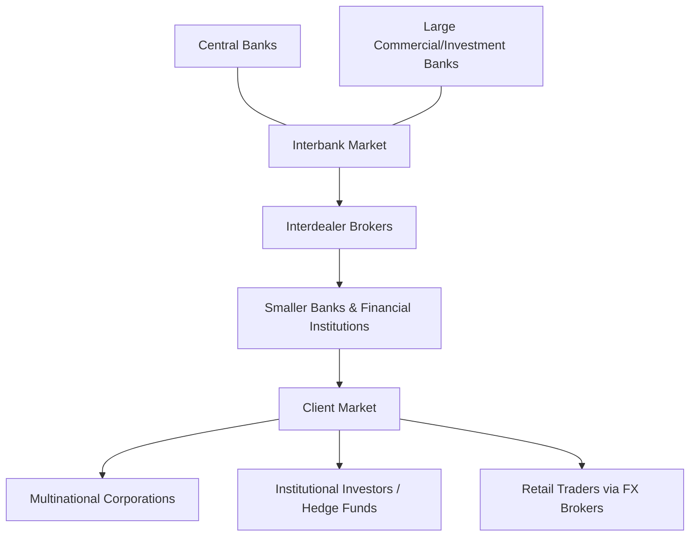

## Foreign Exchange Markets and Quotations

### Overview

The **foreign exchange (FX) market** is the largest and most liquid financial market in the world, facilitating the exchange of one currency for another. It operates as a decentralized, over-the-counter (OTC) network of banks, dealers, corporations, central banks, and electronic trading platforms rather than a single centralized exchange. Understanding FX market structure and quotation conventions is foundational to international corporate finance, since currency risk affects cross-border trade, financing, and investment decisions.

### Market Structure and Participants

**Key Points**

- **Decentralized OTC market**: no single physical or centralized electronic exchange; trading occurs across an interbank network and electronic communication networks (ECNs)
- Operates nearly 24 hours a day across major trading centers (London, New York, Tokyo, Singapore, Hong Kong), following the sun across time zones
- **Tiered structure**:
  - **Interbank market**: largest banks trade directly with each other for the tightest spreads and largest volumes
  - **Broker/dealer market**: smaller banks and financial institutions trade via interdealer brokers
  - **Client market**: corporations, asset managers, hedge funds, and retail traders transact with banks/dealers, typically at wider spreads than interbank rates

**Major Participants**

- Commercial and investment banks (market makers)
- Central banks (monetary policy operations, occasional intervention)
- Multinational corporations (hedging trade and investment exposures)
- Institutional investors (portfolio diversification, currency overlay strategies)
- Hedge funds and proprietary trading firms (speculation, arbitrage)
- Retail traders (via retail FX brokers)

### Spot Market vs. Forward Market

**Key Points**

- **Spot transactions**: exchange of currencies for (typically) settlement two business days after the trade date (T+2), except for certain currency pairs (e.g., USD/CAD often settles T+1)
- **Forward transactions**: exchange of currencies at an agreed rate for settlement at a specified future date, used primarily for hedging currency risk
- **FX swaps**: combine a spot transaction with an offsetting forward transaction, commonly used for short-term funding and hedging rollovers

### Direct vs. Indirect Quotation

**Key Points**

- **Direct quote**: the price of one unit of foreign currency expressed in units of domestic currency (domestic currency per unit foreign currency)
  - Example (from a US perspective): $1.10/€ means $1.10 buys one euro
- **Indirect quote**: the price of one unit of domestic currency expressed in units of foreign currency (foreign currency per unit domestic currency)
  - Example (from a US perspective): €0.909/$ means one dollar buys 0.909 euros

$$\text{Indirect Quote} = \frac{1}{\text{Direct Quote}}$$

**[Inference]** Most currencies are quoted against the US dollar using conventions established by long-standing interbank market practice; certain currencies (notably the British pound, euro, Australian dollar, and New Zealand dollar) are conventionally quoted as USD per unit of foreign currency ("American terms" from a US perspective), while most others are quoted as units of foreign currency per USD ("European terms"), though these conventions can vary by trading desk and context.

### Currency Pair Notation

FX quotes are conventionally expressed as a pair: **BASE/QUOTE** (or BASE/TERMS)

$$\text{EUR/USD} = 1.0850$$

This means 1 euro (the base currency) = 1.0850 US dollars (the quote/terms currency). The quote tells you how many units of the quote currency are needed to buy one unit of the base currency.

**Common Major Pairs**

| Pair | Base | Quote | Nickname |
| --- | --- | --- | --- |
| EUR/USD | Euro | US Dollar | "Fiber" |
| USD/JPY | US Dollar | Japanese Yen | — |
| GBP/USD | British Pound | US Dollar | "Cable" |
| USD/CHF | US Dollar | Swiss Franc | "Swissy" |
| AUD/USD | Australian Dollar | US Dollar | "Aussie" |
| USD/CAD | US Dollar | Canadian Dollar | "Loonie" |

### Bid-Ask Spread

**Key Points**

- **Bid price**: the rate at which the dealer/market maker will *buy* the base currency (i.e., the rate at which you can *sell* the base currency to the dealer)
- **Ask (offer) price**: the rate at which the dealer will *sell* the base currency (i.e., the rate at which you can *buy* the base currency from the dealer)
- The ask price is always greater than or equal to the bid price; the dealer's profit margin is embedded in this spread

**Example**

A dealer quotes EUR/USD as 1.0848 / 1.0852 (often written 1.0848/52).

- **Bid = 1.0848**: the dealer buys euros from you at $1.0848 per euro
- **Ask = 1.0852**: the dealer sells euros to you at $1.0852 per euro

If a corporate treasurer needs to buy €1,000,000, they pay at the ask: $1,085,200. If they need to sell €1,000,000, they receive at the bid: $1,084,800.

**Formula: Bid-Ask Spread (in percentage terms)**

$$\text{Spread \%} = \frac{\text{Ask} - \text{Bid}}{\text{Ask}} \times 100$$

Using the example above:

$$\text{Spread \%} = \frac{1.0852 - 1.0848}{1.0852} \times 100 \approx 0.0369\%$$

**[Inference]** Bid-ask spreads widen during periods of low liquidity, high volatility, or for less commonly traded ("exotic") currency pairs, and narrow for highly liquid major pairs during peak trading hours; the exact spread at any moment depends on market conditions and the specific dealer.

### Cross Rates

**Key Points**

- A **cross rate** is the exchange rate between two currencies, neither of which is the US dollar, derived indirectly through their respective USD rates
- Necessary because most currencies are quoted against the USD rather than against each other directly

**Formula: Deriving a Cross Rate**

Given:

$$\text{USD/JPY} = 149.50 \quad \text{and} \quad \text{EUR/USD} = 1.0850$$

To find EUR/JPY:

$$\text{EUR/JPY} = \text{EUR/USD} \times \text{USD/JPY} = 1.0850 \times 149.50 = 162.21$$

**Example**

A Japanese importer needs to pay a European supplier in euros but only has yen. Rather than the bank needing a direct EUR/JPY market, the transaction is effectively priced by combining the JPY/USD and USD/EUR legs into the implied cross rate, which is standard interbank practice for less liquid direct pairings.

### Triangular Arbitrage

**Key Points**

- Exploits pricing discrepancies between three currencies when the cross rate implied by two currency pairs differs from the directly quoted rate for the third pair
- In efficient, liquid markets, triangular arbitrage opportunities are typically eliminated within seconds by high-frequency trading and arbitrageurs

**Example**

Suppose the directly quoted EUR/JPY rate is 163.00, but the implied cross rate (calculated above) is 162.21. An arbitrageur could:

1. Convert USD to EUR at the EUR/USD rate
2. Convert EUR to JPY at the (overpriced) direct EUR/JPY rate of 163.00
3. Convert JPY back to USD at the USD/JPY rate

This produces a risk-free profit if transaction costs do not exceed the discrepancy. **[Inference]** In modern, highly liquid major currency markets, such discrepancies are rare and vanishingly small due to algorithmic arbitrage, though they can appear briefly during periods of market stress or in less liquid emerging market currency pairs.

### Forward Rates and Points

**Key Points**

- Forward rates are often quoted not as outright rates but as **forward points** (or "pips"), representing the difference between the forward rate and the spot rate
- Forward points are added to or subtracted from the spot rate depending on whether the currency is trading at a **forward premium** or **forward discount**

$$\text{Forward Rate} = \text{Spot Rate} + \text{Forward Points (in decimal form)}$$

**Interest Rate Parity** links forward points to the interest rate differential between the two currencies:

$$F = S \times \frac{1 + i_{quote}}{1 + i_{base}}$$

Where $F$ is the forward rate, $S$ is the spot rate, $i_{quote}$ is the interest rate of the quote currency, and $i_{base}$ is the interest rate of the base currency. A currency with a higher interest rate will typically trade at a forward discount relative to a currency with a lower interest rate, and vice versa, to prevent uncovered arbitrage.

### Effective and Nominal Exchange Rate Concepts

**Key Points**

- **Nominal exchange rate**: the straightforward quoted rate between two currencies
- **Real exchange rate**: adjusts the nominal rate for relative price levels (inflation) between two countries, reflecting purchasing power differences
- **Nominal effective exchange rate (NEER)**: a trade-weighted index of a currency's value against a basket of other currencies
- **Real effective exchange rate (REER)**: the NEER adjusted for relative inflation differentials across the basket of trading partners

$$\text{Real Exchange Rate} = \text{Nominal Exchange Rate} \times \frac{P_{foreign}}{P_{domestic}}$$

### Settlement and Trading Conventions

**Key Points**

- **Spot settlement**: T+2 for most pairs (T+1 for USD/CAD)
- **Value dates**: forward contracts specify a value date; common standard tenors include 1 week, 1 month, 3 months, 6 months, and 1 year
- **Pip**: the smallest standard price movement in a currency pair; for most pairs quoted to four decimal places, a pip is 0.0001; for JPY pairs (quoted to two decimal places), a pip is 0.01

### Diagram: FX Market Structure

### Common Pitfalls in FX Quotation

**Key Points**

- Confusing direct and indirect quotes when converting currency amounts, leading to inverted calculations
- Forgetting that the bid is always the price at which the dealer buys (client sells), and the ask is where the dealer sells (client buys) — a frequent source of confusion for those new to FX
- Incorrectly computing cross rates by simply multiplying rates without checking whether the currencies to be cancelled are in the correct numerator/denominator positions
- Treating forward points as the outright forward rate without adding/subtracting them correctly from spot

### Conclusion

Foreign exchange markets operate as a vast, decentralized OTC network spanning interbank, broker, and client tiers, functioning nearly continuously across global trading centers. Mastery of quotation conventions — direct vs. indirect quotes, bid-ask spreads, cross rates, and forward points — is essential for accurately pricing cross-border transactions, hedging currency exposure, and identifying arbitrage relationships. These mechanics underpin virtually all subsequent topics in international corporate finance, including transaction exposure hedging, translation exposure, and international capital budgeting.

**Related Topics**

- Interest rate parity and covered interest arbitrage
- Purchasing power parity and the real exchange rate
- Transaction, translation, and economic exposure
- Forward, futures, and options hedging strategies for FX risk
- The international Fisher effect
- Currency swaps and cross-currency basis
- Central bank intervention and exchange rate regimes