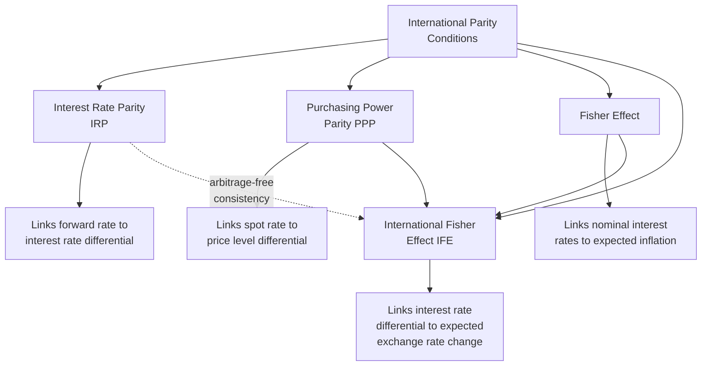
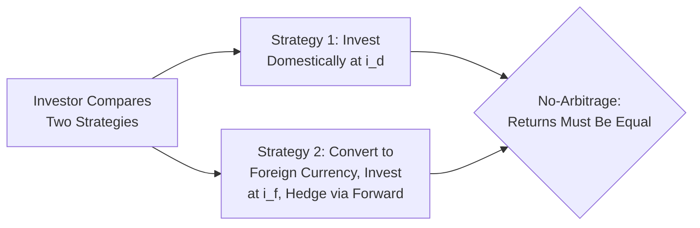
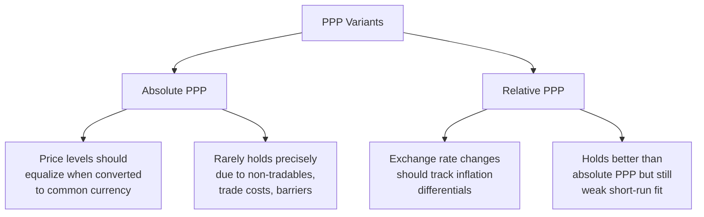

## Interest Rate Parity and Purchasing Power Parity

### Overview

Interest Rate Parity (IRP) and Purchasing Power Parity (PPP) are the two foundational no-arbitrage theories linking exchange rates to, respectively, interest rate differentials and inflation/price level differentials between countries. Together they form the core theoretical framework for understanding how exchange rates should behave in efficient, frictionless international capital and goods markets, and they underpin corporate forward rate pricing, cross-border valuation, and international cost-of-capital analysis.

### Conceptual Relationship Between the Parity Conditions

**Key Points**

- These parity conditions are theoretically interlinked: if PPP and the Fisher Effect both hold, the **International Fisher Effect** follows as a logical consequence, and combined with IRP this forms a consistent (if idealized) framework connecting interest rates, inflation, forward rates, and expected future spot rates.
- In practice, these conditions hold with varying degrees of empirical support — **Covered Interest Rate Parity** holds quite closely for freely convertible major currencies under normal market conditions, while PPP and uncovered parity conditions show much weaker and more inconsistent empirical support, particularly over short-to-medium horizons.

### Covered Interest Rate Parity (CIRP)

CIRP is the no-arbitrage relationship between spot rates, forward rates, and interest rate differentials, enforced by covered (hedged) arbitrage.

$$F = S \times \frac{1 + i_{d}}{1 + i_{f}}$$

Where $F$ is the forward rate, $S$ is the spot rate, $i_d$ is the domestic interest rate, and $i_f$ is the foreign interest rate (both over the same period).

An approximation commonly used for small interest rate differentials:

$$\frac{F - S}{S} \approx i_d - i_f$$

**Key Points**

- CIRP is enforced through **covered interest arbitrage**: if the relationship is violated, arbitrageurs can borrow in the cheaper currency, convert at spot, invest in the higher-yielding currency, and simultaneously lock in the forward rate to hedge currency risk, earning a riskless profit until the mispricing is eliminated.
- Because the currency risk is hedged via the forward contract, CIRP arbitrage is theoretically **riskless** (ignoring transaction costs and counterparty risk), which is why it holds empirically much more tightly than uncovered parity conditions.
- Documented deviations from CIRP since the 2008 financial crisis ("CIP basis") are often attributed by researchers to post-crisis bank balance sheet regulatory constraints (e.g., leverage ratio requirements) limiting arbitrage capacity. [Unverified — the precise causal mechanisms and persistence of these deviations remain an active area of academic debate and are not fully settled in the literature.]

**Example**

US interest rate = 5.00%, Eurozone interest rate = 3.00%, Spot EUR/USD = 1.0800. The 1-year forward rate implied by CIRP:

$$F = 1.0800 \times \frac{1.05}{1.03} \approx 1.1010$$

The euro trades at a forward premium against the dollar (forward rate higher than spot), consistent with the euro's lower interest rate.

### Uncovered Interest Rate Parity (UIRP)

UIRP relates interest rate differentials to the *expected* future spot rate, without a hedging instrument locking in the rate.

$$E[S_{t+1}] = S_t \times \frac{1 + i_d}{1 + i_f}$$

**Key Points**

- Unlike CIRP, UIRP involves **unhedged currency risk** — the investor bets that the expected exchange rate movement will offset the interest rate differential, without a forward contract guaranteeing the outcome.
- UIRP implies that currencies with **higher interest rates should be expected to depreciate** over the holding period (offsetting the extra yield), an implication frequently contradicted by empirical findings — the well-documented **"forward premium puzzle"** (or Fama puzzle) shows high-interest-rate currencies have historically tended to appreciate rather than depreciate on average, the opposite of the UIRP prediction. [Unverified — while the forward premium puzzle itself is a well-established and widely replicated empirical finding in international finance research, its underlying causes remain genuinely disputed, with competing explanations involving risk premia, peso problems, and behavioral factors.]
- This puzzle underlies the logic of the **carry trade** strategy — borrowing in low-interest-rate currencies to invest in high-interest-rate currencies — which has historically generated positive average returns in many periods precisely because UIRP does not hold reliably, though carry trades carry significant crash risk during periods of market stress. [Inference] The carry trade's historical profitability pattern is documented in academic and industry research, though returns and risk characteristics vary considerably across time periods and currency pairs, and past patterns are not a guarantee of future behavior.

### Purchasing Power Parity (PPP)

PPP relates exchange rates to relative price levels between countries, grounded in the **law of one price**.

#### Law of One Price

$$P_{domestic} = S \times P_{foreign}$$

An identical good should cost the same in both countries once converted to a common currency, absent transaction costs, trade barriers, and other frictions.

#### Absolute PPP

$$S = \frac{P_{domestic}}{P_{foreign}}$$

The exchange rate should equalize the price of an identical basket of goods across two countries.

#### Relative PPP

$$\frac{S_{t+1} - S_t}{S_t} \approx \pi_{domestic} - \pi_{foreign}$$

Where $\pi$ represents the inflation rate. Relative PPP holds that the percentage change in the exchange rate over a period should approximate the inflation differential between the two countries.

**Key Points**

- **Absolute PPP** rarely holds precisely in practice due to transportation costs, tariffs and trade barriers, non-tradable goods and services (e.g., haircuts, real estate, local labor-intensive services), and product differentiation across markets.
- **Relative PPP** is a somewhat weaker and more empirically testable condition, focusing on rate-of-change relationships rather than absolute price level equality, though it still shows substantial deviations over short-to-medium time horizons.
- PPP tends to hold better over **very long time horizons** (often cited as multi-year to decade-plus periods in academic studies) than over short-term horizons, where capital flows, interest rate differentials, risk sentiment, and speculative positioning dominate exchange rate movements far more than relative price levels. [Inference] This long-run tendency is a widely cited finding in international finance literature, though the specific time horizon over which PPP "holds reasonably well" varies across studies and currency pairs, and is not a fixed, universally agreed figure.

### The Big Mac Index (Illustrative Application)

**Example**

The Big Mac Index, popularized by *The Economist*, is an informal illustration of PPP using the price of a standardized product (a McDonald's Big Mac) across countries as a rough proxy for a "basket of goods," comparing actual exchange rates to the PPP-implied rate derived from relative Big Mac prices. [Inference] This is a well-known illustrative/pedagogical tool rather than a rigorous economic measurement instrument; it is widely used in economics education specifically because of its simplicity and the wide availability of Big Mac pricing across countries, not because it is considered analytically precise (it does not fully control for non-tradable input costs like local rent and labor).

### The Fisher Effect and International Fisher Effect

$$1 + i_{nominal} = (1 + r_{real})(1 + \pi_{expected})$$

The **Fisher Effect** holds that nominal interest rates reflect the real interest rate plus expected inflation.

$$\frac{E[S_{t+1}] - S_t}{S_t} \approx i_d - i_f \approx \pi_d - \pi_f$$

**Key Points**

- The **International Fisher Effect (IFE)** combines the Fisher Effect with (uncovered) interest rate parity to imply that nominal interest rate differentials should predict future exchange rate changes, since interest rate differentials largely reflect expected inflation differentials.
- Like UIRP, the IFE's empirical predictive power for actual exchange rate movements has been found to be weak in numerous studies, consistent with the broader empirical difficulty of forecasting short-to-medium-term exchange rate movements using macroeconomic fundamentals alone. [Unverified — the weak forecasting power of fundamentals-based exchange rate models (including IFE) versus a random walk benchmark is a well-documented empirical finding in international finance research (associated with the Meese-Rogoff results), though this remains an actively researched area with some more recent studies presenting mixed or qualified challenges to that conclusion.]

### Real Exchange Rate

$$RER = S \times \frac{P_{foreign}}{P_{domestic}}$$

**Key Points**

- The **real exchange rate** adjusts the nominal exchange rate for relative price levels, providing a measure of a currency's purchasing power or competitiveness rather than just its nominal value.
- If PPP holds continuously, the real exchange rate should remain constant over time; persistent real exchange rate deviations from a stable level are often interpreted as evidence of PPP violations or genuine long-run shifts in relative competitiveness (e.g., productivity differentials, per the Balassa-Samuelson effect).

### Balassa-Samuelson Effect (Related Concept)

**Key Points**

- The **Balassa-Samuelson effect** offers a structural explanation for why PPP tends to fail persistently between countries at different development levels: faster productivity growth in a country's tradable goods sector tends to raise wages economy-wide (including in non-tradable sectors), pushing up the relative price level of non-tradables and causing the real exchange rate to appreciate over time even without nominal exchange rate misalignment.
- This effect is commonly cited to explain why price levels (and real exchange rates) in emerging/developing economies tend to be systematically lower than in advanced economies, even after adjusting for nominal exchange rates. [Inference] This is a well-established theoretical framework in international economics; its precise empirical magnitude varies by country pair and study.

### Practical Corporate Finance Applications

**Key Points**

- **Forward rate pricing**: Corporate treasury and bank FX desks use CIRP directly to price forward contracts and derive implied forward points from interest rate differentials.
- **Multi-year cash flow forecasting**: Relative PPP (and inflation differential forecasts) is sometimes used as a long-run assumption for projecting future exchange rates in multi-year capital budgeting models, particularly for emerging market projects, though practitioners generally treat such projections with significant uncertainty given PPP's weak short/medium-run empirical fit.
- **Cost of capital adjustments**: International Fisher Effect logic underlies approaches to adjusting discount rates for expected currency depreciation/appreciation when evaluating foreign-currency-denominated cash flows in an international capital budgeting context.
- **Carry trade risk awareness**: Corporate treasurers engaging in cross-currency funding strategies should be aware that persistent UIRP violations mean interest rate differentials are not a reliable unbiased predictor of future spot rate movements, carrying genuine unhedged currency risk.

### Common Analytical Pitfalls

**Key Points**

- **Confusing covered and uncovered parity**: Assuming interest rate differentials predict *actual* future spot rates (UIRP, empirically weak) rather than only *forward* rates (CIRP, empirically strong under normal conditions) — these are distinct claims with very different empirical support.
- **Over-relying on PPP for short-term forecasting**: Using PPP-based fair value estimates to time short-term currency trades, when PPP's demonstrated explanatory power is concentrated in long-run horizons.
- **Ignoring transaction costs and capital controls**: Textbook parity conditions assume frictionless markets; real-world capital controls, transaction costs, and taxes can sustain apparent arbitrage opportunities that are not genuinely exploitable.

**Related Topics**

- Foreign exchange markets and quotations
- Currency hedging instruments and forward contract pricing
- The forward premium puzzle and carry trade strategies
- International capital budgeting and cost of capital
- Real exchange rates and the Balassa-Samuelson effect
- Exchange rate forecasting models and their empirical limitations
- Country risk premiums in cross-border valuation
- Translation and transaction FX exposure management