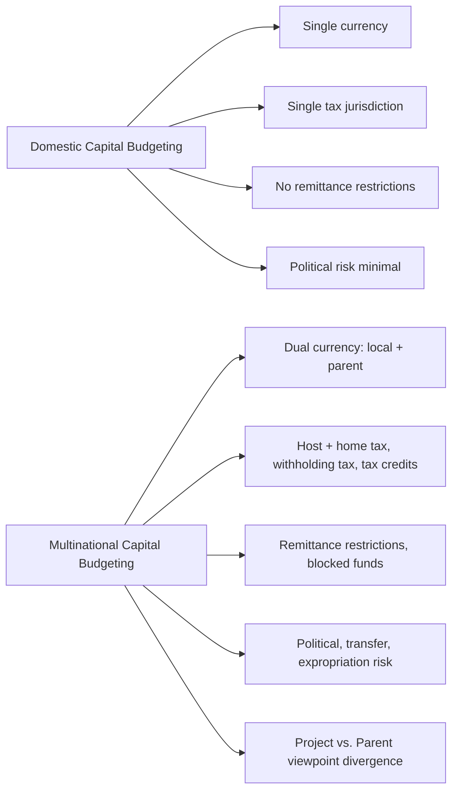

## Multinational Capital Budgeting

### Overview

Multinational capital budgeting extends standard capital budgeting to cross-border investment decisions, evaluating projects where cash flows, discount rates, and risks are denominated in or affected by foreign currencies. A parent company evaluating a foreign subsidiary project must reconcile two distinct valuation perspectives, account for currency translation, and layer in political and country-specific risks that domestic capital budgeting does not face.

### Project versus Parent Perspective

**Key Points**

- **Project (subsidiary) viewpoint**: Evaluates cash flows as if the foreign project were a standalone local entity, measured in the host country's currency.
- **Parent viewpoint**: Evaluates only the cash flows that are actually remitted to (or accessible by) the parent company, converted into the parent's home currency.
- The two viewpoints frequently diverge because of remittance restrictions, withholding taxes, blocked funds, transfer pricing policies, royalty/license fees, and management fees that the parent charges the subsidiary.
- Standard theory holds that the parent perspective is the theoretically correct basis for capital budgeting decisions, since shareholders in the parent's home market are compensated only through cash flows the parent can actually access — dividends, royalties, and repatriated capital — not through cash flows trapped in the subsidiary.
- The project viewpoint is still useful for comparing the project's competitiveness against local rivals and for assessing whether the project can sustain itself.

[Inference] In practice, many firms compute NPV under both viewpoints and use the gap to negotiate remittance policy or structure the deal (e.g., loan repayments instead of dividends) to accelerate cash flow to the parent — this is a strategic implication rather than a universally documented rule.

### Cash Flow Estimation Steps

The standard sequence for building a multinational capital budgeting model:

1. **Forecast local currency cash flows** — Project revenues, operating costs, taxes, and capital expenditures in the foreign (host) currency, exactly as a domestic project would be modeled.
2. **Identify remittable cash flows** — Determine which cash flows can legally and practically be sent to the parent (dividends, royalties, management fees, loan interest/principal, intercompany charges), net of any blocked funds or capital controls.
3. **Adjust for additional taxes** — Apply host-country corporate tax, withholding tax on repatriated dividends/royalties, and any home-country tax on foreign income (net of foreign tax credits, where applicable).
4. **Convert to parent currency** — Translate remitted, after-tax cash flows using projected exchange rates for each future period, not the spot rate held constant, since exchange rates are expected to move over the project's life.
5. **Discount at the appropriate rate** — Discount parent-currency cash flows at a rate reflecting the risk of those cash flows to the parent (see discount rate section below).
6. **Compute NPV (and/or IRR)** — Sum discounted cash flows and compare to the initial after-tax parent-currency investment outlay.

### Exchange Rate Forecasting Approaches

**Key Points**

- **Purchasing Power Parity (PPP)** — Projects future spot rates based on relative inflation differentials between the two countries:

$$S_1 = S_0 \times \frac{1 + i_h}{1 + i_f}$$

where $S_0$ is the current spot rate (home currency per foreign currency unit), $i_h$ is home inflation, and $i_f$ is foreign inflation.

- **Interest Rate Parity (IRP)** — Uses the forward rate implied by nominal interest rate differentials as an unbiased predictor of the future spot rate:

$$F = S_0 \times \frac{1 + i_h}{1 + i_f}$$

(using nominal interest rates $i_h$, $i_f$ in place of inflation rates in the covered interest rate parity formula).

- **Forward rates** — When actively quoted and liquid enough, forward contract rates for the relevant maturities can be used directly as exchange rate forecasts, though liquid forwards for long project horizons (5–10+ years) are often unavailable for many currency pairs. [Unverified] Availability varies significantly by currency pair and tenor and should be checked against current market quotes.

### Adjusting for Risk: Discount Rate vs. Cash Flow Adjustment

There are two broad methods for incorporating additional country/political/currency risk into the valuation, and mixing them causes double-counting.

**Method 1 — Adjust the discount rate**

- Add a risk premium to the required rate of return (e.g., WACC) to compensate for political risk, currency risk, or country risk.
- **Weakness**: This penalizes *all* future cash flows uniformly, including years where the specific risk (e.g., expropriation) may not actually threaten cash flows, and it fails to distinguish between systematic and diversifiable risk components. [Inference] Because political risk is often more idiosyncratic than systematic, adjusting the discount rate is considered a blunter, less precise method than adjusting cash flows directly, though it remains common in practice due to its simplicity.

**Method 2 — Adjust the cash flows**

- Build risk directly into expected cash flows: e.g., apply a probability-weighted expected value to a possible expropriation, blocked-fund scenario, or contract cancellation in the specific year it might occur.
- Preferred conceptually because it isolates *where* and *when* risk affects the project rather than smearing it across the entire discounting horizon.
- Requires more granular scenario analysis (e.g., probability trees, scenario/sensitivity analysis) but yields a more defensible NPV.

**Key Points**

- Do not adjust both the discount rate *and* the cash flows for the same risk — this double-counts the risk and understates project value.
- The **cost of capital for a foreign project** is often estimated using a global/international CAPM extension, adjusting beta for the project's exposure to global market risk versus purely local/diversifiable risk, or using a country risk premium build-up approach:

$$k_e = R_f + \beta \times (R_m - R_f) + \text{Country Risk Premium}$$

### Terminal Value and Remittance Considerations

- **Terminal value** — The project's continuing/terminal value should also be forecast in local currency and converted, with particular attention to how the terminal value itself will be realized (asset sale, liquidation, ongoing repatriation) since this affects both timing and tax treatment.
- **Blocked funds** — If a host country restricts capital outflows, funds may need to be reinvested locally (often at a below-market rate) until they can be repatriated, which reduces effective project value from the parent perspective; some models incorporate this as a "reinvestment at local rate until unblock date" adjustment.
- **Transfer pricing and fee structuring** — Parents can influence *when* and *how much* cash is extracted from a subsidiary via royalty fees, technology licensing fees, management fees, and intercompany loan structures — all of which are frequently taxed differently (and often more favorably) than dividends, giving multinationals structuring flexibility that domestic capital budgeting does not require.

### Political and Country Risk Factors

**Key Points**

- **Expropriation/nationalization risk** — Possibility the host government seizes assets, sometimes with inadequate compensation.
- **Transfer/convertibility risk** — Restrictions on converting local currency profits into hard currency or moving funds out of the country (capital controls).
- **Currency (translation and transaction) risk** — Unfavorable movements in the exchange rate between initiation and cash flow realization/remittance dates.
- **Tax regime risk** — Unexpected changes in host-country tax law, tariffs, or the loss of previously granted tax holidays.
- **Regulatory/contract risk** — Changes in operating regulations, environmental rules, labor law, or breach of government contracts (e.g., concession agreements).
- Firms commonly use tools such as **political risk insurance** (e.g., from the Multilateral Investment Guarantee Agency or national export-import agencies), **local debt financing** (which reduces exposure to expropriation since local creditors have standing to object), and **joint ventures with local partners** to mitigate these risks.

### Worked Numerical Example

**Example**

A US parent company is evaluating a 3-year project in a foreign subsidiary. Assume:

- Initial investment: $10,000,000 (funded from parent, in USD)
- Local currency (LC) free cash flows to the subsidiary: LC 45,000,000 in Year 1, LC 50,000,000 in Year 2, LC 55,000,000 in Year 3
- Only 80% of local FCF is remittable each year (20% must be reinvested locally per local regulation)
- Withholding tax on remittances: 10%
- Current spot rate: LC 10 = $1; local inflation 8%/year, US inflation 3%/year (used to forecast future spot rates via PPP)
- Parent's required rate of return on the project: 12%

**Step 1 — Remittable, after-withholding-tax cash flow (in LC):**

| Year | Local FCF | Remittable (80%) | After 10% W/H Tax |
| --- | --- | --- | --- |
| 1 | 45,000,000 | 36,000,000 | 32,400,000 |
| 2 | 50,000,000 | 40,000,000 | 36,000,000 |
| 3 | 55,000,000 | 44,000,000 | 39,600,000 |

**Step 2 — Forecast exchange rates via PPP:**

$$S_t = S_0 \times \left(\frac{1.03}{1.08}\right)^t$$

- $S_0 = 10$ LC/$
- $S_1 \approx 10 \times 0.9537 = 9.537$ LC/$
- $S_2 \approx 10 \times 0.9095 = 9.095$ LC/$
- $S_3 \approx 10 \times 0.8674 = 8.674$ LC/$

**Step 3 — Convert to USD:**

| Year | LC Cash Flow | Exchange Rate (LC/$) | USD Cash Flow |
| --- | --- | --- | --- |
| 1 | 32,400,000 | 9.537 | $3,397,715 |
| 2 | 36,000,000 | 9.095 | $3,958,218 |
| 3 | 39,600,000 | 8.674 | $4,566,751 |

**Step 4 — Discount at 12% and compute NPV:**

$$NPV = -10{,}000{,}000 + \frac{3{,}397{,}715}{1.12} + \frac{3{,}958{,}218}{1.12^2} + \frac{4{,}566{,}751}{1.12^3}$$

$$NPV \approx -10{,}000{,}000 + 3{,}033{,}674 + 3{,}155{,}652 + 3{,}250{,}756 \approx -\$559{,}918$$

**Conclusion**

Under the parent-currency, after-tax, remittance-constrained analysis, the project shows a negative NPV of approximately -$560,000 at a 12% required return, despite the local subsidiary's cash flows appearing strong in isolation — illustrating why the parent viewpoint, not the project viewpoint, should drive the accept/reject decision. The result is highly sensitive to the remittance ratio, withholding tax rate, and the inflation differential used in the PPP forecast; a sensitivity/scenario analysis on these inputs is standard practice before finalizing the decision.

### Comparison: Domestic vs. Multinational Capital Budgeting

### Decision Framework Diagram

<svg xmlns="http://www.w3.org/2000/svg" viewBox="0 0 760 460" font-family="Arial, sans-serif">
<text x="380" y="28" font-size="18" font-weight="bold" text-anchor="middle" fill="#1a1a1a">Multinational Capital Budgeting Decision Flow (svg_diagram)</text>
<rect x="290" y="50" width="180" height="45" rx="6" fill="#e8f0fe" stroke="#3b5bdb" stroke-width="1.5" />
<text x="380" y="77" font-size="13" text-anchor="middle" fill="#1a1a1a">Local Currency Cash Flows</text>
<line x1="380" y1="95" x2="380" y2="120" stroke="#555" stroke-width="1.5" marker-end="url(#arrow)" />
<rect x="270" y="120" width="220" height="45" rx="6" fill="#e8f0fe" stroke="#3b5bdb" stroke-width="1.5" />
<text x="380" y="147" font-size="13" text-anchor="middle" fill="#1a1a1a">Apply Remittance Restrictions</text>
<line x1="380" y1="165" x2="380" y2="190" stroke="#555" stroke-width="1.5" marker-end="url(#arrow)" />
<rect x="270" y="190" width="220" height="45" rx="6" fill="#e8f0fe" stroke="#3b5bdb" stroke-width="1.5" />
<text x="380" y="217" font-size="13" text-anchor="middle" fill="#1a1a1a">Apply Host + Withholding Tax</text>
<line x1="380" y1="235" x2="380" y2="260" stroke="#555" stroke-width="1.5" marker-end="url(#arrow)" />
<rect x="250" y="260" width="260" height="45" rx="6" fill="#fff3bf" stroke="#e8a33d" stroke-width="1.5" />
<text x="380" y="287" font-size="13" text-anchor="middle" fill="#1a1a1a">Convert via Forecasted FX Rate</text>
<line x1="380" y1="305" x2="380" y2="330" stroke="#555" stroke-width="1.5" marker-end="url(#arrow)" />
<rect x="250" y="330" width="260" height="45" rx="6" fill="#fff3bf" stroke="#e8a33d" stroke-width="1.5" />
<text x="380" y="357" font-size="13" text-anchor="middle" fill="#1a1a1a">Discount at Parent's Required Rate</text>
<line x1="380" y1="375" x2="380" y2="400" stroke="#555" stroke-width="1.5" marker-end="url(#arrow)" />
<rect x="270" y="400" width="220" height="45" rx="6" fill="#d3f9d8" stroke="#2f9e44" stroke-width="1.5" />
<text x="380" y="427" font-size="13" text-anchor="middle" fill="#1a1a1a">NPV (Parent Viewpoint)</text>
<rect x="530" y="120" width="200" height="255" rx="6" fill="#ffe3e3" stroke="#e03131" stroke-width="1.5" />
<text x="630" y="145" font-size="12" font-weight="bold" text-anchor="middle" fill="#1a1a1a">Risk Inputs</text>
<text x="545" y="170" font-size="11" fill="#1a1a1a">• Expropriation</text>
<text x="545" y="192" font-size="11" fill="#1a1a1a">• Blocked funds</text>
<text x="545" y="214" font-size="11" fill="#1a1a1a">• Currency volatility</text>
<text x="545" y="236" font-size="11" fill="#1a1a1a">• Tax regime change</text>
<text x="545" y="258" font-size="11" fill="#1a1a1a">• Regulatory shifts</text>
<text x="545" y="285" font-size="11" font-style="italic" fill="#495057">Applied via:</text>
<text x="545" y="305" font-size="11" fill="#1a1a1a">1) Discount rate premium, OR</text>
<text x="545" y="325" font-size="11" fill="#1a1a1a">2) Direct cash flow adjustment</text>
<text x="545" y="350" font-size="10" font-style="italic" fill="#e03131">Never both (double-counting)</text>
</svg>

### Common Pitfalls

**Key Points**

- Discounting local-currency cash flows at a home-currency discount rate (or vice versa) — currency of cash flow and currency of discount rate must match.
- Double-counting political/currency risk in both the discount rate and the cash flows.
- Ignoring remittance restrictions and valuing the project as if 100% of local cash flow reaches the parent.
- Using the spot exchange rate throughout the forecast horizon instead of a properly forecasted rate path (via PPP, IRP, or forward rates).
- Failing to account for the tax credit/treaty interaction between host and home country, which can significantly change the effective tax rate on repatriated income. [Unverified] Specific treaty provisions and foreign tax credit limitations vary by country pair and should be verified against current tax treaties and domestic tax code.

**Related Topics**

- International Cost of Capital and the International CAPM
- Political Risk Analysis and Mitigation (insurance, JV structuring, local debt)
- Transfer Pricing and Intercompany Fee Structuring
- Foreign Exchange Risk Management (transaction, translation, economic exposure)
- Interest Rate Parity and Covered/Uncovered Interest Arbitrage
- Purchasing Power Parity and Real Exchange Rate Forecasting
- Blocked Funds and Repatriation Strategies
- Country Risk Premium Estimation Methods
- Real Options in International Investment Decisions
- Cross-Border Mergers & Acquisitions Valuation