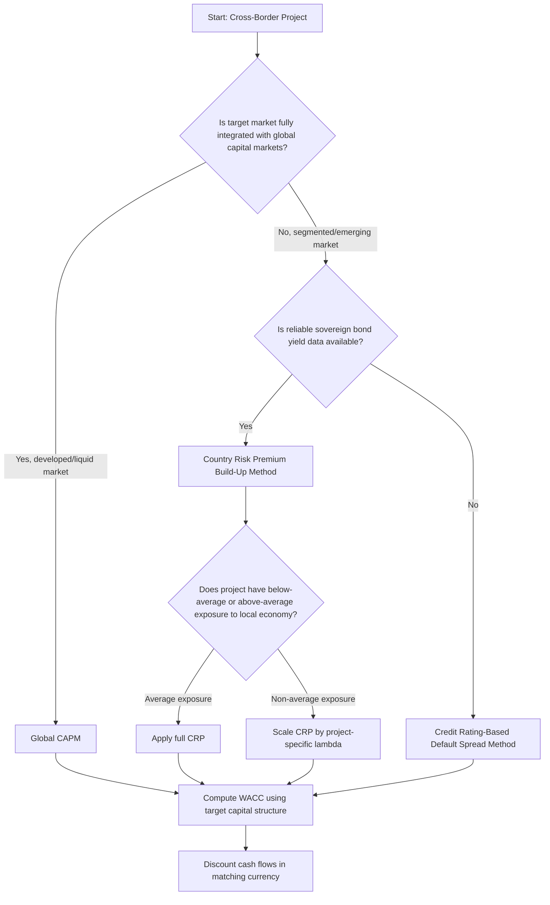

## Cross Border Cost of Capital Estimation

### Overview

Estimating the cost of capital for cross-border investments requires adapting the domestic Capital Asset Pricing Model (CAPM) and weighted average cost of capital (WACC) frameworks to account for market segmentation, currency mismatches, political risk, and the question of which risks are actually priced by the relevant investor base. Unlike domestic cost of capital estimation, there is no single universally accepted model; instead, practitioners choose among several competing frameworks depending on assumptions about market integration and investor diversification.

### The Core Conceptual Problem

**Key Points**

- Standard domestic CAPM assumes a single, fully integrated, well-diversified market where only systematic (non-diversifiable) risk is priced.
- Cross-border investing raises the question of whether global capital markets are **fully integrated**, **fully segmented**, or **partially integrated** — the answer changes which risks should be priced into the discount rate.
- If markets are integrated, investors can diversify away country-specific risk by holding a globally diversified portfolio, and only global systematic risk should command a premium.
- If markets are segmented (due to capital controls, information asymmetry, or investment restrictions), local investors cannot diversify away country risk, and country-specific risk becomes systematic from their perspective and must be priced.
- [Inference] Most large multinational corporations operate in a partially integrated world, which is why practitioners often layer a country risk premium onto an otherwise globally-oriented CAPM rather than relying purely on either polar model — this is a practical compromise rather than a single theoretically "correct" solution.

### Model 1 — Domestic CAPM (Baseline, Not Recommended Standalone)

$$k_e = R_f + \beta_{local} \times (R_m^{local} - R_f)$$

- Uses only the local market's risk-free rate, beta, and equity risk premium.
- **Weakness**: Ignores international diversification and cross-border risk entirely; inappropriate for MNC parent-level discount rates when project risk is not well captured by a purely local index.

### Model 2 — Global CAPM (World CAPM)

$$k_e = R_f + \beta_{global} \times (R_m^{world} - R_f)$$

- Substitutes a global market index (e.g., MSCI World) for the local market index, and computes beta relative to that global index.
- **Assumption**: Fully integrated global capital markets — appropriate for large, liquid markets with few capital restrictions.
- **Weakness**: Understates required return for investments in segmented emerging markets where local investors cannot freely diversify internationally, potentially producing discount rates that are too low for the actual risk borne.

### Model 3 — Country Risk Premium (Build-Up) Approach

The most widely used practitioner approach for emerging/frontier markets, adding a country-specific risk premium (CRP) to a base CAPM estimate:

$$k_e = R_f + \beta \times (R_m - R_f) + CRP$$

**Estimating the Country Risk Premium:**

1. **Sovereign yield spread method** — CRP is approximated as the spread between the foreign country's sovereign bond yield (denominated in a hard currency, e.g., USD) and the yield on a comparable-maturity US Treasury (or other benchmark risk-free) bond.

$$CRP = Y_{sovereign,foreign} - Y_{treasury,US}$$

2. **Adjusted (equity-scaled) sovereign spread method** — Since equity markets are typically more volatile than sovereign bond markets, the raw sovereign spread is often scaled by the ratio of equity market volatility to bond market volatility:

$$CRP_{adjusted} = (Y_{sovereign,foreign} - Y_{treasury,US}) \times \frac{\sigma_{equity,foreign}}{\sigma_{bond,foreign}}$$

3. **Credit rating-based premium** — Using published tables (e.g., default spread by sovereign credit rating) that map a country's credit rating to an implied default spread, often used when liquid sovereign bond yields are unavailable.

**Key Points**

- The country risk premium approach is popular precisely because it is straightforward to implement using observable market data (sovereign bond yields, credit ratings), even though its theoretical foundation (mixing a bond-market-derived spread into an equity cost of capital) is debated among academics. [Inference] This practical-versus-theoretical tension is well documented in corporate finance pedagogy but the "correct" degree of scaling remains an area of professional judgment rather than consensus.

### Model 4 — Local Beta vs. Global Beta Adjustments

Two further refinements when applying the CRP approach:

- **Country beta adjustment** — Multiply the CRP by a measure of how sensitive the specific industry/project is to that country's overall risk (a "lambda" or country-specific relative volatility factor), rather than applying the full CRP uniformly to every project in that country:

$$CRP_{project} = CRP_{country} \times \lambda_{project}$$

where $\lambda_{project}$ might be measured as the project/industry's revenue exposure to the local economy relative to the overall market's exposure.

- **Dual beta (local + global) approach** — Some models combine a local beta (capturing correlation with the local market) and a global beta (capturing correlation with world markets), weighting each based on the degree of market segmentation believed to apply to that specific country/asset class.

### Cost of Debt in Cross-Border Contexts

**Key Points**

- Local-currency cost of debt should reflect local borrowing rates, local default risk, and local tax shield benefits — not simply the parent's home-country borrowing rate.
- If a subsidiary borrows in a foreign hard currency (e.g., USD) rather than local currency, this introduces currency mismatch risk between subsidiary revenues (local currency) and debt service obligations (hard currency), which should be reflected either in the discount rate or explicitly in cash flow scenario analysis.
- The after-tax cost of debt formula still applies, adjusted for the relevant jurisdiction's tax rate:

$$k_d(1-T) = k_d \times (1 - T_{local})$$

- Interest rate parity (IRP) provides a theoretical check: the difference between local and foreign currency borrowing costs should approximately equal the forward premium/discount on the currency pair, absent arbitrage opportunities.

### Cross-Border WACC

The overall weighted average cost of capital combines the equity and debt costs, weighted by target (or market-value) capital structure weights:

$$WACC = \frac{E}{V} \times k_e + \frac{D}{V} \times k_d \times (1 - T)$$

**Key Points**

- **Which capital structure weights to use** is itself a design choice: some firms use the parent's global target capital structure; others use a capital structure appropriate to the specific country/project (reflecting local debt capacity, local interest rates, and local financial market depth).
- **Which tax rate to use**: the marginal tax rate should reflect where the interest tax shield is actually realized (host country, home country, or blended, depending on group financing structure).
- **Currency of the WACC** should match the currency of the cash flows being discounted — a local-currency WACC discounts local-currency cash flows; a parent-currency (e.g., USD) WACC discounts converted parent-currency cash flows. Mixing currencies between cash flows and the discount rate is a common and serious modeling error.

### Converting WACC Between Currencies (International Fisher Effect Approach)

When only one currency's WACC has been estimated directly, it can be approximately converted to the other currency using relative inflation (or interest rate) differentials, analogous to interest rate parity:

$$(1 + k_{foreign}) = (1 + k_{home}) \times \frac{1 + i_{foreign}}{1 + i_{home}}$$

[Inference] This conversion is a standard theoretical approximation drawn from the international Fisher effect; in practice, deviations from strict parity conditions mean this conversion should be treated as an estimate rather than a precise figure, and cross-checked against directly observed local costs of capital where available.

### Worked Numerical Example

**Example**

A US-based multinational is evaluating the appropriate discount rate for a project in an emerging market ("Country X").

**Given:**

- US risk-free rate ($R_f$): 4.0%
- US equity market risk premium ($R_m - R_f$): 5.5%
- Project's global beta (relative to a world index): 1.2
- Country X 10-year USD-denominated sovereign bond yield: 8.5%
- Comparable US Treasury yield: 4.0%
- Country X equity market annualized volatility: 28%
- Country X sovereign bond market annualized volatility: 14%
- Target capital structure: 60% equity / 40% debt
- Local currency cost of debt: 9.0%; local tax rate: 25%

**Step 1 — Base (Global CAPM) cost of equity:**

$$k_e^{base} = 4.0\% + 1.2 \times 5.5\% = 10.6\%$$

**Step 2 — Raw country risk premium:**

$$CRP_{raw} = 8.5\% - 4.0\% = 4.5\%$$

**Step 3 — Equity-volatility-adjusted country risk premium:**

$$CRP_{adjusted} = 4.5\% \times \frac{28\%}{14\%} = 4.5\% \times 2.0 = 9.0\%$$

**Step 4 — Total cost of equity:**

$$k_e = 10.6\% + 9.0\% = 19.6\%$$

**Step 5 — After-tax cost of debt:**

$$k_d(1-T) = 9.0\% \times (1 - 0.25) = 6.75\%$$

**Step 6 — WACC:**

$$WACC = (0.60 \times 19.6\%) + (0.40 \times 6.75\%) = 11.76\% + 2.70\% = 14.46\%$$

**Conclusion**

The resulting cross-border WACC of approximately 14.46% is substantially higher than what a pure domestic US WACC calculation would produce (which might be in the 8–10% range for a similar-risk US-only project), driven primarily by the volatility-adjusted country risk premium. This illustrates why applying a domestic discount rate to an emerging-market project systematically overvalues it — the CRP adjustment is what brings the discount rate in line with the actual risk borne by equity holders exposed to that country's sovereign and equity market risk.

### Model Selection Framework

### Comparison of Approaches

| Model | Best Suited For | Key Weakness |
| --- | --- | --- |
| Domestic CAPM | Purely local investors, no cross-border exposure | Ignores international diversification |
| Global CAPM | Fully integrated, developed markets | Understates risk in segmented/emerging markets |
| CRP Build-Up | Emerging/frontier market projects | Theoretical mixing of bond and equity risk premia |
| Local + Global Dual Beta | Partially segmented markets | Requires subjective weighting between local/global exposure |

### Common Pitfalls

**Key Points**

- Applying a domestic (home-country) WACC to a foreign project without any country risk adjustment.
- Mismatching the currency of the discount rate with the currency of the cash flows being discounted.
- Double-counting country risk (e.g., applying a CRP-adjusted discount rate *and* separately haircutting cash flows for political risk) — as with capital budgeting more broadly, risk should generally be adjusted once, not twice.
- Using an unadjusted (unscaled) sovereign bond spread as if it directly equals the required equity risk premium, without considering that equity markets are typically more volatile than sovereign bond markets.
- Ignoring capital structure differences between the parent's home market and the host market when weighting $k_e$ and $k_d$.
- [Unverified] Specific default spread tables, published country risk premium estimates (e.g., from data providers such as Damodaran's country risk datasets), and sovereign credit spreads change frequently and should be verified against current published sources rather than relied upon from memory.

**Related Topics**

- Multinational Capital Budgeting (parent vs. project viewpoint)
- International CAPM and Market Segmentation Theory
- Sovereign Credit Ratings and Default Spread Estimation
- Political Risk Analysis and Mitigation
- Interest Rate Parity and the International Fisher Effect
- Foreign Exchange Risk Management
- Capital Structure Decisions for Multinational Subsidiaries
- Emerging Market Equity Risk Premium Estimation
- Real Options in International Investment Valuation
- Transfer Pricing and Intercompany Financing Structures