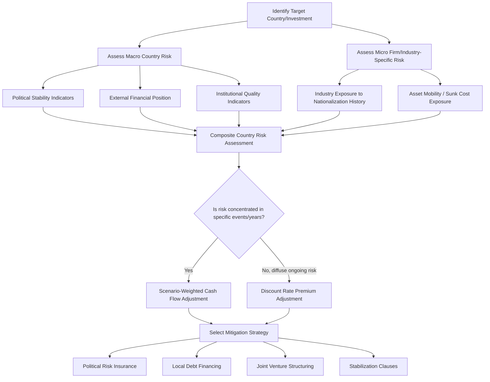

## Political and Country Risk Analysis

### Overview

Political and country risk analysis is the systematic assessment of non-commercial risks arising from a host country's government actions, institutional stability, and macroeconomic/social environment that could adversely affect a multinational firm's foreign investment. Unlike operational or market risk, political risk stems from sovereign actors and institutional dynamics largely outside the firm's control, requiring dedicated assessment frameworks, quantification methods, and mitigation strategies distinct from standard business risk management.

### Taxonomy of Political and Country Risk

**Key Points**

- **Macro (country-level) political risk** — Affects all foreign investors in the country regardless of industry: currency inconvertibility, war, revolution, widespread civil unrest, sovereign default.
- **Micro (firm/industry-specific) political risk** — Targets particular firms, sectors, or types of investment: selective expropriation, industry-specific regulation, discriminatory taxation of foreign-owned firms in a particular sector.
- **Ownership/control risk** — Government actions that force divestment, mandate local partnership/ownership thresholds, or restrict the repatriation of profits and capital.
- **Operational risk** — Government interference in day-to-day operations: local content requirements, import/export restrictions, price controls, labor regulations imposed disproportionately on foreign firms.
- **Transfer risk** — Restrictions on converting local currency to hard currency or moving funds across borders (capital controls, blocked funds).
- **Cultural/institutional risk** — Broader risk from weak rule of law, unpredictable judicial enforcement, corruption, and contract enforcement unreliability, which raises the cost and uncertainty of doing business even absent explicit hostile government action.

### The Expropriation Spectrum

Expropriation risk is often analyzed along a spectrum rather than as a single binary event:

1. **Outright/classic expropriation** — Direct seizure of assets, typically with formal (though possibly inadequate) compensation.
2. **Nationalization** — Seizure of an entire industry, often ideologically motivated, typically nationwide rather than firm-specific.
3. **Creeping expropriation** — Gradual erosion of an investor's control or economic value through incremental regulatory, tax, or contractual changes rather than a single seizure event — e.g., progressively tightening local ownership requirements, incremental royalty rate increases, or selective permit non-renewal.
4. **Indirect/regulatory expropriation** — Government action (regulation, taxation, licensing changes) that substantially destroys the economic value of an investment without formal transfer of title, increasingly the subject of international investment arbitration disputes.

[Inference] Creeping and indirect expropriation are generally considered harder to detect, predict, and insure against than classic expropriation, since they unfold over time and may be difficult to distinguish from legitimate regulatory policy — this is a widely noted challenge in the political risk literature rather than a precisely quantifiable claim.

### Quantitative and Qualitative Assessment Approaches

**Key Points**

- **Checklist approach** — Analysts score a country across a structured list of risk factors (political stability, legal system quality, corruption levels, currency stability, expropriation history) often weighted and aggregated into a composite score.
- **Delphi technique** — Structured, iterative elicitation of expert judgment, where a panel of country/regional experts independently provides risk assessments that are aggregated and fed back anonymously for refinement over multiple rounds, seeking convergence without groupthink bias from open discussion.
- **Quantitative (econometric) models** — Statistical models using macroeconomic and institutional variables (inflation, external debt levels, current account balance, foreign reserves, political stability indices) to predict crisis probability or risk scores.
- **Commercial country risk rating services** — Third-party providers (e.g., political risk consultancies, credit rating agencies, and specialized country risk indices) publish periodic composite risk ratings and sub-scores across political, economic, and financial risk dimensions. [Unverified] Specific providers, their current methodologies, and their scoring scales change over time and should be verified against current published sources rather than assumed static.
- **Scenario analysis / war-gaming** — Constructing plausible discrete future scenarios (e.g., change in ruling party, currency crisis, trade sanction imposition) and assessing firm-specific impact and probability under each.

### Structural and Institutional Risk Indicators

Common categories of leading indicators used in country risk assessment:

| Category | Representative Indicators |
| --- | --- |
| Political stability | Government turnover frequency, incidence of civil unrest, election predictability, judicial independence |
| Institutional quality | Rule of law strength, corruption perception, contract enforcement reliability, property rights protection |
| External financial position | Foreign exchange reserves, external debt-to-GDP, current account balance, debt service ratio |
| Fiscal position | Government budget deficit/surplus, public debt-to-GDP, fiscal policy predictability |
| Monetary/currency stability | Inflation rate and volatility, exchange rate volatility, central bank independence |
| Social factors | Income inequality, ethnic/religious tension, unemployment trends |

### Integrating Political Risk into Valuation

Two primary mechanisms (also discussed under multinational capital budgeting), summarized here with political-risk-specific detail:

**Discount rate adjustment**

- Add a political/country risk premium to the required rate of return.
- Simple to implement but applies uniformly across all future periods, which can misrepresent risks that are concentrated in specific years (e.g., risk clustered around an upcoming election or contract renewal date).

**Cash flow (scenario) adjustment**

- Explicitly model probability-weighted cash flow scenarios reflecting specific political risk events in the years they are most likely to occur.
- Preferred where risk events are lumpy/discrete (e.g., probability of contract non-renewal in Year 5) rather than smoothly distributed across the project horizon.

$$E[CF_t] = \sum_{s=1}^{n} p_s \times CF_{t,s}$$

where $p_s$ is the probability of scenario $s$ and $CF_{t,s}$ is the cash flow in period $t$ under scenario $s$.

### Risk Mitigation Strategies

**Key Points**

- **Political risk insurance (PRI)** — Coverage against expropriation, currency inconvertibility, political violence, and breach of contract, obtained from national export credit agencies, multilateral organizations, or private insurers.
- **Local debt financing** — Borrowing from local banks or issuing local bonds creates local creditors with a vested interest in opposing expropriation, since they would also lose from asset seizure; also reduces net currency exposure since local-currency revenues service local-currency debt.
- **Joint ventures / local partnerships** — Sharing ownership with local partners (including, in some cases, government or state-linked entities) can reduce political exposure by aligning local political interests with the venture's continuity, though at the cost of shared control and profits.
- **Concession agreements and stabilization clauses** — Formal contracts with host governments that attempt to "freeze" the regulatory/tax regime applicable to the investment for a defined period, reducing (though not eliminating) risk of adverse regulatory change.
- **Phased/staged investment** — Structuring investment in tranches tied to milestones, limiting capital exposure until political and operational risk is better understood.
- **Diversification across countries** — Spreading investment across multiple jurisdictions so that no single country's political risk event threatens the firm's overall global portfolio.
- **Obsolescing bargain management** — Recognizing that a foreign investor's negotiating leverage is typically highest before capital is committed and diminishes once assets are sunk (the "obsolescing bargain" phenomenon), and structuring contracts/agreements accordingly to lock in favorable terms early.

### The Obsolescing Bargain Concept

**Key Points**

- Describes the dynamic where a host government's incentive to honor original investment terms declines once the foreign investor's capital is sunk into immobile assets (e.g., mines, pipelines, factories) and the government's bargaining power correspondingly increases.
- Particularly relevant to **extractive industries** (mining, oil and gas) where fixed assets cannot be relocated once developed.
- [Inference] The prevalence and severity of obsolescing bargain dynamics vary substantially by industry, host-country institutional quality, and historical precedent, and are not uniform across all sectors or country contexts.

### Worked Example: Scenario-Weighted Political Risk Adjustment

**Example**

A firm is evaluating a Year 5 cash flow of $10,000,000 from a foreign project, with political risk concentrated around a contract renewal decision in that year.

**Scenarios:**

| Scenario | Probability | Year 5 Cash Flow |
| --- | --- | --- |
| Contract renewed on current terms | 60% | $10,000,000 |
| Contract renewed with unfavorable terms (higher royalty) | 25% | $6,500,000 |
| Contract not renewed / forced divestment | 15% | $1,000,000 |

**Expected Year 5 cash flow:**

$$E[CF_5] = (0.60 \times 10{,}000{,}000) + (0.25 \times 6{,}500{,}000) + (0.15 \times 1{,}000{,}000)$$

$$E[CF_5] = 6{,}000{,}000 + 1{,}625{,}000 + 150{,}000 = \$7{,}775{,}000$$

**Conclusion**

The probability-weighted expected cash flow of $7,775,000 is then discounted at a *normal* project discount rate (without an additional blanket political risk premium, since the risk has already been captured in the cash flow itself). This approach isolates the political risk to the specific year and contingency where it actually applies (the contract renewal decision), rather than penalizing the entire multi-year cash flow stream with a uniform risk premium — illustrating why cash flow scenario adjustment is often preferred over discount rate adjustment when risk is concentrated around identifiable discrete events.

### Political Risk Assessment Process Flow

### Institutional Risk Assessment Diagram

<svg xmlns="http://www.w3.org/2000/svg" viewBox="0 0 760 420" font-family="Arial, sans-serif">
<text x="380" y="28" font-size="18" font-weight="bold" text-anchor="middle" fill="#1a1a1a">Country Risk Dimensions (svg_diagram)</text>
<circle cx="380" cy="230" r="70" fill="#e8f0fe" stroke="#3b5bdb" stroke-width="2" />
<text x="380" y="225" font-size="13" font-weight="bold" text-anchor="middle" fill="#1a1a1a">Composite</text>
<text x="380" y="242" font-size="13" font-weight="bold" text-anchor="middle" fill="#1a1a1a">Country Risk</text>
<line x1="380" y1="160" x2="380" y2="90" stroke="#555" stroke-width="1.5" />
<rect x="290" y="55" width="180" height="40" rx="6" fill="#d3f9d8" stroke="#2f9e44" stroke-width="1.5" />
<text x="380" y="80" font-size="12" text-anchor="middle" fill="#1a1a1a">Political Stability</text>
<line x1="440" y1="185" x2="500" y2="130" stroke="#555" stroke-width="1.5" />
<rect x="490" y="95" width="190" height="40" rx="6" fill="#fff3bf" stroke="#e8a33d" stroke-width="1.5" />
<text x="585" y="120" font-size="12" text-anchor="middle" fill="#1a1a1a">External Financial Position</text>
<line x1="450" y1="230" x2="560" y2="230" stroke="#555" stroke-width="1.5" />
<rect x="560" y="210" width="180" height="40" rx="6" fill="#ffe3e3" stroke="#e03131" stroke-width="1.5" />
<text x="650" y="235" font-size="12" text-anchor="middle" fill="#1a1a1a">Institutional Quality</text>
<line x1="440" y1="275" x2="500" y2="330" stroke="#555" stroke-width="1.5" />
<rect x="490" y="330" width="190" height="40" rx="6" fill="#e8f0fe" stroke="#3b5bdb" stroke-width="1.5" />
<text x="585" y="355" font-size="12" text-anchor="middle" fill="#1a1a1a">Monetary/Currency Stability</text>
<line x1="380" y1="300" x2="380" y2="370" stroke="#555" stroke-width="1.5" />
<rect x="290" y="370" width="180" height="40" rx="6" fill="#d3f9d8" stroke="#2f9e44" stroke-width="1.5" />
<text x="380" y="395" font-size="12" text-anchor="middle" fill="#1a1a1a">Fiscal Position</text>
<line x1="320" y1="275" x2="260" y2="330" stroke="#555" stroke-width="1.5" />
<rect x="90" y="330" width="190" height="40" rx="6" fill="#fff3bf" stroke="#e8a33d" stroke-width="1.5" />
<text x="185" y="355" font-size="12" text-anchor="middle" fill="#1a1a1a">Social/Demographic Factors</text>
<line x1="320" y1="230" x2="220" y2="230" stroke="#555" stroke-width="1.5" />
<rect x="30" y="210" width="190" height="40" rx="6" fill="#ffe3e3" stroke="#e03131" stroke-width="1.5" />
<text x="125" y="235" font-size="12" text-anchor="middle" fill="#1a1a1a">Industry/Firm Exposure</text>
<line x1="320" y1="185" x2="260" y2="130" stroke="#555" stroke-width="1.5" />
<rect x="90" y="95" width="190" height="40" rx="6" fill="#e8f0fe" stroke="#3b5bdb" stroke-width="1.5" />
<text x="185" y="120" font-size="12" text-anchor="middle" fill="#1a1a1a">Legal/Contract Enforcement</text>
</svg>

### Common Pitfalls

**Key Points**

- Treating political risk as static rather than dynamic — risk levels shift with elections, commodity price cycles, and macroeconomic conditions, requiring periodic reassessment rather than a one-time evaluation at deal inception.
- Applying a single blanket country risk premium uniformly to all industries in a country, when risk exposure often varies significantly by sector (e.g., extractive industries typically face higher expropriation risk than service industries with less sunk, immobile capital).
- Underestimating creeping/indirect expropriation because it lacks a single dramatic triggering event.
- Ignoring the obsolescing bargain dynamic when negotiating initial investment terms, leading to weaker renegotiation leverage once capital is sunk.
- Over-relying on a single commercial risk rating without supplementing it with firm-specific and industry-specific analysis.
- [Unverified] The predictive accuracy of any specific quantitative country risk model or rating methodology is subject to ongoing academic and practitioner debate and should not be treated as definitively validated without checking current literature.

**Related Topics**

- Multinational Capital Budgeting (parent vs. project viewpoint)
- Cross-Border Cost of Capital Estimation
- Political Risk Insurance Structures and Providers
- Foreign Direct Investment Entry Mode Decisions
- International Arbitration and Investment Treaty Protections
- Sovereign Credit Rating Methodologies
- Currency Inconvertibility and Transfer Risk Management
- Joint Venture Structuring for Risk Mitigation
- Stabilization Clauses and Contract Design in International Investment