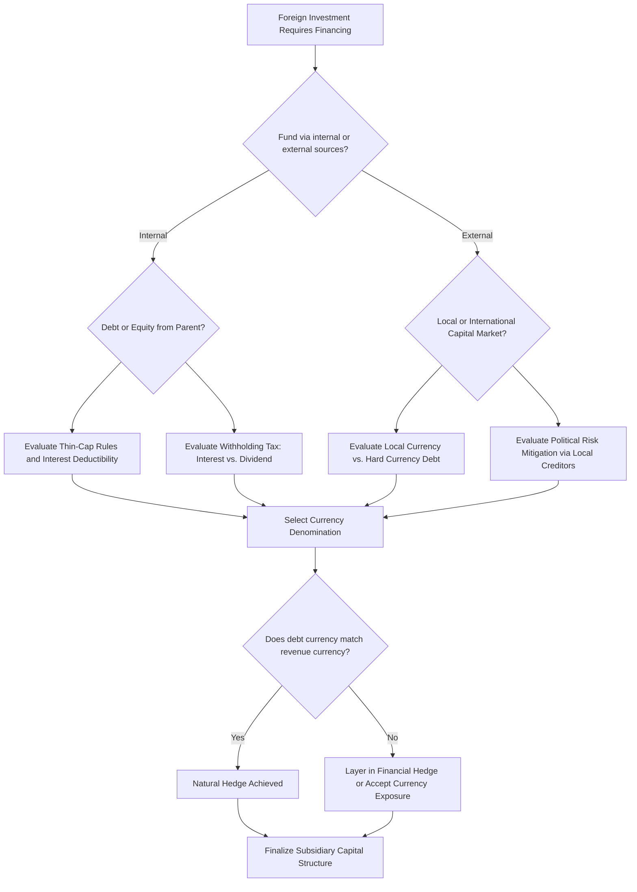

## International Financing and Capital Structure Decisions

### Overview

International financing and capital structure decisions address how a multinational corporation (MNC) funds its foreign operations — the choice of financing source (parent equity, local debt, international debt, intercompany loans), currency denomination, and the resulting capital structure of both the subsidiary and the consolidated group. These decisions interact with tax optimization, currency risk management, political risk mitigation, and cost of capital minimization simultaneously, making them more multidimensional than domestic capital structure choices.

### Sources of International Financing

**Key Points**

- **Internal (intra-firm) financing** — Parent company equity injection, retained earnings of the subsidiary, and intercompany loans from parent or sister affiliates.
- **Local external financing** — Borrowing from banks or issuing debt/equity in the host country's local capital market, denominated in local currency.
- **International/offshore financing** — Borrowing in international capital markets (e.g., Eurobond market, syndicated international loans) or in a third country's currency, chosen for cost, tax, or currency-matching reasons rather than local market access.
- **Trade and supplier financing** — Export credit financing, supplier credit, and trade finance instruments (letters of credit, forfaiting) used particularly for capital-intensive projects with long payment cycles.
- **Multilateral/development finance** — Financing from institutions such as international development banks, sometimes bundled with political risk guarantees, particularly relevant in emerging and frontier markets where private capital is scarce or expensive.

### The Parent-Subsidiary Financing Decision Framework

**Key Points**

- **Debt vs. equity from the parent**: Funding a subsidiary via intercompany loans rather than equity capital contribution can create interest deductions in the subsidiary's local tax jurisdiction (reducing local taxable income) while interest income is recognized at the parent, subject to home-country and withholding tax treatment on the interest payments.
- **Local currency vs. hard currency debt**: Borrowing in local currency naturally hedges local-currency revenue streams (a form of "operational hedging") but may carry higher nominal interest rates reflecting local inflation and country risk; borrowing in a hard currency may offer a lower nominal rate but introduces currency mismatch risk if local revenues are in local currency.
- **Local debt as a political risk mitigant**: As discussed under political risk analysis, using local-currency, locally-sourced debt creates local creditors with a stake in the subsidiary's continued operation, which can reduce expropriation risk relative to funding entirely with parent equity.
- **Thin capitalization considerations**: Many jurisdictions impose thin capitalization rules limiting the amount of intercompany debt (relative to equity) on which interest can be tax-deductible, specifically to prevent excessive profit-shifting via intercompany interest payments. [Unverified] Specific debt-to-equity thresholds and safe-harbor ratios vary significantly by jurisdiction and change periodically with tax reform, and should be verified against current local tax code before use in any actual structuring decision.

### Determinants of Optimal Subsidiary Capital Structure

Three broad, sometimes competing, philosophies for setting subsidiary-level capital structure:

1. **Conform to local norms** — Match the capital structure of comparable local firms in the host country, on the theory that local capital markets and lenders are calibrated to local risk/return conventions, and that local peer conformity eases external financing access and benchmarking.
2. **Conform to parent/global norms** — Apply the parent company's global target capital structure uniformly across subsidiaries, prioritizing consistency in credit profile and consolidated financial reporting/risk management.
3. **Project/subsidiary-specific optimization** — Tailor each subsidiary's capital structure to its own specific risk profile, local tax rules, local debt market depth, and currency exposure, independent of both local peer norms and the parent's blanket policy.

[Inference] In practice, most large MNCs use a hybrid: a global framework or target leverage range set by the parent (for consolidated credit rating and treasury policy purposes), adjusted subsidiary-by-subsidiary for local tax, market access, and currency factors — though the precise weighting of these considerations is a matter of firm-specific treasury policy rather than a single documented industry standard.

### Trade-Offs: Global vs. Local Capital Structure Targeting

| Consideration | Favors Global/Parent-Level Structure | Favors Local/Subsidiary-Specific Structure |
| --- | --- | --- |
| Tax optimization | Centralized planning captures group-wide interest deduction opportunities | Local structure captures jurisdiction-specific tax shield/thin-cap limits |
| Currency risk | N/A (parent bears currency mismatch) | Local debt naturally hedges local-currency revenue |
| Political risk mitigation | N/A | Local creditor base reduces expropriation risk |
| Cost of capital | Access to deeper, more liquid international capital markets, potentially lower nominal rates | May avoid currency mismatch risk premium embedded in cross-currency borrowing |
| Consolidated credit rating | Uniform leverage policy supports predictable group credit profile | Fragmented leverage across subsidiaries can complicate group credit analysis |
| Administrative complexity | Simpler to administer centrally | Requires ongoing local market monitoring per subsidiary |

### Internal (Intercompany) Financing Mechanisms

**Key Points**

- **Intercompany loans** — Parent or affiliate lends directly to the subsidiary; interest payments are generally tax-deductible in the borrowing entity's jurisdiction (subject to thin-cap and transfer pricing/arm's-length interest rate rules) and taxable (often with withholding tax) to the lending entity.
- **Equity injections** — Capital contributed as equity has no interest deduction benefit but avoids thin-capitalization restrictions and withholding tax on interest; dividend repatriation is instead subject to dividend withholding tax (often at a different, sometimes more favorable, treaty rate than interest withholding).
- **Fronting loans** — A loan routed through a financial intermediary (often in a favorable tax jurisdiction) between parent and subsidiary, historically used to reduce withholding tax or political risk exposure by inserting a bank intermediary between the ultimate lender and borrower; the intermediary structure and its tax treatment are subject to increasing anti-avoidance scrutiny in many jurisdictions.
- **Leading and lagging** — Accelerating ("leading") or delaying ("lagging") intercompany payments (for goods, services, royalties, or loan repayments) between affiliates to manage currency exposure, working capital positioning, and tax timing across jurisdictions with different currency outlooks or tax years.
- **Royalties, management fees, and licensing fees** — Non-dividend mechanisms for extracting cash from a subsidiary, often taxed differently (and sometimes more favorably, or without certain repatriation restrictions) than dividends, giving multinationals additional structuring flexibility beyond the debt/equity choice.

### Currency Denomination of Debt

**Key Points**

- **Matching principle**: General best practice is to denominate debt in the currency that matches the primary currency of the cash flows expected to service that debt (i.e., match local-currency revenue with local-currency debt service), minimizing net currency exposure.
- **Interest rate differential temptation**: Borrowing in a low-interest-rate currency to fund operations generating cash flows in a high-interest-rate (often higher-inflation) currency can appear attractive on a nominal basis but, per uncovered interest rate parity, is expected on average to be offset by currency depreciation of the higher-rate currency over time — meaning the apparent savings is compensation for currency risk, not a free lunch.
- **Currency basket / multi-currency debt structuring** — Some firms deliberately diversify debt across a basket of currencies correlated with their diversified revenue base, reducing sensitivity to any single currency's movement.
- **Natural vs. financial hedging trade-off**: Local-currency debt provides a natural (operational) hedge without requiring derivative instruments, but may be more expensive, less liquid, or less available in shorter tenors compared to hard-currency alternatives, requiring a cost-risk trade-off assessment against using financial hedges (forwards, swaps) instead.

### Withholding Tax and Treaty Network Considerations

**Key Points**

- Withholding tax rates on dividends, interest, and royalties paid from a subsidiary to a parent/affiliate vary by the bilateral tax treaty (if any) between the host and home (or intermediate holding) jurisdiction.
- **Treaty shopping / holding company structuring** — MNCs sometimes route investment through an intermediate holding company in a jurisdiction with a favorable tax treaty network relative to direct home-country-to-host-country investment, though this is subject to increasing anti-treaty-shopping provisions (e.g., principal purpose tests) in modern treaties and multilateral tax instruments. [Unverified] The current strength and application of anti-treaty-shopping provisions vary significantly by jurisdiction and have been evolving under international coordinated tax reform efforts; specific applicability should be verified against current treaty text and local tax guidance.
- **Foreign tax credit interaction** — The home country's treatment of foreign tax credits (full credit, credit with limitation, or exemption system) affects whether local withholding tax represents a real incremental cost to the group or is largely offset against home-country tax liability.

### Worked Example: Debt vs. Equity Financing Comparison

**Example**

A US parent is financing a $20,000,000 subsidiary investment in a foreign country. Two structuring options are compared for a single year's cash flow:

**Assumptions:**

- Local corporate tax rate: 25%
- Local subsidiary pre-tax, pre-financing operating income: $3,000,000
- Option A — 100% equity funded (no interest deduction)
- Option B — 50% intercompany loan at 6% interest ($10,000,000 loan → $600,000 annual interest, assumed within thin-cap safe harbor and arm's-length range)
- Dividend withholding tax: 10%; Interest withholding tax: 5%
- US parent taxed on repatriated income with full foreign tax credit assumed (no incremental US tax in this simplified example)

**Option A — All Equity:**

| Item | Amount |
| --- | --- |
| Pre-tax operating income | $3,000,000 |
| Local tax (25%) | ($750,000) |
| Net income (available for dividend) | $2,250,000 |
| Dividend withholding tax (10%) | ($225,000) |
| **Net cash to parent** | **$2,025,000** |

**Option B — 50% Intercompany Debt:**

| Item | Amount |
| --- | --- |
| Pre-tax operating income | $3,000,000 |
| Interest expense (deductible) | ($600,000) |
| Taxable income | $2,400,000 |
| Local tax (25%) | ($600,000) |
| Net income (available for dividend) | $1,800,000 |
| Dividend withholding tax (10%) | ($180,000) |
| Net dividend to parent | $1,620,000 |
| Interest received by parent | $600,000 |
| Interest withholding tax (5%) | ($30,000) |
| Net interest to parent | $570,000 |
| **Total net cash to parent (dividend + interest)** | **$2,190,000** |

**Conclusion**

In this simplified example, the intercompany debt structure (Option B) delivers $2,190,000 to the parent versus $2,025,000 under all-equity financing (Option A) — a difference of $165,000, driven by the local interest tax shield ($600,000 × 25% = $150,000 of local tax saved) partially offset by the different withholding tax treatment between interest and dividend payments. This illustrates the mechanical logic behind intercompany debt structuring, while noting that real-world outcomes depend heavily on thin-capitalization limits, transfer pricing arm's-length interest rate requirements, and specific treaty withholding rates, all of which must be verified against current local law rather than assumed.

### Capital Structure Decision Process

### Financing Structure Comparison

<svg xmlns="http://www.w3.org/2000/svg" viewBox="0 0 760 380" font-family="Arial, sans-serif">
<text x="380" y="28" font-size="18" font-weight="bold" text-anchor="middle" fill="#1a1a1a">Intercompany Financing Flow Comparison (svg_diagram)</text>

<text x="190" y="60" font-size="14" font-weight="bold" text-anchor="middle" fill="`#1a1a1a`">Equity Structure</text>

<rect x="100" y="80" width="180" height="45" rx="6" fill="`#e8f0fe`" stroke="`#3b5bdb`" stroke-width="1.5" />

<text x="190" y="107" font-size="12" text-anchor="middle" fill="`#1a1a1a`">Parent Company</text>

<line x1="190" y1="125" x2="190" y2="165" stroke="#555" stroke-width="1.5" marker-end="url(#arrow2)" />

<text x="230" y="150" font-size="10" fill="`#495057`">Equity capital</text>

<rect x="100" y="165" width="180" height="45" rx="6" fill="`#e8f0fe`" stroke="`#3b5bdb`" stroke-width="1.5" />

<text x="190" y="192" font-size="12" text-anchor="middle" fill="`#1a1a1a`">Subsidiary</text>

<line x1="190" y1="210" x2="190" y2="250" stroke="#555" stroke-width="1.5" marker-end="url(#arrow2)" />

<text x="250" y="235" font-size="10" fill="`#495057`">Dividend (net of WHT)</text>

<rect x="100" y="250" width="180" height="45" rx="6" fill="`#d3f9d8`" stroke="`#2f9e44`" stroke-width="1.5" />

<text x="190" y="277" font-size="12" text-anchor="middle" fill="`#1a1a1a`">Cash to Parent</text>

<text x="190" y="320" font-size="11" text-anchor="middle" fill="`#495057`">No interest deduction</text>

<text x="190" y="336" font-size="11" text-anchor="middle" fill="`#495057`">Dividend WHT applies</text>

<text x="570" y="60" font-size="14" font-weight="bold" text-anchor="middle" fill="`#1a1a1a`">Debt Structure</text>

<rect x="480" y="80" width="180" height="45" rx="6" fill="`#fff3bf`" stroke="`#e8a33d`" stroke-width="1.5" />

<text x="570" y="107" font-size="12" text-anchor="middle" fill="`#1a1a1a`">Parent Company</text>

<line x1="570" y1="125" x2="570" y2="165" stroke="#555" stroke-width="1.5" marker-end="url(#arrow2)" />

<text x="620" y="150" font-size="10" fill="`#495057`">Loan principal</text>

<rect x="480" y="165" width="180" height="45" rx="6" fill="`#fff3bf`" stroke="`#e8a33d`" stroke-width="1.5" />

<text x="570" y="192" font-size="12" text-anchor="middle" fill="`#1a1a1a`">Subsidiary</text>

<line x1="570" y1="210" x2="570" y2="250" stroke="#555" stroke-width="1.5" marker-end="url(#arrow2)" />

<text x="640" y="235" font-size="10" fill="`#495057`">Interest (net of WHT)</text>

<rect x="480" y="250" width="180" height="45" rx="6" fill="`#d3f9d8`" stroke="`#2f9e44`" stroke-width="1.5" />

<text x="570" y="277" font-size="12" text-anchor="middle" fill="`#1a1a1a`">Cash to Parent</text>

<text x="570" y="320" font-size="11" text-anchor="middle" fill="`#495057`">Interest deductible locally</text>

<text x="570" y="336" font-size="11" text-anchor="middle" fill="`#495057`">Subject to thin-cap limits</text>

</svg>

### Common Pitfalls

**Key Points**

- Structuring intercompany debt beyond local thin-capitalization safe harbors, risking disallowance of interest deductions and potential re-characterization as equity by local tax authorities.
- Setting intercompany interest rates that are not arm's-length, creating transfer pricing exposure and potential adjustment/penalty risk.
- Ignoring currency mismatch between debt service currency and operating revenue currency when chasing a lower nominal interest rate, without recognizing the implicit currency risk premium being assumed (per interest rate parity logic).
- Applying a single global capital structure target uniformly to all subsidiaries without considering local market depth, local tax treatment, or local political risk factors that might argue for higher local-currency debt usage in specific jurisdictions.
- Failing to reassess treaty-based structuring (e.g., holding company location) as anti-avoidance rules and treaty networks evolve, since a structure that was efficient historically may become non-compliant or lose its tax benefit under subsequent reform.
- [Unverified] Specific thin-capitalization ratios, withholding tax rates, and treaty benefit eligibility rules are jurisdiction- and time-specific and must be verified against current local tax law and treaty text before use in an actual financing decision.

**Related Topics**

- Multinational Capital Budgeting (parent vs. project viewpoint)
- Cross-Border Cost of Capital Estimation
- Political and Country Risk Analysis
- Transfer Pricing and Intercompany Fee Structuring
- Foreign Exchange Risk Management and Hedging Instruments
- Thin Capitalization Rules and International Tax Planning
- Multinational Treasury Centralization (cash pooling, netting)
- Withholding Tax Treaty Networks and Anti-Treaty-Shopping Provisions
- Foreign Direct Investment Entry Mode Selection