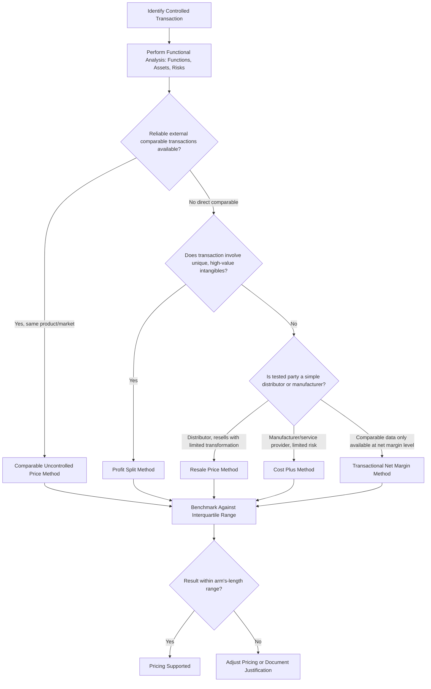

## Transfer Pricing Fundamentals

### Overview

Transfer pricing refers to the pricing of goods, services, intangibles, and financing arrangements transacted between related (commonly controlled) entities within a multinational group — for example, a parent company selling components to its foreign subsidiary, or a subsidiary paying a royalty to its parent for use of intellectual property. Because these transactions occur between affiliates rather than independent third parties, transfer prices directly influence how much taxable profit is recognized in each jurisdiction, making transfer pricing one of the most heavily regulated and scrutinized areas of international corporate finance and tax law.

### The Arm's-Length Principle

**Key Points**

- The foundational international standard for transfer pricing is the **arm's-length principle**: intercompany transactions should be priced as if the transacting parties were independent, unrelated entities negotiating under normal market conditions.
- This principle is embodied in guidance from major international tax bodies and forms the basis of most countries' domestic transfer pricing regulations and the bilateral tax treaty network.
- The arm's-length principle exists specifically to prevent multinational groups from artificially shifting profits from high-tax jurisdictions to low-tax jurisdictions purely through non-market intercompany pricing, which would erode the tax base of higher-tax countries.
- [Unverified] The precise regulatory text, documentation thresholds, and enforcement mechanisms implementing the arm's-length principle vary by jurisdiction and are periodically revised through international coordinated reform efforts; current local regulations should be checked directly rather than assumed uniform across countries.

### Standard Transfer Pricing Methods

**Comparable Uncontrolled Price (CUP) Method**

- Compares the price charged in the controlled (intercompany) transaction to the price charged in a comparable transaction between unrelated parties, for the same or highly similar goods/services under similar conditions.
- Considered the most direct method when good comparables exist, but is difficult to apply when the product is unique, differentiated, or involves proprietary intangibles with no external market comparable.

**Resale Price Method (RPM)**

- Starts from the price at which a product purchased from a related party is resold to an independent third party, then subtracts an appropriate gross margin (the "resale price margin") that the reseller would earn in a comparable uncontrolled transaction, to back into the arm's-length transfer price.
- Most suitable when the buying affiliate performs relatively simple distribution functions without significantly transforming the product.

**Cost Plus Method**

- Starts from the costs incurred by the supplier in a controlled transaction, then adds an appropriate arm's-length markup (the "cost plus markup") based on markups earned by comparable independent suppliers performing similar functions.
- Commonly used for transactions involving manufacturing, assembly, or contract services where the supplying affiliate bears limited risk and performs routine functions.

**Transactional Net Margin Method (TNMM)**

- Examines the net profit margin (relative to an appropriate base such as costs, sales, or assets) realized by a party in a controlled transaction and compares it to net margins realized by comparable independent enterprises performing similar functions.
- Widely used in practice because it is more tolerant of product-level differences than CUP, RPM, or Cost Plus, since it operates at the net margin level rather than requiring precise product/transaction-level comparability.

**Profit Split Method**

- Allocates the combined profit from a controlled transaction between the related parties based on the relative value of each party's contribution (functions performed, assets used, risks assumed), typically used for highly integrated transactions or transactions involving unique, valuable intangibles where no reliable one-sided comparable exists.
- Often subdivided into a **contribution analysis** (dividing combined profit based on relative value of each party's contribution) and a **residual analysis** (allocating routine returns first via a simpler method, then splitting the residual/excess profit based on unique contributions such as valuable intangibles).

### Method Selection Framework

**Key Points**

- Most transfer pricing regimes require selecting the **"most appropriate method"** given the facts and circumstances, rather than mandating a single method universally — this typically depends on the availability of reliable comparable data, the complexity and uniqueness of the transaction, and which party performs the less complex ("tested party") functions.
- **Functional analysis** — A foundational step before method selection: identifying which entity performs which functions, uses which assets, and assumes which risks (often summarized as "FAR" — Functions, Assets, Risks) in the controlled transaction, since compensation should correlate with the value of functions performed and risks borne.
- **Tested party selection** — In one-sided methods (RPM, Cost Plus, TNMM), analysts typically select the less complex party (the one with more readily available comparable data and simpler functions) as the "tested party" whose margin is benchmarked against comparables.

### Comparability Analysis

**Key Points**

- Comparability analysis evaluates whether an uncontrolled transaction is sufficiently similar to the controlled transaction to serve as a valid benchmark, typically assessed across five factors: characteristics of the property/services, functional analysis (functions, assets, risks), contractual terms, economic circumstances (market conditions, geographic location), and business strategies.
- **Comparable company searches** — Analysts typically use commercial databases of financial information on independent companies to identify potential comparables, applying quantitative and qualitative screens (industry classification, independence criteria, financial data availability) to build a comparable set.
- **Interquartile range** — A common statistical convention is to accept results falling within the interquartile range (25th to 75th percentile) of the comparable set's margins as arm's-length, rather than requiring an exact point match, recognizing inherent imprecision in comparability.

### Intangible Property and Transfer Pricing

**Key Points**

- Intangibles (patents, trademarks, know-how, brand value, customer relationships) present the greatest transfer pricing complexity because they are frequently unique, making external comparables difficult or impossible to find.
- **DEMPE framework** (Development, Enhancement, Maintenance, Protection, Exploitation) — A framework used to determine which group entities should be entitled to returns from intangibles based on which entities actually perform the value-creating DEMPE functions, rather than simply which entity holds legal title to the intangible.
- **Cost Sharing / Cost Contribution Arrangements (CCAs)** — Structures where multiple affiliates jointly fund the development of an intangible (e.g., R&D) in proportion to their expected benefit, allowing each to hold rights to exploit the resulting intangible in their respective markets without ongoing royalty payments, subject to buy-in/buy-out payment requirements reflecting pre-existing intangible value contributed.
- **Hard-to-value intangibles** — Many regimes include specific rules addressing intangibles whose valuation at the time of the controlled transaction is highly uncertain, often permitting tax authorities to use actual subsequent outcomes as evidence in reassessing whether the original pricing was arm's-length.

### Documentation Requirements

**Key Points**

- Most jurisdictions require or strongly encourage contemporaneous transfer pricing documentation justifying the pricing methodology used, though specific thresholds and formats vary by country.
- **Three-tiered documentation structure** (aligned with internationally coordinated standards in many jurisdictions):
  - **Master File** — Group-wide overview of the MNC's global business operations, overall transfer pricing policies, and allocation of income and economic activity.
  - **Local File** — Detailed transactional information specific to the local entity's controlled transactions, including the functional analysis and method application for that jurisdiction.
  - **Country-by-Country Report (CbCR)** — Aggregate data on global allocation of income, taxes paid, and indicators of economic activity by jurisdiction, typically required for very large multinational groups above a specified consolidated revenue threshold.
- [Unverified] Specific documentation thresholds (e.g., the CbCR revenue threshold), filing deadlines, and penalty regimes for non-compliance vary by jurisdiction and are subject to periodic legislative change; current local requirements should be verified directly.

### Transfer Pricing Risk and Enforcement Mechanisms

**Key Points**

- **Transfer pricing adjustments** — Tax authorities can unilaterally adjust a taxpayer's reported income if they determine the transfer price was not arm's-length, potentially resulting in additional tax assessment, interest, and penalties.
- **Double taxation risk** — A unilateral adjustment by one country's tax authority can create double taxation if the other country does not make a corresponding adjustment, since the same profit may then be taxed in both jurisdictions.
- **Advance Pricing Agreements (APAs)** — Formal agreements negotiated in advance with one or more tax authorities, pre-approving the transfer pricing methodology for specified future transactions, providing certainty and reducing audit risk; can be unilateral (with one tax authority), bilateral, or multilateral (involving multiple tax authorities simultaneously, reducing double taxation risk).
- **Mutual Agreement Procedure (MAP)** — A treaty-based mechanism allowing competent authorities of two jurisdictions to negotiate resolution of double taxation disputes arising from transfer pricing adjustments, invoked after an adjustment has already occurred (in contrast to the forward-looking APA).
- **Penalty regimes** — Many jurisdictions impose specific penalties for transfer pricing non-compliance or inadequate documentation, sometimes with reduced penalty exposure for taxpayers who maintain contemporaneous documentation even if the pricing is ultimately adjusted.

### Interaction with Multinational Capital Budgeting and Financing

**Key Points**

- Transfer pricing policy directly affects the **project vs. parent cash flow divergence** discussed in multinational capital budgeting: royalty rates, management fees, and intercompany goods pricing determine how much of a subsidiary's economic profit is actually captured as parent-currency cash flow versus retained (and taxed) locally.
- As discussed under international financing decisions, **intercompany loan interest rates** must themselves satisfy the arm's-length standard — using an artificially high intercompany interest rate to shift profit out of a high-tax subsidiary is subject to the same transfer pricing scrutiny as goods or intangible transactions.
- Transfer pricing policy is thus not merely a tax compliance exercise but an active structuring lever interacting with capital budgeting cash flow timing, financing structure choice, and country risk/repatriation planning.

### Worked Example: Cost Plus Method Application

**Example**

A US parent manufactures a specialized component and sells it to its foreign contract-manufacturing subsidiary, which assembles it into a finished product and sells the finished product to independent third-party distributors in the local market. The subsidiary performs routine assembly functions and bears limited risk (a typical **cost-plus scenario**).

**Given:**

- Subsidiary's fully absorbed manufacturing cost (excluding the parent-supplied component): $400,000
- Comparable independent contract manufacturers earn a cost-plus markup in the range of 8%–12% on fully absorbed costs (interquartile range from a comparable company search)
- Selected point within range (median): 10%

**Step 1 — Determine arm's-length markup:**

$$\text{Arm's-Length Markup} = 10\% \times \$400{,}000 = \$40{,}000$$

**Step 2 — Determine arm's-length transfer price the subsidiary should be compensated for its assembly function (i.e., minimum margin it should retain):**

$$\text{Arm's-Length Compensation} = \$400{,}000 + \$40{,}000 = \$440{,}000$$

**Step 3 — Compare to actual result:**

Suppose the subsidiary's actual results show it retained only $415,000 in total compensation for its assembly function after accounting for the price paid to the parent for the component — equivalent to a 3.75% markup on costs, below the 8%–12% arm's-length range.

**Conclusion**

Since the subsidiary's realized markup (3.75%) falls below the arm's-length interquartile range (8%–12%), local tax authorities could assert that excess profit was inappropriately shifted to the parent (e.g., via an inflated component price), and could adjust the subsidiary's taxable income upward to reflect an arm's-length markup — in this case, an adjustment bringing the subsidiary's margin back to approximately the $440,000 (10%) benchmark, increasing local taxable income by roughly $25,000. This illustrates the mechanical logic tax authorities apply when benchmarking transfer prices, and underscores why maintaining contemporaneous documentation supporting the selected markup is critical to defending the original pricing position.

### Transfer Pricing Method Selection Flow

### Transfer Pricing Method Comparison

<svg xmlns="http://www.w3.org/2000/svg" viewBox="0 0 760 400" font-family="Arial, sans-serif">
<text x="380" y="28" font-size="18" font-weight="bold" text-anchor="middle" fill="#1a1a1a">Transfer Pricing Methods by Complexity (svg_diagram)</text>
<line x1="80" y1="340" x2="700" y2="340" stroke="#333" stroke-width="1.5" />
<text x="390" y="370" font-size="12" text-anchor="middle" fill="#495057">Transaction / Intangible Complexity →</text>
<line x1="80" y1="340" x2="80" y2="60" stroke="#333" stroke-width="1.5" />
<text x="55" y="200" font-size="12" text-anchor="middle" fill="#495057" transform="rotate(-90 55 200)">Reliance on External Comparables →</text>
<rect x="110" y="290" width="150" height="40" rx="6" fill="#d3f9d8" stroke="#2f9e44" stroke-width="1.5" />
<text x="185" y="315" font-size="11" text-anchor="middle" fill="#1a1a1a">CUP Method</text>
<rect x="280" y="250" width="150" height="40" rx="6" fill="#e8f0fe" stroke="#3b5bdb" stroke-width="1.5" />
<text x="355" y="275" font-size="11" text-anchor="middle" fill="#1a1a1a">Resale Price / Cost Plus</text>
<rect x="450" y="180" width="150" height="40" rx="6" fill="#fff3bf" stroke="#e8a33d" stroke-width="1.5" />
<text x="525" y="205" font-size="11" text-anchor="middle" fill="#1a1a1a">TNMM</text>
<rect x="530" y="90" width="150" height="40" rx="6" fill="#ffe3e3" stroke="#e03131" stroke-width="1.5" />
<text x="605" y="115" font-size="11" text-anchor="middle" fill="#1a1a1a">Profit Split</text>
<line x1="185" y1="290" x2="355" y2="290" stroke="#adb5bd" stroke-width="1" stroke-dasharray="4,4" />
<line x1="355" y1="250" x2="525" y2="220" stroke="#adb5bd" stroke-width="1" stroke-dasharray="4,4" />
<line x1="525" y1="180" x2="605" y2="130" stroke="#adb5bd" stroke-width="1" stroke-dasharray="4,4" />
</svg>

### Common Pitfalls

**Key Points**

- Treating a single transfer pricing method as universally applicable across all intercompany transaction types within a group, rather than performing a separate most-appropriate-method analysis per transaction category.
- Relying on outdated comparable company benchmarking studies without periodic refresh, since arm's-length ranges shift as market conditions, industry margins, and comparable company sets change over time.
- Setting intercompany interest rates on loans without benchmarking against arm's-length rates for comparable credit risk, tenor, and currency, creating exposure alongside the goods/services transfer pricing analysis.
- Assuming legal ownership of an intangible automatically entitles that entity to the associated profit, without considering the DEMPE functional analysis that many jurisdictions now require to support such allocation.
- Underestimating double taxation risk from unilateral transfer pricing adjustments, and failing to consider APA or MAP mechanisms proactively rather than reactively after an audit adjustment has already occurred.
- [Unverified] Specific penalty thresholds, safe harbor provisions, and documentation deadlines are jurisdiction-specific and change with legislative reform; current local regulations should be verified rather than assumed from general principles.

**Related Topics**

- International Financing and Capital Structure Decisions
- Multinational Capital Budgeting (parent vs. project viewpoint)
- Political and Country Risk Analysis
- Base Erosion and Profit Shifting (BEPS) Framework
- Advance Pricing Agreements and Dispute Resolution Mechanisms
- Intangible Asset Valuation in Cross-Border Transactions
- Foreign Tax Credit Systems and Double Taxation Relief
- Country-by-Country Reporting and Global Tax Transparency Initiatives
- Withholding Tax Treaty Networks