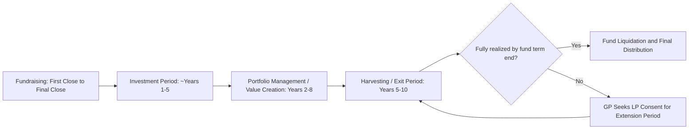

## Private Equity Fund Structures and Lifecycle

### Overview

Private equity (PE) fund structures and lifecycle describe how capital is pooled, deployed, managed, and returned to investors over the multi-year life of a typical private equity fund. Unlike public market investing, PE investing operates through closed-end, illiquid fund vehicles with a defined term, a structured relationship between fund managers and capital providers, and a distinctive economic model built around management fees and profit-sharing (carried interest).

### The Limited Partnership Structure

**Key Points**

- The dominant legal structure for PE funds is the **limited partnership (LP)**, comprising two categories of participants: the **General Partner (GP)**, who manages the fund and makes investment decisions, and the **Limited Partners (LPs)**, who provide the vast majority of capital but have no role in day-to-day fund management.
- **Limited liability**: LPs' liability is generally limited to their committed capital, while the GP bears unlimited liability for fund obligations (though the GP entity itself is typically also a limited liability vehicle, insulating the individual fund managers).
- **Fund management company vs. GP entity**: In practice, a separate investment management company (often owned by the fund's principals) is typically contracted to provide day-to-day investment advisory and operational services to the fund, distinct from the GP entity that holds formal partnership authority — a structural separation used partly for liability and tax planning purposes.
- **Typical fund term**: PE funds are commonly structured with a stated term (often around 10 years), subject to possible extension periods at the GP's discretion or with LP advisory committee/majority consent, reflecting the illiquid, long-horizon nature of the underlying portfolio company investments.

### LP Commitment and Capital Call Mechanics

**Key Points**

- LPs make a **capital commitment** at the fund's closing — a contractual promise to provide capital up to a specified amount over the fund's life — rather than transferring the full amount upfront.
- **Capital calls (drawdowns)**: The GP issues capital call notices to LPs as investment opportunities or fund expenses arise, requiring LPs to fund their pro-rata share of the called amount within a specified notice period.
- **Uncalled/undrawn commitment**: The portion of an LP's total commitment not yet called remains an off-balance-sheet future obligation for the LP, requiring LPs to maintain sufficient liquidity planning across their broader portfolio to meet future calls.
- **Default consequences**: LP agreements typically specify remedies for LPs who fail to meet a capital call (e.g., forfeiture of prior capital account value, dilution, or forced sale of the LP's interest), since a defaulting LP can jeopardize the fund's ability to close pending transactions.

### The Fund Lifecycle Phases

**Fundraising Period**

- The GP markets the fund to prospective LPs (institutional investors, family offices, funds-of-funds, sovereign wealth funds, high-net-worth individuals) based on a stated investment strategy, target fund size, and track record from prior funds.
- Culminates in one or more **closings** (first close, subsequent closes, final close) at which LPs formally commit capital; funds may accept LPs at successive closings up to a specified final close date, often with an "equalization" mechanism so later-closing LPs contribute a catch-up payment reflecting the fund's activity to date.

**Investment (Deployment) Period**

- Typically spans the first several years of the fund's life (often cited as roughly 3–5 years, though this varies by fund strategy and market conditions), during which the GP sources, diligences, and executes new platform investments.
- **Investment period restrictions**: LP agreements often restrict new (non-follow-on) investments after the investment period ends, redirecting the fund's focus toward managing and exiting the existing portfolio.

**Portfolio Management (Value Creation) Period**

- Overlapping with and extending beyond the investment period, the GP works actively with portfolio company management teams to execute value creation initiatives: operational improvements, add-on acquisitions (buy-and-build strategies), management team upgrades, capital structure optimization, and strategic repositioning.
- [Inference] The specific mix of operational versus financial engineering value creation levers emphasized varies significantly by GP strategy, sector focus, and market cycle, and is not a fixed formula applied uniformly across the industry.

**Harvesting (Exit/Realization) Period**

- The latter years of the fund's life, during which the GP executes exits from portfolio companies via strategic sale, sale to another financial sponsor (sponsor-to-sponsor / secondary buyout), initial public offering (IPO), or recapitalization, and distributes realized proceeds to LPs.
- **Fund extensions**: If the fund term expires before all investments are fully realized, GPs commonly seek LP consent for one or more extension periods to allow orderly exits rather than forced fire-sale liquidation.

### Fee and Compensation Structure

**Key Points**

- **Management fee**: An annual fee (commonly cited in industry practice as being in the range of approximately 1.5%–2.5% of committed capital during the investment period, though specific rates vary by fund size, strategy, and negotiating leverage) paid by LPs to the GP/management company to cover operating expenses and compensate the investment team, regardless of fund performance.
- **Fee basis step-down**: Many fund agreements shift the management fee calculation basis from committed capital to invested capital (or net asset value) after the investment period ends, reducing the fee base as the portfolio is gradually realized and capital is returned.
- **Carried interest ("carry")**: The GP's share of fund profits above a specified return threshold, commonly cited in industry practice as being around 20% of profits in many conventional structures, representing the primary performance-based incentive compensation for the GP.
- **Hurdle rate (preferred return)**: A minimum rate of return that must be achieved and distributed to LPs before the GP begins earning carried interest, commonly cited in industry practice as being in a single-digit percentage range, intended to align GP incentives with delivering returns above a baseline opportunity cost of capital.
- **GP catch-up**: After LPs receive their preferred return, many structures include a catch-up provision allowing the GP to receive a disproportionately large share of subsequent distributions until the GP's cumulative carry reaches its target percentage of total profits above the return of capital.
- [Unverified] Specific management fee percentages, carry percentages, and hurdle rates vary significantly across funds, strategies, vintage years, and negotiating dynamics between GPs and anchor LPs, and should not be treated as fixed industry constants without verifying current market terms for the specific fund type in question.

### Distribution Waterfall Structures

**Key Points**

- **European (whole-fund) waterfall**: Carried interest is calculated only after LPs have received back their total contributed capital across the entire fund plus the preferred return on that capital, meaning the GP does not receive carry on early exits until the whole fund has returned capital and hurdle — generally considered more LP-favorable since it prevents the GP from receiving carry on a fund that later underperforms overall.
- **American (deal-by-deal) waterfall**: Carried interest can be calculated and distributed on a per-deal basis as each individual investment is realized, potentially allowing the GP to receive carry earlier in the fund's life even if later deals subsequently underperform — generally considered more GP-favorable, though often paired with an escrow/clawback mechanism to protect LPs.
- **GP clawback provision**: A contractual mechanism requiring the GP to return excess carried interest to LPs if, over the life of the fund, the GP received more carry than it was ultimately entitled to under the fund's overall (whole-fund) profit-sharing terms — particularly relevant in deal-by-deal waterfall structures.

### Distribution Waterfall Tiers (Typical European Structure)

1. **Return of capital** — LPs receive back their total contributed/invested capital before any profit distribution.
2. **Preferred return (hurdle)** — LPs receive a specified minimum return on their invested capital.
3. **GP catch-up** — The GP receives a disproportionate share of subsequent distributions until its cumulative share reaches the target carry percentage of total profits above return of capital.
4. **Carried interest split** — Remaining profits are split between LPs and GP according to the agreed carry percentage (e.g., commonly cited as an 80/20 LP/GP split in many conventional structures).

### Fund Performance Metrics

Key metrics used by LPs to evaluate fund performance during the fund's life (before final realization):

$$\text{DPI (Distributions to Paid-In)} = \frac{\text{Cumulative Distributions to LPs}}{\text{Cumulative Paid-In Capital}}$$

$$\text{RVPI (Residual Value to Paid-In)} = \frac{\text{Current NAV of Unrealized Investments}}{\text{Cumulative Paid-In Capital}}$$

$$\text{TVPI (Total Value to Paid-In)} = DPI + RVPI$$

- **DPI** measures actual realized cash returned to LPs relative to capital paid in — the "cash-on-cash" realized return.
- **RVPI** measures the value of remaining unrealized (still-held) investments relative to capital paid in, based on the GP's valuation of the portfolio.
- **TVPI** combines both realized and unrealized value to give a total value multiple, though it depends on the GP's marks for unrealized positions and is therefore more subjective than DPI for funds still early in their life.
- **IRR (Internal Rate of Return)** is also widely used, but is sensitive to the timing of cash flows and can be distorted in early fund years by the drag of unrealized investments and fee payments before meaningful distributions occur (a phenomenon often referred to informally as the "J-curve" effect).

### The J-Curve Effect

**Key Points**

- Refers to the typical pattern of a PE fund's reported returns over its life: negative or low apparent returns in the early years (driven by management fees, transaction costs, and investments not yet showing value appreciation), followed by rising returns in later years as portfolio companies mature and are realized at a premium to cost.
- [Inference] The depth and duration of the J-curve varies by fund strategy (e.g., buyout funds typically exhibiting a shallower/shorter J-curve than early-stage venture funds, given differences in investment holding periods and loss/realization patterns) — this is a general pattern observed across the industry rather than a precise, uniformly quantifiable relationship.

### Worked Example: Waterfall Distribution Calculation

**Example**

A PE fund with $100,000,000 in paid-in capital from LPs realizes its full portfolio for total proceeds of $220,000,000. Assume a European (whole-fund) waterfall with an 8% preferred return (assume, for simplicity, a single lump-sum preferred return amount of $8,000,000 rather than a compounded multi-year calculation), a 100% GP catch-up, and a 20% carry.

**Tier 1 — Return of capital:**

LPs receive $100,000,000 (return of their paid-in capital).

Remaining proceeds: $220,000,000 − $100,000,000 = $120,000,000

**Tier 2 — Preferred return:**

LPs receive the $8,000,000 preferred return.

Remaining proceeds: $120,000,000 − $8,000,000 = $112,000,000

**Tier 3 — GP catch-up (100% catch-up until GP has 20% of profits above return of capital):**

Total profit above return of capital ultimately available = $120,000,000 (the LP preferred return + catch-up + final split all come from this pool).

GP catch-up target: GP needs to receive an amount such that its cumulative carry equals 20% of total profit distributed via preferred return + catch-up combined.

$$\text{GP Catch-Up} = \frac{0.20}{0.80} \times \$8{,}000{,}000 = \$2{,}000{,}000$$

Remaining proceeds after catch-up: $112,000,000 − $2,000,000 = $110,000,000

**Tier 4 — Carried interest split (80/20):**

$$\text{LP Share} = 0.80 \times \$110{,}000{,}000 = \$88{,}000{,}000$$

$$\text{GP Share (Carry)} = 0.20 \times \$110{,}000{,}000 = \$22{,}000{,}000$$

**Final Totals:**

| Party | Return of Capital | Preferred Return | Catch-Up | Final Split | Total |
| --- | --- | --- | --- | --- | --- |
| LPs | $100,000,000 | $8,000,000 | $0 | $88,000,000 | $196,000,000 |
| GP | $0 | $0 | $2,000,000 | $22,000,000 | $24,000,000 |
| **Total** |  |  |  |  | **$220,000,000** |

**Conclusion**

In this example, LPs receive a DPI of $196,000,000 / $100,000,000 = **1.96x**, and the GP earns total carried interest of $24,000,000, which represents 20% of the total profit above return of capital ($24,000,000 / $120,000,000 = 20%), confirming the catch-up mechanism correctly restored the GP's target carry percentage on the whole-fund profit pool. This illustrates how the catch-up tier functions as a bridge ensuring the GP ultimately receives its full negotiated carry percentage once LPs have cleared their preferred return threshold.

### PE Fund Lifecycle Timeline

### Fund Structure Diagram

<svg xmlns="http://www.w3.org/2000/svg" viewBox="0 0 760 420" font-family="Arial, sans-serif">
<text x="380" y="28" font-size="18" font-weight="bold" text-anchor="middle" fill="#1a1a1a">PE Fund Limited Partnership Structure (svg_diagram)</text>
<rect x="290" y="55" width="180" height="50" rx="6" fill="#e8f0fe" stroke="#3b5bdb" stroke-width="1.5" />
<text x="380" y="76" font-size="12" font-weight="bold" text-anchor="middle" fill="#1a1a1a">General Partner (GP)</text>
<text x="380" y="93" font-size="10" text-anchor="middle" fill="#495057">Manages fund, makes decisions</text>
<rect x="290" y="130" width="180" height="45" rx="6" fill="#fff3bf" stroke="#e8a33d" stroke-width="1.5" />
<text x="380" y="157" font-size="12" text-anchor="middle" fill="#1a1a1a">Investment Management Co.</text>
<line x1="380" y1="105" x2="380" y2="130" stroke="#555" stroke-width="1.5" marker-end="url(#arrow3)" />
<text x="440" y="120" font-size="9" fill="#495057">advisory contract</text>
<line x1="380" y1="175" x2="380" y2="210" stroke="#555" stroke-width="1.5" marker-end="url(#arrow3)" />
<rect x="230" y="210" width="300" height="50" rx="6" fill="#d3f9d8" stroke="#2f9e44" stroke-width="1.5" />
<text x="380" y="231" font-size="13" font-weight="bold" text-anchor="middle" fill="#1a1a1a">Fund (Limited Partnership)</text>
<text x="380" y="248" font-size="10" text-anchor="middle" fill="#495057">Management fee + carried interest</text>
<line x1="150" y1="330" x2="290" y2="260" stroke="#555" stroke-width="1.5" marker-end="url(#arrow3)" />
<line x1="380" y1="330" x2="380" y2="260" stroke="#555" stroke-width="1.5" marker-end="url(#arrow3)" />
<line x1="610" y1="330" x2="470" y2="260" stroke="#555" stroke-width="1.5" marker-end="url(#arrow3)" />
<rect x="60" y="330" width="180" height="45" rx="6" fill="#ffe3e3" stroke="#e03131" stroke-width="1.5" />
<text x="150" y="357" font-size="11" text-anchor="middle" fill="#1a1a1a">Limited Partner 1</text>
<rect x="290" y="330" width="180" height="45" rx="6" fill="#ffe3e3" stroke="#e03131" stroke-width="1.5" />
<text x="380" y="357" font-size="11" text-anchor="middle" fill="#1a1a1a">Limited Partner 2</text>
<rect x="520" y="330" width="180" height="45" rx="6" fill="#ffe3e3" stroke="#e03131" stroke-width="1.5" />
<text x="610" y="357" font-size="11" text-anchor="middle" fill="#1a1a1a">Limited Partner N</text>

<text x="380" y="400" font-size="10" text-anchor="middle" fill="`#495057`">Capital commitments flow up; distributions flow down (not shown separately)</text>

</svg>

### Common Pitfalls

**Key Points**

- Confusing committed capital with invested/called capital when evaluating fund-level return metrics — DPI and TVPI are calculated relative to *paid-in* capital, not total committed capital.
- Treating TVPI as equivalent to a realized return; unrealized (RVPI) value depends on GP marks, which are inherently more subjective than realized DPI, particularly for funds early in their life.
- Assuming all funds use the same waterfall structure (European vs. American) without checking the specific fund's LP agreement, since this materially affects when and how the GP is compensated relative to fund-wide performance.
- Overlooking the GP catch-up mechanism when estimating carry, which can result in materially understating the GP's total profit share versus a naive flat "20% of everything above hurdle" assumption.
- Interpreting early negative or low IRR figures in a young fund's life as a definitive sign of underperformance without accounting for the expected J-curve effect.
- [Unverified] Specific fee percentages, hurdle rates, and carry structures cited here reflect commonly discussed industry conventions rather than universal or currently verified figures, and should be checked against current market data and the specific fund's governing documents before use in any real analysis.

**Related Topics**

- Venture Capital Fund Structures and Stage-Based Investing
- Leveraged Buyout (LBO) Transaction Structuring and Modeling
- Portfolio Company Value Creation Levers
- Private Equity Exit Strategies (IPO, Strategic Sale, Secondary Buyout)
- LP Due Diligence and Fund Selection Criteria
- Secondary Market Transactions in Private Equity (LP stakes, GP-led continuation funds)
- Co-Investment Structures and LP Direct Participation
- Fund-of-Funds Structures and Multi-Manager Portfolios
- Private Equity Fund Regulation and Reporting Requirements