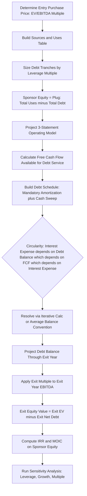

## Leveraged Buyout Modeling Fundamentals

### Overview

Leveraged buyout (LBO) modeling is the financial analysis framework used to evaluate acquisitions of a company funded predominantly with debt, where the target's own assets and cash flows serve as collateral and repayment source. The model projects the acquired company's operating performance, debt paydown, and eventual exit value to determine the equity returns achievable by the financial sponsor, and is a core analytical tool in private equity buyout transaction evaluation.

### Core LBO Mechanics

**Key Points**

- An LBO is structured so that a financial sponsor (private equity firm) acquires a target company using a relatively small proportion of equity capital and a relatively large proportion of debt financing, with the acquired company's own cash flows used to service and repay that debt over the holding period.
- **Value creation levers in an LBO** are traditionally decomposed into three components: (1) **EBITDA growth** (operational improvement and/or revenue growth during the holding period), (2) **multiple expansion/contraction** (the difference between the entry and exit valuation multiple), and (3) **debt paydown / deleveraging** (reduction in net debt over the holding period, which increases the equity value at exit even if enterprise value is unchanged).
- **Leverage amplification effect**: Because equity represents a smaller proportion of the total purchase price, a given percentage increase in enterprise value translates into a proportionally larger percentage increase in equity value — this leverage effect is central to why LBOs can generate high equity returns even from modest enterprise value growth, but also means losses are similarly amplified on the downside.

### Sources and Uses of Funds

**Key Points**

- **Sources** (where the acquisition capital comes from): senior secured debt (term loans, revolving credit facility), subordinated/mezzanine debt, high-yield bonds, sponsor equity contribution, and sometimes seller rollover equity (where existing owners/management retain a partial equity stake) or seller financing.
- **Uses** (what the capital is used for): purchase of target equity (based on the agreed purchase price), refinancing of existing target debt, transaction fees (advisory, legal, financing fees), and often a minimum cash balance left on the target's post-close balance sheet.
- A **sources and uses table** must balance — total sources must equal total uses — and is typically the first schedule built in an LBO model before projecting operating performance.

### Typical Sources and Uses Table Structure

| Sources | Amount | Uses | Amount |
| --- | --- | --- | --- |
| Senior Term Loan | $X | Purchase of Target Equity | $Y |
| Subordinated Debt | $X | Refinance Existing Debt | $Y |
| Sponsor Equity | $X | Transaction Fees | $Y |
| Management Rollover | $X | Minimum Cash | $Y |
| **Total Sources** | **$Total** | **Total Uses** | **$Total** |

### Purchase Price and Entry Valuation

**Key Points**

- LBO entry valuation is commonly expressed as an **EV/EBITDA multiple** applied to the target's trailing twelve months (LTM) or projected forward EBITDA, though other multiples (EV/Revenue, EV/EBIT) may be used depending on industry and company characteristics.
- **Enterprise Value to Equity Value bridge**: Purchase price is typically negotiated on an enterprise value basis, then converted to the equity purchase price by subtracting net debt (total debt less cash) and other adjustments (e.g., minority interest, preferred equity) assumed at close:

$$\text{Equity Purchase Price} = \text{Enterprise Value} - \text{Net Debt} - \text{Other Claims}$$

- **Transaction fees** (financing fees, advisory/legal fees) are typically capitalized and amortized (for financing fees) or expensed (for advisory fees) depending on the fee type and applicable accounting treatment, and must be funded as part of total uses.

### Debt Structuring and the Debt Schedule

**Key Points**

- **Debt tranches** in a typical LBO capital structure are layered by seniority and cost, from lowest-cost/most senior to highest-cost/most subordinated: revolving credit facility (for working capital needs), senior secured term loan, senior subordinated notes/high-yield bonds, and mezzanine debt (sometimes including an equity kicker such as warrants).
- **Leverage multiple**: Total debt is commonly expressed as a multiple of EBITDA (e.g., "5.0x Debt/EBITDA"), which serves as a key input constraint reflecting what lenders are willing to underwrite for a given target's cash flow stability and industry.
- **Mandatory amortization**: Term loans typically require scheduled mandatory principal repayment (e.g., a percentage of original principal per year) in addition to interest payments.
- **Cash flow sweep**: Many LBO debt structures require some or all of excess free cash flow (after mandatory debt service and operating needs) to be used to pay down debt early, accelerating deleveraging beyond the mandatory amortization schedule; sweep percentages sometimes step down or apply differentially across debt tranches based on a specified payment waterfall (senior debt swept before subordinated debt).
- **Financial covenants**: Debt agreements typically impose covenants (e.g., maximum leverage ratio, minimum interest coverage ratio) that the target must maintain, with breach potentially triggering default or requiring lender consent/waiver.

### Building the Debt Schedule (Circularity Consideration)

The debt schedule in an LBO model is inherently **circular**: interest expense depends on the debt balance, but the debt balance (via the cash flow sweep) depends on free cash flow available after interest expense, which itself depends on interest expense. This circularity is typically resolved via one of two approaches:

1. **Iterative calculation with a circularity switch** — Enabling iterative calculation in the modeling software, often paired with a manual "circularity breaker" toggle that can zero out the circular reference temporarily to avoid broken formulas or error propagation.
2. **Average balance method** — Calculating interest expense based on the average of beginning and ending debt balances within the period, which still creates circularity but is a standard convention for approximating the effect of paying down debt throughout the year rather than only at year-end.

[Inference] The specific mechanical implementation of circularity handling (iterative Excel calculation, VBA macros, or a non-circular approximation using beginning-of-period balances only) is a modeling convention choice rather than a single prescribed industry standard, and practitioners vary in their preferred approach.

### Projecting Operating Performance

**Key Points**

- The LBO model requires a full three-statement projection (income statement, balance sheet, cash flow statement) of the target's standalone operating performance over the holding period, typically build from revenue growth and margin assumptions down through EBITDA, EBIT, and net income.
- **Free cash flow available for debt paydown** is typically calculated starting from EBITDA and working down through cash taxes, changes in net working capital, capital expenditures, and mandatory debt service, to arrive at discretionary cash flow available for the cash flow sweep.

$$FCF_{available for sweep} = EBITDA - CapEx - \Delta NWC - Cash\ Taxes - Mandatory\ Debt\ Service$$

- **Management case vs. sponsor case**: Sponsors typically build their own set of operating assumptions (a "sponsor case") that may be more conservative than management's own projections (the "management case"), given management's potential incentive to present optimistic projections during the sale process.

### Exit Assumptions and Equity Value Realization

**Key Points**

- **Exit multiple assumption**: The model requires an assumed exit EV/EBITDA multiple at the end of the holding period, commonly assumed to be equal to the entry multiple as a conservative baseline ("no multiple expansion" case), with sensitivity analysis run around higher/lower exit multiples.
- **Exit enterprise value** is calculated as the projected exit-year EBITDA multiplied by the assumed exit multiple; exit equity value is then calculated by subtracting the projected net debt balance at exit (which reflects cumulative debt paydown over the holding period).

$$\text{Exit Equity Value} = (\text{Exit Year EBITDA} \times \text{Exit Multiple}) - \text{Net Debt at Exit}$$

- **Holding period**: LBO holding periods are commonly modeled over a multi-year horizon (often cited in industry practice as roughly 3–7 years), consistent with the harvesting/exit period discussed under private equity fund lifecycle.

### Return Metrics: IRR and MOIC

**Key Points**

- **Internal Rate of Return (IRR)** — The annualized rate of return on the sponsor's equity investment, solved as the discount rate that equates the present value of the initial equity outlay to the present value of the exit equity proceeds (and any interim distributions):

$$0 = -\text{Equity Investment} + \frac{\text{Exit Equity Value} + \text{Interim Distributions}}{(1+IRR)^n}$$

- **Multiple on Invested Capital (MOIC)** — The simple (non-annualized) ratio of total equity value returned to total equity invested:

$$MOIC = \frac{\text{Exit Equity Value} + \text{Interim Distributions}}{\text{Initial Equity Investment}}$$

- IRR and MOIC provide complementary information: MOIC measures absolute wealth multiplication, while IRR measures the time-weighted annualized efficiency of that return — a deal with a lower MOIC achieved over a shorter holding period can produce a higher IRR than a deal with a higher MOIC achieved over a much longer holding period.

### Sensitivity Analysis

**Key Points**

- LBO models are typically stress-tested across key variable pairs to understand return sensitivity, most commonly **entry multiple vs. exit multiple** and **leverage level vs. EBITDA growth rate**, presented as a sensitivity/data table showing resulting IRR or MOIC across a grid of assumption combinations.
- **Downside case modeling**: Sponsors typically model a downside operating scenario (lower revenue growth, margin compression) to assess whether the target can still service mandatory debt obligations and covenants under stress, since excessive leverage combined with underperformance can trigger covenant breach or default risk.

### Worked Numerical Example

**Example**

A sponsor acquires a target company with the following assumptions:

**Entry:**

- LTM EBITDA: $50,000,000
- Entry multiple: 8.0x EV/EBITDA
- Entry Enterprise Value: $400,000,000
- Existing net debt assumed refinanced (excluded from equity purchase price calc for simplicity)
- Transaction fees: $10,000,000
- Total Uses = $400,000,000 + $10,000,000 = $410,000,000

**Sources:**

- Senior Debt: 4.0x EBITDA = $200,000,000
- Subordinated Debt: 1.5x EBITDA = $75,000,000
- Sponsor Equity (plug): $410,000,000 − $200,000,000 − $75,000,000 = $135,000,000

**Operating projections (5-year hold):**

- EBITDA grows from $50,000,000 at entry to $72,000,000 by Year 5 (approximately 7.6% CAGR)
- Cumulative free cash flow over 5 years used to pay down debt: $95,000,000 (via mandatory amortization + cash sweep)
- Total debt at exit: $275,000,000 − $95,000,000 = $180,000,000

**Exit (Year 5):**

- Exit multiple assumption: 8.0x EV/EBITDA (no multiple expansion)
- Exit Enterprise Value: $72,000,000 × 8.0 = $576,000,000
- Exit Net Debt: $180,000,000
- Exit Equity Value: $576,000,000 − $180,000,000 = $396,000,000

**Step — Compute MOIC:**

$$MOIC = \frac{\$396{,}000{,}000}{\$135{,}000{,}000} \approx 2.93x$$

**Step — Compute IRR (5-year holding period):**

$$IRR = \left(\frac{396{,}000{,}000}{135{,}000{,}000}\right)^{1/5} - 1 \approx (2.933)^{0.2} - 1 \approx 0.2397 \approx 24.0\%$$

**Conclusion**

The transaction generates an approximate 2.93x MOIC and 24.0% IRR over the five-year holding period, driven by a combination of EBITDA growth (from $50M to $72M) and substantial deleveraging ($95M of debt paydown), with no contribution from multiple expansion in this scenario (entry and exit multiples held constant at 8.0x). This decomposition — separating the equity value gain into EBITDA growth, debt paydown, and multiple change contributions — is a standard way of communicating "where the returns came from" in an LBO analysis, and is frequently presented as a value creation bridge/waterfall alongside the headline IRR and MOIC figures.

### LBO Modeling Process Flow

### Value Creation Bridge Diagram

<svg xmlns="http://www.w3.org/2000/svg" viewBox="0 0 760 380" font-family="Arial, sans-serif">
<text x="380" y="28" font-size="18" font-weight="bold" text-anchor="middle" fill="#1a1a1a">LBO Equity Value Creation Bridge (svg_diagram)</text>
<rect x="40" y="250" width="110" height="90" fill="#e8f0fe" stroke="#3b5bdb" stroke-width="1.5" />
<text x="95" y="280" font-size="11" text-anchor="middle" fill="#1a1a1a">Entry Equity</text>
<text x="95" y="296" font-size="11" text-anchor="middle" fill="#1a1a1a">\$135M</text>
<rect x="190" y="150" width="110" height="190" fill="#d3f9d8" stroke="#2f9e44" stroke-width="1.5" />
<text x="245" y="175" font-size="10" text-anchor="middle" fill="#1a1a1a">EBITDA</text>
<text x="245" y="190" font-size="10" text-anchor="middle" fill="#1a1a1a">Growth</text>
<text x="245" y="230" font-size="10" text-anchor="middle" fill="#1a1a1a">+\$176M</text>
<text x="245" y="248" font-size="9" text-anchor="middle" fill="#495057">(EV gain from</text>
<text x="245" y="260" font-size="9" text-anchor="middle" fill="#495057">EBITDA increase</text>
<text x="245" y="272" font-size="9" text-anchor="middle" fill="#495057">at const. multiple)</text>
<rect x="340" y="330" width="110" height="10" fill="#fff3bf" stroke="#e8a33d" stroke-width="1.5" />
<text x="395" y="355" font-size="10" text-anchor="middle" fill="#1a1a1a">Multiple Exp.</text>
<text x="395" y="368" font-size="10" text-anchor="middle" fill="#1a1a1a">\$0M (flat)</text>
<rect x="490" y="115" width="110" height="225" fill="#ffe3e3" stroke="#e03131" stroke-width="1.5" />
<text x="545" y="140" font-size="10" text-anchor="middle" fill="#1a1a1a">Debt</text>
<text x="545" y="155" font-size="10" text-anchor="middle" fill="#1a1a1a">Paydown</text>
<text x="545" y="200" font-size="10" text-anchor="middle" fill="#1a1a1a">+\$95M</text>
<rect x="640" y="55" width="110" height="285" fill="#e8f0fe" stroke="#3b5bdb" stroke-width="2" />
<text x="695" y="85" font-size="11" text-anchor="middle" fill="#1a1a1a">Exit Equity</text>
<text x="695" y="101" font-size="11" text-anchor="middle" fill="#1a1a1a">\$396M</text>

<text x="380" y="365" font-size="10" text-anchor="middle" fill="`#495057`">Entry $135M → Exit $396M (2.93x MOIC)</text>

</svg>

### Common Pitfalls

**Key Points**

- Failing to properly resolve the interest expense/debt balance circularity, leading to broken model formulas or errors that propagate through the entire projection.
- Treating the exit multiple as certain to equal or exceed the entry multiple; using an unrealistically favorable exit multiple assumption significantly overstates modeled returns, and conservative practice typically assumes no multiple expansion (exit multiple ≤ entry multiple) as a base case.
- Overlooking financial covenant constraints when sizing leverage, which can result in a capital structure that is arithmetically feasible on a spreadsheet but would not actually be underwritable by real lenders given covenant and market leverage norms for the target's industry and cash flow profile.
- Ignoring transaction fees and minimum cash requirements in the sources and uses table, which understates the total equity check actually required to close the transaction.
- Confusing MOIC and IRR when comparing deals with different holding periods — a higher MOIC does not necessarily imply a higher IRR if achieved over a substantially longer hold.
- [Unverified] Specific leverage multiples, entry/exit multiple ranges, and typical holding periods cited reflect commonly discussed industry conventions that vary by market cycle, target industry, and financing market conditions, and should be checked against current market data before use in an actual transaction analysis.

**Related Topics**

- Private Equity Fund Structures and Lifecycle
- Debt Capital Markets: Term Loans, High-Yield Bonds, and Mezzanine Financing
- Portfolio Company Value Creation Levers (operational vs. financial engineering)
- Private Equity Exit Strategies (IPO, Strategic Sale, Secondary Buyout)
- Merger and Acquisition Valuation Methods (comparable companies, precedent transactions, DCF)
- Management Incentive Plans and Equity Rollover Structures
- Credit Agreement Covenants and Default Provisions
- Dividend Recapitalization Transactions
- Distressed Debt and Restructuring in Over-Levered LBOs