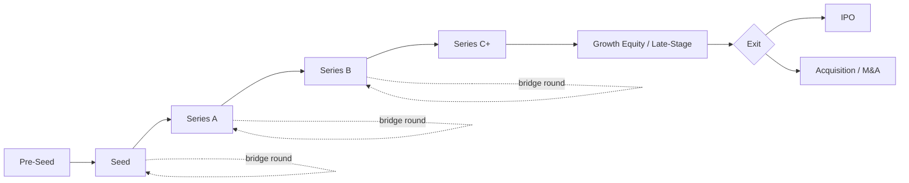

## Venture Capital Financing Stages

### Overview

Venture capital (VC) financing is structured across sequential **stages** that correspond to a startup's maturity, risk profile, and capital needs. Each stage involves different investor types, valuation methods, deal structures, and expected milestones. As a company progresses through stages, risk (theoretically) declines while capital requirements and valuations typically increase, though this progression is not strictly monotonic in practice.

### The General Financing Lifecycle

**Key Points**

- Pre-Seed → Seed → Series A → Series B → Series C (and later, if needed) → Growth/Late-Stage → Exit (IPO or M&A)
- Not all companies raise every stage; some skip stages or raise "bridge" rounds between stages
- Later stages are typically characterized by larger check sizes, more institutional investors, more formal governance (board seats, protective provisions), and increasingly detailed financial diligence

### Pre-Seed Stage

**Key Points**

- Earliest stage of external financing, often preceding a fully formed product or company
- Typical investors: founders' personal savings, friends and family, incubators/accelerators (e.g., Y Combinator, Techstars), angel investors, pre-seed-focused micro-VC funds
- Typical capital raised: **[Inference]** commonly in the range of tens of thousands to roughly $1–2 million, though this varies substantially by geography, sector, and market conditions and should not be treated as a fixed benchmark
- Primary use of funds: validating the idea, building a minimum viable product (MVP), initial market research
- Instruments used: SAFEs (Simple Agreements for Future Equity), convertible notes, or founder equity with no formal priced valuation

**Example**

Two co-founders raise $150,000 from an accelerator program and angel investors using a SAFE with a $5 million valuation cap, using the funds to build a working MVP and acquire the first handful of pilot customers before approaching institutional seed investors.

### Seed Stage

**Key Points**

- First institutional round for many startups; company typically has an MVP, some early user traction, and a nascent go-to-market strategy
- Typical investors: seed-stage VC funds, angel syndicates, some pre-seed funds following on
- Typical capital raised: **[Inference]** commonly ranges from roughly $1 million to $4 million, though "seed" round sizes have grown substantially larger over the past decade in many markets and vary widely by sector
- Primary use of funds: product refinement, initial hiring (engineering, early sales), establishing product-market fit signals
- Instruments used: priced equity rounds (preferred stock) are increasingly common at seed, though SAFEs and convertible notes remain widely used, particularly for earlier or smaller seed rounds

### Series A

**Key Points**

- First major institutional VC round with formal, priced equity and a full term sheet
- Company typically has demonstrated **product-market fit** and a repeatable, if not yet fully scaled, revenue model or clear usage metrics
- Typical investors: Series A-focused VC funds (often lead investors with dedicated partners joining the board)
- Typical capital raised: **[Inference]** commonly in the range of roughly $5 million to $15 million, though this has expanded considerably in some markets and sectors in recent years
- Key focus: scaling the go-to-market motion, building out the core team, proving unit economics
- Governance: typically introduces a formal board structure, protective provisions for investors, and standard preferred stock rights (liquidation preference, anti-dilution, pro-rata rights)

### Series B

**Key Points**

- Focused on **scaling** an already-validated business model
- Company typically has meaningful revenue, a clear growth trajectory, and is expanding into new markets, verticals, or customer segments
- Typical investors: growth-oriented VC funds, sometimes with continued participation from Series A investors exercising pro-rata rights
- Typical capital raised: **[Inference]** commonly in the range of roughly $15 million to $40 million, again with substantial variation by sector and geography
- Key focus: scaling operations, sales and marketing expansion, sometimes geographic expansion or M&A of smaller competitors

### Series C and Beyond

**Key Points**

- Later rounds (Series C, D, E, etc.) fund continued scaling, market expansion, and sometimes strategic acquisitions
- Typical investors: late-stage VC funds, private equity growth funds, hedge funds, sovereign wealth funds, and crossover investors (funds that invest in both private and public markets)
- Company profile: established revenue base, often approaching or at profitability, preparing for eventual exit (IPO or acquisition)
- Valuations at this stage increasingly rely on comparable public company multiples in addition to growth-adjusted metrics

### Bridge and Extension Rounds

**Key Points**

- Interim financing raised between formal priced rounds, often to extend runway to reach a valuation-supportive milestone before the next round
- Commonly structured as convertible notes or SAFEs that convert into the next priced round, often with a discount and/or valuation cap
- **[Inference]** A bridge round can sometimes signal that a company did not reach the milestones needed to raise its next round on favorable terms at the originally anticipated timeline, though bridges are also used proactively by well-performing companies simply to opportunistically extend runway

### Growth Equity / Late-Stage Financing

**Key Points**

- Distinguished from traditional VC by focusing on companies with established, proven business models seeking capital primarily for scaling rather than validating a concept
- Typically involves less operational risk but still meaningful growth risk
- Often includes structured terms such as liquidation preferences with participation rights, given the larger check sizes involved
- Common investors: dedicated growth equity funds (e.g., segments of firms like Insight Partners, General Atlantic, TCV), crossover hedge funds, and late-stage arms of traditional VC firms

### Comparison Table: Typical Characteristics by Stage

| Stage | Company Maturity | Typical Investors | Primary Instrument | Key Milestone |
| --- | --- | --- | --- | --- |
| Pre-Seed | Idea/MVP | Founders, F&F, accelerators, angels | SAFE / convertible note | Validate concept |
| Seed | Early product, early users | Seed VCs, angel syndicates | SAFE, convertible note, or priced equity | Early product-market fit signals |
| Series A | Product-market fit | Series A VCs | Priced preferred equity | Repeatable go-to-market motion |
| Series B | Scaling | Growth VCs | Priced preferred equity | Proven unit economics, expansion |
| Series C+ | Established, scaling further | Late-stage VC, PE growth, crossover funds | Priced preferred equity | Path to profitability / exit readiness |
| Growth Equity | Mature, proven model | Growth equity funds, crossover investors | Priced equity, sometimes structured | Continued scaling toward exit |

**[Inference]** The specific capital ranges, valuation levels, and stage-defining milestones described above are broad, commonly cited heuristics rather than fixed rules; actual deal parameters vary considerably by industry (e.g., capital-intensive biotech vs. asset-light SaaS), geographic market, and prevailing macroeconomic/fundraising conditions, and the boundaries between adjacent stages have become increasingly blurred in practice.

### Valuation Approaches by Stage

**Key Points**

- **Pre-seed/Seed**: valuation is largely qualitative — based on team quality, market size (TAM/SAM/SOM), and comparable deal terms, since there is often little or no revenue to anchor a valuation
- **Series A/B**: valuation increasingly incorporates revenue multiples (e.g., multiple of annual recurring revenue for SaaS), growth rate, and comparable recent financings in the sector
- **Series C+/Growth**: valuation approaches converge toward methods used in later-stage private and public markets — comparable company multiples, discounted cash flow analysis (where cash flows are more predictable), and precedent transaction multiples

### Key Investor Protections Introduced Across Stages

**Key Points**

- **Liquidation preference**: ensures investors receive a specified multiple of their investment back before common shareholders receive proceeds in an exit
- **Anti-dilution protection**: protects investors from being diluted at a lower valuation in a future "down round" (commonly via broad-based weighted average or, less commonly, full ratchet provisions)
- **Pro-rata rights**: allow existing investors to maintain their ownership percentage by participating in future rounds
- **Board seats and protective provisions**: increasingly formalized at each subsequent round, giving investors greater governance influence as check sizes grow

### Diagram: VC Financing Stage Progression

### Common Pitfalls in Understanding VC Stages

**Key Points**

- Treating stage-specific capital ranges and valuations as fixed rules rather than broad, market-dependent heuristics
- Assuming every company must raise every stage sequentially; many successful companies skip stages, raise unconventionally large or small rounds, or reach profitability without further institutional financing
- Confusing a bridge/extension round with a formal priced round when analyzing a company's fundraising history
- Overlooking that instrument choice (SAFE/convertible note vs. priced equity) can vary at the same nominal "stage" depending on market conditions and investor preference

### Conclusion

Venture capital financing stages provide a structured, if increasingly flexible, framework for understanding how startups raise capital as they mature from an unproven idea to a scaled, exit-ready business. Each stage is associated with characteristic investor types, instruments, deal terms, and capital needs, though the boundaries between stages have blurred considerably as seed rounds have grown larger and growth-stage financing has taken on many private equity-style structuring characteristics. Understanding this progression is essential for analyzing dilution, valuation methodology, and investor rights across a company's private financing history.

**Related Topics**

- SAFEs and convertible notes: mechanics and conversion terms
- Liquidation preferences and waterfall analysis
- Cap table modeling and dilution across financing rounds
- Term sheet negotiation and key VC deal terms
- Down rounds and anti-dilution provisions
- Venture capital fund structure and the J-curve
- Exit strategies: IPO vs. strategic acquisition