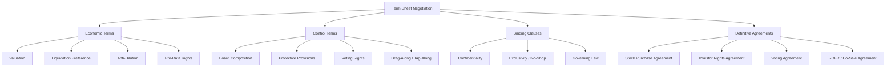

## Term Sheets and Deal Structuring

### Overview

A term sheet is a non-binding document outlining the principal terms of a proposed private equity (PE) or venture capital (VC) investment, serving as the blueprint for definitive legal agreements. It aligns investor and company expectations on valuation, control, economics, and governance before parties incur the legal costs of full documentation.

### Core Legal Nature

- Term sheets are generally **non-binding** on price and structural terms, but specific clauses are typically carved out as **binding**: confidentiality, exclusivity/no-shop, governing law, and expenses.
- They reduce negotiation risk by surfacing deal-breakers early, before drafting the Stock Purchase Agreement (SPA) and ancillary documents.
- [Inference] The binding/non-binding split is standard market practice but final enforceability depends on jurisdiction and precise drafting language.

### Key Components of a Term Sheet

#### 1. Valuation and Investment Amount

- **Pre-money valuation**: Company value before new investment.
- **Post-money valuation**: Pre-money valuation plus new investment.

$$\text{Post-money Valuation} = \text{Pre-money Valuation} + \text{Investment Amount}$$

- **Price per share**:

$$\text{Price per Share} = \frac{\text{Pre-money Valuation}}{\text{Fully Diluted Pre-money Shares Outstanding}}$$

**Example**: A company with a $40M pre-money valuation and 20M fully diluted shares outstanding has a price per share of $2.00. A $10M investment yields a post-money valuation of $50M, with the investor owning 20% ($10M / $50M).

#### 2. Security Type

- **Common Stock**: Typically held by founders and employees; lowest priority in liquidation.
- **Preferred Stock**: Standard VC instrument, carrying liquidation preferences, dividends, anti-dilution rights, and conversion rights.
- **Convertible Notes / SAFEs**: Debt or equity-like instruments used in early-stage rounds, converting to preferred stock at a later priced round, often with a **discount rate** and/or **valuation cap**.

#### 3. Liquidation Preference

Determines the payout order and amount to preferred holders upon a liquidity event (sale, merger, dissolution) before common shareholders receive proceeds.

- **Non-participating preferred**: Investor receives the greater of (a) their liquidation preference or (b) their as-converted common share of proceeds — not both.
- **Participating preferred**: Investor receives their liquidation preference **and then** participates pro-rata in remaining proceeds with common holders ("double-dip").
- **Multiple**: Commonly expressed as 1x, but can be 2x, 3x, etc., meaning the investor receives that multiple of their original investment before others are paid.

$$\text{Liquidation Payout (Non-Participating)} = \max(\text{Preference Amount}, \text{As-Converted Value})$$

$$\text{Liquidation Payout (Participating)} = \text{Preference Amount} + \text{Pro-rata Share of Remaining Proceeds}$$

**Example**: An investor puts in $5M with a 1x non-participating preference for 20% ownership. On a $50M exit:

- As-converted value: 20% × $50M = $10M
- Since $10M > $5M preference, investor takes the as-converted $10M (converts to common).

If instead the exit is $15M:

- As-converted value: 20% × $15M = $3M
- Since $5M preference > $3M, investor takes the $5M preference instead.

#### 4. Anti-Dilution Protection

Protects investors from value erosion in a **down round** (subsequent financing at a lower valuation).

- **Full ratchet**: Conversion price is reset to the new, lower issuance price, regardless of how many new shares are issued. Highly investor-favorable and founder-unfriendly.
- **Weighted average (broad-based / narrow-based)**: Adjusts the conversion price based on both the price and quantity of new shares issued, diluting the impact proportionally. Broad-based includes all fully diluted shares in the calculation; narrow-based includes only outstanding common/preferred, producing a more aggressive adjustment.

$$\text{New Conversion Price (Broad-Based Weighted Average)} = CP_1 \times \frac{A + B}{A + C}$$

Where:

- $CP_1$ = Original conversion price
- $A$ = Fully diluted shares outstanding before new issuance
- $B$ = Shares that would have been issued at the original conversion price for the new consideration received
- $C$ = New shares actually issued

#### 5. Governance and Control Provisions

- **Board composition**: Specifies board seats allocated to founders, investors, and independent directors.
- **Protective provisions**: Veto rights for preferred holders over specific actions (issuing senior securities, incurring debt above a threshold, M&A, changing the charter).
- **Voting rights**: Typically as-converted with common stock, though separate class votes apply to protective provisions.
- **Information rights**: Investor entitlement to financial statements, budgets, and periodic reporting.
- **Drag-along rights**: Compel minority holders to join a sale approved by a specified majority.
- **Tag-along (co-sale) rights**: Allow minority holders to join a sale on the same terms if a major holder sells.

#### 6. Economic and Ownership Protections

- **Pro-rata rights**: Allow existing investors to maintain their ownership percentage in future financing rounds.
- **Pay-to-play**: Requires investors to participate in future down rounds or lose certain preferential rights (e.g., conversion to common, loss of anti-dilution).
- **Redemption rights**: Allow investors to force the company to repurchase their shares after a specified period (common in PE, less so in early-stage VC).

#### 7. Vesting and Employee Matters

- **Founder/employee vesting**: Standard structure is a 4-year vesting schedule with a 1-year cliff.
- **Option pool**: Shares reserved for future employee grants, often expanded pre-money at investor insistence, which dilutes existing founders disproportionately (the "option pool shuffle").

$$\text{Effective Founder Dilution} = \text{Investment \%} + \text{Option Pool Expansion \%}$$

**Example**: If a term sheet requires a 15% post-financing option pool to be created pre-money, this dilution is borne entirely by existing shareholders (mostly founders), not the incoming investor, effectively lowering the true pre-money valuation for founders.

### Term Sheet Structure Diagram

### PE vs. VC Deal Structuring Differences

| Dimension | Venture Capital | Private Equity (Buyout) |
| --- | --- | --- |
| Security type | Preferred stock (minority stake) | Common equity + significant leverage |
| Control | Board seats, protective provisions | Majority/full control, often 100% ownership |
| Leverage | Minimal to none | High (LBO structures, debt-to-EBITDA multiples) |
| Liquidation preference | Central negotiating point | Less relevant (majority owner) |
| Exit mechanics | IPO, acquisition | Sale, recapitalization, secondary buyout |
| Management incentives | Option pools | Management rollover equity, incentive plans (MIPs) |

### Leveraged Buyout (LBO) Structuring Considerations

In PE buyouts, deal structuring centers on capital structure optimization rather than preference stacks:

$$\text{Purchase Price} = \text{Equity Contribution} + \text{Debt Financing}$$

$$\text{Equity IRR} \approx \left(\frac{\text{Exit Equity Value}}{\text{Entry Equity Value}}\right)^{1/n} - 1$$

Where $n$ is the holding period in years. Key structuring levers include senior debt tranches, mezzanine/subordinated debt, seller notes, and management rollover equity, each carrying distinct covenants and priority in the capital stack.

### Common Negotiation Dynamics

- Founders typically prioritize: valuation, option pool size, board control, and vesting acceleration triggers.
- Investors typically prioritize: liquidation preference terms, anti-dilution protection, protective provisions, and pro-rata/information rights.
- **[Inference]** Deals with strong founder leverage (competitive term sheets, high-growth metrics) tend to see more founder-friendly terms (1x non-participating preference, broad-based weighted average anti-dilution), while investor-favorable markets or distressed situations tend to see participating preferred and full-ratchet anti-dilution.

### Double Trigger Acceleration

A protective mechanism combining two conditions for accelerated vesting:

1. **Trigger 1**: Change of control (acquisition/merger).
2. **Trigger 2**: Termination without cause or resignation for good reason within a specified window post-acquisition.

This protects founders/employees from being terminated post-acquisition without receiving unvested equity, while still incentivizing them to stay through the transition.

### Key Points

- Term sheets set the framework; definitive agreements (SPA, IRA, Voting Agreement, ROFR/Co-Sale Agreement) provide binding legal enforceability.
- Liquidation preference structure and anti-dilution mechanism are typically the highest-impact negotiation points on realized investor and founder returns.
- The option pool shuffle is a common but often overlooked source of effective founder dilution.
- PE deal structuring emphasizes leverage and capital stack optimization; VC deal structuring emphasizes preference stacks and control rights over a minority stake.

### Related Topics

- Capitalization table modeling and dilution waterfalls
- Convertible notes vs. SAFEs: mechanics and conversion triggers
- Drag-along, tag-along, and right of first refusal (ROFR) provisions
- LBO modeling and capital structure design
- Management incentive plans (MIPs) and carried interest structures
- Down round mechanics and pay-to-play provisions
- Exit waterfall modeling across multiple financing rounds