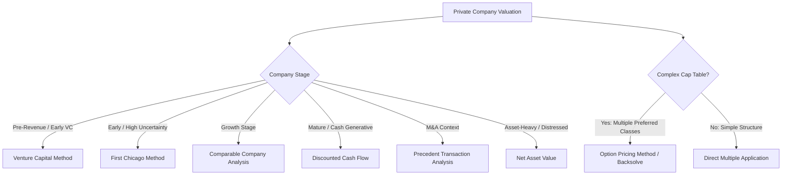

## Valuation Methods in Private Markets

### Overview

Private market valuation differs fundamentally from public market valuation due to the absence of continuous price discovery, lower liquidity, information asymmetry, and the frequent presence of complex capital structures (multiple preferred share classes). Valuation methods must therefore account for illiquidity, control premiums/discounts, and negotiated rather than market-clearing prices.

### 1. Comparable Company Analysis (CCA / "Public Comps")

Values a private company by applying valuation multiples derived from publicly traded peers.

**Process**:

1. Select comparable public companies (similar industry, size, growth, margin profile).
2. Calculate trading multiples: EV/Revenue, EV/EBITDA, P/E.
3. Apply the median or mean multiple to the target's financials.
4. Apply an **illiquidity discount** (Discount for Lack of Marketability, DLOM) since private shares cannot be readily sold.

$$\text{Implied EV} = \text{Target Metric} \times \text{Peer Multiple}$$

$$\text{Adjusted Value} = \text{Implied EV} \times (1 - \text{DLOM})$$

**[Inference]** DLOM in practice commonly ranges from 10%–30%, depending on company stage, restriction periods, and expected time to liquidity, though this varies significantly by situation and is often contested in valuation disputes.

**Example**: A private SaaS company with $20M ARR is compared to public SaaS peers trading at 6x EV/Revenue. Implied EV = $120M. Applying a 20% DLOM yields an adjusted value of $96M.

### 2. Precedent Transaction Analysis

Values a company based on multiples paid in comparable historical M&A or financing transactions.

$$\text{Implied Value} = \text{Target Metric} \times \text{Precedent Transaction Multiple}$$

- Captures **control premiums** since most transactions involve a change of control.
- Sensitive to market cycle timing; multiples paid during frothy periods may not reflect current conditions.
- Requires disclosed deal terms, which are often limited in private transactions (unlike public M&A, which has SEC disclosure requirements).

### 3. Discounted Cash Flow (DCF)

Values a company based on the present value of projected future free cash flows.

$$\text{Enterprise Value} = \sum_{t=1}^{n} \frac{FCF_t}{(1+r)^t} + \frac{TV_n}{(1+r)^n}$$

Where:

- $FCF_t$ = Free cash flow in year $t$
- $r$ = Discount rate (typically WACC)
- $TV_n$ = Terminal value at year $n$

**Terminal value (Gordon Growth Method)**:

$$TV_n = \frac{FCF_{n+1}}{r - g}$$

Where $g$ = perpetual growth rate.

**Private market adjustments**:

- Higher discount rates than public companies to reflect illiquidity and higher business risk, especially for early-stage companies with unproven cash flows.
- Often supplemented with scenario-weighted or probability-weighted DCF for high-uncertainty ventures.

**[Inference]** DCF is generally considered less reliable for early-stage/pre-revenue companies due to the high sensitivity of output to assumptions about growth and terminal value; it is more commonly applied to mature, cash-generative PE targets.

### 4. Venture Capital Method

A valuation approach specific to early-stage VC investing, working backward from an anticipated exit value.

**Steps**:

1. Estimate **exit value** (terminal value at expected exit, often via a comparable multiple applied to projected revenue/earnings).
2. Discount back using a **target rate of return** (VC hurdle rate, often 30%–70% depending on stage risk).
3. Derive post-money valuation, then subtract investment to get pre-money valuation.

$$\text{Post-money Valuation} = \frac{\text{Exit Value}}{(1 + \text{Target ROI})^n}$$

$$\text{Pre-money Valuation} = \text{Post-money Valuation} - \text{Investment Amount}$$

$$\text{Required Ownership \%} = \frac{\text{Investment Amount}}{\text{Post-money Valuation}}$$

**Example**: An investor expects a company to exit in 5 years at $200M and requires a 10x return on investment.

$$\text{Post-money Valuation} = \frac{\$200M}{10} = \$20M$$

If the investment is $4M, pre-money valuation = $16M, and the investor requires 20% ownership.

Later rounds dilute this ownership, so VCs often build in an **anti-dilution adjustment factor** to account for expected future financing rounds when calculating required ownership today.

### 5. First Chicago Method

A scenario-based, probability-weighted valuation blending DCF logic across multiple outcome scenarios — commonly used for early/growth-stage companies with binary or highly variable outcomes.

$$\text{Expected Value} = \sum_{i} P_i \times V_i$$

Where $P_i$ is the probability of scenario $i$ (e.g., "success," "sideways," "failure") and $V_i$ is the valuation under that scenario, each typically derived via DCF or multiples.

**Example**:

| Scenario | Probability | Valuation | Weighted Value |
| --- | --- | --- | --- |
| Success (IPO) | 20% | $500M | $100M |
| Sideways (moderate growth) | 50% | $100M | $50M |
| Failure (shutdown/distressed sale) | 30% | $10M | $3M |
| **Total** | 100% | — | **$153M** |

### 6. Net Asset Value (NAV) / Asset-Based Approach

Values a company as the fair market value of its assets minus liabilities. Most relevant for:

- Asset-heavy businesses (real estate, holding companies).
- Distressed or liquidation scenarios.
- Fund-level reporting (PE fund NAV reflects the fair value of portfolio company holdings).

$$\text{NAV} = \text{Fair Value of Assets} - \text{Total Liabilities}$$

### 7. Option Pricing Method (OPM) / Black-Scholes Backsolve

Used to allocate enterprise value across a **complex capital structure** with multiple preferred share classes, each having different liquidation preferences, participation rights, and conversion thresholds. Treats each equity class as a call option on the company's total equity value with a strike price equal to the liquidation preference breakpoint.

$$C = S \cdot N(d_1) - K e^{-rt} \cdot N(d_2)$$

Where:

- $S$ = Total equity value
- $K$ = Breakpoint (liquidation preference threshold for a given share class)
- $r$ = Risk-free rate
- $t$ = Time to liquidity event
- $N(\cdot)$ = Cumulative standard normal distribution

$$d_1 = \frac{\ln(S/K) + (r + \sigma^2/2)t}{\sigma\sqrt{t}}, \quad d_2 = d_1 - \sigma\sqrt{t}$$

- Commonly used for **409A valuations** (fair market value of common stock for option grant compliance in the U.S.) and ASC 820 fair value reporting.
- Requires estimating volatility ($\sigma$), which for private companies is typically proxied from comparable public company volatility.

**[Unverified]** Specific 409A safe harbor requirements and methodology preferences can vary by valuation firm and are subject to IRS guidance that may be updated; consult current regulatory guidance for compliance-critical applications.

### Valuation Method Selection Diagram

### Discounts and Premiums Applied in Private Valuation

| Adjustment | Direction | Typical Driver |
| --- | --- | --- |
| Discount for Lack of Marketability (DLOM) | Reduces value | Illiquidity, no public market |
| Discount for Lack of Control (DLOC) | Reduces value | Minority, non-controlling stake |
| Control Premium | Increases value | Acquiring a controlling interest |
| Key-Person Discount | Reduces value | Dependency on a specific individual |

$$\text{DLOC} \approx 1 - \frac{1}{1 + \text{Control Premium}}$$

### Key Points

- No single method is universally correct; practitioners typically **triangulate** across multiple approaches (e.g., CCA, DCF, and precedent transactions) and reconcile the resulting valuation range.
- The VC Method and First Chicago Method are tailored for high-uncertainty, early-stage companies where traditional DCF is unreliable.
- The Option Pricing Method is essential when a company has a complex capital structure with multiple preferred share classes and is standard practice for 409A/fair value reporting.
- DLOM and DLOC adjustments are critical in private markets and have no direct analog in public market valuation.

### Related Topics

- 409A valuations and stock option fair market value compliance
- Cap table modeling with multiple preferred share classes
- Waterfall analysis and liquidation preference stacking
- Discount rate/WACC estimation for private companies
- Real options valuation in venture-backed companies
- Portfolio company fair value reporting under ASC 820 / IFRS 13