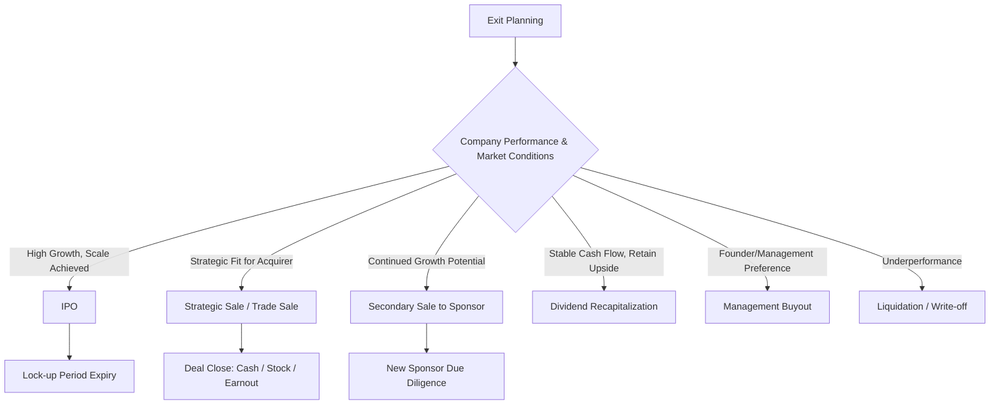
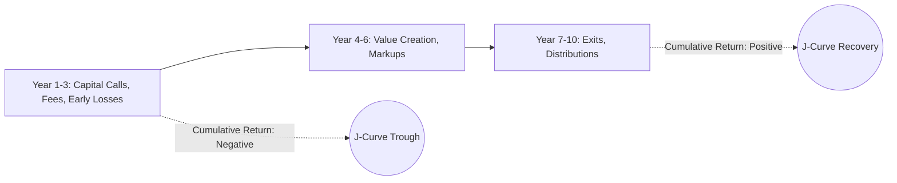

## Exit Strategies and Returns Analysis

### Overview

Exit strategy is the mechanism by which private equity and venture capital investors realize liquidity and returns on an illiquid investment. Since PE/VC funds are typically structured as closed-end vehicles with finite lives (commonly 10 years), exit planning is integral to the investment thesis from the outset, and returns analysis quantifies performance both at the deal level and fund level.

### Primary Exit Strategies

#### 1. Initial Public Offering (IPO)

The company lists shares on a public exchange, allowing investors to sell shares (often subject to a **lock-up period**, typically 90–180 days post-IPO).

- Provides the highest potential valuation ceiling and public market liquidity.
- Requires regulatory compliance (e.g., SEC registration in the U.S.), significant scale, and consistent growth/profitability narrative.
- Investors typically exit gradually post-lock-up rather than all at once, to manage market impact and signaling effects.

**[Inference]** IPO exits are generally more common for VC-backed growth companies than for traditional PE buyout targets, though large PE-backed companies do IPO as well (particularly via sponsor-backed IPOs).

#### 2. Strategic Acquisition (Trade Sale)

Sale of the company to a strategic buyer (typically a larger corporation in the same or adjacent industry) seeking synergies, market access, or technology.

- Strategic buyers often pay a **premium** over financial buyers due to expected synergies (revenue or cost).
- Faster execution than IPO; no lock-up or public disclosure requirements.
- Common structures: all-cash, stock-for-stock, or cash-and-stock combinations, sometimes with **earnouts** tied to post-acquisition performance milestones.

#### 3. Secondary Sale (Sponsor-to-Sponsor)

Sale of the company to another private equity firm or financial sponsor.

- Common in PE when the buying firm sees continued value-creation opportunity (e.g., different growth stage expertise, additional capital for expansion).
- Also refers to **secondary market transactions** where LPs sell fund interests to other LPs, or where VC investors sell shares to secondary funds before a company-level exit.

#### 4. Recapitalization

The company raises new debt or equity to pay a dividend to existing investors, partially returning capital without a full exit.

- **Dividend recapitalization**: Portfolio company issues new debt, proceeds distributed to PE sponsor as a dividend, while the sponsor retains ownership.
- Allows partial liquidity while preserving upside in the remaining stake.
- Increases company leverage, raising financial risk.

#### 5. Management Buyout (MBO) / Buyback

Existing management team, sometimes with new financing, repurchases the investor's stake.

- Common exit for smaller or founder-centric businesses where a sale to a third party is undesirable.
- Requires management to secure financing (often from a new PE sponsor or lender).

#### 6. Liquidation / Write-off

If the company fails or underperforms significantly, the investment may be wound down or written off entirely, realizing a partial or total loss.

### Exit Strategy Decision Diagram

### Returns Analysis Framework

#### 1. Internal Rate of Return (IRR)

The discount rate that sets the net present value of all cash flows (in and out) to zero.

$$0 = \sum_{t=0}^{n} \frac{CF_t}{(1+IRR)^t}$$

Where $CF_t$ includes capital calls (negative) and distributions (positive) at each time $t$.

- IRR is time-sensitive: a faster return of capital produces a higher IRR even with the same absolute dollar profit.
- Widely used but has known limitations: sensitive to timing/size of interim cash flows, and can be distorted by early distributions (e.g., dividend recaps) that inflate IRR without proportionally increasing total value.

#### 2. Multiple on Invested Capital (MOIC) / Multiple on Money (MOM)

$$\text{MOIC} = \frac{\text{Total Value Realized}}{\text{Total Capital Invested}}$$

- Time-agnostic: does not account for when cash flows occurred.
- Commonly paired with IRR to give a fuller performance picture (a high IRR with low MOIC may indicate a quick but small win; a high MOIC with low IRR may indicate a large but slow-maturing win).

**Example**: An investor deploys $10M and receives $35M in total distributions over 6 years.

$$\text{MOIC} = \frac{\$35M}{\$10M} = 3.5x$$

#### 3. Distributed to Paid-In Capital (DPI)

Measures realized returns only (cash actually returned to LPs), excluding unrealized value.

$$\text{DPI} = \frac{\text{Cumulative Distributions}}{\text{Cumulative Paid-In Capital}}$$

#### 4. Residual Value to Paid-In Capital (RVPI)

Measures unrealized value remaining in the fund.

$$\text{RVPI} = \frac{\text{Residual (Unrealized) Value}}{\text{Cumulative Paid-In Capital}}$$

#### 5. Total Value to Paid-In Capital (TVPI)

$$\text{TVPI} = \text{DPI} + \text{RVPI} = \frac{\text{Distributions} + \text{Residual Value}}{\text{Paid-In Capital}}$$

TVPI is functionally equivalent to gross MOIC at the fund level, combining both realized and unrealized value.

#### 6. Public Market Equivalent (PME)

Benchmarks PE/VC fund performance against what the same cash flows would have earned if invested in a public index (e.g., S&P 500), addressing IRR's lack of a market comparison.

$$\text{PME} = \frac{\text{FV of Distributions if Invested in Index}}{\text{FV of Contributions if Invested in Index}}$$

A PME greater than 1.0 indicates outperformance relative to the public benchmark.

### Gross vs. Net Returns

- **Gross returns**: Performance at the deal/portfolio level before fund-level fees and carried interest.
- **Net returns**: Performance to Limited Partners (LPs) after management fees (typically ~2% annually) and carried interest (typically ~20% of profits above a hurdle rate).

$$\text{Net Return to LPs} = \text{Gross Return} - \text{Management Fees} - \text{Carried Interest}$$

**Carried interest with hurdle rate (European waterfall, simplified)**:

$$\text{Carry} = \text{Carry \%} \times \max(0, \text{Profit} - \text{Hurdle Return})$$

**Example**: A fund achieves an 18% gross IRR against an 8% hurdle rate, with 20% carried interest and a 2% management fee. The GP earns carry only on the excess return above the 8% hurdle (subject to waterfall structure: American vs. European, and whether a GP catch-up provision applies), while LPs' net IRR will typically be several percentage points lower than gross IRR due to the combined fee and carry drag.

### J-Curve Effect

PE/VC funds typically exhibit a **J-curve** pattern: early years show negative returns (due to fees and unrealized investment costs before value creation materializes), followed by positive returns as portfolio companies mature and exit.

### Key Points

- Exit route selection depends on company scale, market conditions, sector dynamics, and the relative valuations offered by strategic vs. financial buyers vs. public markets.
- IRR and MOIC together provide a more complete returns picture than either alone; IRR captures time-value efficiency, MOIC captures absolute magnitude.
- DPI, RVPI, and TVPI are the standard LP-facing metrics for tracking realized vs. unrealized fund performance over the fund lifecycle.
- Net returns to LPs are materially lower than gross deal-level returns due to management fees and carried interest — this distinction is critical when evaluating fund track records.
- **[Inference]** The J-curve effect means early-fund-life IRR figures are typically poor early performance indicators and should be interpreted cautiously relative to a fund's eventual mature returns.

### Related Topics

- Carried interest waterfall structures (American vs. European) and GP catch-up mechanics
- Fund-level vs. deal-level performance attribution
- Secondary market transactions and LP-led secondaries
- Earnout structuring in M&A exits
- Dividend recapitalization mechanics and leverage risk
- Benchmarking private fund performance (PME, Kaplan-Schoar PME, Direct Alpha)