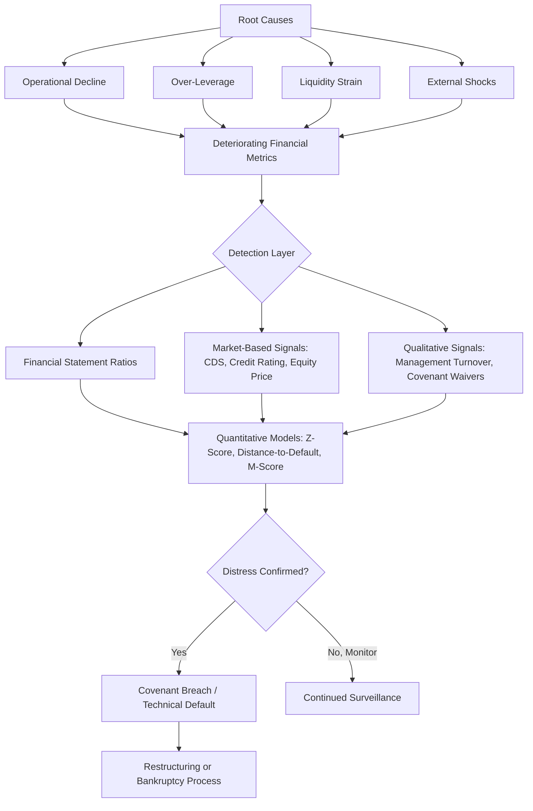

## Causes and Early Warning Signs of Distress

### Overview

Financial distress refers to a condition in which a company struggles to meet its financial obligations, arising from a deterioration in cash flow, capital structure imbalance, or operational underperformance. Identifying distress early — before covenant breach or default — is central to credit risk management, turnaround planning, and restructuring strategy.

### Categories of Causes

#### 1. Operational Causes

- **Declining revenue/margins**: Loss of market share, pricing pressure, or demand shocks.
- **Cost structure rigidity**: High fixed costs relative to revenue, limiting flexibility during downturns (high operating leverage).
- **Poor management execution**: Failed strategic initiatives, ineffective cost controls, or governance failures.
- **Industry disruption**: Technological obsolescence or new entrants eroding competitive position.

$$\text{Operating Leverage} = \frac{\% \Delta \text{EBIT}}{\% \Delta \text{Revenue}}$$

High operating leverage means small revenue declines cause disproportionately large profit declines, accelerating distress.

#### 2. Financial Causes

- **Over-leverage**: Excessive debt relative to cash flow generation capacity, often from aggressive LBOs or debt-funded acquisitions.
- **Maturity mismatch**: Short-term debt funding long-term assets, creating refinancing risk.
- **Interest rate exposure**: Floating-rate debt exposure during rising rate environments increasing debt service burden.
- **Covenant breaches**: Violation of financial maintenance covenants (leverage ratio, interest coverage ratio) triggering technical default even absent a payment default.

$$\text{Interest Coverage Ratio} = \frac{\text{EBIT}}{\text{Interest Expense}}$$

$$\text{Leverage Ratio} = \frac{\text{Total Debt}}{\text{EBITDA}}$$

#### 3. Liquidity Causes

- **Working capital mismanagement**: Extended receivables collection, inventory buildup, or compressed payables terms straining cash conversion.
- **Loss of access to credit**: Lenders tightening or withdrawing revolving credit facilities.
- **Cash burn without runway**: Particularly relevant for growth-stage companies burning cash faster than fundraising cycles can replenish it.

$$\text{Cash Conversion Cycle} = \text{DIO} + \text{DSO} - \text{DPO}$$

Where DIO = Days Inventory Outstanding, DSO = Days Sales Outstanding, DPO = Days Payables Outstanding. A lengthening cash conversion cycle signals deteriorating liquidity management.

#### 4. External/Macroeconomic Causes

- **Economic downturns**: Recession-driven demand contraction across a sector.
- **Regulatory changes**: New compliance costs or restricted business models.
- **Supply chain shocks**: Input cost spikes or availability disruptions.
- **Market/credit contraction**: Reduced availability of refinancing capital during credit tightening cycles.

### Early Warning Sign Categories

#### Financial Statement Indicators

| Indicator | Warning Signal |
| --- | --- |
| Declining or negative EBITDA margin trend | Erosion of core profitability |
| Rising leverage ratio (Debt/EBITDA) | Increasing insolvency risk |
| Falling interest coverage ratio (approaching 1x-2x) | Reduced cushion to service debt |
| Negative or declining free cash flow | Insufficient cash generation to fund operations/debt service |
| Increasing days sales outstanding (DSO) | Customers delaying payment, potential revenue quality issues |
| Auditor "going concern" opinion | Formal auditor doubt about continued viability |
| Frequent restatements or accounting changes | Potential earnings management or control weaknesses |

#### Market-Based Indicators

- **Widening credit default swap (CDS) spreads**: Market pricing in higher default probability.
- **Bond price/yield deterioration**: Falling bond prices, rising yields relative to benchmark.
- **Credit rating downgrades**: Formal reassessment by rating agencies (Moody's, S&P, Fitch).
- **Equity price decline and volatility**: Market repricing of equity value amid rising uncertainty (relevant for structural models like Merton's model).
- **Rising short interest**: Increased bets against the company's equity.

#### Operational/Qualitative Indicators

- Executive/board turnover, particularly CFO departures.
- Delayed financial reporting or SEC filing extensions.
- Loss of key customers, suppliers, or credit insurance withdrawal by trade creditors.
- Deferred capital expenditures or maintenance.
- Covenant waiver requests to lenders (a signal of anticipated or actual breach).
- Asset sales to raise liquidity outside the normal course of business.

### Quantitative Distress Prediction Models

#### Altman Z-Score

A multivariate model predicting bankruptcy probability for public manufacturing firms, using five weighted financial ratios.

$$Z = 1.2X_1 + 1.4X_2 + 3.3X_3 + 0.6X_4 + 1.0X_5$$

Where:

- $X_1$ = Working Capital / Total Assets
- $X_2$ = Retained Earnings / Total Assets
- $X_3$ = EBIT / Total Assets
- $X_4$ = Market Value of Equity / Total Liabilities
- $X_5$ = Sales / Total Assets

**Interpretation zones**:

- $Z > 2.99$: "Safe" zone
- $1.81 < Z < 2.99$: "Grey" zone
- $Z < 1.81$: "Distress" zone

**[Inference]** The Z-Score's coefficients were derived from historical manufacturing company data; predictive accuracy is generally considered lower for service, financial, or private companies, and modified variants (Z'-Score, Z''-Score) exist to address non-manufacturing and private company contexts.

#### Merton Structural (Distance-to-Default) Model

Models equity as a call option on firm assets, with default occurring when asset value falls below debt obligations at maturity.

$$\text{Distance to Default} = \frac{\ln(V_A/D) + (\mu - \sigma_A^2/2)T}{\sigma_A \sqrt{T}}$$

Where $V_A$ = asset value, $D$ = default point (debt value), $\mu$ = expected asset return, $\sigma_A$ = asset volatility, $T$ = time horizon. Lower distance-to-default implies higher near-term default probability.

#### Beneish M-Score

Focuses specifically on detecting earnings manipulation, which often precedes or masks distress.

$$M\text{-Score} = -4.84 + 0.92(DSRI) + 0.528(GMI) + 0.404(AQI) + 0.892(SGI) + 0.115(DEPI) - 0.172(SGAI) + 4.679(TATA) - 0.327(LVGI)$$

A score above approximately -1.78 suggests a higher likelihood of earnings manipulation. **[Unverified]** Exact threshold interpretation and component weightings are debated in academic literature and may be updated by subsequent research; treat as a screening heuristic rather than a definitive diagnostic.

### Early Warning Signal Flow

### The Distress Continuum

Distress typically progresses through identifiable stages rather than occurring suddenly:

1. **Latent distress**: Underlying weakness not yet visible in reported financials (e.g., emerging competitive threats).
2. **Financial distress (technical)**: Deteriorating ratios, covenant pressure, but payments still current.
3. **Covenant/technical default**: Breach of financial covenants without missing scheduled payments.
4. **Payment default**: Missed interest or principal payment.
5. **Insolvency/bankruptcy filing**: Formal legal restructuring or liquidation process initiated.

### Key Points

- Distress typically results from a combination of operational, financial, liquidity, and external factors rather than a single isolated cause.
- Early detection relies on triangulating financial statement ratios, market-based signals, and qualitative/behavioral indicators, since any single indicator can lag or be manipulated.
- Quantitative models (Z-Score, Distance-to-Default, M-Score) provide standardized screening tools but should be interpreted as probabilistic indicators, not definitive predictors, and their reliability varies by company type and industry.
- Covenant breach often precedes payment default, making covenant monitoring and waiver requests some of the earliest observable formal warning signs.

### Related Topics

- Corporate restructuring and workout negotiation strategies
- Chapter 11 vs. Chapter 7 bankruptcy processes
- Debt covenant design and covenant-lite lending trends
- Distressed debt investing and fulcrum security analysis
- Turnaround management and operational restructuring
- Credit rating methodology and rating agency processes