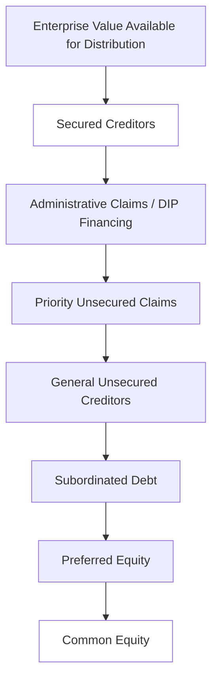
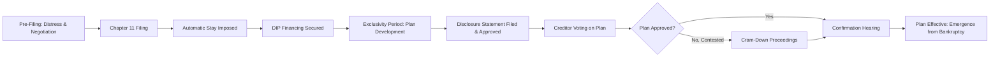

## Formal Bankruptcy Processes and Reorganization

### Overview

Formal bankruptcy is a legal process through which a financially distressed company either reorganizes its obligations to continue operating (reorganization) or liquidates its assets to repay creditors (liquidation). Processes vary substantially by jurisdiction; this content primarily follows the U.S. Bankruptcy Code framework, given its prevalence in corporate finance curricula, while noting key international analogs.

### U.S. Bankruptcy Code Framework

#### Chapter 11: Reorganization

Allows a company to continue operating as a "debtor-in-possession" (DIP) while restructuring its debts under court supervision.

**Key features**:

- **Automatic stay**: Immediately upon filing, all creditor collection actions, lawsuits, and foreclosure proceedings are halted, providing the debtor breathing room.
- **Debtor-in-Possession (DIP) financing**: New financing obtained during bankruptcy, typically senior to pre-petition debt, to fund ongoing operations.
- **Exclusivity period**: The debtor has an initial exclusive right (typically 120 days, extendable) to propose a reorganization plan before creditors can propose competing plans.
- **Plan of Reorganization (POR)**: A formal plan detailing how claims will be treated, restructured, or converted (e.g., debt-to-equity swaps, extended maturities, reduced principal).
- **Disclosure Statement**: Accompanies the POR, providing creditors with sufficient information to make an informed vote.
- **Creditor voting**: Each class of claims votes on the plan; a class accepts if holders of at least two-thirds in amount and more than one-half in number of voting claims approve.
- **Cram-down**: If a class rejects the plan, the court may still confirm it under certain conditions (Section 1129(b)) provided the plan does not discriminate unfairly and is "fair and equitable" to the dissenting class.
- **Confirmation**: Court approval of the POR, at which point the reorganized company emerges from bankruptcy ("Chapter 22" refers colloquially to a company filing Chapter 11 a second time).

#### Chapter 7: Liquidation

The company ceases operations, and a court-appointed trustee liquidates assets to distribute proceeds to creditors according to the priority waterfall.

- Used when reorganization is not viable (no going-concern value, unsustainable business model).
- Faster and simpler than Chapter 11 but typically yields lower recoveries.
- Equity holders are almost always wiped out.

#### Chapter 15: Cross-Border Insolvency

Provides a framework for handling insolvency cases involving debtors, assets, or creditors across multiple jurisdictions, promoting cooperation between U.S. and foreign courts.

### The Absolute Priority Rule

Governs the order in which claims must be satisfied in a reorganization or liquidation; senior claims must be paid in full before junior claims receive any distribution, unless senior claimants consent otherwise.

$$\text{Priority Order (Highest to Lowest)}:$$

1. Secured creditors (up to collateral value)
2. Administrative claims (DIP financing, bankruptcy professional fees)
3. Priority unsecured claims (certain employee wages, taxes)
4. General unsecured creditors (including unsecured bondholders, trade creditors)
5. Subordinated debt
6. Preferred equity
7. Common equity

### The Fulcrum Security

The tranche of the capital structure that is "in the money" for a partial recovery but not fully covered — where value runs out. This class typically receives equity in the reorganized entity (debt-to-equity conversion) and effectively becomes the new owner post-emergence.

$$\text{Fulcrum Security} = \text{Tranche where } \sum(\text{Senior Claims}) < \text{Enterprise Value} < \sum(\text{Senior} + \text{This Tranche})$$

**Example**: A company has $300M enterprise value with the following claims: $150M secured debt, $100M senior unsecured notes, $100M subordinated notes, and common equity.

- Secured debt ($150M): Fully recovered.
- Senior unsecured notes ($100M): Remaining value after secured = $150M, fully recovered.
- Subordinated notes ($100M): Remaining value after senior unsecured = $50M — this class is the **fulcrum security**, receiving partial recovery (50%), typically converted to equity in the reorganized company.
- Common equity: Wiped out ($0 remaining).

### Reorganization Plan Mechanics

#### Claims Classification and Treatment

Claims are grouped into classes based on similarity of legal rights (e.g., secured claims, unsecured claims, subordinated claims, equity interests). Each class receives distinct treatment under the POR.

#### New Capital Structure Design

Reorganization typically involves:

- **Debt-to-equity conversion**: Unsecured or subordinated creditors receive equity in the reorganized company in exchange for extinguishing their claims.
- **Debt reinstatement**: Some claims may be left unimpaired (reinstated on original terms) if the plan proposes to cure defaults and continue payments.
- **New debt issuance**: Exit financing to replace DIP financing and fund post-emergence operations.
- **Rights offerings**: Existing creditors offered the right to purchase new equity, often backstopped by a subset of creditors, to raise fresh capital as part of the plan.

$$\text{Reorganized Enterprise Value} = \text{New Debt} + \text{New Equity Value}$$

#### 363 Sale (Section 363 Asset Sale)

An alternative to a traditional reorganization plan: the debtor sells substantially all assets to a buyer under Bankruptcy Code Section 363, often on an expedited basis, "free and clear" of most liens and claims (which attach instead to sale proceeds).

- Frequently used when speed is critical (e.g., deteriorating going-concern value) or when a "stalking horse bidder" establishes a floor price via auction process.
- **Stalking horse bidder**: An initial bidder whose offer sets the floor for a competitive auction, typically compensated with a break-up fee if outbid.

### Pre-Packaged and Pre-Negotiated Bankruptcies

- **Pre-packaged (Pre-pack) bankruptcy**: The debtor negotiates and secures creditor approval of the reorganization plan **before** filing, then files Chapter 11 primarily to implement the already-agreed plan through the court process, significantly compressing the timeline (sometimes to a matter of weeks).
- **Pre-negotiated bankruptcy**: Key terms are negotiated with major creditor groups pre-filing via a Restructuring Support Agreement (RSA), but formal plan solicitation and voting occur after filing.

**[Inference]** Pre-packaged and pre-negotiated processes generally result in shorter, less costly bankruptcy proceedings compared to a traditional free-fall Chapter 11, since major creditor negotiations are largely resolved before the process begins, though this depends on the complexity of the capital structure and whether all major stakeholders have aligned.

### Bankruptcy Process Timeline

### International Analogs

| Jurisdiction | Reorganization Regime | Liquidation Regime |
| --- | --- | --- |
| United States | Chapter 11 | Chapter 7 |
| United Kingdom | Administration / Restructuring Plan (Part 26A) | Liquidation (Winding Up) |
| European Union | Preventive Restructuring Frameworks (varies by member state) | National insolvency/liquidation laws |
| Japan | Civil Rehabilitation / Corporate Reorganization | Bankruptcy (Liquidation) |

**[Unverified]** Specific procedural details and thresholds for non-U.S. regimes vary by jurisdiction and are subject to legislative updates; verify against current local insolvency law for jurisdiction-specific application.

### Key Points

- Chapter 11 aims to preserve going-concern value through reorganization, while Chapter 7 liquidates the company under the assumption that no viable going-concern value exists.
- The absolute priority rule dictates the sequential distribution waterfall, with the fulcrum security marking the class that receives partial recovery, typically converting to new equity ownership.
- Section 363 asset sales offer a faster alternative to a full reorganization plan, particularly useful when going-concern value is deteriorating rapidly.
- Pre-packaged and pre-negotiated bankruptcies significantly compress the timeline and cost of Chapter 11 by resolving major creditor negotiations before or shortly after filing.
- Cram-down provisions allow courts to confirm a plan over a dissenting class's objection, provided fairness and non-discrimination standards are met.

### Related Topics

- Distressed debt investing and fulcrum security identification
- DIP financing structuring and lender protections
- Out-of-court restructuring and exchange offers
- Cross-border insolvency coordination (Chapter 15 / UNCITRAL Model Law)
- Fraudulent conveyance and preference claims in bankruptcy
- Post-emergence capital structure and fresh-start accounting