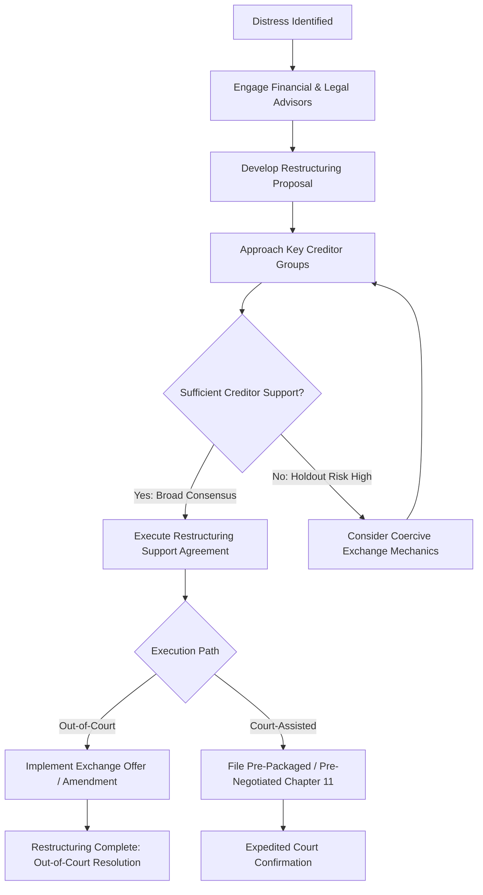

## Out-of-Court Workouts and Debt Restructuring

### Overview

An out-of-court workout is a negotiated resolution of financial distress between a company and its creditors that avoids formal bankruptcy proceedings. By operating outside court supervision, workouts generally preserve enterprise value, reduce professional fees, avoid reputational/customer-facing stigma, and complete faster than Chapter 11 — provided sufficient creditor consensus can be reached.

### Why Pursue an Out-of-Court Workout

- **Lower cost**: Avoids court fees, extensive legal/advisory costs, and U.S. Trustee fees associated with formal bankruptcy.
- **Speed**: No mandatory disclosure statement, voting, or confirmation hearing process.
- **Confidentiality**: Terms can remain private, unlike bankruptcy court filings which are public record.
- **Preserves business relationships**: Avoids the customer/supplier disruption often triggered by a public bankruptcy filing (loss of trade credit, customer attrition due to going-concern uncertainty).
- **Avoids "free-fall" risk**: Formal bankruptcy carries execution risk (contested plan confirmation, competing plans, loss of exclusivity).

**Key limitation**: Out-of-court workouts require **unanimous or near-unanimous consent** from affected creditors, since dissenting creditors cannot be legally bound (no cram-down mechanism exists outside of court), making workouts vulnerable to holdout creditors.

### Common Workout Structures

#### 1. Debt Rescheduling (Maturity Extension)

Extending the maturity date of existing debt to provide breathing room, without changing principal amount.

$$\text{New Debt Service Schedule: } T_{original} \rightarrow T_{extended}$$

Reduces near-term liquidity pressure without requiring creditors to accept a loss, making it often the easiest concession to negotiate.

#### 2. Covenant Waivers and Amendments

Lenders agree to waive a covenant breach (e.g., leverage ratio breach) or amend covenant thresholds, typically in exchange for:

- **Waiver fees**: One-time cash payment to lenders for granting the waiver.
- **Increased interest margin (pricing step-up)**: Compensation for increased credit risk.
- **Tighter reporting/monitoring requirements**: More frequent financial reporting or board observer rights.

#### 3. Debt-for-Debt Exchange

Existing debt is exchanged for new debt with modified terms — often reduced principal, extended maturity, or different security/priority ranking — usually executed as an **exchange offer**.

$$\text{Exchange Ratio} = \frac{\text{New Debt Face Value}}{\text{Old Debt Face Value}}$$

**Example**: Bondholders exchange $1,000 face value of unsecured notes for $700 face value of new secured notes with a longer maturity. This is a discounted exchange, effectively reducing principal by 30% while improving creditors' security position.

#### 4. Debt-for-Equity Swap

Creditors exchange debt claims for equity ownership in the company, reducing leverage and interest burden while diluting or eliminating existing shareholders.

$$\text{Post-Swap Leverage} = \frac{\text{Remaining Debt}}{\text{EBITDA}}$$

**Example**: A company with $500M debt and $50M EBITDA (10x leverage) converts $300M of subordinated debt to equity. Post-swap leverage falls to $200M / $50M = 4.0x, a materially more sustainable capital structure.

#### 5. Discounted Debt Buyback

The company (or a sponsor) repurchases its own debt in the open market at a discount to face value, if the debt is trading below par due to distress.

$$\text{Gain on Extinguishment} = \text{Face Value} - \text{Repurchase Price}$$

**[Inference]** This approach is generally more feasible when the company (or a new capital provider) has available liquidity and the debt trades at a meaningful discount; it may also carry tax implications related to cancellation of debt income, which vary by jurisdiction and should be assessed with tax counsel.

#### 6. New Money Injection / Rescue Financing

Existing or new investors provide additional capital (equity or priming debt) to fund operations through the distress period, often as part of a broader restructuring agreement.

- **Priming lien**: New financing granted senior priority over existing secured debt, typically requiring existing secured lenders' consent (or, in a bankruptcy context, court approval).

### Restructuring Support Agreement (RSA)

A contractual agreement between the debtor and a subset of key creditors (often holding a supermajority of a particular debt class) committing them to support a specified restructuring plan, whether executed out-of-court or as a pre-negotiated/pre-packaged bankruptcy filing.

- Typically includes **lock-up provisions**: Signing creditors agree not to transfer their claims to non-consenting parties without requiring the transferee to also join the RSA.
- Provides the debtor with negotiating momentum and reduces holdout risk by binding a critical mass of creditors early.

### The Holdout Problem

Because out-of-court workouts require creditor consent rather than court-imposed cram-down, individual creditors may refuse to participate, hoping to be paid in full while other creditors take a haircut (free-rider incentive).

$$\text{Holdout Incentive} \propto \frac{1}{\text{Number of Participating Creditors} \times \text{Concession Size}}$$

**Mitigation techniques**:

- **Exit consent**: Participating bondholders vote to strip protective covenants from the old bonds as a condition of the exchange, making the non-tendered bonds less attractive to hold.
- **Coercive exchange structuring**: Structuring the exchange so that non-participants face a worse outcome (e.g., subordination to new debt) if the exchange succeeds.
- **Minimum participation thresholds**: Exchange offer conditioned on a minimum percentage of creditors agreeing to participate.

**[Inference]** These mitigation techniques are common in practice but are subject to legal scrutiny (e.g., claims of breach of the implied covenant of good faith, or violations of the Trust Indenture Act in U.S. public bond contexts, which generally prohibits non-consensual modification of core payment terms); specific enforceability depends on indenture language and governing law.

### Workout Negotiation Process

### Comparison: Out-of-Court Workout vs. Formal Bankruptcy

| Dimension | Out-of-Court Workout | Formal Bankruptcy (Chapter 11) |
| --- | --- | --- |
| Creditor consent required | Unanimous/near-unanimous | Majority per class (with cram-down option) |
| Speed | Fast (weeks to months) | Slower (months to years, unless pre-packaged) |
| Cost | Lower | Higher (court, trustee, professional fees) |
| Confidentiality | Private | Public record |
| Automatic stay protection | Not available | Available immediately upon filing |
| Binding on dissenting creditors | No | Yes, via cram-down or class vote |
| Executory contract/lease rejection | Not available | Available (debtor can reject burdensome contracts) |

### Distressed Exchange and Rating Agency Treatment

Rating agencies (Moody's, S&P) often classify a debt-for-debt or debt-for-equity exchange executed under financial distress as a **distressed exchange**, treated similarly to a formal default for rating purposes, even though no formal bankruptcy occurred — because creditors received less value than originally promised under duress of the alternative (bankruptcy or default).

**[Unverified]** Specific classification criteria differ between rating agencies and are subject to periodic methodology updates; consult current agency criteria for precise default/distressed exchange classification triggers.

### Key Points

- Out-of-court workouts trade the certainty and binding power of court-supervised bankruptcy for speed, cost savings, and confidentiality, but require broad creditor consent since no cram-down mechanism exists.
- Core restructuring levers — maturity extension, covenant waivers, debt-for-debt exchange, debt-for-equity swap, and new money injection — can be combined to address both liquidity and leverage problems simultaneously.
- The holdout problem is the central structural challenge of out-of-court restructuring, addressed through RSAs, exit consents, and coercive exchange mechanics.
- Many distressed situations use a **hybrid approach**: negotiating an RSA out-of-court, then filing a pre-packaged or pre-negotiated Chapter 11 to bind holdout creditors and gain the benefits of a court-sanctioned, legally binding process.

### Related Topics

- Restructuring Support Agreements (RSA) and lock-up provisions
- Pre-packaged and pre-negotiated Chapter 11 processes
- Distressed debt investing and exchange offer analysis
- Covenant design and maintenance vs. incurrence covenants
- Fulcrum security identification in capital structure analysis
- Trust Indenture Act implications for public bond restructurings