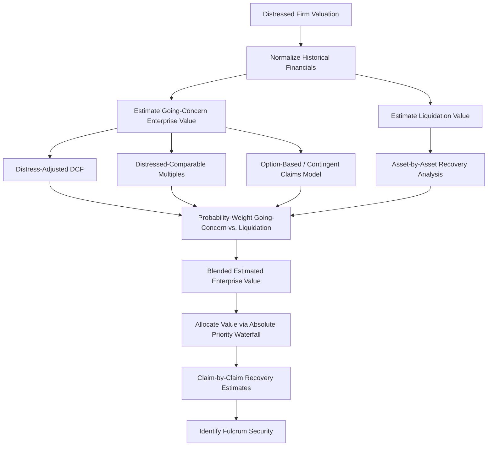

## Valuing Distressed and Financially Troubled Firms

### Overview

Valuing distressed firms requires modifications to standard valuation frameworks because conventional assumptions — going-concern continuity, stable capital structure, normalized cash flows — often do not hold. Distressed valuation must explicitly incorporate bankruptcy probability, potential liquidation outcomes, capital structure complexity, and the strategic behavior of different creditor classes.

### Key Challenges Unique to Distressed Valuation

1. **Going-concern uncertainty**: Standard DCF assumes indefinite operation; distressed firms carry a material probability of liquidation or forced sale.
2. **Distorted historical financials**: Reported earnings may reflect one-time restructuring charges, impairments, or non-recurring items that obscure normalized operating performance.
3. **Capital structure complexity**: Multiple debt tranches with different seniority, combined with the possibility of debt-to-equity conversion, mean "equity value" and "enterprise value" must be decomposed carefully across the capital stack.
4. **Circularity between value and capital structure**: The appropriate capital structure (and thus WACC) is itself uncertain since the company will likely undergo restructuring that changes it.
5. **Legal and negotiation dynamics**: Actual recoveries depend heavily on legal priority, negotiation leverage, and litigation risk, not solely fundamental cash flow value.

### 1. Adjusted (Distress-Aware) Discounted Cash Flow

Standard DCF is modified to reflect distress-specific risk factors.

$$EV = \sum_{t=1}^{n} \frac{FCF_t}{(1+r_d)^t} + \frac{TV_n}{(1+r_d)^n}$$

Where $r_d$ is a **distress-adjusted discount rate**, typically higher than a standard WACC to reflect:

- Elevated probability of default/bankruptcy.
- Reduced predictability of cash flows.
- Additional risk premium for financial distress costs (legal fees, customer/supplier attrition, key employee turnover).

**Probability-weighted approach**:

$$EV = p_{going} \times EV_{going\text{-}concern} + (1 - p_{going}) \times EV_{liquidation}$$

Where $p_{going}$ is the estimated probability of successful reorganization/continuation, and $EV_{liquidation}$ is the estimated liquidation value.

**[Inference]** Estimating $p_{going}$ is inherently judgment-intensive and is often informed by quantitative distress models (e.g., Altman Z-Score, Distance-to-Default), industry precedent, and qualitative assessment of the restructuring negotiation dynamics; it is not a precise, objectively observable input.

### 2. Liquidation Value Analysis

Estimates proceeds available if the company were liquidated (Chapter 7-style outcome), providing a valuation **floor**.

$$\text{Liquidation Value} = \sum (\text{Asset Category} \times \text{Recovery Rate}) - \text{Wind-down Costs}$$

**Typical recovery rate ranges by asset category** (illustrative, highly situation-dependent):

| Asset Category | Typical Recovery Range |
| --- | --- |
| Cash and equivalents | ~100% |
| Accounts receivable | 60%–90% |
| Inventory (finished goods) | 30%–70% |
| Inventory (raw materials/WIP) | 10%–40% |
| PP&E (specialized) | 10%–40% |
| PP&E (general purpose, real estate) | 40%–70% |
| Intangibles/goodwill | Often near 0% |

**[Unverified]** Actual recovery rates vary enormously by industry, asset specificity, and market conditions at the time of liquidation; the ranges above are illustrative approximations, not authoritative benchmarks, and should be supported by appraisals or comparable liquidation precedents in practice.

### 3. Comparable Company and Precedent Transaction Analysis (Distress-Adjusted)

Standard multiple-based approaches are adapted by:

- Using **forward-looking, normalized EBITDA** rather than trailing figures distorted by restructuring charges.
- Selecting comparables that are themselves distressed or have recently emerged from distress, rather than healthy sector peers, to reflect appropriate risk-adjusted multiples.
- Applying a **distress discount** to multiples derived from healthy comparables, reflecting the market's typically lower willingness to pay for a company under financial stress.

$$\text{Distressed Multiple} = \text{Healthy Peer Multiple} \times (1 - \text{Distress Discount \%})$$

### 4. Option-Based (Contingent Claims) Valuation

Applies option pricing theory (Merton structural model) to value equity as a call option on the firm's assets, with the debt's face value acting as the strike price.

$$E = V_A \cdot N(d_1) - D \cdot e^{-rT} \cdot N(d_2)$$

Where:

- $E$ = Equity value
- $V_A$ = Firm asset value
- $D$ = Face value of debt (default point)
- $r$ = Risk-free rate
- $T$ = Time to debt maturity

This framework explains a key distressed-investing phenomenon: **equity can retain positive value even when a firm is deeply distressed**, because equity holders benefit from the optionality of asset value volatility (the "option value" of waiting, since equity has unlimited upside and limited downside due to limited liability).

**[Inference]** This helps explain why distressed equity sometimes trades at a small but non-zero value despite apparent insolvency on a book basis — the market is pricing residual optionality, not necessarily expecting a full recovery of asset value above debt.

### 5. Waterfall / Recovery Analysis

Rather than valuing "the company" as a single number, distressed valuation typically produces a **claim-by-claim recovery analysis**, allocating estimated enterprise value across the capital structure per the absolute priority rule.

$$\text{Recovery}_i = \min\left(\text{Claim}_i, \max\left(0, EV - \sum_{j<i} \text{Claim}_j\right)\right)$$

Where claims are ordered from most senior ($j=1$) to most junior.

**Example**: Estimated reorganization enterprise value = $400M. Capital structure: $200M secured debt, $150M senior unsecured notes, $100M subordinated notes.

| Claim | Amount | Cumulative Senior Claims | Recovery | Recovery % |
| --- | --- | --- | --- | --- |
| Secured debt | $200M | $0M | $200M | 100% |
| Senior unsecured | $150M | $200M | $150M | 100% |
| Subordinated | $100M | $350M | $50M | 50% |
| Equity | — | $450M | $0M | 0% |

This identifies the subordinated notes as the **fulcrum security**.

### Distressed Valuation Process Flow

### Special Considerations for Distressed Debt Investors

- **Trading price vs. intrinsic recovery**: Distressed debt investors compare current market trading price of a claim to its estimated intrinsic recovery value under a projected reorganization outcome.

$$\text{Expected Return} = \frac{\text{Estimated Recovery Value}}{\text{Current Trading Price}} - 1$$

- **Blended recovery scenarios**: Sophisticated distressed investors often build multiple reorganization scenarios (different EV estimates, different plan structures) and probability-weight expected recoveries across scenarios rather than relying on a single point estimate.
- **Legal/procedural risk premium**: Litigation risk (inter-creditor disputes, fraudulent conveyance claims, subordination disputes) introduces valuation uncertainty beyond pure financial modeling, often requiring input from restructuring legal counsel.
- **Time value and process duration risk**: Prolonged bankruptcy proceedings erode value through professional fees and operational disruption, so expected process duration is itself a value driver.

### Fresh-Start Accounting (Post-Emergence)

Upon emergence from Chapter 11 (under applicable accounting standards, e.g., ASC 852 in the U.S.), if pre-emergence holders receive less than 50% of the reorganized equity and reorganization value is less than post-petition liabilities plus allowed claims, the company applies **fresh-start reporting**: assets and liabilities are revalued to fair value as if the reorganized entity were a new enterprise, and accumulated deficit is reset.

$$\text{Reorganization Value} = \text{Going-Concern Enterprise Value Post-Emergence}$$

**[Unverified]** Specific fresh-start accounting eligibility criteria and treatment can vary based on applicable accounting framework (US GAAP vs. IFRS) and specific standard updates; verify against current accounting guidance for technical application.

### Key Points

- Distressed valuation blends going-concern and liquidation value estimates, weighted by the probability of successful reorganization, rather than relying on a single DCF output.
- The absolute priority waterfall converts an aggregate enterprise value estimate into claim-specific recovery estimates, which is the primary output distressed debt investors actually use for decision-making.
- Option-based (contingent claims) models explain why equity can retain nominal value even in deep distress, due to the optionality embedded in limited liability.
- Liquidation value serves as an analytical floor, while going-concern methods (adjusted DCF, distressed comparables) provide the upside case; actual outcomes depend heavily on negotiation dynamics and legal priority, not purely financial modeling.

### Related Topics

- Fulcrum security identification and capital structure arbitrage
- Absolute priority rule and cram-down mechanics
- Distressed debt investing strategies (loan-to-own, capital structure arbitrage)
- Fresh-start accounting and post-emergence financial reporting
- Merton structural credit risk model and distance-to-default
- Liquidation analysis and asset appraisal methodologies