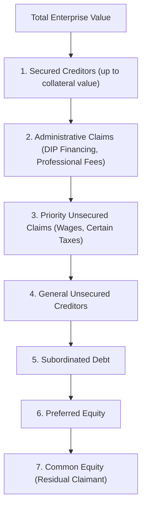

## Priority of Claims and the Absolute Priority Rule

### Overview

The priority of claims establishes the legal order in which creditors and equity holders are entitled to payment from a distressed or bankrupt company's assets. The **Absolute Priority Rule (APR)** is the governing legal principle in U.S. bankruptcy law requiring that senior classes of claims be paid in full before any junior class receives a distribution, unless senior claimants consent otherwise. Understanding this hierarchy is foundational to distressed valuation, recovery analysis, and reorganization plan negotiation.

### The Priority Waterfall

From highest to lowest priority in a liquidation or reorganization:

1. **Secured creditors** — Paid first, up to the value of their collateral.
2. **Administrative claims** — Costs of administering the bankruptcy estate, including DIP financing and professional fees (attorneys, financial advisors).
3. **Priority unsecured claims** — Certain statutorily privileged claims (e.g., limited employee wage claims, certain tax obligations), per specific priority ranking under bankruptcy law.
4. **General unsecured creditors** — Trade creditors, unsecured bondholders, and other claims without security or statutory priority.
5. **Subordinated debt** — Contractually or structurally subordinated to general unsecured claims.
6. **Preferred equity** — Ranks above common equity but below all debt claims.
7. **Common equity** — Residual claimants; paid only after all creditors are satisfied in full.

### Secured vs. Unsecured Claims

- **Secured claims**: Backed by specific collateral (a lien on assets). Recovery is capped at the lesser of the claim amount or the collateral's value; any shortfall is treated as a general unsecured claim (a **deficiency claim**).

$$\text{Secured Recovery} = \min(\text{Claim Amount}, \text{Collateral Value})$$

$$\text{Deficiency Claim} = \max(0, \text{Claim Amount} - \text{Collateral Value})$$

- **Unsecured claims**: No specific collateral backing; recovery depends entirely on residual value after senior claims are satisfied.

**Example**: A lender holds a $50M claim secured by equipment worth $35M. The secured portion is $35M; the remaining $15M becomes an unsecured deficiency claim, ranking pari passu with other general unsecured creditors.

### Contractual vs. Structural Subordination

- **Contractual subordination**: Explicitly agreed in loan documents/indentures — subordinated debt holders contractually agree their claims rank behind senior debt, regardless of the general unsecured priority ranking.
- **Structural subordination**: Arises from corporate structure rather than contract. Creditors of a parent holding company are structurally subordinated to creditors of an operating subsidiary, because subsidiary creditors have first claim on subsidiary assets before any residual value flows up to the parent.

$$\text{Parent Creditor Recovery} = \max\left(0, \text{Subsidiary Value} - \text{Subsidiary Creditor Claims}\right) \text{ (flowed up as equity value)}$$

**[Inference]** Structural subordination is a critical consideration in leveraged corporate structures with multiple operating subsidiaries; lenders at the parent/holdco level typically demand higher pricing or covenant protection to compensate for this inherent disadvantage relative to opco-level lenders.

### The Absolute Priority Rule (APR) in Detail

Under Section 1129(b) of the U.S. Bankruptcy Code, a Chapter 11 plan can be confirmed over a dissenting class's objection ("cram-down") only if it is **"fair and equitable"** — which, for the APR specifically, requires:

- A dissenting unsecured or subordinated class must be paid in full, **or**
- No class junior to the dissenting class may receive or retain any property under the plan.

$$\text{APR Condition: } \text{If Class}_i \text{ dissents and is not paid in full, then Class}_{i+1}, ..., \text{Class}_n \text{ receive nothing}$$

This prevents junior stakeholders (often existing equity holders or management) from retaining value while senior creditors are impaired.

### Deviations from Strict APR: New Value Exception

Courts have historically recognized a **"new value exception"**: existing equity holders may retain an interest in the reorganized company despite senior creditors not being paid in full, if they contribute **new capital** that is:

- Substantial in relation to the amount retained,
- Necessary for the reorganization,
- Reasonably equivalent in value to the equity interest received,
- Subject to market test (competing bids) to ensure fairness.

**[Unverified]** The continued vitality and precise contours of the new value exception remain subject to ongoing judicial interpretation and circuit-level disagreement in U.S. case law; specific applicability should be assessed against current binding precedent in the relevant jurisdiction.

### Deviations in Practice: Negotiated Settlements

Despite the APR's strict legal requirement, actual Chapter 11 outcomes frequently deviate from pure absolute priority through **negotiated settlements**, where:

- Senior creditors agree to allow junior classes (including equity) to retain some value in exchange for avoiding costly, delay-inducing litigation over valuation and plan confirmation.
- This is sometimes referred to as creditors "gifting" value to a junior class to secure a consensual, faster resolution.

**[Inference]** Empirical bankruptcy research has documented that actual recoveries often deviate from strict absolute priority in practice, generally attributed to negotiation dynamics, litigation cost avoidance, and the practical leverage of incumbent management/equity in controlling the reorganization process; the degree of deviation varies by case and is a subject of ongoing academic study.

### Priority in Practice: Recovery Waterfall Example

**Facts**: Enterprise value at emergence estimated at $350M. Capital structure:

| Claim Class | Claim Amount | Priority |
| --- | --- | --- |
| Secured revolver | $100M | 1 (Secured) |
| DIP financing (converted) | $20M | 1 (Administrative/Secured) |
| Senior unsecured notes | $150M | 4 (General Unsecured) |
| Subordinated notes | $80M | 5 (Subordinated) |
| Common equity | — | 7 (Residual) |

**Waterfall allocation**:

$$\text{Secured/Admin Recovery} = \min(\$120M, \$350M) = \$120M \text{ (100\%)}$$

$$\text{Remaining} = \$350M - \$120M = \$230M$$

$$\text{Senior Unsecured Recovery} = \min(\$150M, \$230M) = \$150M \text{ (100\%)}$$

$$\text{Remaining} = \$230M - \$150M = \$80M$$

$$\text{Subordinated Recovery} = \min(\$80M, \$80M) = \$80M \text{ (100\%)}$$

$$\text{Remaining for Equity} = \$350M - \$120M - \$150M - \$80M = \$0M$$

In this scenario, subordinated notes are recovered in full and become the **fulcrum security** boundary — any additional enterprise value above $350M would flow to equity, but at exactly $350M, equity is fully wiped out under strict APR.

### Priority of Claims vs. Equitable Subordination

**Equitable subordination** is a distinct doctrine (Bankruptcy Code Section 510(c)) allowing a court to subordinate a claim that would otherwise rank at a given priority level, due to inequitable conduct by the claimant (e.g., fraud, breach of fiduciary duty, undercapitalization by an insider lender) that harmed other creditors. This is an exception applied by courts on a case-specific basis, not a standard priority category.

### Intercreditor Agreements

Among secured creditors with multiple tranches (e.g., first lien and second lien lenders), an **intercreditor agreement** governs the relative priority, standstill obligations, and voting/consent rights between the tranches — effectively creating a private contractual priority structure layered on top of the statutory framework.

$$\text{First Lien Recovery} = \min(\text{First Lien Claim}, \text{Collateral Value})$$

$$\text{Second Lien Recovery} = \min(\text{Second Lien Claim}, \max(0, \text{Collateral Value} - \text{First Lien Claim}))$$

### Key Points

- The priority waterfall — secured, administrative, priority unsecured, general unsecured, subordinated, preferred equity, common equity — determines the order of recovery in both liquidation and reorganization contexts.
- The Absolute Priority Rule requires full payment to a dissenting senior class before any junior class retains value, forming the legal basis for cram-down plan confirmation.
- Structural subordination (parent vs. subsidiary creditors) and contractual subordination (explicit indenture terms) are distinct mechanisms that can each affect a creditor's effective priority beyond the base statutory ranking.
- In practice, negotiated settlements frequently result in deviations from strict absolute priority, motivated by litigation cost avoidance and negotiation leverage, even though APR remains the binding legal standard for contested cram-down confirmation.
- Intercreditor agreements create privately negotiated priority structures among secured creditors that operate alongside, and can be more granular than, the statutory priority framework.

### Related Topics

- Fulcrum security identification in distressed valuation
- Cram-down mechanics and plan confirmation standards under Section 1129(b)
- Equitable subordination and lender liability doctrines
- DIP financing priming liens and adequate protection
- Structural subordination in leveraged holding company structures
- Intercreditor agreements and first lien/second lien dynamics