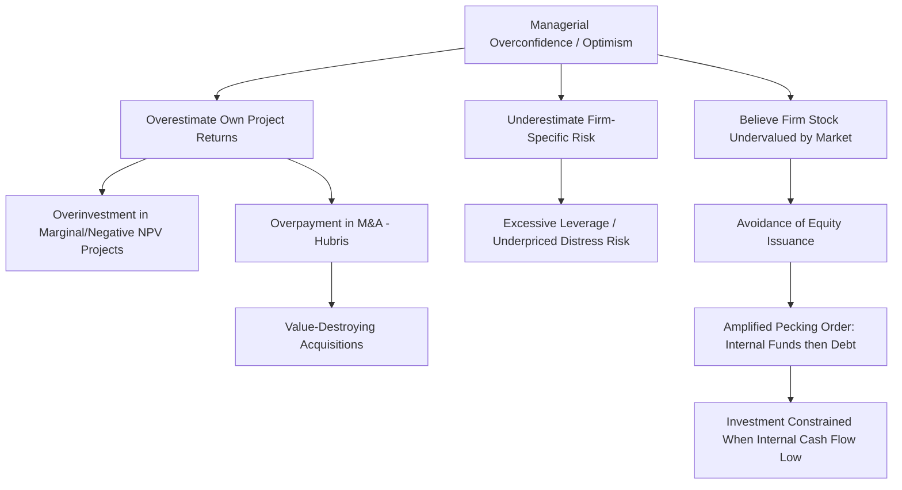

## Managerial Overconfidence and Optimism

### Overview

Managerial overconfidence and optimism are core behavioral biases studied in behavioral corporate finance, describing systematic tendencies among executives to overestimate their own abilities, the probability of favorable outcomes, and their degree of control over uncertain events. Unlike traditional corporate finance models that assume rational, value-maximizing managers, behavioral models incorporate these biases to explain empirically observed patterns in investment, financing, and M&A decisions that deviate from neoclassical predictions.

### Conceptual Distinctions

- **Overconfidence**: Overestimation of the precision of one's own knowledge or the accuracy of one's judgments/forecasts (miscalibration), and/or overestimation of one's own abilities relative to others (better-than-average effect).
- **Optimism**: Overestimation of the probability of favorable future outcomes and underestimation of the probability of unfavorable ones, independent of one's own perceived ability.

**[Inference]** While theoretically distinct, these biases are often modeled together in the corporate finance literature because they produce similar directional predictions (excessive investment, underestimation of risk) and are difficult to empirically disentangle using observable managerial behavior alone.

### Theoretical Sources of Managerial Overconfidence

1. **Illusion of control**: Managers overestimate their ability to influence outcomes that are substantially driven by external/random factors.
2. **Better-than-average effect**: Systematic tendency for individuals to rate their own skill, judgment, or performance above the population average (a statistical impossibility at the aggregate level).
3. **Self-attribution bias**: Attributing successful outcomes to personal skill while attributing failures to external/bad luck, reinforcing overconfidence over time via biased learning.
4. **Selection/promotion effects**: Corporate promotion processes may systematically select for individuals who are confident (sometimes overconfident), since confidence can be correlated with ambition and risk-taking that produces visible early-career success.

### Empirical Measurement Approaches

Because overconfidence is a latent psychological trait, researchers use observable behavioral proxies:

#### 1. Option Exercise Behavior (Malmendier-Tate Approach)

A widely used proxy in the academic literature: CEOs who hold executive stock options **beyond the point where rational, risk-averse, diversification-motivated exercise would predict** are classified as overconfident, since holding excessively concentrated in-the-money options reflects excessive personal belief in continued firm-specific stock appreciation.

$$\text{Overconfident CEO} \Leftrightarrow \text{Holds vested, deep in-the-money options well past optimal exercise/diversification point}$$

#### 2. Press-Based Measures

Media characterization of the CEO (counting instances where press coverage describes the CEO using terms like "confident," "optimistic," "reliable," versus terms like "cautious" or "conservative") is used to construct a net-optimism proxy.

#### 3. Relative Compensation Measures

Some studies use the CEO's option/equity holdings relative to peers or relative to total compensation as a proxy, based on the premise that overconfident executives voluntarily hold more firm-specific risk.

**[Inference]** All of these proxies are indirect and subject to measurement error and alternative explanations (e.g., holding concentrated options might reflect signaling motives to the market rather than genuine overconfidence); the academic literature generally treats these as imperfect but useful empirical proxies rather than direct measurements of the underlying psychological trait.

### Effects on Corporate Investment Decisions

#### Overinvestment and Investment-Cash Flow Sensitivity

Overconfident managers tend to overestimate the returns on their investment projects, believing they can generate more value from a given project than objective analysis would suggest.

$$\text{Overconfident Manager's Perceived NPV} > \text{Objective NPV}$$

This leads to a documented pattern: overconfident CEOs display **higher investment-cash flow sensitivity** — investing more heavily when internal cash flow is abundant (since they perceive external financing as unduly costly, given their belief that the market undervalues their firm) but curtailing investment when internal funds are constrained, even for projects with legitimately positive NPV.

#### Preference for Internal Financing (Pecking Order Amplification)

Overconfident managers, believing their firm's stock is undervalued by the market (because they are confident in the firm's prospects but perceive the market as insufficiently informed or too conservative), exhibit an **exaggerated preference for internal funds and debt over equity issuance**, amplifying the pecking order behavior predicted by asymmetric information models — but for behavioral rather than purely informational reasons.

$$\text{Financing Preference Order (Overconfident CEO): } \text{Internal Funds} \gg \text{Debt} > \text{Equity}$$

**[Inference]** This behavioral amplification of pecking order preferences is distinct from the classical Myers-Majluf information asymmetry explanation, though both theories predict similar observable financing hierarchies, making empirical disentanglement of the two channels an ongoing area of research.

### Effects on Mergers and Acquisitions

Overconfidence is one of the most extensively studied behavioral explanations for value-destroying M&A activity.

#### Hubris Hypothesis (Roll, 1986)

Predates the formal overconfidence literature but is closely related: acquiring managers overestimate their ability to identify undervalued targets and to extract synergies, leading to **overpayment** relative to intrinsic target value, even when no true synergies exist.

$$\text{Overpayment} = \text{Price Paid} - \text{Target Standalone Value} - \text{True Synergies}$$

#### Empirical M&A Patterns Associated with Overconfident Acquirers

- **Higher likelihood of undertaking mergers**, particularly diversifying (non-core) mergers.
- **Larger acquisition premiums paid**, especially when financed with internal cash or debt rather than equity (since overconfident CEOs, believing their stock undervalued, avoid issuing "cheap" equity as currency).
- **More negative announcement-period stock returns** for acquirer shareholders, consistent with the market anticipating value destruction.
- **Lower realized post-merger performance/synergies** relative to announced expectations.

$$\text{Acquirer CAR (Cumulative Abnormal Return)}_{\text{Overconfident CEO}} < \text{Acquirer CAR}_{\text{Non-Overconfident CEO}}$$

Where CAR is measured around the M&A announcement date.

### Overconfidence and Corporate Financing/Capital Structure

- **Excessive leverage**: Overconfident CEOs may take on more debt than optimal, believing the firm's future cash flows (which will service the debt) are more certain and favorable than objectively warranted.
- **Underestimation of financial distress risk**: Optimism bias leads to underweighting the probability of adverse future states, resulting in capital structures with insufficient margin of safety.

**[Inference]** The net effect of overconfidence on leverage is theoretically ambiguous in some models — overconfidence can increase leverage (underestimating distress risk) while simultaneously reducing the perceived need for external financing overall (if internal cash flow is believed sufficient); empirical findings on the net direction vary by study design and sample.

### Behavioral Diagram: Overconfidence Transmission Mechanism

### Governance and Mitigation Mechanisms

- **Board oversight and independent directors**: Stronger, more independent boards are associated with better monitoring of overconfident CEO decision-making, particularly around large capital allocation and M&A decisions.
- **Compensation structure design**: Some research suggests certain incentive structures may exacerbate overconfidence-driven risk-taking (e.g., convex payoffs from stock options), while others (e.g., restricted stock with longer vesting) may temper it.
- **External advisor/analyst scrutiny**: Investment bank fairness opinions, activist investors, and sell-side analyst coverage can act as partial checks on overconfident capital allocation decisions.
- **Mandatory second opinions / devil's advocate processes**: Some firms institutionalize structured decision processes (e.g., red-team review of major investment/M&A decisions) specifically to counteract single-decision-maker overconfidence.

**[Inference]** The academic literature generally finds these governance mechanisms only partially offset overconfidence effects rather than eliminating them, since overconfidence is a persistent individual trait rather than purely an information or incentive-alignment problem, meaning traditional agency-theory solutions (better incentive alignment) are not fully sufficient remedies for behaviorally-driven distortions.

### Is Overconfidence Always Value-Destroying?

Not universally — the literature identifies contexts where managerial overconfidence and optimism can be associated with **potentially beneficial** effects:

- **Encouraging entrepreneurial risk-taking**: Optimism may be necessary to motivate innovation and long-shot R&D investment that purely rational risk-averse assessment might reject, even though some such investments have genuinely high option-like value.
- **Signaling and leadership effects**: Confident leadership may improve employee morale, recruitment, and stakeholder confidence in ways that have real (if hard to quantify) economic value.

**[Inference]** This creates a nuanced empirical picture: moderate overconfidence may be associated with beneficial innovation outcomes in certain contexts (e.g., R&D-intensive industries), while excessive overconfidence is more consistently associated with value destruction in capital allocation and M&A decisions; the specific threshold or context distinguishing "beneficial confidence" from "harmful overconfidence" is not precisely defined in the literature and remains an active research question.

### Key Points

- Managerial overconfidence and optimism are distinct but related biases: overconfidence concerns miscalibrated belief in one's own ability/judgment, optimism concerns skewed probability assessment of future outcomes.
- Empirical measurement relies on indirect behavioral proxies (notably option-holding behavior in the Malmendier-Tate framework), since the underlying trait is not directly observable.
- Overconfidence is associated with overinvestment, investment-cash flow sensitivity, an amplified preference for internal financing/debt over equity, and higher likelihood of value-destroying, overpriced M&A activity (consistent with the hubris hypothesis).
- Governance mechanisms (board oversight, external scrutiny, structured decision processes) can partially mitigate but do not fully eliminate overconfidence-driven distortions, since the bias is behavioral/psychological rather than purely incentive-driven.
- The relationship between overconfidence and firm value is not uniformly negative; context-dependent benefits (e.g., innovation encouragement) exist alongside the more commonly documented costs (overinvestment, overpayment in M&A).

### Related Topics

- Behavioral theories of capital structure (market timing, pecking order extensions)
- Hubris hypothesis and M&A announcement returns
- CEO compensation design and risk-taking incentives
- Corporate governance mechanisms and board monitoring effectiveness
- Prospect theory and loss aversion in corporate decision-making
- Herding behavior and social proof in corporate investment decisions