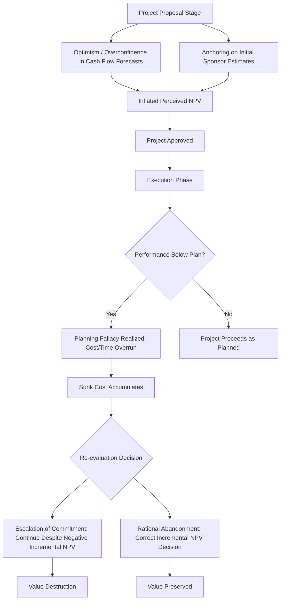

## Behavioral Influences on Capital Budgeting

### Overview

Behavioral influences on capital budgeting examine how psychological biases systematically distort the capital allocation process away from the predictions of classical NPV-maximization theory. While traditional capital budgeting assumes managers rationally evaluate projects using unbiased cash flow forecasts and appropriate discount rates, behavioral corporate finance documents persistent, predictable deviations arising from cognitive biases in forecasting, evaluation, and decision commitment.

### Core Biases Affecting Capital Budgeting

#### 1. Overconfidence and Optimism Bias

Managers systematically overestimate expected cash flows and underestimate the variance/downside risk of proposed projects, leading to inflated perceived NPV relative to objectively expected NPV.

$$\text{Perceived NPV} = \sum_{t=1}^{n} \frac{E^{biased}[CF_t]}{(1+r)^t} > \sum_{t=1}^{n} \frac{E^{true}[CF_t]}{(1+r)^t} = \text{True NPV}$$

This is closely linked to the broader managerial overconfidence literature but manifests specifically in capital budgeting as **systematically optimistic cash flow projections** submitted in project proposals.

#### 2. Planning Fallacy

A specific manifestation of optimism bias: the tendency to underestimate the time, costs, and risks of future actions while overestimating the benefits, even when the decision-maker has accurate knowledge of past projects that took longer or cost more than planned.

$$\text{Actual Project Cost/Duration} > \text{Planned Estimate, systematically and repeatedly}$$

**[Inference]** The planning fallacy is particularly well-documented in large capital expenditure projects (infrastructure, capital-intensive manufacturing expansions) where cost overruns and schedule delays are empirically common even among experienced project sponsors, suggesting the bias persists despite institutional learning opportunities.

#### 3. Escalation of Commitment (Sunk Cost Fallacy)

Decision-makers continue investing in a failing project because of resources already committed ("sunk costs"), rather than evaluating the project purely on its incremental (forward-looking) NPV, which under rational decision theory should be entirely independent of past expenditures.

$$\text{Correct Decision Rule: Continue if } NPV_{incremental} = \sum_{t} \frac{FCF_t^{future}}{(1+r)^t} - \text{Additional Investment Required} > 0$$

$$\text{Sunk Cost (Irrelevant to Decision)} = \text{Amount Already Invested (should not enter the incremental NPV calculation)}$$

**Drivers of escalation of commitment**:

- **Self-justification**: Reluctance to admit an earlier decision was wrong (ego/reputational preservation).
- **Project champion effect**: The manager who originally sponsored the project has personal incentive (career, reputation) to see it succeed and may suppress negative information.
- **Prospect theory framing**: Abandoning a project crystallizes a loss, while continuing preserves the (often false) hope of recovering the investment — consistent with loss-aversion-driven risk-seeking in the loss domain.

#### 4. Anchoring in Forecast Development

Initial cash flow or cost estimates (often provided by a project sponsor advocating for the project) serve as an anchor that subsequent revisions insufficiently adjust away from, even when new information suggests the initial estimate was significantly biased.

$$\text{Revised Estimate} = \text{Initial Anchor} + \text{Insufficient Adjustment for New Information}$$

#### 5. Confirmation Bias in Project Evaluation

Decision-makers selectively seek, interpret, and weight information that confirms a pre-existing preference for a project (often one they proposed or favor), while discounting disconfirming evidence.

#### 6. Illusion of Control in Risk Assessment

Managers overestimate their ability to manage project risks (execution risk, market risk) once the project is underway, leading to insufficient contingency buffers and understated risk-adjusted discount rates.

### Capital Budgeting Bias Transmission Diagram

### Behavioral Distortions in Specific Capital Budgeting Techniques

#### NPV and Discount Rate Manipulation

- **Hurdle rate inflation as a (partial, imperfect) bias correction**: Some firms set hurdle rates above the theoretically correct risk-adjusted cost of capital, in part as an informal institutional correction for known optimism bias in cash flow forecasts submitted by project sponsors.

$$\text{Applied Hurdle Rate} = \text{True Risk-Adjusted Cost of Capital} + \text{Behavioral Buffer}$$

**[Inference]** This practice, while common, is a blunt corrective mechanism — it does not address the underlying forecast bias directly and can lead to rejection of genuinely positive-NPV projects with accurately conservative forecasts, while insufficiently correcting for the most severely overoptimistic proposals.

#### Payback Period Overreliance

Behavioral finance research suggests managers exhibit **present bias** (a preference for outcomes closer in time, beyond what pure time-value-of-money discounting would justify), which may partially explain the persistent popularity of the payback period method in practice despite its theoretical inferiority to NPV (ignoring cash flows beyond the payback threshold and time value of money within the payback period, in its simple form).

#### Real Options Undervaluation or Overvaluation

- Overconfident managers may **overvalue** embedded real options (e.g., option to expand) by overestimating the probability of favorable future states justifying the option's exercise.
- Conversely, managers using traditional (non-real-options) DCF frameworks may systematically **undervalue** flexibility-embedding projects by ignoring optionality altogether, a separate methodological rather than purely behavioral gap, though behavioral factors can compound the underestimation.

### Debiasing Techniques and Institutional Mitigations

#### 1. Reference Class Forecasting

Rather than building forecasts bottom-up from the specific project's details (which invites anchoring and optimism), reference class forecasting bases estimates on the **actual outcomes of a class of similar past projects**, adjusting for the specific project's distinguishing characteristics.

$$\text{Reference Class Forecast} = \text{Distribution of Outcomes from Comparable Historical Projects}$$

**[Inference]** This technique, associated with planning fallacy mitigation research, is generally considered effective at reducing (though not eliminating) systematic optimism bias, because it grounds forecasts in empirical base rates rather than case-specific narrative reasoning, which tends to be more susceptible to overconfidence.

#### 2. Devil's Advocate / Red Team Review

Formal institutional processes requiring a designated party to argue against a proposed project, surfacing risks and downside scenarios that the project's proponents may have under-emphasized.

#### 3. Post-Investment Audits

Systematic comparison of actual project outcomes against original projections, creating institutional accountability and a feedback loop that can, over time, calibrate future forecasting (though self-attribution bias can undermine learning if failures are consistently attributed to external factors).

$$\text{Forecast Accuracy Tracking} = \text{Actual Outcome} - \text{Original Projection, tracked systematically across projects and sponsors}$$

#### 4. Pre-Mortem Analysis

Before project approval, teams are asked to imagine the project has failed and work backward to identify plausible causes, which research suggests can surface risks that standard forward-looking risk assessment misses (partly by reframing the exercise away from optimistic narrative-building).

#### 5. Removing the Sponsor from Final Approval Authority

Structurally separating the project champion (who has self-justification and reputational incentives) from the final capital allocation decision, to reduce escalation-of-commitment risk when re-evaluating troubled projects.

#### 6. Staged/Sequential Investment Structuring

Structuring large capital projects with **explicit stage-gates and kill criteria** determined in advance (before sunk costs accumulate and self-justification pressures intensify), rather than committing full capital upfront.

$$\text{Staged Investment: } I_0 \rightarrow \text{Gate 1 (Go/No-Go)} \rightarrow I_1 \rightarrow \text{Gate 2 (Go/No-Go)} \rightarrow I_2...$$

This is conceptually related to real options theory (treating each stage as an option to continue) while also serving as a behavioral safeguard against escalation of commitment.

### Empirical Evidence Themes

**[Inference]** The corporate finance and management literature has documented, across multiple study designs (surveys, natural experiments, archival capital expenditure data), a general pattern in which: (1) capital expenditure projects frequently exceed initial budget and timeline estimates, (2) firms with governance structures that separate project sponsorship from approval/audit functions tend to show smaller forecast biases, and (3) escalation of commitment is more pronounced when the original decision-maker retains authority over continuation decisions; however, the magnitude of these effects varies across studies, industries, and time periods, and should not be treated as universally precise quantitative findings.

### Key Points

- Behavioral biases — optimism/overconfidence, planning fallacy, escalation of commitment, anchoring, and illusion of control — systematically distort capital budgeting away from unbiased NPV maximization, primarily through inflated cash flow forecasts and impaired abandonment decisions.
- Escalation of commitment is conceptually distinct from rational continued investment: the correct decision rule depends only on incremental (forward-looking) NPV, and sunk costs are formally irrelevant, yet sunk costs demonstrably influence real-world continuation decisions.
- Institutional debiasing techniques — reference class forecasting, devil's advocate review, post-investment audits, pre-mortem analysis, and staged investment structuring — target specific biases but generally reduce rather than eliminate their influence.
- Hurdle rate inflation is a common but imprecise practical response to known forecast optimism, since it uniformly penalizes all projects rather than correcting the specific bias in overoptimistic proposals.

### Related Topics

- Managerial overconfidence and its effects on M&A and financing decisions
- Prospect theory, loss aversion, and framing effects in corporate decisions
- Real options valuation and staged investment decision-making
- Reference class forecasting methodology and outside-view forecasting
- Corporate governance structures for capital allocation oversight
- Post-audit and capital expenditure control systems