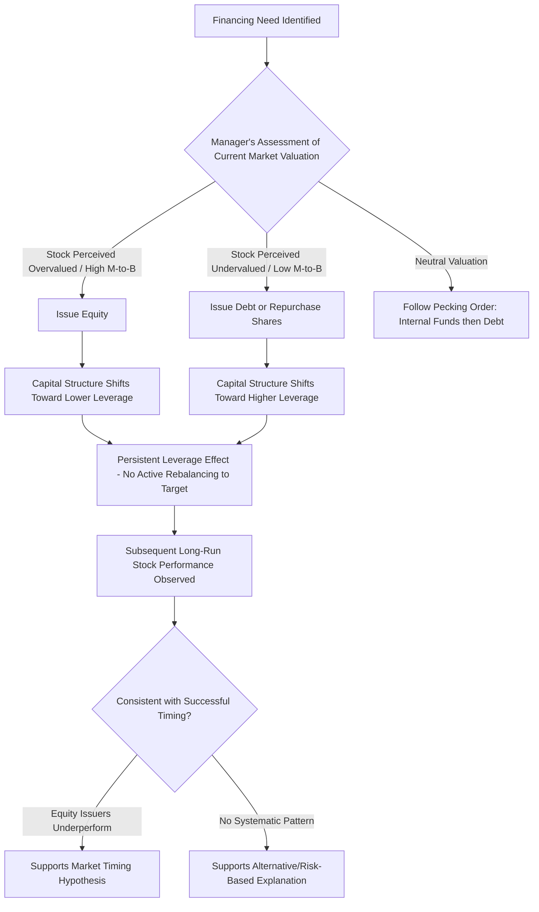

## Market Timing in Financing Decisions

### Overview

Market timing theory in corporate finance posits that managers issue securities opportunistically based on perceived favorable or unfavorable market conditions — issuing equity when they believe the stock is overvalued and repurchasing or issuing debt when they believe it is undervalued — rather than adjusting financing choices purely toward an optimal target capital structure. This behavioral/informational theory stands as an alternative (or complement) to both the traditional trade-off theory and the pecking order theory of capital structure.

### Theoretical Foundations

#### Equity Market Timing Hypothesis (Baker and Wurgler)

The central proposition: current capital structure is heavily influenced by **historical market valuations** at the time financing decisions were made, and firms do not actively rebalance back toward a target leverage ratio afterward — meaning market timing has a **persistent, long-lasting effect** on capital structure rather than a transient one.

$$\text{Leverage}_t = f(\text{Historical Market-to-Book Ratios at Past Financing Decision Points}), \text{ not simply current target leverage}$$

This is a notably different implication from static trade-off theory, which predicts firms should actively rebalance toward a target leverage ratio regardless of the leverage ratio's historical origin.

#### External Finance Weighted-Average Market-to-Book (EFWAMB)

A key empirical construct used to test market timing: a weighted average of the firm's market-to-book ratio at each point in time it raised external capital, weighted by the amount of financing raised.

$$EFWAMB_t = \sum_{s=0}^{t-1} \frac{e_s + d_s}{\sum_{r=0}^{t-1}(e_r + d_r)} \times \left(\frac{M}{B}\right)_s$$

Where $e_s$ and $d_s$ represent equity and debt issued in period $s$, and $(M/B)_s$ is the market-to-book ratio in period $s$. Higher historical EFWAMB values (financing raised during high market-to-book periods) are associated with lower subsequent leverage, consistent with market timing behavior.

### Mechanisms Underlying Market Timing Behavior

#### 1. Information Asymmetry-Based Timing

Managers possess superior information about firm value relative to outside investors. When managers believe the market is **overvaluing** the firm's stock (information asymmetry favoring the firm), issuing equity transfers value from new investors to existing shareholders, making equity issuance attractive during perceived overvaluation.

$$\text{Equity Issuance Incentive} \propto (\text{Perceived Intrinsic Value} < \text{Market Value})$$

This shares conceptual roots with the Myers-Majluf adverse selection framework but emphasizes the **behavioral timing decision** rather than just the pooling equilibrium signaling effect.

#### 2. Behavioral/Irrational Market Timing

An alternative or complementary explanation: managers time issuance based on **perceived market sentiment or investor overreaction** (which may or may not reflect genuine private information advantage), essentially exploiting temporary mispricing driven by irrational investor behavior (sentiment-driven mispricing) rather than the manager's own superior fundamental information.

**[Inference]** Distinguishing empirically between "rational timing exploiting genuine information asymmetry" versus "timing that exploits investor sentiment/irrationality" is difficult, since both predict similar observable patterns (issuance following high valuations); the corporate finance literature has not fully resolved which mechanism dominates in practice, and the two are not mutually exclusive.

### Empirical Patterns Consistent with Market Timing

#### Equity Issuance and Market-to-Book Ratios

Firms tend to issue equity following periods of high stock returns and elevated market-to-book ratios ("hot" equity markets), and repurchase shares or issue debt following periods of relatively depressed valuations.

$$\text{Probability of Equity Issuance} \propto \text{Recent Stock Return Performance and Market-to-Book Ratio}$$

#### Post-Issuance Long-Run Underperformance

A well-documented empirical pattern: firms that issue equity tend to exhibit **lower long-run stock returns** in the years following issuance, relative to comparable non-issuing firms — consistent with managers successfully timing issuance to coincide with periods of (at least partially) temporary overvaluation.

$$\text{Long-Run Abnormal Return}_{\text{Post-SEO}} < 0 \text{ (on average, in documented studies)}$$

**[Inference]** This pattern (sometimes referred to in the literature as the "new issues puzzle") has generated substantial academic debate regarding its interpretation — some researchers attribute it to market timing/mispricing correction, others to risk-based explanations (changing risk characteristics of issuing firms) or methodological/statistical concerns in long-run event study design; there is no full academic consensus on the precise magnitude or complete causal explanation.

#### Persistence of Market Timing Effects on Capital Structure

Baker and Wurgler's original research found that the impact of historical market timing on leverage appears to persist for many years rather than being quickly rebalanced away, challenging the trade-off theory's rebalancing prediction.

**[Unverified]** Subsequent research has debated the robustness and persistence period of this finding, with some studies suggesting leverage does eventually revert toward target levels over longer horizons than initially documented, and methodological critiques regarding how "market timing" is empirically distinguished from other explanations (e.g., mechanical effects of stock price changes on book leverage ratios); treat specific persistence estimates as subject to ongoing academic refinement rather than settled fact.

### Market Timing vs. Trade-Off Theory vs. Pecking Order Theory

| Theory | Core Prediction | Market Timing's Relationship |
| --- | --- | --- |
| Trade-off theory | Firms target an optimal leverage ratio balancing tax shield benefits against financial distress costs | Market timing predicts persistent deviations from target, contradicting active rebalancing |
| Pecking order theory | Firms prefer internal funds, then debt, then equity, due to information asymmetry costs | Market timing shares the information asymmetry mechanism but adds a valuation-timing dimension absent from the basic pecking order |
| Market timing theory | Financing choice driven by perceived relative mispricing of debt vs. equity at the time of decision | Capital structure is the cumulative outcome of historical timing decisions, not a deliberate target |

### Market Timing Decision Flow

### Debt Market Timing

While most market timing literature emphasizes equity, similar logic applies to debt issuance timing:

- **Interest rate timing**: Firms may accelerate debt issuance when they perceive current rates as favorably low relative to their own expectations of future rates.
- **Maturity structure timing**: Issuing longer-term debt when the yield curve or credit spread environment is perceived as favorable, and shorter-term debt otherwise.
- **Credit spread timing**: Issuing debt when the firm's perceived credit risk is favorably priced by the market relative to the firm's own internal risk assessment.

$$\text{Debt Timing Incentive} \propto (\text{Perceived Fair Credit Spread} < \text{Market-Offered Credit Spread})$$

### Practical Manifestations in Corporate Financing Practice

- **Shelf registration and "on-the-shelf" equity offerings**: Allow companies to pre-register securities and issue opportunistically when market windows appear favorable, without needing to complete the full registration process at the time of actual issuance.
- **Window of opportunity" IPO timing**: Companies and their underwriters often explicitly discuss "market windows" for IPO timing, delaying or accelerating offerings based on broader market sentiment and recent comparable company performance (a widely observed practice in investment banking, closely related to market timing theory).
- **Share buyback timing**: Announced buyback programs are sometimes framed by management as signaling a belief that the stock is undervalued, consistent with the same timing logic in reverse.

### Critiques and Limitations of Market Timing Theory

- **Endogeneity concerns**: High market-to-book ratios may reflect genuine growth opportunities requiring more equity financing (a rational, non-timing explanation) rather than opportunistic mispricing exploitation, making causal identification difficult.
- **Mechanical leverage effects**: Book leverage ratios mechanically decrease when stock prices rise (since market value of equity increases the denominator in market leverage calculations), which can create a statistical pattern resembling market timing effects without any deliberate managerial timing behavior.
- **Limited direct evidence of manager intent**: Much of the supporting evidence is based on ex-post correlations between valuation levels and financing choices, rather than direct evidence of manager beliefs or stated intent at the time of the decision.

**[Inference]** These critiques suggest market timing theory, while empirically well-supported in its core correlational patterns, faces ongoing challenges in cleanly separating deliberate behavioral timing from rational responses to changing investment opportunities and mechanical valuation effects; it is generally viewed in the literature as a meaningful contributing factor to financing decisions rather than a complete, standalone theory of capital structure.

### Key Points

- Market timing theory predicts managers issue equity when perceived overvalued and debt/repurchase when perceived undervalued, with resulting capital structure effects that persist rather than being actively rebalanced toward a target.
- Empirical support includes the tendency of equity issuance to follow high market-to-book periods and the documented (though debated) pattern of long-run post-issuance underperformance.
- Market timing shares mechanisms with pecking order theory (information asymmetry) but adds an explicit valuation-timing dimension, and stands in tension with trade-off theory's active-rebalancing prediction.
- The theory faces credible critiques regarding endogeneity (growth opportunities vs. timing), mechanical leverage effects from stock price movements, and the difficulty of directly observing manager intent, meaning it is best understood as one contributing explanation among several rather than a fully displacing theory of capital structure.

### Related Topics

- Pecking order theory and information asymmetry in financing choices
- Trade-off theory and optimal capital structure determinants
- Seasoned equity offering (SEO) announcement effects and long-run performance
- Managerial overconfidence and its interaction with financing timing
- IPO underpricing and hot/cold IPO market cycles
- Share repurchase signaling theory